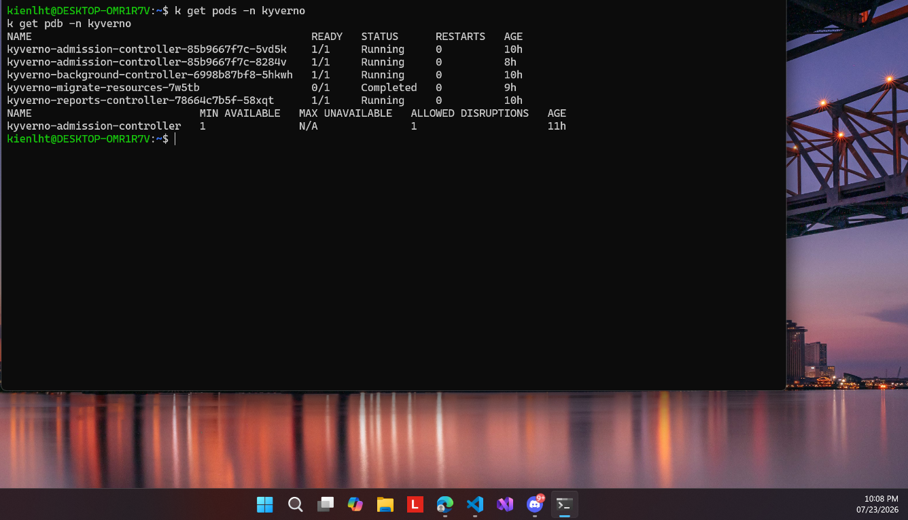

# 01 — Kyverno chạy HA

**Chụp:** 23/07/2026 22:08 · PROD `ecommerce-dev-eks` · ns `kyverno`
**Chứng minh:** yêu cầu #3 (admission enforce) — nền tảng để dám fail-closed

## Trong ảnh có gì

`k get pods -n kyverno` + `k get pdb -n kyverno`. Hai pod `admission-controller` cùng
Running, thêm `background-controller` và `reports-controller`, `migrate-resources` đã
Completed. PDB `kyverno-admission-controller` có `ALLOWED DISRUPTIONS = 1`.

## Vì sao đáng chụp

Policy đặt `failurePolicy: Fail`, nghĩa là **webhook chết thì cụm không nhận pod mới**.
Đó là lựa chọn fail-closed có chủ đích, nhưng nó chỉ an toàn khi webhook không bao giờ
chết hẳn. Hai replica cộng với PDB cho phép rút 1 pod là thứ giữ cho quyết định đó không
biến thành tự bắn vào chân mình lúc node bảo trì.

Liên quan: [08](08-policy-mode-enforce-fail.md) (mốc `Enforce/Fail`)
