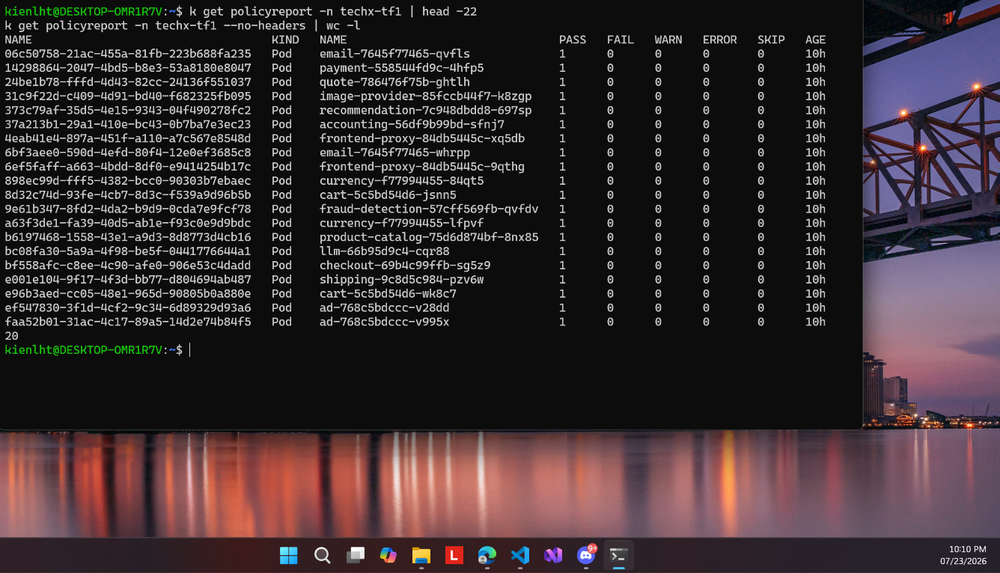

# 02 — Soak chế độ Audit sạch

**Chụp:** 23/07/2026 22:10 · ns `techx-tf1`
**Chứng minh:** yêu cầu #3 — điều kiện đủ để flip Enforce

## Trong ảnh có gì

`k get policyreport -n techx-tf1` — 20 pod, cột `PASS=1`, `FAIL=0`, `WARN=0`, `ERROR=0`,
`SKIP=0`, tuổi 10h. Đủ mặt service thật: email, payment, quote, checkout, cart, currency,
shipping, ad, frontend-proxy, product-catalog, recommendation, fraud-detection, llm...

## Vì sao đáng chụp

Đây là **điều kiện để dám flip Enforce**. Chạy Audit khoảng 10 tiếng mà không một FAIL nào
nghĩa là mọi workload đang chạy đều có chữ ký hợp lệ. Nếu flip thẳng sang Enforce ngay từ
đầu, rủi ro là chặn nhầm chính service của mình rồi sập cụm.

Con số 0 ERROR còn nói thêm một điều: IRSA hoạt động. Không có role `ecommerce-dev-kyverno`
thì mọi verify đã fail với lỗi ECR auth, vì node prod đặt IMDSv2 hop limit = 1 nên pod
không mượn được node role.

Liên quan: [11](11-policyreport-36-aiops-pass.md) (report sau khi Enforce)
