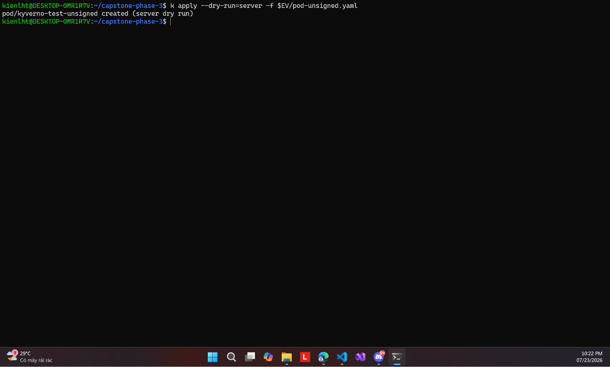

# 03 — Vế TRƯỚC: image không chữ ký ĐƯỢC NHẬN



**Chụp:** 23/07/2026 22:22 · ns `techx-tf1`
**Chứng minh:** yêu cầu #3 — nửa đầu của cặp before/after

## Trong ảnh có gì

```
k apply --dry-run=server -f $EV/pod-unsigned.yaml
pod/kyverno-test-unsigned created (server dry run)
```

## Vì sao đáng chụp

Chữ **`created`** chính là bằng chứng. Ở chế độ Audit, pod mang image **không có chữ ký
`.sig`** vẫn đi qua admission trót lọt — policy chỉ ghi vào PolicyReport rồi cho đi.

Đây đúng là lỗ hổng mà directive #3 nhắm tới khi nói *"admission enforce, không phải
audit/cảnh báo suông"*. Image dùng làm mẫu là `1.2-aiops-detector-ae89fa2`, chính image
aiops push tay ngày 17/07 trước khi aiops được kéo vào `app-build`.

Ảnh này chỉ có giá trị khi đọc cùng [09](09-enforce-unsigned-bi-chan.md) — **cùng một
manifest, cùng một cụm, chỉ khác chế độ policy**, kết quả lật từ `created` sang `blocked`.
