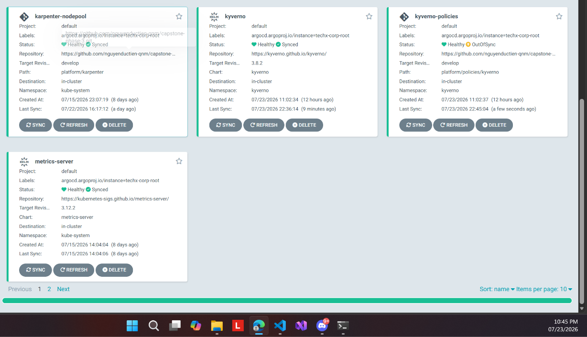

# 07 — GitOps đã sync sau flip

**Chụp:** 23/07/2026 22:45 · ArgoCD UI
**Chứng minh:** yêu cầu #3 — policy đã lên cụm qua GitOps

## Trong ảnh có gì

Bốn Application: `karpenter-nodepool` Healthy/Synced, `kyverno` Healthy/Synced (last sync
9 phút trước), `kyverno-policies` Healthy/**OutOfSync** (last sync vài giây trước),
`metrics-server` Healthy/Synced.

## Vì sao đáng chụp

Chứng minh PR ở [06](06-pr-flip-enforce-diff.md) đã thật sự sync xuống cụm, không dừng ở
mức merge code.

Điểm cần đọc đúng: chữ **OutOfSync** ở `kyverno-policies` là drift cosmetic đã giải thích
ở [05](05-argocd-diff-map-rong.md) — **không phải** policy chưa lên.
[Ảnh 08](08-policy-mode-enforce-fail.md) ngay sau đó xác nhận policy live đúng là Enforce.

Cũng đáng chú ý là `kyverno-policies` tách thành Application **riêng** khỏi `kyverno`. Đó
là thiết kế có chủ đích cho đường rollback: gỡ policy được mà không phải gỡ cả Kyverno.
