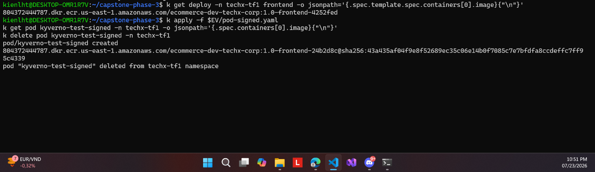

# 10 ⭐ — Image có chữ ký được nhận VÀ mutate sang digest



**Chụp:** 23/07/2026 22:52 · ns `techx-tf1`
**Chứng minh:** yêu cầu #3 — vế "chạy theo digest" + policy không chặn nhầm

## Trong ảnh có gì

```
# Deployment trong Git khai theo TAG:
k get deploy -n techx-tf1 frontend -o jsonpath='{...containers[0].image}'
804372444787...ecommerce-dev-techx-corp:1.0-frontend-4252fed

# Pod sau khi qua admission — đã thành DIGEST:
k apply -f $EV/pod-signed.yaml   →  pod/kyverno-test-signed created
804372444787...ecommerce-dev-techx-corp:1.0-frontend-24b2d8c@sha256:43a435af04f9e8f52689ec35c06e14b0f7085c7e7bfdfa8ccdeffc7ff95c4339
```

## Vì sao đáng chụp

Ảnh này trả lời vế còn lại của câu chuyện: enforce mà chặn cả image sạch thì vô dụng. Pod
mang image **có chữ ký** được `created` bình thường.

Nhưng giá trị lớn hơn nằm ở chỗ **image bị sửa**. Manifest gửi lên khai theo tag, thứ chạy
thật lại là `@sha256:...`. Đó là `mutateDigest: true` làm việc ngay tại admission.

Directive #3 đòi *"cluster chỉ chạy image đã ký, **tham chiếu theo digest**"*. Ta đạt được
điều đó **mà không phải sửa GitOps** — manifest vẫn đọc được bằng tag cho người, còn thứ
thật sự chạy là digest bất biến. Nếu ai đó đè lại tag trên registry, pod đang chạy không
bị ảnh hưởng vì nó đã ghim digest.

> [!NOTE]
> Đây cũng là lý do `mutateDigest` không dùng được ở chế độ Audit — xem
> [ảnh 06](06-pr-flip-enforce-diff.md).

Cặp đôi: [09](09-enforce-unsigned-bi-chan.md) chặn image bẩn ↔ **10** nhận image sạch.
