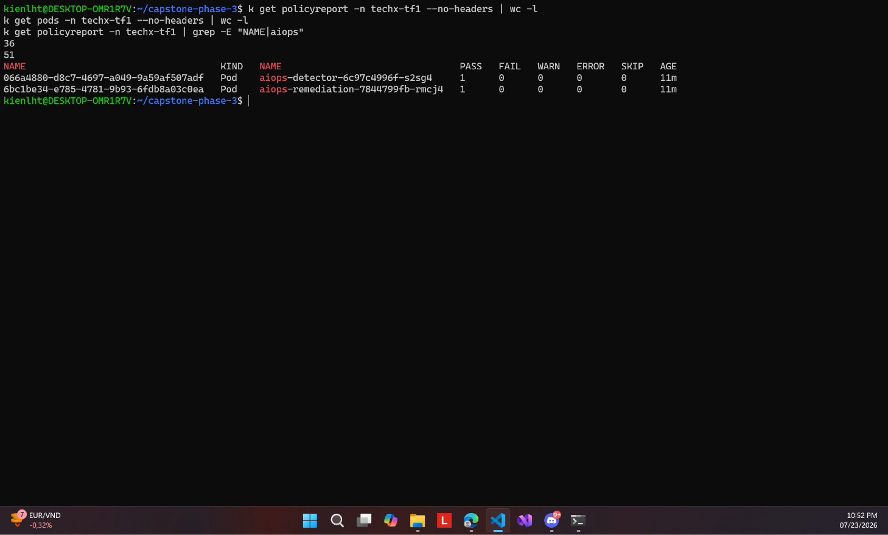

# 11 — 36 report, 2 pod aiops PASS

**Chụp:** 23/07/2026 22:52 · ns `techx-tf1`
**Chứng minh:** yêu cầu #3 — bịt "shadow path" image push tay

## Trong ảnh có gì

`policyreport` tăng lên **36** trên tổng **51** pod. Lọc riêng aiops:

| Pod | PASS | FAIL | Tuổi |
|---|---|---|---|
| `aiops-detector-6c97c4996f-s2sg4` | 1 | 0 | 11m |
| `aiops-remediation-7844799fb-rmcj4` | 1 | 0 | 11m |

## Vì sao đáng chụp

Ý nghĩa lịch sử. Hai image này trước ngày 17/07 là **push tay**, không qua CI nào — đúng
cái mà directive gọi là *"image ra cluster mà không ai chứng minh được nó sạch, từ đâu, ai
duyệt"*. Workflow `aiops-ci` chỉ chạy pytest, còn `app-build` thì không nhìn thư mục
`aiops/`, nên tồn tại một đường đi song song không ai gác.

Sau khi kéo `aiops/**` vào `app-build`, hai image này đi trọn chuỗi build → Trivy → ký →
SBOM. Ảnh này là bằng chứng chúng qua được policy — lỗ hổng đã bịt, và bịt bằng cách sửa
gốc (đưa vào pipeline có cổng) chứ không phải ký vá.

Con số 36/51 không phải thiếu sót: report chỉ sinh cho pod trong phạm vi policy, còn lại
là pod hệ thống ngoài `techx-tf1` hoặc pod vừa tạo chưa kịp có report.

Liên quan: [02](02-policyreport-audit-20pass.md) (report lúc còn Audit)
