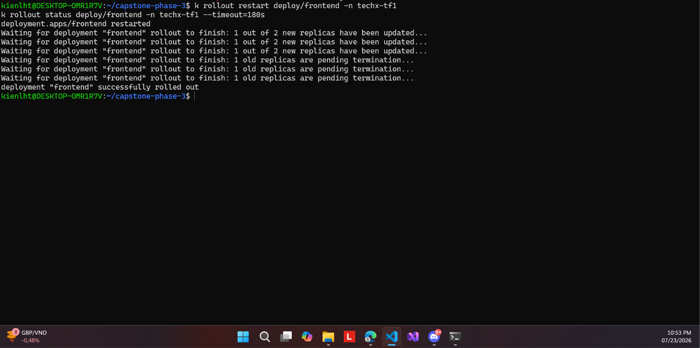

# 12 — Rollout vẫn chạy bình thường sau Enforce



**Chụp:** 23/07/2026 22:53 · ns `techx-tf1`
**Chứng minh:** ràng buộc directive — *"giữ SLO trong suốt"*

## Trong ảnh có gì

```
k rollout restart deploy/frontend -n techx-tf1
k rollout status deploy/frontend -n techx-tf1 --timeout=180s
...
deployment "frontend" successfully rolled out
```

Log cho thấy 2 replica thay **lần lượt**: "1 out of 2 new replicas have been updated" rồi
mới "1 old replicas are pending termination".

## Vì sao đáng chụp

Bật Enforce xong phải chứng minh **không phá gì**. Đây là phép thử trực tiếp: ép toàn bộ
pod của một Deployment thật đi qua admission mới. Nếu policy cấu hình sai — sai identity,
sai repo pattern, hay IRSA hỏng — thì rollout sẽ treo và câu "successfully rolled out"
không bao giờ hiện ra.

Việc thay lần lượt chứ không đồng loạt cũng quan trọng: nó nghĩa là dịch vụ không có
khoảng trống không replica nào phục vụ.

Liên quan: [13](13-techx-corp-synced-healthy.md) (trạng thái tổng thể sau đó)
