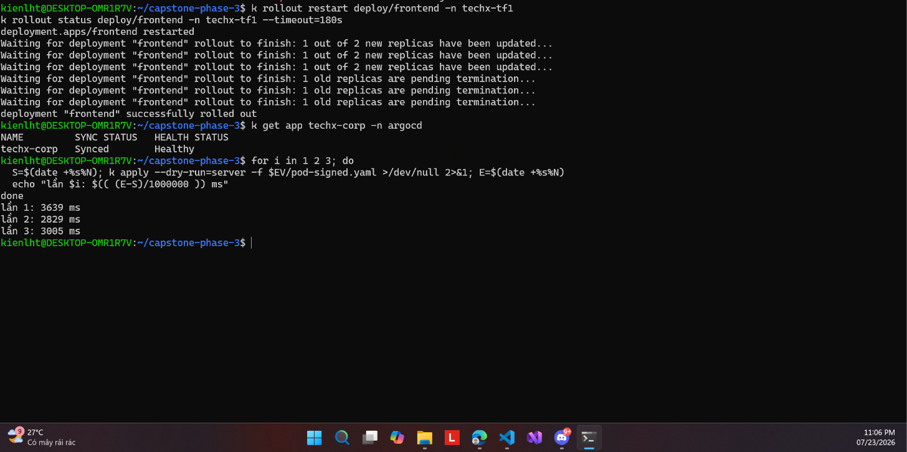

# 14 — Chi phí độ trễ admission khi cache đã ấm

**Chụp:** 23/07/2026 23:07
**Chứng minh:** ràng buộc directive — *"trong ngân sách, giữ SLO"*

## Trong ảnh có gì

Vòng lặp đo 3 lần `apply --dry-run=server` với pod đã ký:

| Lần | Thời gian |
|---|---|
| 1 | 3639 ms |
| 2 | 2829 ms |
| 3 | 3005 ms |

## Vì sao đáng chụp

Enforce không miễn phí — mỗi pod tạo ra đều phải chờ Kyverno verify chữ ký. Phải đo để
biết cái giá đó là bao nhiêu.

Ba số trên là trạng thái **cache đã ấm**. Đọc kèm
[../logs/01-baseline-admission-latency.txt](../logs/01-baseline-admission-latency.txt) thì
bức tranh đầy đủ hơn nhiều:

| Tình huống | Thời gian |
|---|---|
| Lần verify **đầu tiên** của một digest mới | **70.1s** |
| Lần 2-5 của cùng digest | 2.6-4.8s |
| Image ngoài phạm vi policy (busybox) | 2.4s |

Con số 70s là cái giá **một lần cho mỗi digest mới**: tải TUF root và truy vấn Rekor qua
NAT gateway. Từ lần sau còn 2.6-4.8s, mà trừ đi 2.4s overhead mạng nền thì chi phí thật
của verify chỉ khoảng **0.2-2.4s**.

Đây chính là lý do giữ `webhookTimeoutSeconds: 30` — đủ rộng cho đường ấm. Digest mới lần
đầu chậm thì chấp nhận, vì nó chỉ xảy ra một lần cho mỗi image.

> [!NOTE]
> Hạn chế đã biết: Kyverno **không cache được token ECR** vì `readOnlyRootFilesystem` chặn
> ghi `/.ecr` (log "Could not save cache" ×143). Mỗi verify tốn thêm một round-trip. Giảm
> được bằng cách mount `emptyDir` vào `/.ecr`.
