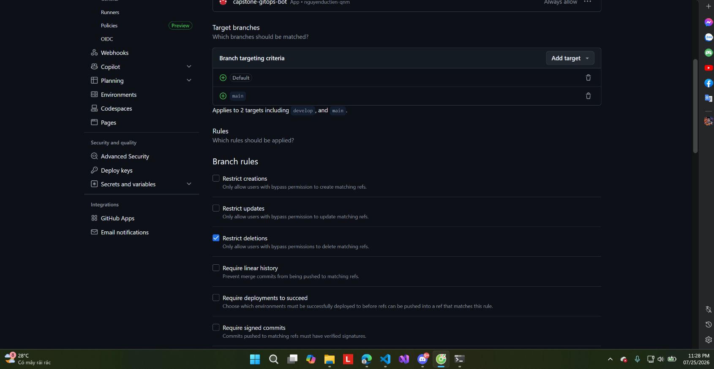

# 15 — Ruleset áp cho nhánh nào

**Chụp:** 25/07/2026 23:28 · GitHub repo settings → Rules
**Chứng minh:** yêu cầu #1 — cổng chặn phủ đúng nhánh deploy

## Trong ảnh có gì

Branch targeting criteria có `Default` và `main`, chú thích *"Applies to 2 targets
including `develop` and `main`"*. Trong danh sách Branch rules, `Restrict deletions` đã tick.

## Vì sao đáng chụp

Trước khi khoe "có cổng chặn" thì phải chứng minh cổng đặt **đúng cửa**. Ảnh này cho thấy
ruleset áp lên cả `develop` (nhánh deploy thật, nơi `app-build` chạy và bump tag) lẫn
`main`, chứ không phải cấu hình cho một nhánh phụ nào đó.

`Restrict deletions` chặn việc xóa nhánh — một đường vòng để né cổng nếu ai đó xóa rồi tạo
lại nhánh.

Đọc tiếp: [16](16-ruleset-require-pr-approval.md) → [17](17-ruleset-3-required-checks.md)
