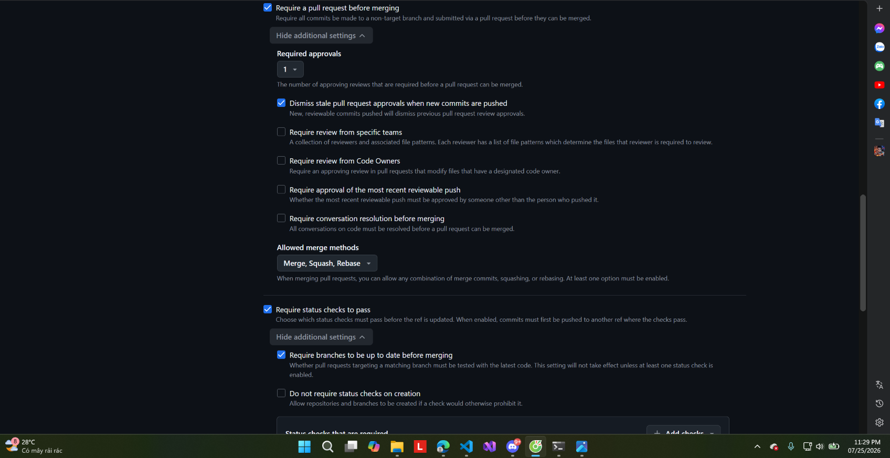

# 16 — Bắt buộc PR và phải có người duyệt

**Chụp:** 25/07/2026 23:29 · GitHub repo settings → Rules
**Chứng minh:** yêu cầu #1 (cổng chặn) + yêu cầu #5 (PR ai duyệt)

## Trong ảnh có gì

| Cấu hình | Trạng thái |
|---|---|
| `Require a pull request before merging` | ✅ |
| `Required approvals` | **1** |
| `Dismiss stale pull request approvals when new commits are pushed` | ✅ |
| `Require review from Code Owners` | ⬜ |
| `Require conversation resolution` | ⬜ |

## Vì sao đáng chụp

Yêu cầu #5 đòi truy được *"PR **ai duyệt**"*. Muốn có câu trả lời đó thì trước hết phải
**bắt buộc có PR và có người duyệt** — đó là việc của ảnh này. Không có nó thì mắt xích
"người duyệt" trong [ảnh 20](20-trace-provenance-8-mat-xich.md) sẽ trống.

Dòng **"Dismiss stale approvals"** quan trọng hơn vẻ ngoài của nó. Nếu ai đó được duyệt
rồi mới push thêm commit, phê duyệt cũ **bị hủy** và phải duyệt lại. Không có nó thì chữ
"đã duyệt" trở nên vô nghĩa: người duyệt xem một bản code, thứ được merge lại là bản khác.

Đây là loại chi tiết dễ bỏ sót nhưng chính là ranh giới giữa "có quy trình duyệt" và
"quy trình duyệt chứng minh được điều gì".
