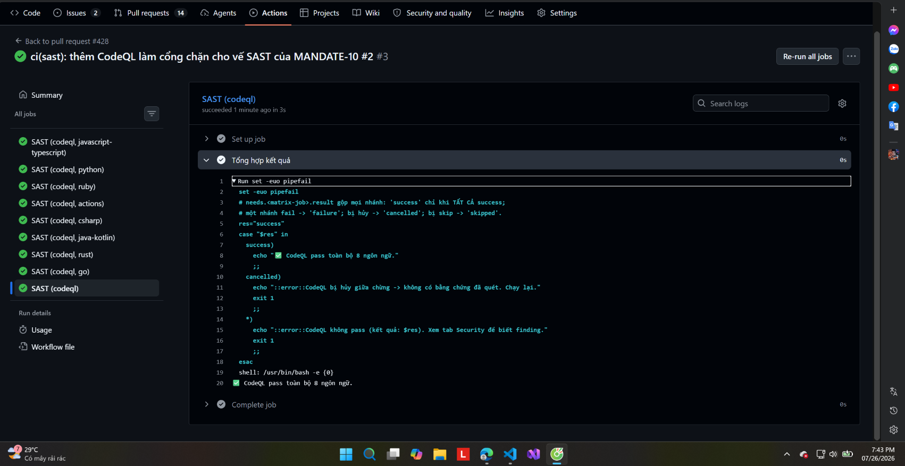

# 21 ⭐ — SAST chạy thật: CodeQL pass đủ 8 ngôn ngữ

**Chụp:** 26/07/2026 19:43 · run #3 của PR [#428](https://github.com/nguyenductien-qnm/capstone-phase-3/pull/428)
**Chứng minh:** yêu cầu #2 — vế **SAST**, vế cuối cùng còn hở của directive

## Trong ảnh có gì

Panel trái liệt kê đủ 9 job xanh — 8 nhánh matrix cộng job gộp:

| Job | Vai trò |
|---|---|
| `SAST (codeql, javascript-typescript)` | quét 84 file `.ts` + 9 file `.js` |
| `SAST (codeql, python)` | quét 72 file `.py` |
| `SAST (codeql, ruby)` | quét service email |
| `SAST (codeql, actions)` | **quét chính workflow GitHub Actions** |
| `SAST (codeql, csharp)` | quét accounting + cart |
| `SAST (codeql, java-kotlin)` | quét ad + fraud-detection |
| `SAST (codeql, rust)` | quét shipping |
| `SAST (codeql, go)` | quét 15 file `.go` |
| **`SAST (codeql)`** | job gộp — tên cố định để đưa vào ruleset |

Panel phải mở log job gộp, dòng 20 in ra: `✅ CodeQL pass toàn bộ 8 ngôn ngữ.`

## Vì sao đáng chụp

Trước ngày này repo **không có SAST nào**. Grep `semgrep|sonar|bandit|codeql` trên cả 13
workflow đều ra rỗng — 0/13. Yêu cầu #2 của directive đòi bốn vế cùng là cổng chặn: image
CVE scan, IaC misconfig scan, secret, và SAST. Ba vế kia đã có từ trước; đây là vế cuối.

Ba chi tiết làm nên sức nặng của ảnh.

**Thứ nhất, job gộp `SAST (codeql)` chạy 3 giây** trong khi các nhánh matrix chạy 43 giây
tới 1 phút 58. Chênh lệch đó đúng thiết kế: job gộp không quét gì, nó chỉ đọc
`needs.analyze.result` rồi kết luận. Lý do phải có nó là matrix sinh tên động
(`SAST (codeql, python)`…) mà required status check cần một chuỗi **cố định** — thêm ngôn
ngữ mới sau này cũng không phải sửa ruleset. Cùng cách làm với job `Unit tests` trong
`platform-ci.yaml`.

**Thứ hai, log hiện rõ logic phân nhánh** ở dòng 10–17: `cancelled` và các trạng thái khác
đều `exit 1`. Điểm này **khác** job `Unit tests`: với test thì skip nghĩa là không có gì
cần chạy, còn với SAST thì skip nghĩa là **không ai quét** — đúng thứ directive gọi là
"pipeline chạy cho vui". Chỉ `success` mới được qua.

**Thứ ba, thời gian quét chứng minh nó quét thật.** Lần chạy đầu tiên của PR này fail cả 8
ngôn ngữ chỉ sau 13–21 giây với lỗi `Query pack default cannot be found` — đó là chết ở
bước khởi tạo, chưa quét gì. Sau khi sửa (bỏ `queries: default`, vì input đó chỉ nhận
query **bổ sung** chứ không nhận tên suite mặc định), thời gian nhảy lên hàng phút. Đó là
khác biệt giữa "gate xanh vì không chạy" và "gate xanh vì quét xong không thấy gì".

Ngôn ngữ `actions` đáng chú ý riêng: nó quét chính các file workflow, bắt script injection
và quyền token thừa. Bối cảnh directive mở đầu bằng *"Một pipeline bị chiếm..."* — pipeline
là bề mặt tấn công được nêu tên đầu tiên, mà chính nó lại cầm quyền ký cosign và apply
Terraform.

## Kết quả quét

Không finding nào. Đây là lần đầu repo được quét SAST, nên kết quả sạch là dữ kiện đáng
ghi chứ không hiển nhiên.

Xem cổng này được đưa vào ruleset: [23](23-ruleset-4-checks-co-sast.md)
