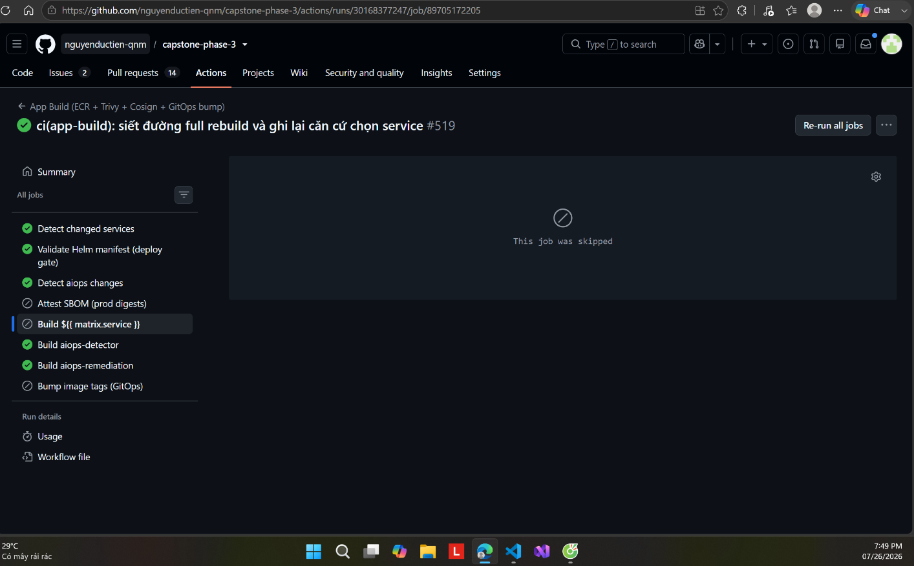

# 22 ⭐ — Chỉ đụng cái gì đổi: workflow tự chứng minh trên chính nó



**Chụp:** 26/07/2026 19:49 · run [30168377247](https://github.com/nguyenductien-qnm/capstone-phase-3/actions/runs/30168377247) của PR [#413](https://github.com/nguyenductien-qnm/capstone-phase-3/pull/413)
**Chứng minh:** yêu cầu #6 — **"một thay đổi nhỏ không được kéo rebuild cả hệ"**

## Trong ảnh có gì

Panel trái, kết quả từng job của run:

| Job | Kết quả |
|---|---|
| `Detect changed services` | ✅ chạy |
| `Validate Helm manifest (deploy gate)` | ✅ chạy |
| `Detect aiops changes` | ✅ chạy |
| **`Build ${{ matrix.service }}`** | ⏭️ **skipped** |
| `Build aiops-detector` | ✅ chạy |
| `Build aiops-remediation` | ✅ chạy |
| `Bump image tags (GitOps)` | ⏭️ skipped |
| `Attest SBOM (prod digests)` | ⏭️ skipped |

Panel phải: `This job was skipped`.

## Vì sao đáng chụp

Đây là bằng chứng **workflow tự chứng minh trên chính nó**, không phải một ca dựng sẵn.

PR #413 sửa đúng **một file**: `.github/workflows/app-build.yaml`. Mà file đó nằm trong
danh sách `paths:` kích hoạt chính workflow này:

```yaml
pull_request:
  paths:
    - "techx-corp-platform/src/**"
    - "platform/charts/application/values.yaml"
    - "aiops/**"
    - ".trivyignore"
    - ".github/workflows/app-build.yaml"   # <-- PR #413 chạm đúng dòng này
```

Nên workflow **được kích hoạt**, job `Detect changed services` **chạy thật** — rồi tự kết
luận: không service nào có thay đổi ảnh hưởng nội dung image, nên không build gì. Với logic
cũ trước PR #413, một PR chạm file trong `paths:` sẽ kéo rebuild **toàn bộ 21 image**.

Nói cách khác: chính cái PR sửa logic chống full-rebuild lại là ca kiểm thử đầu tiên của
logic đó, và nó chặn đúng.

## Ba job skipped nói lên chuỗi hệ quả

Điều đáng chú ý là **không chỉ mỗi bước build bị bỏ qua**. `Bump image tags (GitOps)` cũng
skipped, kéo theo ArgoCD không nhận tag mới nên **không service nào bị redeploy**. Đó đúng
là chuỗi mà directive muốn cắt: *"một thay đổi nhỏ không được kéo rebuild + redeploy cả
hệ"*. Không rebuild là một nửa; không redeploy mới là nửa còn lại.

`Attest SBOM (prod digests)` skipped vì đó là chế độ `workflow_dispatch` riêng, không liên
quan tới PR — ghi ra đây để không ai đọc nhầm thành lỗi.

## Vì sao hai job aiops vẫn chạy

`Build aiops-detector` và `Build aiops-remediation` vẫn xanh, và **đó không phải sai sót**.
Job `detect-aiops` là job độc lập với `detect`: nó coi việc sửa `app-build.yaml` là lý do
để dựng lại 2 image aiops. Không nguy hiểm vì đây là sự kiện `pull_request` nên
`push: false` — image được dựng và quét Trivy nhưng **không đẩy lên ECR**.

Ghi rõ điểm này thay vì giấu: đây là chỗ còn nới hơn phần chart, đã cân nhắc và giữ
nguyên vì rủi ro bỏ sót kiểm chứng lớn hơn lợi ích tiết kiệm hai lần build.

## Đối chiếu với hai ca full rebuild trước đó

| Ca | Chuyện gì | Kết quả |
|---|---|---|
| Dispatch bỏ trống `services` | run 30159978689 | 🔴 21 image, tất cả mang commit không liên quan |
| Merge PR #284 thêm `telemetryRetention` vào `values.yaml` | commit 4252fed | 🔴 21 image, trong khi code đổi chỉ ở `src/email/` |
| **PR #413 sửa `app-build.yaml`** | run này | 🟢 **0 image chart** |

Xem thêm bằng chứng file trong `README.md` mục #6.
