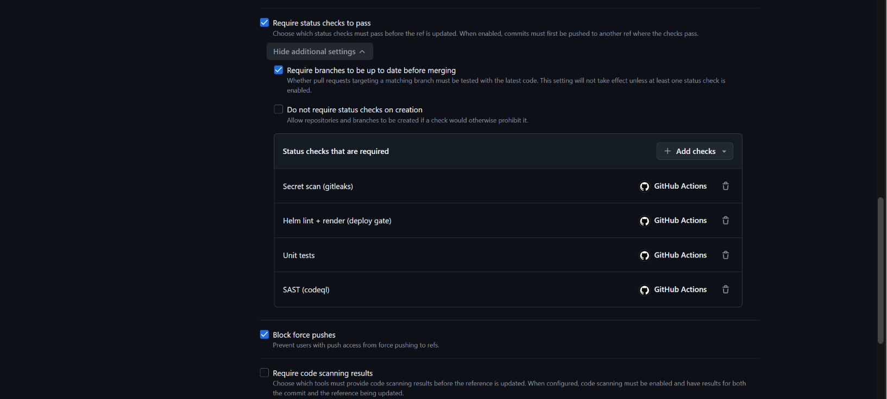

# 23 ⭐ — SAST thành cổng chặn thật: ruleset đủ 4 required check

**Chụp:** 26/07/2026 20:03 · GitHub repo settings → Rules → `protect main & develop`
**Chứng minh:** yêu cầu #1 + #2 — vế SAST **khép kín**

## Trong ảnh có gì

| Cấu hình | Trạng thái |
|---|---|
| `Require status checks to pass` | ✅ |
| `Require branches to be up to date before merging` | ✅ |
| `Block force pushes` | ✅ |
| `Do not require status checks on creation` | ⬜ |
| `Require code scanning results` | ⬜ **cố ý không bật** — xem phần cuối |

Danh sách check bắt buộc, **bốn** thay vì ba:

| Check | Chặn cái gì |
|---|---|
| `Secret scan (gitleaks)` | secret lọt vào repo |
| `Helm lint + render (deploy gate)` | manifest hỏng ra cluster |
| `Unit tests` | code đỏ |
| **`SAST (codeql)`** | **lỗ hổng trong mã nguồn** ← mới |

## Vì sao đáng chụp

Ảnh [21](21-codeql-8-ngon-ngu-pass.md) chứng minh CodeQL **chạy được và sạch**. Nhưng chạy
được chưa phải là cổng chặn — nếu không nằm trong danh sách này thì CodeQL đỏ vẫn merge
được như thường, đúng thứ directive gọi là *hậu kiểm*. Ảnh 23 là mắt xích khép kín: từ nay
CodeQL đỏ thì nút Merge xám.

So với [ảnh 17](17-ruleset-3-required-checks.md) chụp 25/07 thì khác đúng một dòng — dòng
thứ tư. Hai ảnh đặt cạnh nhau là dòng thời gian của việc vá vế SAST.

`Require branches to be up to date` đáng chú ý: nó bắt PR phải rebase lên develop mới nhất
trước khi merge, nghĩa là 4 check phải xanh **trên đúng tổ hợp code sẽ vào nhánh**, không
phải trên một bản cũ. `Block force pushes` bịt đường vòng còn lại — không thể đè lên nhánh
để né cổng.

## Bài học đã trả giá: thứ tự bật cổng

Khi thêm `SAST (codeql)` vào danh sách này mà `codeql.yaml` **chưa có trên develop**, toàn
bộ PR đang mở lập tức kẹt. GitHub chờ một check tên `SAST (codeql)`; PR nào không sinh ra
được check đó thì treo vĩnh viễn ở trạng thái `Expected`. Thời điểm đó 4 PR chuyển sang
`BLOCKED` và không ai merge được gì — kể cả chính PR #428 mang file cần thiết.

Thoát ra bằng cách merge #428 trước, file lên develop là mọi PR sinh được check.

> [!CAUTION]
> Thứ tự đúng khi thêm bất kỳ required check nào: **merge workflow sinh ra check TRƯỚC**,
> rồi mới thêm tên nó vào ruleset. Làm ngược lại thì khoá cả repo, và không tự gỡ được
> bằng cách chạy lại — vì job không tồn tại chứ không phải job đỏ.

## Vì sao `Require code scanning results` cố ý KHÔNG bật

[Ảnh 17](17-ruleset-3-required-checks.md) chụp hôm 25/07 có ghi ô này *"chính là ô cần tick
để SAST thành cổng chặn thật"*. **Kết luận đó đã được thay bằng ảnh này** — hoá ra không
cần: `SAST (codeql)` trong required checks đã đủ chặn merge, chứng minh ngay ở ảnh trên.

Ba lý do giữ nguyên ô trống:

**Trùng chức năng.** Required check đã canh việc CodeQL fail. Bật thêm ô này là hai cơ chế
cùng gác một thứ, mỗi cơ chế lại có cách hỏng riêng — thêm điểm gãy chứ không thêm an toàn.

**Khắt khe hơn hẳn.** `SAST (codeql)` hỏi "workflow chạy xong có lỗi không". Ô này hỏi "có
alert nào từ mức severity X trở lên không" — CodeQL chạy xanh mà lòi một alert `medium` thì
vẫn có thể chặn merge tuỳ ngưỡng. Với gate vừa bật lần đầu, đó là cách nhanh nhất để cả
team đứng hình.

**Cùng cái bẫy vừa trả giá.** Ô này đòi code scanning đã có kết quả cho **cả nhánh nguồn
lẫn nhánh đích**. Develop vừa mới có `codeql.yaml`, chưa tích luỹ đủ lịch sử quét. Bật bây
giờ là lặp lại đúng sự cố kẹt PR ở trên.

Đáng cân nhắc bật lại sau, khi CodeQL đã chạy ổn định trên develop vài tuần và biết rõ nó
ra bao nhiêu alert ở mỗi mức.

Cặp đôi: [17](17-ruleset-3-required-checks.md) (3 check, 25/07) → **23** (4 check, 26/07).
Bằng chứng CodeQL chạy thật: [21](21-codeql-8-ngon-ngu-pass.md).
