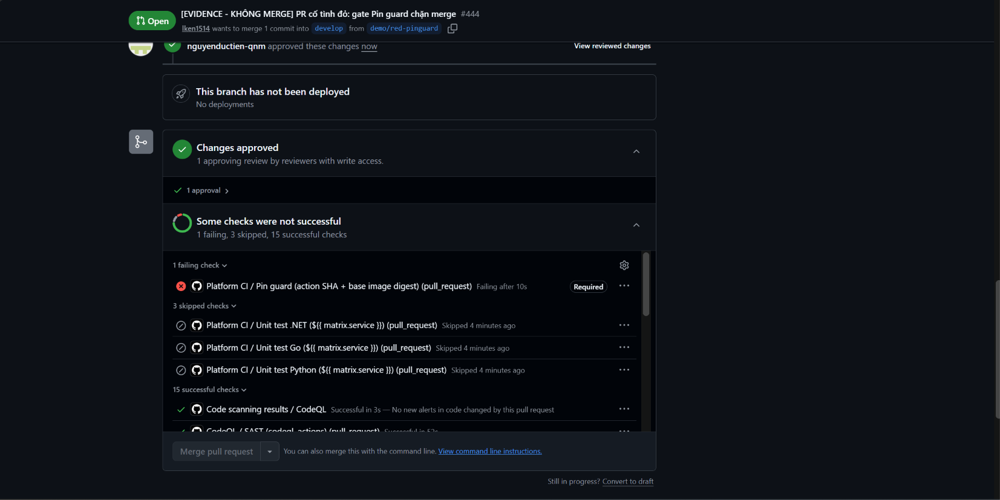

# 24 — PR cố tình đỏ: Pin guard chặn merge

**Chụp:** 27/07/2026 10:53 · PR #444 `demo/red-pinguard` → `develop`
**Chứng minh:** yêu cầu "mở PR với CI cố tình đỏ → phải bị chặn merge"

## Trong ảnh có gì

Bốn thứ, và cần đủ cả bốn thì ảnh mới có giá trị:

| Trong ảnh | Ý nghĩa |
|---|---|
| `Platform CI / Pin guard...` ❌ **Failing after 10s** | Gate bắt được lỗi |
| Nhãn **`Required`** cạnh nó | Gate này thuộc ruleset, không phải check cho vui |
| **Merge pull request** xám, không bấm được | Cửa khoá thật |
| ✅ **1 approval** · *Changes approved* | Đã có người duyệt — chặn là do CI đỏ, không phải do thiếu review |

Đếm thêm: *1 failing, 3 skipped, 15 successful*.

## Vì sao đáng chụp

Dòng `1 approval` là chi tiết dễ bỏ qua nhất mà lại quan trọng nhất. Nếu PR chưa ai duyệt
thì nút Merge cũng xám, và người đọc bằng chứng có quyền nghi ngờ: xám vì thiếu chữ ký hay
xám vì CI đỏ? Ảnh này trả lời dứt điểm — chữ ký đã có, nút vẫn xám, nên thứ giữ cửa đúng
là cái gate.

Con số **15 successful** cũng phải nằm trong khung hình. Một hệ thống đỏ vơ đũa cả nắm thì
vô dụng ngang hệ thống xanh hết: nó không nói được cái gì thật sự hỏng. Ảnh có cả một ô đỏ
lẫn mười lăm ô xanh mới chứng minh cổng chặn **đúng chỗ**.

Gate đỏ sau **10 giây** — nhanh nhất trong 7 cổng, vì nó chỉ đọc file chứ không build hay
quét gì.

## Lưu ý khi đọc

`Code scanning results / CodeQL` trong ảnh này đang **xanh**, ghi *"No new alerts in code
changed by this pull request"*. Đúng như vậy: PR #444 chỉ sửa một dòng YAML, không thêm lỗ
hổng nào. Cổng SAST không có lý do gì để đỏ, và nó không đỏ. Xem [30](30-pr443-codeql-required-merge-xam.md)
cho trường hợp ngược lại.

Đọc tiếp: [25](25-pr444-diff-doi-sha-ve-tag.md) — chỗ cố tình sai nằm ở đâu
