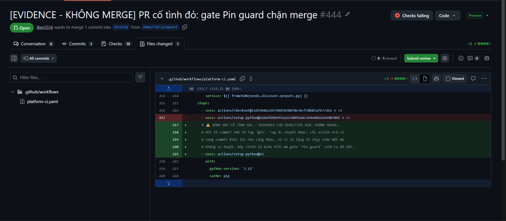

# 25 — Chỗ cố tình sai của PR #444: đổi SHA về tag



**Chụp:** 27/07/2026 10:53 · PR #444 → tab Files changed
**Chứng minh:** lỗi dùng làm mồi là lỗi THẬT, không phải lỗi bịa để gate dễ bắt

## Trong ảnh có gì

Diff một dòng trong `.github/workflows/platform-ci.yaml`:

```diff
-      - uses: actions/setup-python@a26af69be951a213d495a4c3e4e4022e16d87065 # v5
+      - uses: actions/setup-python@v5
```

Góc trên phải: **Checks failing**. Tab Checks: **19**.

## Vì sao dòng này nguy hiểm

Commit SHA là địa chỉ cố định. Nó trỏ vào đúng một bản mã đã tồn tại, và không ai đổi được
nội dung của nó — đổi một ký tự thì SHA thành số khác.

Tag `v5` thì ngược lại: nó chỉ là cái nhãn dán. Chủ action gỡ nhãn ra dán sang commit khác
lúc nào cũng được, không cần hỏi ai. Khi đó CI của mình lặng lẽ chạy mã mới mà không một ai
trong repo duyệt qua — người ngoài vừa sửa được thứ đang chạy trên runner giữ token ký
cosign và quyền apply Terraform.

Ví như hợp đồng ghi *"giao tại kho số 12"* thay vì *"giao tại kho ở 12 Nguyễn Trãi"*. Ai đó
tháo biển số 12 gắn sang cái kho khác thì hàng vẫn được giao đều đặn, chỉ là giao nhầm chỗ,
và trên giấy tờ không có dòng nào sai cả.

## Đã kiểm trước khi push

Chạy đúng logic của gate ngay tại máy, không chờ CI đoán mò:

```
GATE SẼ ĐỎ ✅
.github/workflows/platform-ci.yaml:221:      - uses: actions/setup-python@v5
```

Đúng một dòng bị bắt. Không sót dòng nào, và cũng không bắt nhầm dòng nào — kể cả các dòng
`uses:` nằm trong comment minh hoạ của chính file đó, vốn từng làm gate tự bắt lỗi của mình
ở PR #433.

Đọc tiếp: [26](26-add-check-codeql-vs-sast.md)
