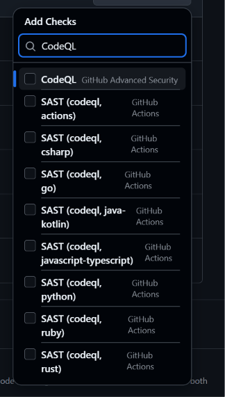

# 26 — Hai cái tên CodeQL, chọn đúng cái nào

**Chụp:** 27/07/2026 11:04 · Settings → Rules → Add checks
**Chứng minh:** yêu cầu #1 — hiểu đúng cổng nào mới thật sự chặn được

## Trong ảnh có gì

Gõ "CodeQL" vào ô tìm ra chín dòng, chia làm hai nhóm rõ rệt theo cột nguồn bên phải:

| Dòng | Nguồn | Là gì |
|---|---|---|
| **`CodeQL`** | **GitHub Advanced Security** | Kết quả quét, đã đối chiếu ngưỡng severity |
| `SAST (codeql, actions)` và 7 dòng nữa | GitHub Actions | Job con của matrix, mỗi ngôn ngữ một cái |

Chỉ tick dòng đầu.

## Vì sao chỉ một dòng

**Không tick 8 dòng matrix**, vì tên chúng là tên động. Hôm nay matrix có 8 ngôn ngữ nên có
8 job; mai bỏ Rust đi thì check `SAST (codeql, rust)` biến mất, mà ruleset vẫn đòi nó — mọi
PR sẽ treo `Expected` vĩnh viễn, không ai merge được gì. Đây đúng cái bẫy đã làm kẹt 4 PR
hồi thêm CodeQL vào ruleset lần đầu (xem [17](17-ruleset-3-required-checks.md)).

Job gộp `SAST (codeql)` sinh ra chính là để tránh chuyện đó: tên nó cố định, không phụ
thuộc matrix có bao nhiêu ngôn ngữ. Nó đã nằm trong ruleset từ trước nên không hiện ở đây.

## Bài học: job xanh không có nghĩa là code sạch

Trước hôm nay ruleset đã có `SAST (codeql)` rồi, và ai cũng tưởng thế là đủ. Không đủ. PR
#443 mang hai lỗ hổng thật — một critical, một high — mà `SAST (codeql)` vẫn **xanh** và PR
vẫn merge được.

Lý do nằm ở chỗ hai cái tên làm hai việc khác nhau:

| Check | Việc của nó | Xanh nghĩa là |
|---|---|---|
| `SAST (codeql)` | Chạy CodeQL trên 8 ngôn ngữ | *Công cụ chạy ổn* — không crash, không timeout |
| `CodeQL` | Đọc alert, so ngưỡng severity | *Không có lỗ hổng vượt ngưỡng* |

Ví như nhân viên phòng xét nghiệm và bác sĩ. Nhân viên báo *"đã lấy đủ mẫu, máy chạy bình
thường"* — câu đó đúng kể cả khi kết quả xét nghiệm xấu. Bác sĩ mới là người nhìn con số
rồi nói *"chỉ số này nguy hiểm, chưa cho về"*. Ruleset trước hôm nay chỉ nghe nhân viên
phòng xét nghiệm, mà nhân viên thì báo về cái máy chứ không báo về bệnh nhân.

## Vì sao vẫn giữ cả hai

Thiếu cái nào cũng hở một đằng:

- Chỉ có `SAST (codeql)` → công cụ chạy ngon mà code đầy lỗ vẫn merge được. Đúng tình trạng
  PR #443 gặp phải.
- Chỉ có `CodeQL` → ai đó làm job crash sớm là không alert nào sinh ra, mà không có alert
  thì không có gì để chặn. Cổng tự mở khi bị làm hỏng.

Đọc tiếp: [27](27-ruleset-7-required-checks.md)
