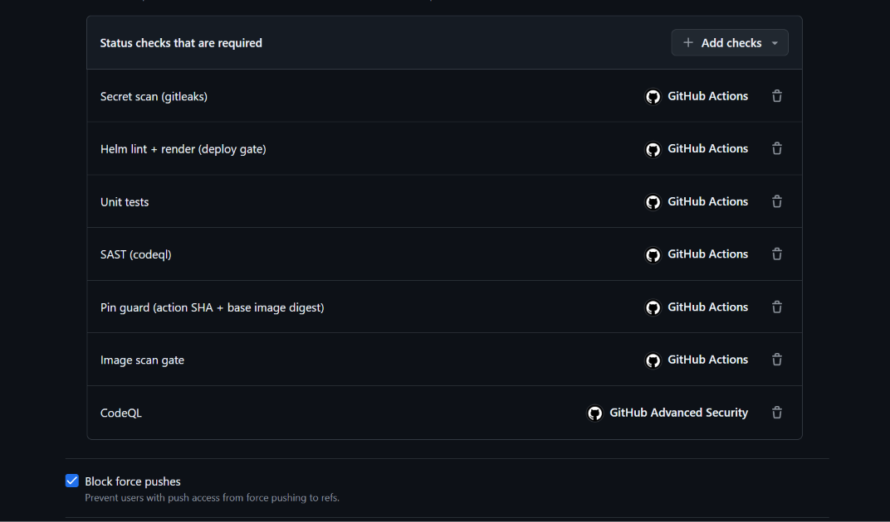

# 27 — Ruleset đủ 7 cổng bắt buộc

**Chụp:** 27/07/2026 11:05 · Settings → Rules → "protect main & develop"
**Chứng minh:** yêu cầu #1 — cổng chặn đã phủ đủ các mặt

## Trong ảnh có gì

Bảy dòng trong *Status checks that are required*, và **Block force pushes** đã tick:

| # | Check | Nguồn | Bắt gì |
|---|---|---|---|
| 1 | Secret scan (gitleaks) | Actions | Credential lọt vào git |
| 2 | Helm lint + render (deploy gate) | Actions | Manifest hỏng, render ra rác |
| 3 | Unit tests | Actions | Code sai logic |
| 4 | SAST (codeql) | Actions | Công cụ quét bị hỏng, không chạy được |
| 5 | Pin guard (action SHA + base image digest) | Actions | Action/base image pin bằng tag di động |
| 6 | Image scan gate | Actions | CVE nghiêm trọng trong ảnh container |
| 7 | **CodeQL** | **GitHub Advanced Security** | **Lỗ hổng mã nguồn vượt ngưỡng severity** |

So với [17](17-ruleset-3-required-checks.md) chụp ngày 25/07 (3 cổng), số cổng đã tăng hơn
gấp đôi. Ba cái thêm trong ngày 27/07 là dòng 5, 6, 7.

## Vì sao Block force pushes cũng phải tick

Không tick thì mọi cổng phía trên thành vô nghĩa. Ai có quyền push chỉ cần
`git push --force` đè lên `develop` là đưa được code vào mà không qua PR nào cả — cổng vẫn
đứng đó, người ta đi vòng qua tường.

Cùng lý do với `Restrict deletions` ở [15](15-ruleset-target-branches.md): xoá nhánh rồi
tạo lại cũng là một đường vòng.

## Điểm còn thiếu

`Terraform fmt, validate, scan` chưa có mặt. Không phải quên, mà vì workflow hạ tầng chưa
có job gộp tên cố định — thêm thẳng job matrix vào đây sẽ dính đúng bẫy tên động nói ở
[26](26-add-check-codeql-vs-sast.md). Việc cần làm là viết job gộp trước, thêm vào ruleset
sau.

## Về 6 alert cũ đang mở

Repo đang có 6 alert code scanning chưa xử: `py/flask-debug`, ba cái
`js/tainted-format-string`, hai cái `actions/missing-workflow-permissions`. Thêm `CodeQL`
vào ruleset **không** làm kẹt các PR lành, vì không cái nào trong sáu cái đó đạt mức
high — ngưỡng chặn đặt ở high trở lên.

Đây là chỗ cổng này tinh hơn vẻ ngoài: nó không chặn mọi alert, nó chặn theo mức nghiêm
trọng. Nếu chặn tất thì repo đã đứng hình từ lâu vì sáu alert kia. Sáu cái đó vẫn cần xử,
nhưng là việc riêng, không phải việc của cổng.

Đọc tiếp: [28](28-pr443-alert-sql-injection-high.md)
