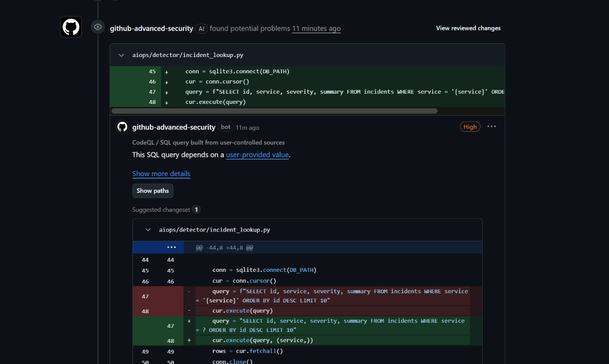

# 28 — CodeQL bắt SQL injection (High)



**Chụp:** 27/07/2026 11:06 · PR #443 → Files changed
**Chứng minh:** cổng SAST bắt được lỗ hổng thật, chỉ đúng dòng, kèm cách sửa

## Trong ảnh có gì

`github-advanced-security` bình luận thẳng vào `aiops/detector/incident_lookup.py:47`, nhãn
**High**, tiêu đề *"CodeQL / SQL query built from user-controlled sources"*.

Dòng bị bắt:

```python
query = f"SELECT id, service, severity, summary FROM incidents WHERE service = '{service}' ORDER BY id DESC LIMIT 10"
cur.execute(query)
```

Bản vá nó tự đề xuất:

```python
query = "SELECT id, service, severity, summary FROM incidents WHERE service = ? ORDER BY id DESC LIMIT 10"
cur.execute(query, (service,))
```

Có nút **Show paths** — bấm vào xem được đường đi từ nguồn dữ liệu tới chỗ nguy hiểm.

## Lỗ này làm được gì

`service` đến thẳng từ query string của HTTP request. Gọi endpoint với
`?service=x' OR '1'='1` là đọc được toàn bộ bảng; với `?service=x'; DROP TABLE incidents; --`
là mất bảng.

Bản vá không phải "lọc ký tự xấu" mà là **tách dữ liệu ra khỏi câu lệnh**. Dấu `?` báo cho
driver biết chỗ đó là dữ liệu, và driver sẽ không bao giờ diễn giải nó thành lệnh SQL, dù
người dùng gửi gì đi nữa.

## Bài học: CodeQL cần ĐƯỜNG ĐI, không chỉ cần code xấu

Bản đầu của file này **không** làm CodeQL đỏ, dù nó có đúng lỗ hổng ấy. Đã truy nguyên nhân
bằng log run 30235473845 thay vì đoán:

```
Extracted file .../aiops/detector/incident_lookup.py in 25ms
CodeQL scanned 58 out of 58 Python files
Interpreted pathproblem query "SQL query built from user-controlled sources" (py/sql-injection)
Interpreted pathproblem query "Uncontrolled command line" (py/command-line-injection)
```

File **đã được đọc**, đúng hai query **đã chạy**, mà vẫn ra 0 alert. Loại trừ được cả giả
thuyết `paths-ignore` chặn lẫn giả thuyết thiếu query.

Nguyên nhân thật: CodeQL không báo vì "trông thấy code xấu". Nó chỉ báo khi truy được đường
đi từ một nguồn do người ngoài điều khiển tới chỗ nguy hiểm. Bản đầu nhận dữ liệu qua tham
số hàm, mà tham số hàm thì CodeQL không biết ai sẽ truyền vào — không có nguồn thì không có
đường đi, không có đường đi thì không có alert.

Nó không sót. Nó từ chối đoán mò, và đó là điều đúng đắn: một công cụ báo bừa mọi chuỗi
f-string sẽ ngập trong báo động giả tới mức không ai buồn đọc nữa.

Ví như chó nghiệp vụ không sủa khi bạn cầm cái túi rỗng. Nó sủa khi ngửi ra mùi đi từ cái
túi ấy về một thứ nó được huấn luyện để tìm. Túi rỗng thì hình dáng đáng ngờ mấy cũng không
có mùi để lần theo.

Bản sửa dùng `flask.request.args` làm nguồn. Chọn Flask vì repo đã có nó thật ở
`techx-corp-platform/src/llm/app.py`, và CodeQL đang báo `py/flask-debug` ngay tại đó —
bằng chứng nó hiểu Flask trong bối cảnh repo này.

Đọc tiếp: [29](29-pr443-alert-command-injection-critical.md)
