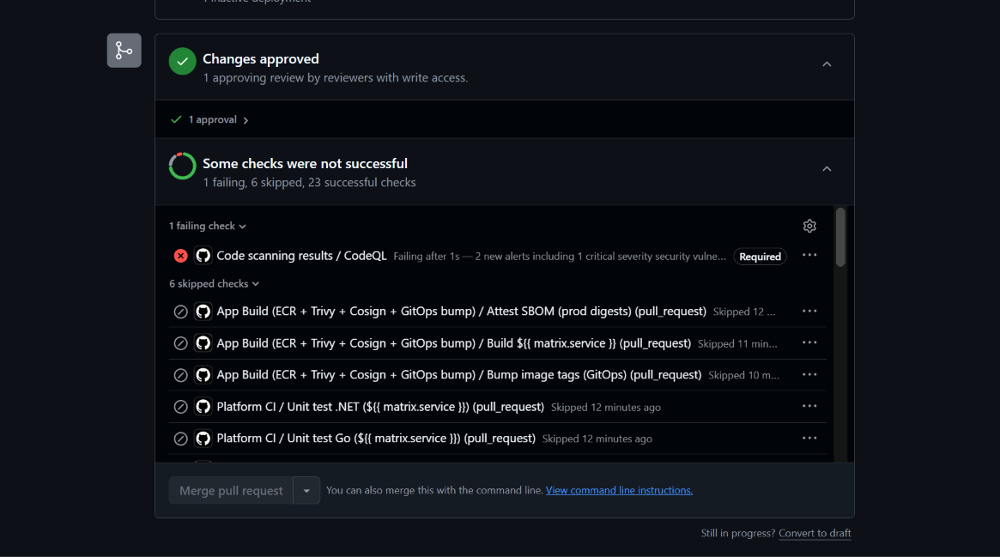

# 30 — PR cố tình đỏ: CodeQL chặn merge

**Chụp:** 27/07/2026 11:06 · PR #443 `demo/red-sast` → `develop`
**Chứng minh:** yêu cầu "mở PR với CI cố tình đỏ → phải bị chặn merge", màn thứ hai

## Trong ảnh có gì

| Trong ảnh | Ý nghĩa |
|---|---|
| `Code scanning results / CodeQL` ❌ **Failing after 1s** | Kết quả quét vượt ngưỡng |
| *"2 new alerts including 1 critical severity security vulne..."* | Đếm đúng hai lỗ đã gài |
| Nhãn **`Required`** | Đã nằm trong ruleset — thêm lúc 11:05, xem [27](27-ruleset-7-required-checks.md) |
| **Merge pull request** xám | Cửa khoá thật |
| ✅ **1 approval** · *Changes approved* | Chặn là do CI đỏ, không phải thiếu review |

Đếm thêm: *1 failing, 6 skipped, 23 successful*.

## Đây là cặp đôi của ảnh 24

Hai ảnh chứng minh hai loại cổng khác nhau, và cần cả hai mới đủ:

| | Ảnh [24](24-pr444-pinguard-do-merge-xam.md) — PR #444 | Ảnh 27 — PR #443 |
|---|---|---|
| Cổng đỏ | Pin guard | CodeQL |
| Bắt loại lỗi gì | Cấu hình pipeline sai | Lỗ hổng trong mã nguồn |
| Ai quyết định đỏ | Script trong workflow tự viết | GitHub so ngưỡng severity |
| Thời gian đỏ | 10 giây | 1 giây (đọc kết quả có sẵn) |

## Vì sao "Failing after 1s" mà không phải vài phút

Vì check này không quét gì cả. Việc quét do 8 job `SAST (codeql, ...)` làm xong từ trước,
mất vài phút. `Code scanning results / CodeQL` chỉ đọc kết quả đã có, so với ngưỡng, rồi
phán — nên nó xong trong một giây.

## Chi tiết dễ gây hiểu nhầm khi đọc bằng chứng

Trong ảnh này, `SAST (codeql)` và cả 8 job ngôn ngữ đều nằm trong nhóm **23 successful**.
Chúng xanh, và xanh là **đúng** — công cụ quét chạy trót lọt thật, không crash, không
timeout. Xanh ở đó nghĩa là "cái máy chạy ổn", không phải "code sạch".

Thứ chặn merge là `Code scanning results / CodeQL`, một check khác hẳn, do GitHub Advanced
Security sinh ra chứ không phải job nào trong workflow.

Ai chỉ nhìn lướt sẽ tưởng ruleset ghi `SAST (codeql)` mà ảnh lại hiện tên khác là mâu
thuẫn. Không mâu thuẫn — ruleset hiện có **cả hai**, và chúng gác hai thứ khác nhau. Giải
thích đầy đủ ở [26](26-add-check-codeql-vs-sast.md).

## Lịch sử: PR này từng KHÔNG chặn được

Đáng ghi lại vì nó là lý do ảnh 26 và 27 tồn tại.

| Mốc | Trạng thái | Vì sao |
|---|---|---|
| Lần push đầu | `CLEAN` — merge được | CodeQL không dựng được đường đi taint, 0 alert |
| Sau khi sửa nguồn taint | `UNSTABLE` — vẫn merge được | Có alert, `CodeQL` đỏ, **nhưng chưa có trong ruleset** |
| Sau khi thêm `CodeQL` (11:05) | `BLOCKED` — nút xám | Cổng đã có tên trong ruleset |

Chặng giữa là chặng nguy hiểm nhất, vì trang PR **có hiện màu đỏ** mà nút Merge vẫn bấm
được. Nhìn lướt thì tưởng đã chặn. GitHub coi check không có tên trong ruleset là loại "cho
biết thôi".

Ví như thấy đèn đỏ ở ngã tư nên tưởng xe phải dừng, nhưng đó là đèn của làn bên cạnh. Làn
của mình vẫn xanh, xe cứ thế đi.

Bài học: **thấy đỏ trên trang PR không có nghĩa là đã chặn.** Phải xem có nhãn `Required`
cạnh nó không. Đó cũng là lý do mọi ảnh trong bộ này đều cố lấy nhãn `Required` và nút
Merge vào cùng khung hình.
