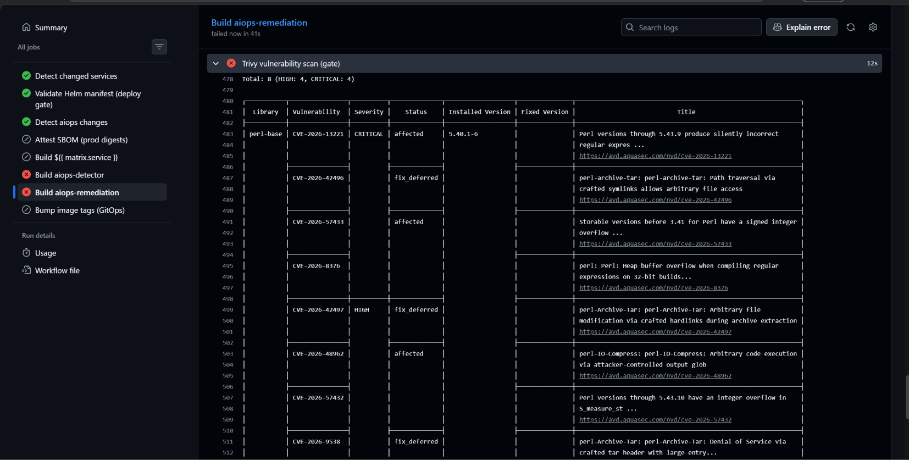

# 31 — Trivy bắt 8 CVE perl-base, build đỏ



**Chụp:** 27/07/2026 11:24 · PR #446 → job `Build aiops-remediation`, run 30236871985
**Chứng minh:** yêu cầu #2 — image CVE scan là cổng chặn, chặng 1 của chuỗi ba chặng

## Trong ảnh có gì

Bước **Trivy vulnerability scan (gate)** ❌, job *failed now in 41s*. Dòng tổng:

```
Total: 8 (HIGH: 4, CRITICAL: 4)
```

Bảng liệt kê đủ 8 CVE, tất cả thuộc `perl-base`:

| CVE | Severity | Status | Nội dung |
|---|---|---|---|
| CVE-2026-13221 | **CRITICAL** | affected | Perl ≤ 5.43.9 sinh regex sai âm thầm |
| CVE-2026-42496 | CRITICAL | fix_deferred | Archive::Tar — path traversal qua symlink |
| CVE-2026-57433 | CRITICAL | affected | Storable < 3.41 — signed integer overflow |
| CVE-2026-8376 | CRITICAL | — | Heap buffer overflow khi biên dịch regex |
| CVE-2026-42497 | HIGH | fix_deferred | Archive::Tar — sửa file tuỳ ý qua hardlink |
| CVE-2026-48962 | HIGH | affected | IO-Compress — chạy mã tuỳ ý qua output glob |
| CVE-2026-57432 | HIGH | — | Integer overflow trong `S_measure_st` |
| CVE-2026-9538 | HIGH | fix_deferred | Archive::Tar — DoS qua tar header lớn |

Cột **Fixed Version** trống ở mọi dòng.

## Vì sao con số 8 quan trọng

PR này comment-out đúng 8 dòng `perl-base` trong `.trivyignore` (37 → 29 dòng active).
Trivy báo lại **đúng 8**, không thừa không thiếu. Nghĩa là gate đỏ vì đúng thứ đã gỡ, chứ
không phải vì build hỏng hay CVE nào khác lẫn vào.

## Không bịa CVE giả, không hạ base image

Đây là điểm đáng lưu ý nhất của màn này. Tám CVE trên **vẫn nằm nguyên trong ảnh của ngày
thường**, chưa bao giờ được vá — Debian nhúng `Archive::Tar` và `Storable` thẳng vào gói
`perl-base` (`Essential=yes`) nên không bump riêng được, và cột Fixed Version trống chứng
minh điều đó.

Chúng chỉ được **khai báo bỏ qua có chủ ý** trong `.trivyignore`. Bỏ khai báo đi là chúng
hiện lại ngay.

Bằng chứng chúng vẫn ở đó từ trước, lấy từ run `30235684823` (job `89883019084`) — một build
bình thường của ngày hôm đó:

```
INFO  Some vulnerabilities have been ignored/suppressed.
      Use the "--show-suppressed" flag to display them.

Report Summary
│ ...aiops-detector (debian 13.6) │ debian │ 0 │
```

Con số **0 CVE** của ngày thường là 0 **sau khi lọc**, không phải ảnh sạch. Trivy tự nói ra
điều đó ở dòng ngay trên.

Ví như tủ thuốc ghi "0 lọ quá hạn" vì đã dán giấy che ngày hết hạn của 8 lọ, kèm ghi chú
"biết rồi, hãng chưa ra lô mới". Gỡ giấy che thì 8 lọ hiện nguyên, không ai bỏ thêm lọ nào
vào tủ cả.

## Về `.trivyignore` — che có kỷ luật, không phải che bừa

Mỗi dòng trong file đó đều kèm lý do, tên gói, và **hạn review**. Nhóm perl-base ghi
*"Review: 2026-08-20 (soi lại sid/forky đã xuống trixie chưa)"*.

Đó là khác biệt giữa `.trivyignore` và cờ `ignore-unfixed: true`. Cờ ấy tắt **mọi** CVE
chưa có bản vá trên **mọi** service, nên khi upstream phát hành bản vá thì gate im lặng thay
vì đỏ lên bắt rebuild. `app-build.yaml` cố ý không dùng nó — xem comment tại dòng 481.

Đọc tiếp: [32](32-pr446-image-scan-gate-merge-xam.md) — chặng 2 và 3 của chuỗi
