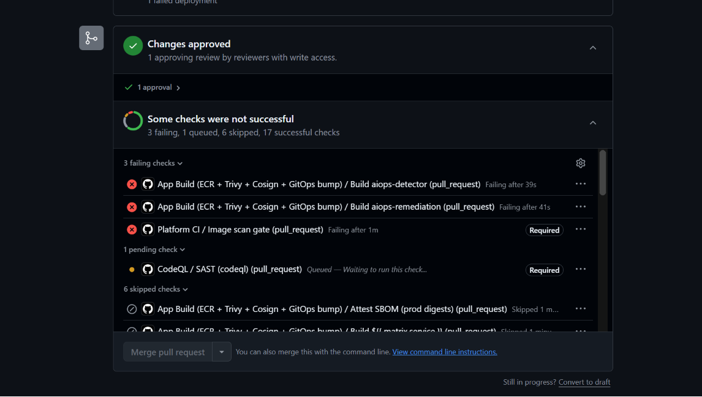

# 32 — Gate quét ảnh chặn merge, qua đường vòng ba chặng



**Chụp:** 27/07/2026 11:24 · PR #446 `demo/red-trivy` → `develop`
**Chứng minh:** yêu cầu #1 + #2 — màn thứ ba của "PR cố tình đỏ", và là màn khó nhất

## Trong ảnh có gì

| Trong ảnh | Ý nghĩa |
|---|---|
| `App Build / Build aiops-detector` ❌ *Failing after 39s* | Chặng 1 — Trivy đỏ |
| `App Build / Build aiops-remediation` ❌ *Failing after 41s* | Chặng 1 — cả hai ảnh |
| `Platform CI / Image scan gate` ❌ *Failing after 1m*, nhãn **`Required`** | Chặng 2 — gate đọc được kết quả |
| **Merge pull request** xám | Chặng 3 — ruleset khoá cửa |
| ✅ **1 approval** | Chặn là do CI, không phải thiếu review |

Đếm: *3 failing, 1 queued, 6 skipped, 17 successful*.

## Vì sao màn này khó hơn hai màn trước

Hai PR đỏ trước ([24](24-pr444-pinguard-do-merge-xam.md) Pin guard,
[30](30-pr443-codeql-required-merge-xam.md) CodeQL) chứng minh cổng chặn **trực tiếp**: gate
đỏ thì merge bị chặn, hết.

Trivy không thể chặn trực tiếp, và đây là lý do:

| Vì sao không đưa Trivy thẳng vào ruleset | Hậu quả nếu cố làm |
|---|---|
| `app-build.yaml` chạy theo matrix, mỗi service một tên job | Required check đòi tên viết cứng, thêm service mới là phải sửa ruleset |
| `app-build.yaml` có `paths:` filter | PR không chạm `src/` thì job không chạy → check treo `Expected` vĩnh viễn |

Nên Trivy chặn qua **ba chặng**:

```
Trivy thấy CVE HIGH/CRITICAL
      │ exit-code: 1
      ▼
job "Build aiops-*" đỏ                     (app-build.yaml)
      │ Image scan gate gọi GitHub API đọc kết quả run đó
      ▼
"Image scan gate" đọc thấy failure → fail=1 → exit 1   (platform-ci.yaml)
      │ gate này CÓ tên trong 7 required check
      ▼
nút Merge xám                              (ruleset 18604771)
```

Ví như bảo vệ toà nhà không tự đi kiểm từng phòng. Anh ta ngồi ở sảnh đọc bảng đèn báo
cháy. Phòng 305 cháy thì đèn 305 sáng, bảo vệ thấy đèn đỏ liền khoá cửa chính. Trivy là đầu
báo khói trong phòng, `Image scan gate` là anh bảo vệ ngoài sảnh, và chỉ anh bảo vệ mới có
quyền khoá cửa.

## Đây là lần đầu dây nối được kiểm

Trước PR này, `Image scan gate` mới chỉ gặp hai tình huống: build **xanh**, và build **không
tồn tại** (PR sửa docs). Chưa lần nào gặp cảnh build **chạy rồi fail** — tức chưa ai chứng
minh dây nối giữa đầu báo và bảng đèn có thông.

Log của gate cho thấy nó đọc đúng, không đỏ vì lý do khác:

```
app-build run: 30236871985 (status=completed)
--- job của run 30236871985 ---
success  Detect changed services
success  Detect aiops changes
failure  Build aiops-detector
failure  Build aiops-remediation
skipped  Build ${{ matrix.service }}

✅ Detect changed services: success
✅ Detect aiops changes: success
❌ Build aiops-detector: failure — Trivy thấy CVE HIGH/CRITICAL, hoặc build hỏng.
❌ Build aiops-remediation: failure — Trivy thấy CVE HIGH/CRITICAL, hoặc build hỏng.
⏭️  Build ${{ matrix.service }}: không có ảnh nào cần dựng
Cổng quét ảnh KHÔNG pass — xem run 30236871985 để biết CVE nào.
```

Ba điểm đáng chú ý trong log này:

- Gate **gọi đúng run** mà Trivy vừa fail, không phải run cũ nào khác
- Nó **phân biệt được** `skipped` với `failure`: `Build ${{ matrix.service }}` skipped vì PR
  không chạm service nào của `techx-corp-platform/src/`, và skipped được cho qua — cổng
  chặn có chọn lọc
- Hai nhánh `Detect` xanh nên gate biết chắc mình đang xét đúng thứ cần xét

## Vì sao sửa `.trivyignore` chắc chắn kích hoạt build

`app-build.yaml` liệt kê `.trivyignore` trong `paths:` ở cả hai chỗ (dòng 40 và 48). Nếu
chọn nhầm file không nằm trong danh sách đó thì `app-build` không chạy, gate rơi vào nhánh
*"không có run nào → cho qua"*, và PR sẽ **xanh** — chứng minh nhầm điều ngược lại.

Đây là chi tiết phải kiểm **trước** khi push, không phải sau.

## Chuyện xảy ra giữa chừng, ghi lại cho đủ

CI của PR này chạy **hai đợt**. Đợt đầu bị huỷ vì có người merge `develop` vào nhánh evidence
(commit `590f417`, không phải tác giả PR tạo ra) ngay sau khi PR #445 lên develop. Ảnh này
chụp đợt thứ hai.

Không ảnh hưởng kết quả — `.trivyignore` vẫn nguyên, bài kiểm vẫn đúng thứ cần kiểm. Ghi lại
vì nếu ai đối chiếu số run sẽ thấy hai run app-build trên cùng một PR.

Đọc lại chặng 1: [31](31-pr446-trivy-8-cve-perl-base.md) — bảng Trivy 8 CVE
