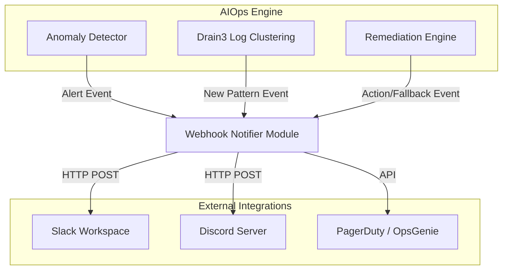

# Đặc tả Tích hợp Cảnh báo AIOps (Notification & Integration)

> **Trạng thái:** Implemented (Spec)
> **Phạm vi:** Kênh thông báo của AIOps Detector, Log Clustering (Drain3), và Remediation Engine.
> **Ngày:** 2026-07-15
> **⚠️ Cập nhật 2026-07-24:** PagerDuty/OpsGenie ở kiến trúc §2 và bảng kênh bên dưới
> là **spec ban đầu, chưa triển khai** — `alerter.py` thật chỉ hỗ trợ
> `slack | discord | stdout` (`provider` tự nhận diện từ URL webhook, kênh team đang
> dùng = Discord). Phần "Mẫu Alert" (payload Slack Block Kit / Discord embed) bên dưới
> khớp đúng code thật, không lỗi thời. (Nhân tiện khi rà lại tài liệu này cho
> MANDATE-15 — xem `05_adrs.md` ADR-015 phần "incident summary".)

## 1. Mục tiêu (Objective)

Đảm bảo mọi phát hiện dị thường (Anomaly), mẫu log mới (Log Clusters), và các hành động can thiệp tự động (Auto-remediation) từ hệ thống AIOps đều được thông báo tức thời, chính xác đến đội ngũ vận hành (Platform/SRE Team) thông qua các kênh giao tiếp chuẩn (Slack/Discord — PagerDuty/OpsGenie ở mức spec, chưa triển khai, xem cảnh báo ở đầu tài liệu).

## 2. Kiến trúc Tích hợp (Integration Architecture)

Thay vì tích hợp rải rác, các module AIOps sẽ sử dụng một lớp **Webhook Notifier** dùng chung, cấu hình qua biến môi trường (Environment Variables) hoặc Kubernetes Secrets.



## 3. Phân loại Kênh Thông báo (Channel Routing)

Để tránh tình trạng "Alert Fatigue" (chết chìm trong cảnh báo), thông báo được chia làm 2 cấp độ/kênh:

### 3.1 Kênh CRITICAL (`#aiops-alerts-critical`)
- **Mục đích:** Các sự cố ảnh hưởng trực tiếp đến người dùng, làm giảm SLO, hoặc cần con người can thiệp khẩn cấp.
- **Sự kiện kích hoạt:**
  - Vỡ SLO Latency (p95 > 1s kéo dài).
  - Error Budget cạn kiệt (< 0).
  - Auto-remediation thất bại dẫn đến MỞ cầu dao (Circuit Breaker OPEN).
  - Tỷ lệ HTTP 5xx hoặc gRPC Error vượt ngưỡng 5%.
- **Hành động đính kèm:** Ping `@here` hoặc kích hoạt cuộc gọi PagerDuty.

### 3.2 Kênh INFO & AUDIT (`#aiops-alerts-info`)
- **Mục đích:** Nhật ký vận hành tự động, thông tin tham khảo, không cần phản ứng ngay.
- **Sự kiện kích hoạt:**
  - Drain3 phát hiện một Log Template hoàn toàn mới.
  - Remediation Engine chạy thành công (đã Restart Pod và Verify xanh).
  - Remediation Engine chạy ở chế độ Dry-run (đề xuất kịch bản, chưa thực thi).
- **Hành động đính kèm:** Chỉ gửi tin nhắn im lặng (Silent notification).

## 4. Định dạng Payload (Alert Format)

Payload gửi qua Webhook (Slack/Discord) cần chứa đủ thông tin để Kỹ sư On-call có thể bấm vào là thấy ngay vấn đề (Click-to-investigate).

### Mẫu Alert từ Anomaly Detector (Slack Block Kit JSON)

```json
{
  "blocks": [
    {
      "type": "header",
      "text": {
        "type": "plain_text",
        "text": "🚨 [CRITICAL] Storefront Latency Spike Detected"
      }
    },
    {
      "type": "section",
      "fields": [
        {
          "type": "mrkdwn",
          "text": "*Metric:* `http_request_duration_seconds` (p95)"
        },
        {
          "type": "mrkdwn",
          "text": "*Giá trị đo:* 1.25s (Ngưỡng: >1s)"
        },
        {
          "type": "mrkdwn",
          "text": "*Phương pháp:* EWMA (3σ deviation)"
        },
        {
          "type": "mrkdwn",
          "text": "*Trạng thái Remediation:* Đang chạy Dry-run"
        }
      ]
    },
    {
      "type": "actions",
      "elements": [
        {
          "type": "button",
          "text": {
            "type": "plain_text",
            "text": "📊 Xem trên Grafana"
          },
          "url": "http://grafana.internal/d/storefront/latency"
        },
        {
          "type": "button",
          "text": {
            "type": "plain_text",
            "text": "🕵️ Trace trên Jaeger"
          },
          "url": "http://jaeger.internal/search?service=frontend"
        }
      ]
    }
  ]
}
```

### Mẫu Alert từ Anomaly Detector (Discord Embed JSON — 17/07)

`alerter.py` gửi Discord qua `POST` với 1 `embed` (không phải Block Kit, Discord
webhook không hỗ trợ Block Kit) — màu theo severity (`SEVERITY_COLOR`), field tách
riêng cho service/giá trị đo/phương pháp phát hiện (metric) hoặc số log khớp + log mẫu
(log rule). Không có nút bấm / gợi ý remediation (detector chỉ phát hiện + cảnh báo,
xem MANDATE-07):

```json
{
  "embeds": [
    {
      "title": "🔴 [CRITICAL] genai-assistant-failure",
      "description": "GenAI assistant lỗi — product-reviews không sinh được tóm tắt/trả lời (đã rơi vào fallback)",
      "color": 15548997,
      "timestamp": "2026-07-17T09:05:30+07:00",
      "footer": { "text": "AIOps Detector · dedup=genai-assistant-failure · cooldown 600s" },
      "fields": [
        { "name": "🔢 Số log khớp / Cửa sổ", "value": "22 / 5m", "inline": true },
        { "name": "📝 Bằng chứng (log mẫu)", "value": "```AI_SUMMARY_FALLBACK stage=bedrock reason=Exception```", "inline": false }
      ]
    }
  ]
}
```

## 5. Yêu cầu Cấu hình (Dành cho CDO)

Để kích hoạt tính năng Integration này, CDO cần cung cấp các Secret sau vào không gian mạng (namespace) của hệ thống AIOps:

1. `AIOPS_SLACK_WEBHOOK_CRITICAL`: URL Webhook của kênh báo động khẩn.
2. `AIOPS_SLACK_WEBHOOK_INFO`: URL Webhook của kênh nhật ký.
3. `GRAFANA_BASE_URL`: Base URL trỏ tới Grafana để tự động render link (vd: `https://grafana.techx-corp.internal`).
4. `JAEGER_BASE_URL`: Base URL trỏ tới Jaeger UI.

*(Hệ thống thiết kế theo nguyên lý Tắt/Mở mềm: Nếu không có các biến môi trường Webhook trên, AIOps Notifier sẽ tự động fallback sang việc chỉ in log ra `stdout` mà không gây lỗi crash service).*
