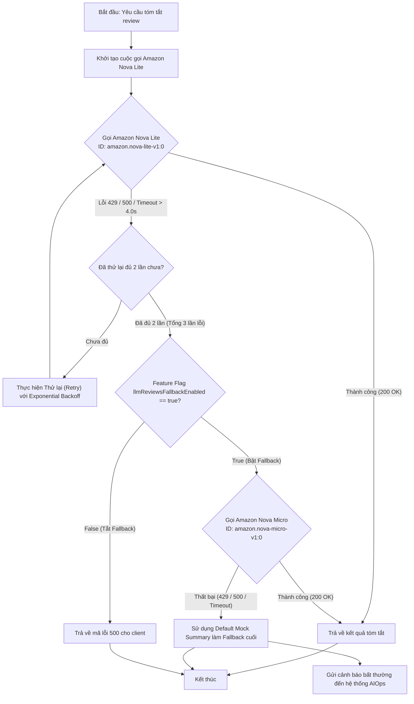
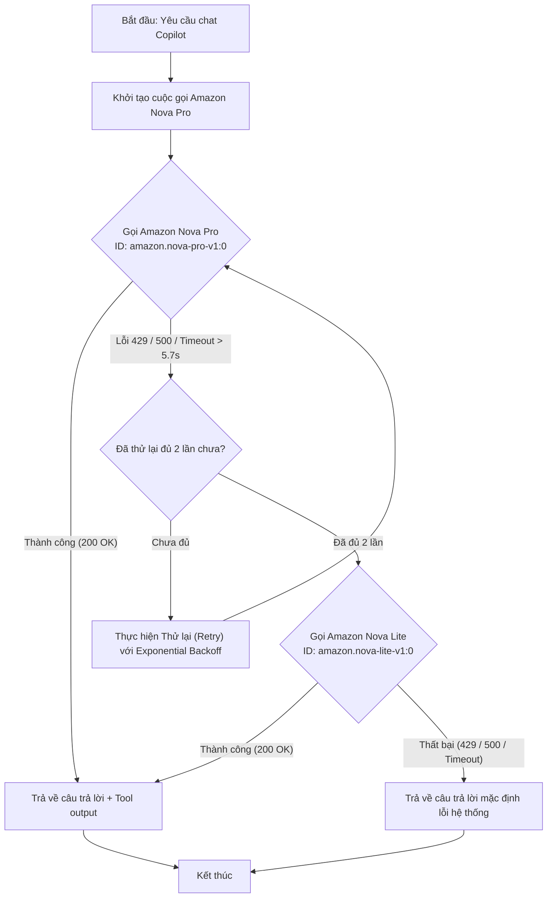

# Đặc tả thiết kế Fallback & Retry cho cuộc gọi LLM (Mô hình Định tuyến Lai - Hybrid Routing)

> **Vùng triển khai:** Đơn vùng `us-east-1` | **Ngân sách:** < $300/tuần | **SLO:** p95 < 1.0s
>
> **Nguồn dữ liệu:**
> - Chi phí model: [AWS Bedrock Pricing](https://aws.amazon.com/bedrock/pricing/)
> - Benchmark TTFT & throughput: [Artificial Analysis](https://artificialanalysis.ai/leaderboards/models)
> - Retry config: [AWS SDK Retry Behavior](https://docs.aws.amazon.com/sdkref/latest/guide/feature-retry-behavior.html)
> - Backoff & Jitter: [AWS Architecture Blog](https://aws.amazon.com/blogs/architecture/exponential-backoff-and-jitter/)
>
> **Quyết định liên quan:** [ADR-004](../05_adrs.md#adr-004---định-tuyến-model-llm-lai-theo-tác-vụ-hybrid-task-specific-routing-cho-đơn-vùng-single-region)

## 1. Flowchart Cơ chế Dự phòng (Fallback & Retry Flowchart)

Sơ đồ dưới đây thể hiện quy trình xử lý lỗi khi các dịch vụ thực hiện cuộc gọi API đến AWS Bedrock (`us-east-1`):

### A. Luồng Tóm tắt Review (Product Reviews Summary) - Tải cao, Độ phức tạp thấp:

### B. Luồng Trợ lý Chatbot (Shopping Copilot Agent) - Tải thấp, Độ phức tạp cao:

---

## 2. Thông số Cấu hình Hệ thống (Configuration Parameters)

Dưới đây là các thông số chi tiết cấu hình cho cơ chế định tuyến và fallback trong Đơn Vùng (`us-east-1`). Giá trị timeout và backoff dựa trên [AWS Architecture Blog — Backoff & Jitter](https://aws.amazon.com/blogs/architecture/exponential-backoff-and-jitter/) và benchmark từ [Artificial Analysis](https://artificialanalysis.ai/leaderboards/models):

### A. Luồng Tóm tắt Review (Product Reviews)
| Tham số | Model chính (Primary Model) | Model dự phòng (Fallback Model) |
|---|---|---|
| **Tên Model** | Amazon Nova Lite | Amazon Nova Micro |
| **Model ID AWS Bedrock** | `amazon.nova-lite-v1:0` | `amazon.nova-micro-v1:0` |
| **Timeout tối đa** | **4.0 giây (4000ms)** | **2.0 giây (2000ms)** |
| **Số lần tự động thử lại** | **Tối đa 2 lần** (Tổng cộng tối đa 3 cuộc gọi) | **Tối đa 1 lần** (Tổng cộng tối đa 2 cuộc gọi) |
| **Cơ chế Retry Backoff** | Exponential backoff (Base: 100ms, Factor: 1.5, Jitter: True) | Exponential backoff (Base: 50ms, Factor: 1.5, Jitter: True) |
| **Lỗi kích hoạt** | HTTP 429, HTTP 500/503, ClientTimeout (> 4.0s) | HTTP 429, HTTP 500/503, ClientTimeout (> 2.0s) |

> **Vì sao chốt 4.0s/2.0s theo số đo thật:**
>
> 1. **Timeout ngắn hơn P95 đầu-cuối thì retry là vô ích.** Đo thật ngày 15/07/2026 bằng `evals/measure_bedrock_latency.py` (`n=10`, 2 vòng Converse) cho Nova Lite: flow P50 **1.571s**, P95 **3.969s** → chốt `LLM_REVIEWS_TIMEOUT=4.0`. Nova Micro fallback: P95 **1.938s** → chốt `LLM_REVIEWS_FALLBACK_TIMEOUT=2.0`. Đây thay cho ước lượng TTFT cũ.
> 2. **Không đánh đổi gì để lấy 2.0s.** Tóm tắt AI là **best-effort, không SLA cứng** (`SLO.md`), và chỉ chạy khi khách **bấm nút** — nó không nằm trên đường render trang, nên không tính vào SLO p95 < 1s của storefront. Rút timeout xuống 2.0s không cứu được SLO nào cả, chỉ tạo thêm retry storm.
> 3. **Trần 5.7s** cho Copilot: theo P95 tool loop đo được trên Nova Pro; vẫn nằm dưới Envoy route timeout 30s cho tối đa 5 tool loop.

### B. Luồng Trợ lý Chatbot (Shopping Copilot)
| Tham số | Model chính (Primary Model) | Model dự phòng (Fallback Model) |
|---|---|---|
| **Tên Model** | Amazon Nova Pro | Amazon Nova Lite |
| **Model ID AWS Bedrock** | `amazon.nova-pro-v1:0` | `amazon.nova-lite-v1:0` |
| **Timeout tối đa** | **5.7 giây (5700ms)** | **2.5 giây (2500ms)** |
| **Số lần tự động thử lại** | **Tối đa 2 lần** (Tổng cộng tối đa 3 cuộc gọi) | **Tối đa 1 lần** (Tổng cộng tối đa 2 cuộc gọi) |
| **Cơ chế Retry Backoff** | Exponential backoff (Base: 200ms, Factor: 1.5, Jitter: True) | Exponential backoff (Base: 100ms, Factor: 1.5, Jitter: True) |
| **Lỗi kích hoạt** | HTTP 429, HTTP 500/503, ClientTimeout (> 5.7s) | HTTP 429, HTTP 500/503, ClientTimeout (> 2.5s) |

### C. Bảng đo P50/P95 Bedrock thật (15/07/2026)

Nguồn: `docs/ai/evals/bedrock_latency_results_2026-07-15.md`. Role SSO hiện tại bị `OperationNotAllowed` khi invoke runtime ở `us-east-1`; số dưới đây đo bằng cùng model/inference profile tại `us-east-2` để có latency thật thay vì tiếp tục dùng benchmark ước lượng.

| Flow | Role | Model | Runtime profile | n | Flow P50 | Flow P95 | Timeout chốt |
|---|---|---|---|---:|---:|---:|---:|
| Reviews | Primary | `amazon.nova-lite-v1:0` | `us.amazon.nova-lite-v1:0` | 10 | 1.571s | 3.969s | **4.0s** |
| Reviews | Fallback | `amazon.nova-micro-v1:0` | `us.amazon.nova-micro-v1:0` | 10 | 1.578s | 1.938s | **2.0s** |
| Copilot | Primary | `amazon.nova-pro-v1:0` | `us.amazon.nova-pro-v1:0` | 10 | 4.086s | 5.688s | **5.7s** |
| Copilot | Fallback | `amazon.nova-lite-v1:0` | `us.amazon.nova-lite-v1:0` | 10 | 1.907s | 2.468s | **2.5s** |

---

## 3. Cấu hình biến môi trường (Environment Variables)

Các biến môi trường được cấu hình linh động cho Pod `product-reviews` trong cụm K8s.

### 3.1 Biến BẮT BUỘC giữ lại (code hiện tại phụ thuộc)

> ⚠️ `src/product-reviews/product_reviews_server.py` gọi `must_map_env()` cho các biến dưới đây — **thiếu bất kỳ biến nào là pod raise exception ngay lúc boot** (`CrashLoopBackOff`). Việc thêm biến mới ở §3.2 **không được phép xoá** nhóm này.

| Biến | Dùng ở đâu | Ghi chú |
|---|---|---|
| `LLM_MODEL` | `must_map_env('LLM_MODEL')` | Model mặc định. Giữ làm **alias** trỏ tới `LLM_REVIEWS_MAIN_MODEL`. |
| `LLM_BASE_URL` | `must_map_env('LLM_BASE_URL')` | Endpoint Bedrock-compatible. Giữ model-agnostic: đổi endpoint/model không cần sửa code. |
| `OPENAI_API_KEY` | `must_map_env('OPENAI_API_KEY')` | Lấy từ secret `llm-api-key`. |
| `LLM_HOST` / `LLM_PORT` | `must_map_env(...)` | Dựng `llm_mock_url` cho luồng mock/rate-limit. |

### 3.2 Biến mới bổ sung cho Hybrid Routing

*   **Cho Reviews Summary:**
    *   `LLM_REVIEWS_MAIN_MODEL`: ID model tóm tắt chính (Mặc định: `amazon.nova-lite-v1:0`).
    *   `LLM_REVIEWS_FALLBACK_MODEL`: ID model tóm tắt dự phòng (Mặc định: `amazon.nova-micro-v1:0`).
    *   `LLM_REVIEWS_TIMEOUT`: Timeout cho Nova Lite (Mặc định: `4.0`).
    *   `LLM_REVIEWS_FALLBACK_TIMEOUT`: Timeout cho Nova Micro (Mặc định: `2.0`).
    *   `LLM_REVIEWS_MAX_RETRIES`: Số lần thử lại tối đa (Mặc định: `2`).
*   **Cho Shopping Copilot:**
    *   `LLM_COPILOT_MAIN_MODEL`: ID model chatbot chính (Mặc định: `amazon.nova-pro-v1:0`).
    *   `LLM_COPILOT_FALLBACK_MODEL`: ID model chatbot dự phòng (Mặc định: `amazon.nova-lite-v1:0`).
    *   `LLM_COPILOT_TIMEOUT`: Timeout cho Nova Pro (Mặc định: `5.7`).
    *   `LLM_COPILOT_FALLBACK_TIMEOUT`: Timeout cho Nova Lite (Mặc định: `2.5`).
    *   `LLM_COPILOT_MAX_RETRIES`: Số lần thử lại tối đa (Mặc định: `2`).

**Quy tắc di trú:** khi đọc model, code resolve theo thứ tự `LLM_REVIEWS_MAIN_MODEL` → fallback về `LLM_MODEL`. Nhờ vậy `platform/gitops/environments/sandbox/values-aio-llm.yaml` hiện có (chỉ set `LLM_MODEL`, `LLM_BASE_URL`, `OPENAI_API_KEY`) vẫn boot được mà không cần sửa cùng lúc với code.

---

## 4. Rollback & Feature Flags

*   **Flagd Key:** `llmReviewsFallbackEnabled` (Boolean - Mặc định: `true`)
    *   *True:* Tự động kích hoạt chuyển đổi sang model dự phòng (Nova Micro) và Mock Summary khi Nova Lite bị lỗi hàng loạt. Đảm bảo SLO Availability > 99.9%.
    *   *False:* Tắt cơ chế dự phòng. Khi Nova Lite gặp lỗi sau số lần retry, ứng dụng trả thẳng lỗi 500 về storefront để bảo đảm tính nhất quán chất lượng bản dịch.

---

## 5. Kiến trúc Tự phục hồi 5 lớp (5-Layer Resilience Stack)

Đáp ứng yêu cầu vận hành bền bỉ trước sự cố mạng hoặc lỗi rate limit do BTC giả lập (như cờ `llmRateLimitError`), Reviews Service triển khai ngăn xếp tự phục hồi 5 lớp sau:

1. **Lớp 1: Adaptive Client Retry (AWS SDK):** Cấu hình client sử dụng chế độ adaptive retry tự động đo lường và xếp hàng cuộc gọi khi AWS Bedrock API trả về lỗi nghẽn.
2. **Lớp 2: Exponential Backoff & Jitter:** 
   - Thử lại tối đa 2 lần với thời gian chờ trễ: $t = \text{Base} \times 1.5^{\text{attempt}} \pm \text{random\_jitter}$.
   - Chỉ kích hoạt retry cho nhóm lỗi: HTTP 429, 500, 503, và Connection Timeout.
3. **Lớp 3: Bulkhead Isolation (Asyncio Semaphore):**
   - Giới hạn tối đa **10 luồng gọi Bedrock đồng thời** bằng `asyncio.Semaphore(10)`.
   - Nếu luồng xử lý bị nghẽn (Bedrock phản hồi chậm), các request sau sẽ xếp hàng chờ thay vì spam API hoặc làm cạn kiệt CPU/RAM của container.
4. **Lớp 4: Context-Aware Dynamic Deadlines (fail-fast, không co timeout):**
   - Đọc thời gian xử lý còn lại của request (trace context) và so với deadline của caller.
   - **Sàn timeout đo thật:** không co timeout Bedrock xuống dưới timeout đã chốt theo P95 (`4.0s` primary, `2.0s` fallback) — timeout ngắn hơn latency thực tế chỉ sinh ra retry storm và đốt token, không cứu được request nào (xem §2.A/C).
   - Thay vì co timeout, hệ thống **fail-fast**: nếu thời gian còn lại của request **< 2.0s**, bỏ qua Bedrock hoàn toàn và trả **Mock Summary ngay lập tức**. Vừa giữ được sàn timeout, vừa tránh cascading timeout cho storefront.
5. **Lớp 5: Flag-Aware Circuit Breaker:**
   - Tự động chuyển Circuit Breaker sang trạng thái **OPEN** ngay khi phát hiện flag `llmRateLimitError` từ flagd ở trạng thái ON. Chuyển thẳng request sang Mock Summary hoặc model dự phòng mà không cần thực hiện cuộc gọi thật tới Bedrock, bảo vệ trần chi phí và tránh nghẽn luồng.

---

## Phụ lục kiểm chứng & đồng bộ code 12/07/2026

Spec trên có các điểm lệch với code đã merge (PR#26) và với số đo thật — bảng dưới là nguồn sự thật hiện hành:

| Mục trong spec | Thực tế (đã kiểm chứng) |
|---|---|
| Lớp 1 "SDK adaptive retry" | Code **tắt** SDK retry (`retries={'max_attempts': 0}`) — đúng, để tránh retry kép; spec cần sửa mô tả |
| Lớp 3 "asyncio.Semaphore(10)" | Code sync gRPC dùng `threading.Semaphore`, và blocking-wait là **no-op đã chứng minh** (waiter giữ thread pool; thí nghiệm: 1909ms vs 10ms) → hiện là **non-blocking, size 6** (`LLM_BULKHEAD_SIZE`), bão hoà → mock ngay |
| Lớp 5 "Circuit breaker theo flag `llmRateLimitError`" | **Đã bỏ** (vùng xám luật AI_FEATURE §3) → breaker theo lỗi quan sát được: 3 lỗi primary liên tiếp → open 30s (`LLM_CB_THRESHOLD`/`LLM_CB_COOLDOWN`). Proof runtime: "Circuit Breaker OPENED for 30.0s after 3 consecutive primary failures" |
| §2 "TTFT Nova Lite ~0.4s" | Đã thay bằng đo Bedrock thật 15/07/2026: Reviews Lite flow P50/P95 **1.571s/3.969s**, Micro **1.578s/1.938s**; Copilot Pro **4.086s/5.688s**, Lite **1.907s/2.468s**. Timeout chốt: **4.0/2.0/5.7/2.5s** |
| Flowchart "fallback off → trả 500" | Code trả **mock summary message**, không 500 |
| §3.1 "bắt buộc giữ LLM_BASE_URL/OPENAI_API_KEY/LLM_MODEL" | Stale — `must_map_env` hiện chỉ đòi `LLM_HOST/PORT`, `PRODUCT_CATALOG_ADDR`, `PRODUCT_REVIEWS_PORT`, `OTEL_SERVICE_NAME` |
| §3.2 thiếu biến | Bổ sung: `LLM_REVIEWS_FALLBACK_TIMEOUT` (2.0), `LLM_COPILOT_FALLBACK_TIMEOUT` (2.5), `LLM_REVIEWS_FALLBACK_RETRIES` (1), `LLM_MOCK_ENABLED` (true), `LLM_BULKHEAD_SIZE` (6), `LLM_CB_THRESHOLD` (3), `LLM_CB_COOLDOWN` (30) |
| §4 flag mặc định true | Trước 12/07 flag **không tồn tại trong flagd** + default code False → fallback chết trong cluster (runtime xác nhận 0 lần trigger). Đã thêm vào cả 2 `demo.flagd.json`, defaultVariant `on` — proof sau fix: trigger ×5 |
| Lỗi ngoài dự kiến | `BotoCoreError` (NoCredentials/endpoint) từng thoát ladder → đã vào except tuple, mọi lớp lỗi đi qua fallback/CB |
