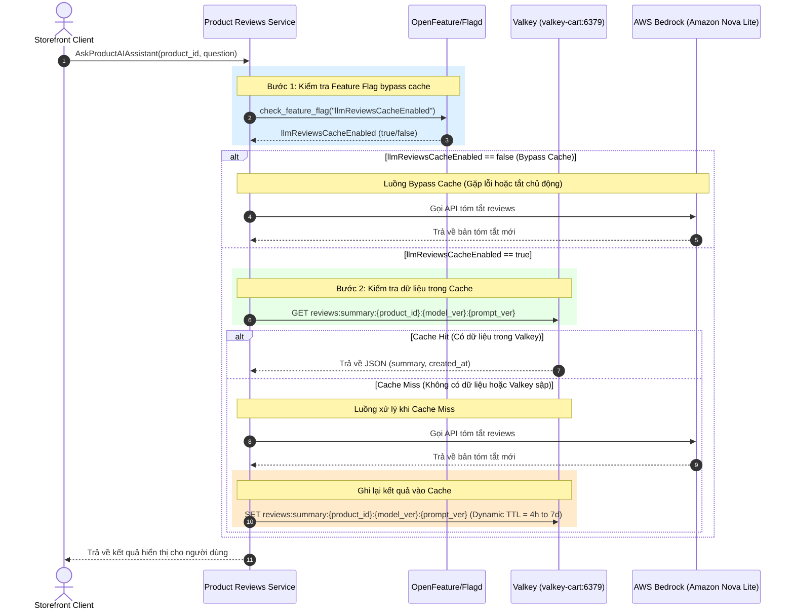

# Đặc tả thiết kế Valkey Caching - Review Summary

## 1. High-Level Architecture (Kiến trúc tổng quan)



## 2. Phân rã thành phần hệ thống (Component Breakdown)

| Thành phần | Vai trò & Trách nhiệm | Lựa chọn Công nghệ | Lý do lựa chọn & Tối ưu hóa |
|---|---|---|---|
| **Caching Store** | Lưu trữ tạm thời các bản tóm tắt review dưới định dạng JSON để tránh gọi LLM nhiều lần | **Valkey (Redis-compatible)** | - Tương thích giao thức Redis, tốc độ đọc/ghi in-memory cực nhanh (< 2ms).<br>- **Tối ưu hóa chi phí:** Dùng chung backend cache với cart của CDO, không duy trì cụm cache độc lập. **[CẬP NHẬT 14/07]** backend đã là **ElastiCache Valkey managed** (CDO migrate, `terraform/modules/elasticache/`) thay cho pod `valkey-cart` in-cluster — xem mục 3.2 Trạng thái 14/07. *(Lưu ý lịch sử: con số "~$30/tuần" trước đây áp cho phương án ElastiCache managed — xem ADR-001 Option A — nay chính là phương án đang chạy, chi phí do CDO quản trong trần budget.)* |
| **Reviews Service** | Tiếp nhận yêu cầu, kiểm tra feature flag, thực hiện kiểm tra cache, gọi LLM khi cache miss và cập nhật cache | **Python (gRPC Service)** | Service `product-reviews` hiện tại viết bằng Python, dễ dàng tích hợp thư viện `redis-py` hoặc `valkey` client. |
| **Feature Flag Server** | Cung cấp cờ tắt/bật bypass cache động thời gian thực | **OpenFeature / Flagd** | Có sẵn trong kiến trúc hạ tầng, cho phép tắt cache ngay lập tức khi phát hiện lỗi dữ liệu mà không cần restart/redeploy service. |

## 3. Chính sách & Cấu trúc Cache (Cache Policy & Schema)

### 3.1 Cấu trúc Cache Key & Value
- **Cache Key Format:** `reviews:summary:{product_id}:{model_ver}:{prompt_ver}`
  - *Ví dụ:* `reviews:summary:L9ECAV7KIM:nova-lite-v1:p3`
  - `model_ver` — định danh model đang phục vụ (ví dụ `nova-lite-v1`, `nova-pro-v1`).
  - `prompt_ver` — phiên bản system prompt, tăng thủ công mỗi lần sửa prompt.
  - **Vì sao nhúng version vào key:** đổi model hoặc đổi prompt làm bản tóm tắt cũ trở nên lỗi thời. Nhúng vào key thì lần đọc tiếp theo **miss tự nhiên**, không cần lệnh `DEL` nào. Nếu chỉ dùng `reviews:summary:{product_id}`, việc đổi Nova Lite ↔ Nova Pro vẫn trả về bản tóm tắt sinh bởi model cũ.
- **Cache Value Format (JSON):**
  Dữ liệu được serialize dưới dạng chuỗi JSON để đảm bảo khả năng mở rộng thông tin sau này.
  ```json
  {
    "summary": "Bản tóm tắt review sản phẩm bằng tiếng Việt được tạo bởi AI...",
    "created_at": "2026-07-08T12:00:00Z",
    "model_ver": "nova-lite-v1",
    "prompt_ver": "p3"
  }
  ```
  *(`model_ver`/`prompt_ver` lặp lại trong value để phục vụ audit và debug; key mới là thứ quyết định hit/miss.)*

### 3.2 Cấu hình vòng đời và bộ nhớ (TTL & Eviction)
- **TTL (Time To Live):** ~~Động (Dynamic TTL) 4 giờ đến 7 ngày~~ → **[SỬA 12/07] TTL phẳng 7 ngày.** Dynamic TTL bị gỡ khỏi code sau kiểm chứng: review data là tĩnh (không rpc ghi, seed cố định) nên $N$ và $\sigma^2$ không bao giờ đổi — công thức không có gì để phản ứng, chỉ đốt lại token cho output giống hệt. Xem Mục 5 (giữ làm tư liệu) + Phụ lục.
- **Eviction Policy (Chính sách giải phóng bộ nhớ) & Giải pháp Bảo vệ Giỏ hàng (Option 1):**
  - Cấu hình eviction policy của cụm Valkey là `volatile-lru`.
  - Để tránh việc giỏ hàng (khi đó còn TTL mặc định 60m trong code) bị xóa nhầm khi RAM đầy, nhóm đã **loại bỏ hoàn toàn TTL của giỏ hàng trong code C# (`ValkeyCartStore.cs`)**. Khi không có TTL, key giỏ hàng trở thành key vĩnh viễn (non-volatile) và được Valkey bảo vệ an toàn 100% khỏi cơ chế tự động eviction.
  - **Trạng thái 13/07:** ⏪ **TTL cart KHÔI PHỤC 60m (baseline)** — ADR-003 chưa chốt, review J1 chỉ ra gỡ TTL + volatile-lru-không-maxmemory = nguy cơ OOMKill mất giỏ (checkout SLO). Giữ TTL an toàn cho tới khi CDO chốt hướng (maxmemory + tách instance). `ValkeyCartStore.cs:188,216` đã bật lại `KeyExpireAsync(60m)`.
  - **Trạng thái 14/07:** ✅ **J1 đóng — backend cache chuyển sang ElastiCache Valkey managed** (CDO migrate: `terraform/modules/elasticache/`, TLS + auth token, failover; pod `valkey-cart` in-cluster đã `enabled: false`). Kịch bản OOMKill theo cgroup 20Mi không còn; `maxmemory-policy` theo parameter group mặc định của ElastiCache (`volatile-lru`, chờ CDO xác nhận khi co-sign). TTL cart 60m giữ nguyên. Chi tiết: ADR-003 addendum 14/07 trong `05_adrs.md`; tracked TF1-68.
  - Thiết lập một **background CronJob** chạy lúc 2h sáng hàng ngày để chủ động quét dọn (`SCAN`) các giỏ hàng rác đã quá 30 ngày không có hoạt động, tránh làm rò rỉ và nghẽn bộ nhớ.


### 3.3 Cấu hình biến môi trường (Environment Variables)
Để đồng bộ hoàn toàn với **Hợp đồng tích hợp dịch vụ Product Reviews** với CDO, việc kết nối được cấu hình qua các biến môi trường sau:
- `VALKEY_HOST`: Tên Host/Service K8s của Valkey (Mặc định: `valkey-cart` nhằm tận dụng hạ tầng sẵn có).
- `VALKEY_PORT`: Cổng kết nối của Valkey (Mặc định: `6379`).


## 4. Kịch bản Xử lý Lỗi & Kế hoạch Dự phòng (Resilience & Rollback)

### 4.1 Cơ chế Tắt Cache Nhanh (Bypass Cache via Feature Flag)
- **Tên Flag OpenFeature:** `llmReviewsCacheEnabled`
- **Kiểu dữ liệu:** `Boolean` (Mặc định: `true`)
- **Cách thức hoạt động:**
  - Khi `llmReviewsCacheEnabled` là `true`: Luồng caching hoạt động bình thường.
  - Khi `llmReviewsCacheEnabled` là `false`: Luồng service bypass hoàn toàn Valkey, thực hiện truy vấn trực tiếp AWS Bedrock cho mọi request. Được sử dụng khi muốn kiểm thử trực tiếp model AI hoặc khi phát hiện lỗi định dạng dữ liệu trong cache.

### 4.2 Xử lý khi Valkey sập (Connection/Socket Timeout Resilience)
Để đảm bảo tính liên tục của tính năng reviews đối với khách hàng (SLO Error Rate < 0.5%), Reviews service không được phép lỗi (trả về 500) khi Valkey gặp sự cố.
- **Cơ chế Fallback khi Valkey sập:**
  - Thiết lập kết nối Valkey với `socket_timeout = 0.5s` và `socket_connect_timeout = 0.5s` để tránh nghẽn luồng (blocking).
  - Bọc tất cả các thao tác đọc (`GET`) và ghi (`SET`/`EXPIRE`) trong khối lệnh `try-except`.
  - Nếu bắt được bất kỳ lỗi kết nối nào từ phía Valkey (như `ConnectionError`, `TimeoutError`):
    1. Ghi nhận log lỗi mức độ `ERROR` kèm chi tiết trace context sang Collector/Jaeger.
    2. Tự động chuyển trạng thái xử lý sang **Cache Miss**, thực hiện gọi trực tiếp AWS Bedrock API để lấy summary.
    3. Không cố gắng thực hiện lệnh ghi (`SET`) vào Valkey ở bước sau để tránh lặp lại lỗi timeout.

---

## 5. ~~Cơ chế Đặt TTL Động (Score-Based Dynamic TTL)~~ [ĐÃ GỠ 12/07 — giữ làm tư liệu thiết kế]

> **Lý do gỡ (kiểm chứng được):** premise dữ liệu review thay đổi là sai — data tĩnh 100% (đã verify proto + DB). Công thức dưới đây chỉ kích hoạt lại nếu hệ có đường ghi review thật (trigger nâng cấp).

Thiết kế gốc: tối ưu hóa chi phí token và tính cập nhật bằng TTL động theo thông số review:

$$\text{TTL}_{\text{seconds}} = \max\left(14400, \frac{604800}{1 + 0.05 \cdot N + 0.5 \cdot \sigma^2}\right)$$

*   **Ý nghĩa các tham số:**
    *   $N$: Tổng số lượng reviews của sản phẩm.
    *   $\sigma^2$: Phương sai điểm số (Score Variance) của các reviews gần nhất.
    *   Giới hạn dưới: **4 giờ** (14,400 giây) để tránh việc gọi Bedrock quá liên tục đối với các sản phẩm cực kỳ hot.
    *   Giới hạn trên: **7 ngày** (604,800 giây) đối với sản phẩm ít reviews và điểm số ổn định, giúp giảm thiểu tối đa chi phí token trùng lặp.

---

## 6. Chiến Lược Làm Mới Cache — Content-Addressed Invalidation [chốt 13/07]

> **Cơ chế chuẩn thế giới** (Rails `cache_key` với content digest / HTTP ETag): *"key là hàm của STATE object; không bao giờ invalidate thủ công — key cũ (giờ sai) tự hết hạn"* ([Rails caching guide](https://github.com/rails/rails/blob/main/guides/source/caching_with_rails.md), [cache invalidation strategies](https://oneuptime.com/blog/post/2026-01-30-cache-invalidation-strategies/view)). Đây là giải pháp thay cho cả TTL-tĩnh (có staleness window) lẫn dynamic-TTL (đoán, không self-heal).

Cache key nhúng **fingerprint nội dung review**:
```
reviews:summary:{product_id}:{model_ver}:{prompt_ver}:{content_fp}
```
- `content_fp` = `md5(COUNT || MAX(id) || md5(content))[:12]` — 1 aggregate query (`fetch_reviews_fingerprint`, index sẵn trên `product_id`, ~5 dòng → rẻ hơn LLM call ~1000×).
- Review **thêm/xoá** → COUNT+MAX(id) đổi; review **sửa** → md5(content) đổi → **fingerprint đổi → cache key đổi → MISS tự nhiên → sinh lại bằng nội dung mới.**
- **Zero staleness window**: khách không bao giờ nhận summary cũ dù review vừa đổi 1 giây trước (khác TTL-tĩnh có thể cũ tới 7 ngày).
- **Self-healing**: không có code invalidate riêng để "quên gọi" (khác write-invalidation thủ công). Không đoán TTL (khác dynamic-TTL đã gỡ).

### 6.1 TTL 7d = GC backstop thuần
`ttl = 604800`. Khi fingerprint đổi, key cũ trở thành rác (không ai đọc) → TTL 7d dọn nó. TTL **không còn vai trò chống outdate** — đó là việc của fingerprint. Đây đúng tinh thần "để key cũ tự hết hạn".

### 6.2 Versioned key theo model/prompt (giữ nguyên)
`{model_ver}:{prompt_ver}` (derive từ env model thật + hash system prompt). Đổi model hoặc prompt → key mới → miss tự nhiên; kết hợp với `content_fp` thành khoá đầy đủ theo mọi chiều state.

### 6.3 Fail-open
Lỗi query fingerprint → skip cache call đó (gọi thẳng Bedrock), không serve từ key có thể sai. An toàn hơn fail-closed.

### 6.4 Đánh đổi & tối ưu tương lai
- Chi phí thêm: +1 aggregate query/Ask-AI (kể cả cache hit). Ở 10 sản phẩm / ~0.1 qps: <1ms, không đáng kể.
- Nếu sau này DB-load thành vấn đề (traffic cao): thay query bằng **version-counter trong Valkey** bump bởi `AddReview` (khi rpc ghi có mặt — TF1-55/56). Đánh đổi: nhanh hơn nhưng phụ thuộc write-path nhớ bump (kém self-heal hơn). Content-fingerprint là mặc định vì robust hơn.

Self-check: `docs/ai/evals/test_cache_key_invalidation.py` (4 assertion: thêm/sửa review → key đổi).
