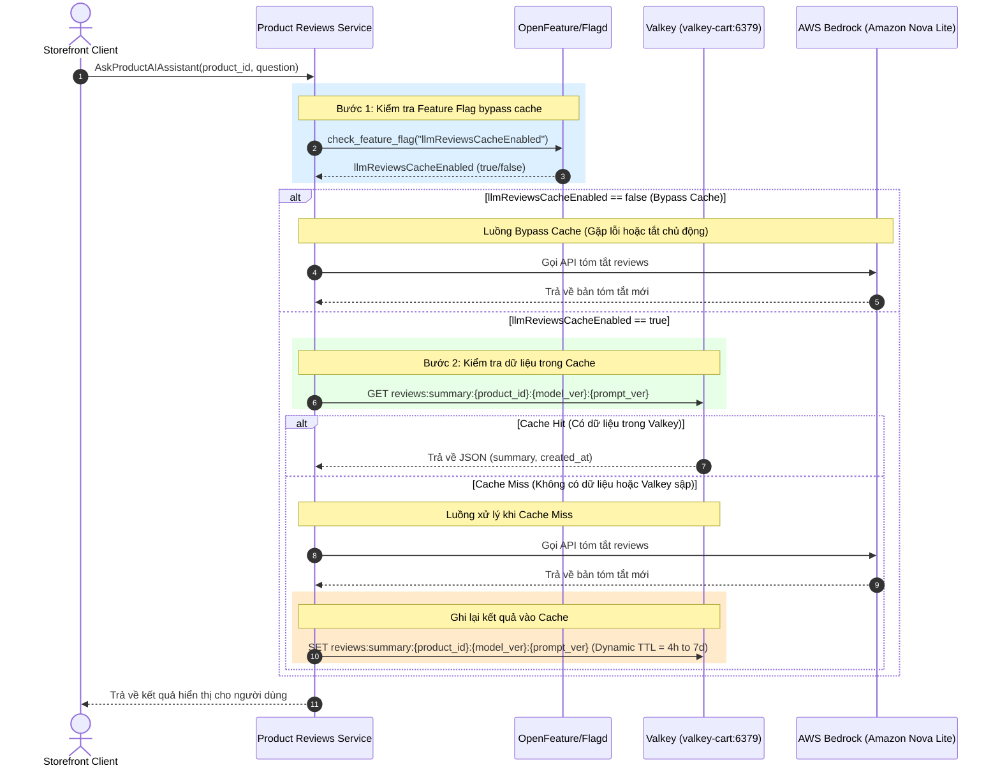

# Đặc tả thiết kế Valkey Caching - Review Summary

## 1. High-Level Architecture (Kiến trúc tổng quan)



## 2. Phân rã thành phần hệ thống (Component Breakdown)

| Thành phần | Vai trò & Trách nhiệm | Lựa chọn Công nghệ | Lý do lựa chọn & Tối ưu hóa |
|---|---|---|---|
| **Caching Store** | Lưu trữ tạm thời các bản tóm tắt review dưới định dạng JSON để tránh gọi LLM nhiều lần | **Valkey (Redis-compatible)** | - Tương thích giao thức Redis, tốc độ đọc/ghi in-memory cực nhanh (< 2ms).<br>- **Tối ưu hóa chi phí:** Tận dụng cụm `valkey-cart:6379` sẵn có chạy trong cluster EKS của nhóm CDO, không phát sinh chi phí duy trì cụm cache độc lập. *(Lưu ý: con số "~$30/tuần" chỉ áp dụng cho phương án **ElastiCache managed** — xem ADR-001 Option A. Một pod Valkey thứ hai in-cluster gần như không tốn thêm chi phí; xem đính chính ở ADR-003 Option 2.)* |
| **Reviews Service** | Tiếp nhận yêu cầu, kiểm tra feature flag, thực hiện kiểm tra cache, gọi LLM khi cache miss và cập nhật cache | **Python (gRPC Service)** | Service `product-reviews` hiện tại viết bằng Python, dễ dàng tích hợp thư viện `redis-py` hoặc `valkey` client. |
| **Feature Flag Server** | Cung cấp cờ tắt/bật bypass cache động thời gian thực | **OpenFeature / Flagd** | Có sẵn trong kiến trúc hạ tầng, cho phép tắt cache ngay lập tức khi phát hiện lỗi dữ liệu mà không cần restart/redeploy service. |

## 3. Chính sách & Cấu trúc Cache (Cache Policy & Schema)

### 3.1 Cấu trúc Cache Key & Value
- **Cache Key Format:** `reviews:summary:{product_id}:{model_ver}:{prompt_ver}`
  - *Ví dụ:* `reviews:summary:L9ECAV7KIM:nova-lite-v1:p3`
  - `model_ver` — định danh model đang phục vụ (ví dụ `nova-lite-v1`, `nova-pro-v1`).
  - `prompt_ver` — phiên bản system prompt, tăng thủ công mỗi lần sửa prompt.
  - **Vì sao nhúng version vào key:** đổi model hoặc đổi prompt làm bản tóm tắt cũ trở nên lỗi thời. Nhúng vào key thì lần đọc tiếp theo **miss tự nhiên**, không cần lệnh `DEL` nào. Nếu chỉ dùng `reviews:summary:{product_id}`, việc đổi Nova Lite ↔ Nova Pro vẫn trả về bản tóm tắt sinh bởi model cũ.
- **Cache Value Format (JSON):**
  Dữ liệu được serialize dưới dạng chuỗi JSON để đảm bảo khả năng mở rộng thông tin sau này.
  ```json
  {
    "summary": "Bản tóm tắt review sản phẩm bằng tiếng Việt được tạo bởi AI...",
    "created_at": "2026-07-08T12:00:00Z",
    "model_ver": "nova-lite-v1",
    "prompt_ver": "p3"
  }
  ```
  *(`model_ver`/`prompt_ver` lặp lại trong value để phục vụ audit và debug; key mới là thứ quyết định hit/miss.)*

### 3.2 Cấu hình vòng đời và bộ nhớ (TTL & Eviction)
- **TTL (Time To Live):** ~~Động (Dynamic TTL) 4 giờ đến 7 ngày~~ → **[SỬA 12/07] TTL phẳng 7 ngày.** Dynamic TTL bị gỡ khỏi code sau kiểm chứng: review data là tĩnh (không rpc ghi, seed cố định) nên $N$ và $\sigma^2$ không bao giờ đổi — công thức không có gì để phản ứng, chỉ đốt lại token cho output giống hệt. Xem Mục 5 (giữ làm tư liệu) + Phụ lục.
- **Eviction Policy (Chính sách giải phóng bộ nhớ) & Giải pháp Bảo vệ Giỏ hàng (Option 1):**
  - Cấu hình eviction policy của cụm Valkey là `volatile-lru`.
  - Để tránh việc giỏ hàng (khi đó còn TTL mặc định 60m trong code) bị xóa nhầm khi RAM đầy, nhóm đã **loại bỏ hoàn toàn TTL của giỏ hàng trong code C# (`ValkeyCartStore.cs`)**. Khi không có TTL, key giỏ hàng trở thành key vĩnh viễn (non-volatile) và được Valkey bảo vệ an toàn 100% khỏi cơ chế tự động eviction.
  - **Trạng thái:** ✅ đã triển khai (TF1-54) — `ValkeyCartStore.cs:174` và `:199` đã comment out `KeyExpireAsync`. Xem ADR-003 về yêu cầu CDO co-sign.
  - Thiết lập một **background CronJob** chạy lúc 2h sáng hàng ngày để chủ động quét dọn (`SCAN`) các giỏ hàng rác đã quá 30 ngày không có hoạt động, tránh làm rò rỉ và nghẽn bộ nhớ.


### 3.3 Cấu hình biến môi trường (Environment Variables)
Để đồng bộ hoàn toàn với **Hợp đồng tích hợp dịch vụ Product Reviews** với CDO, việc kết nối được cấu hình qua các biến môi trường sau:
- `VALKEY_HOST`: Tên Host/Service K8s của Valkey (Mặc định: `valkey-cart` nhằm tận dụng hạ tầng sẵn có).
- `VALKEY_PORT`: Cổng kết nối của Valkey (Mặc định: `6379`).


## 4. Kịch bản Xử lý Lỗi & Kế hoạch Dự phòng (Resilience & Rollback)

### 4.1 Cơ chế Tắt Cache Nhanh (Bypass Cache via Feature Flag)
- **Tên Flag OpenFeature:** `llmReviewsCacheEnabled`
- **Kiểu dữ liệu:** `Boolean` (Mặc định: `true`)
- **Cách thức hoạt động:**
  - Khi `llmReviewsCacheEnabled` là `true`: Luồng caching hoạt động bình thường.
  - Khi `llmReviewsCacheEnabled` là `false`: Luồng service bypass hoàn toàn Valkey, thực hiện truy vấn trực tiếp AWS Bedrock cho mọi request. Được sử dụng khi muốn kiểm thử trực tiếp model AI hoặc khi phát hiện lỗi định dạng dữ liệu trong cache.

### 4.2 Xử lý khi Valkey sập (Connection/Socket Timeout Resilience)
Để đảm bảo tính liên tục của tính năng reviews đối với khách hàng (SLO Error Rate < 0.5%), Reviews service không được phép lỗi (trả về 500) khi Valkey gặp sự cố.
- **Cơ chế Fallback khi Valkey sập:**
  - Thiết lập kết nối Valkey với `socket_timeout = 0.5s` và `socket_connect_timeout = 0.5s` để tránh nghẽn luồng (blocking).
  - Bọc tất cả các thao tác đọc (`GET`) và ghi (`SET`/`EXPIRE`) trong khối lệnh `try-except`.
  - Nếu bắt được bất kỳ lỗi kết nối nào từ phía Valkey (như `ConnectionError`, `TimeoutError`):
    1. Ghi nhận log lỗi mức độ `ERROR` kèm chi tiết trace context sang Collector/Jaeger.
    2. Tự động chuyển trạng thái xử lý sang **Cache Miss**, thực hiện gọi trực tiếp AWS Bedrock API để lấy summary.
    3. Không cố gắng thực hiện lệnh ghi (`SET`) vào Valkey ở bước sau để tránh lặp lại lỗi timeout.

---

## 5. ~~Cơ chế Đặt TTL Động (Score-Based Dynamic TTL)~~ [ĐÃ GỠ 12/07 — giữ làm tư liệu thiết kế]

> **Lý do gỡ (kiểm chứng được):** premise dữ liệu review thay đổi là sai — data tĩnh 100% (đã verify proto + DB). Công thức dưới đây chỉ kích hoạt lại nếu hệ có đường ghi review thật (trigger nâng cấp).

Thiết kế gốc: tối ưu hóa chi phí token và tính cập nhật bằng TTL động theo thông số review:

$$\text{TTL}_{\text{seconds}} = \max\left(14400, \frac{604800}{1 + 0.05 \cdot N + 0.5 \cdot \sigma^2}\right)$$

*   **Ý nghĩa các tham số:**
    *   $N$: Tổng số lượng reviews của sản phẩm.
    *   $\sigma^2$: Phương sai điểm số (Score Variance) của các reviews gần nhất.
    *   Giới hạn dưới: **4 giờ** (14,400 giây) để tránh việc gọi Bedrock quá liên tục đối với các sản phẩm cực kỳ hot.
    *   Giới hạn trên: **7 ngày** (604,800 giây) đối với sản phẩm ít reviews và điểm số ổn định, giúp giảm thiểu tối đa chi phí token trùng lặp.

---

## 6. Chiến Lược Làm Mới Cache (Cache Refresh Strategy)

Cache được làm mới bằng đúng **hai cơ chế thụ động**, không có lệnh `DEL` chủ động nào:

### 6.1 TTL phẳng 7 ngày — làm mới theo thời gian [SỬA 12/07]
Mọi key hết hạn sau **7 ngày** (`ttl = 604800` trong code). Với data tĩnh, expiry chỉ là cơ chế tự-phục-hồi (self-healing) nếu cache chứa giá trị hỏng — không phải cơ chế "cập nhật nội dung".

### 6.2 Versioned Cache Key — làm mới khi đổi model hoặc prompt
Key chứa `{model_ver}:{prompt_ver}` (§3.1). Đổi model hoặc sửa system prompt ⇒ key mới ⇒ lần đọc kế tiếp **miss tự nhiên** và sinh lại bằng cấu hình mới. Bản tóm tắt cũ nằm lại cho tới khi TTL hết hạn rồi tự bị dọn, không cần thao tác vận hành.

### 6.3 Vì sao KHÔNG dùng Write-Around Invalidation và Thumbs Down

Hai cơ chế này từng được đặc tả ở đây và **đã bị loại bỏ** sau khi đối chiếu với hệ thống thật:

- **Không có đường ghi review.** `ProductReviewService` trong `pb/demo.proto` chỉ có 3 rpc đọc: `GetProductReviews`, `GetAverageProductReviewScore`, `AskProductAIAssistant`. Review là **dữ liệu tĩnh** seed sẵn qua `src/postgresql/init.sql`. Write-Around Invalidation sẽ là invalidation cho một sự kiện không bao giờ xảy ra.
- **Không có nút feedback.** Storefront không có Thumbs Up/Down, và không có rpc nhận feedback.
- **Nguyên nhân lỗi thời thật sự là đổi model/prompt**, không phải review mới — và §6.2 xử lý đúng nguyên nhân đó với chi phí bằng không.

Nút Thumbs Down cùng cơ chế routing động sang Nova Pro chuyển xuống hạng mục **Mở rộng [Extend]**, ngoài phạm vi tuần 1. Nếu về sau có đường ghi review thật, cân nhắc thêm Write-Around Invalidation khi đó.


---

## Phụ lục kiểm chứng 12/07/2026

1. **Dynamic TTL đã gỡ khỏi code** → TTL phẳng 7d: premise "review tĩnh" kiểm chứng đúng (proto không rpc ghi, seed init.sql) nên N/variance không bao giờ đổi — công thức không có gì để phản ứng; hệ chỉ có **10 cache key** (10 sản phẩm đếm từ DB). Bỏ luôn query DB thừa mỗi lần cache-write.
2. **Versioned key giờ mới thật sự versioned**: `model_ver` đọc từ `LLM_REVIEWS_MAIN_MODEL` (trước là hằng "nova-lite-v1" chết — đổi model qua env không xoay key), `prompt_ver` = md5(SYSTEM_PROMPT)[:8].
3. **⚠️ Blast radius chung instance với cart (liên quan ADR-003):** valkey-cart hiện `volatile-lru` **không có maxmemory** (policy không chạy) + cart không TTL + limit 20Mi → nguy cơ OOMKill mất giỏ (checkout SLO). Nếu set maxmemory sau này, key reviews (volatile duy nhất) sẽ hứng toàn bộ eviction trước. Cần quyết với CDO: khôi phục TTL cart hoặc maxmemory + tách instance.
