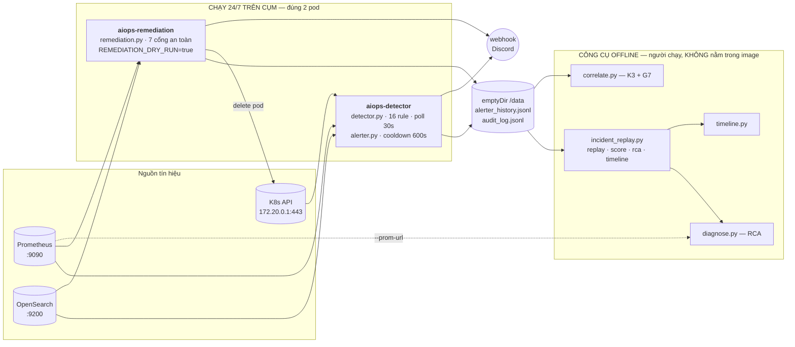
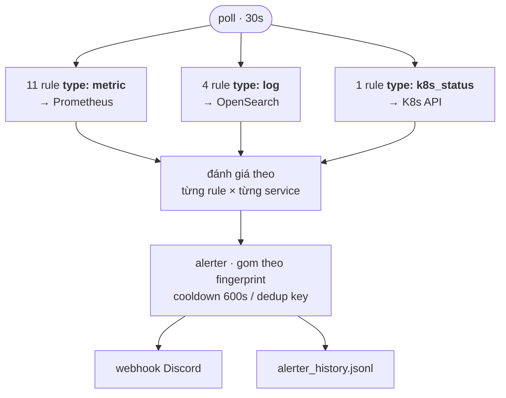
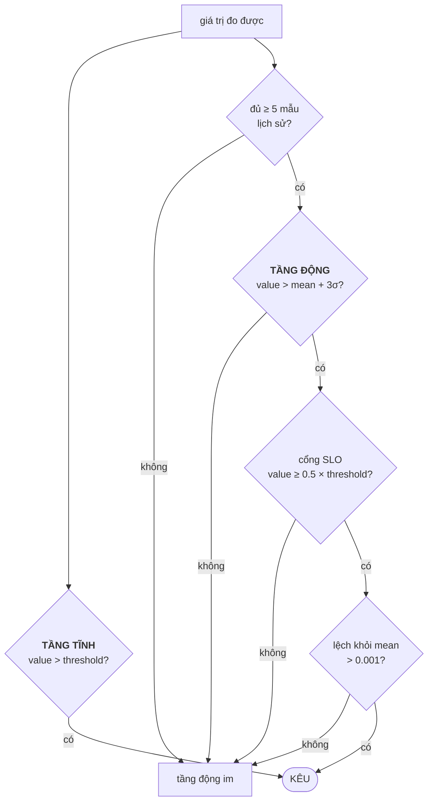
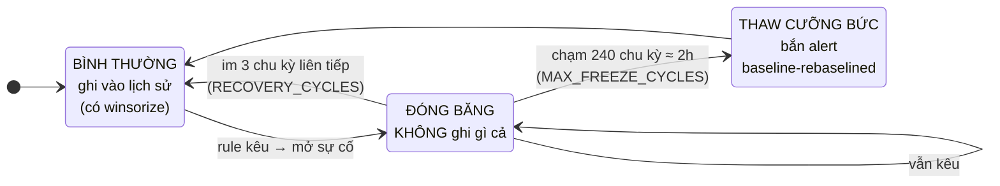
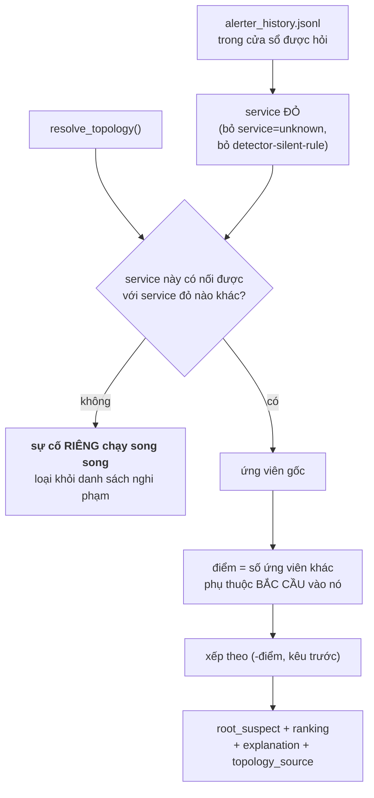
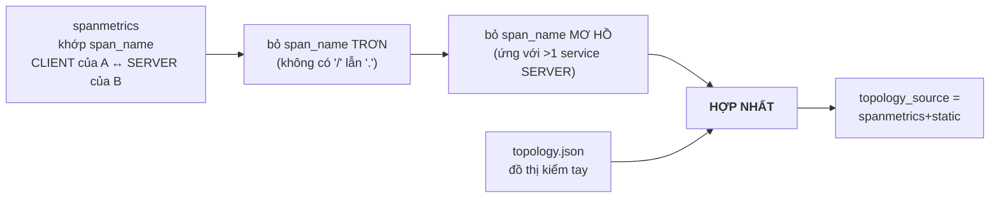
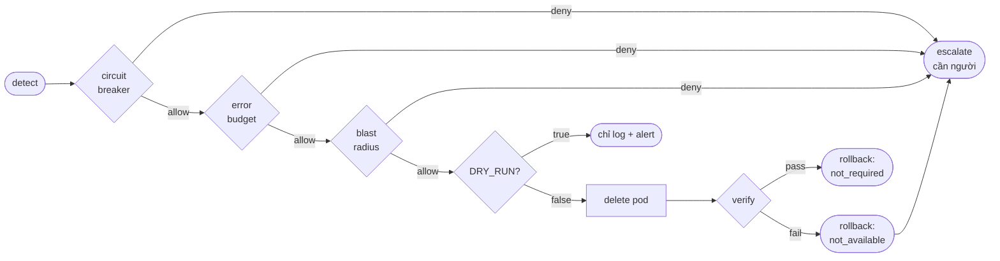
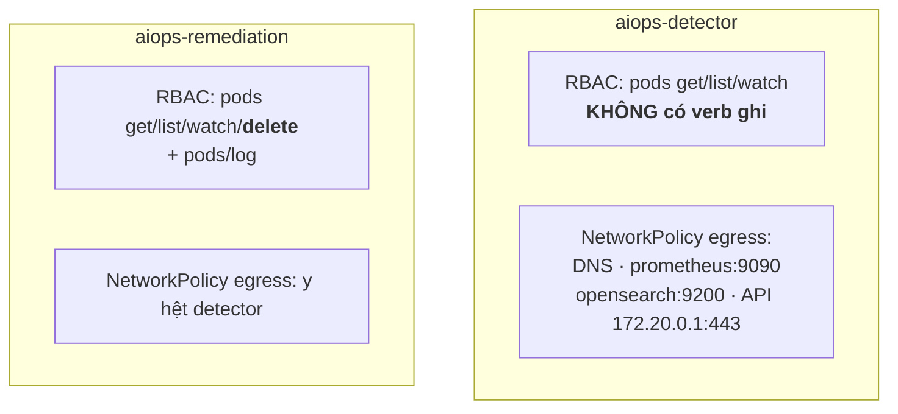
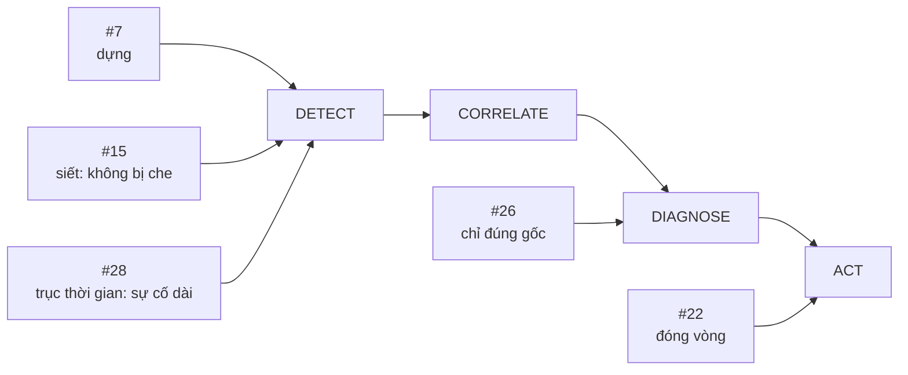

# Kiến trúc AIOps — TF1 / AIO03

> Bản đồ hệ AIOps: cái gì chạy ở đâu, đọc gì, quyết định thế nào, và giới hạn ở đâu.
> Mọi con số trong tài liệu này đọc thẳng từ code hoặc đo trên cụm `techx-tf1`, không phải thiết kế mong muốn.
>
> Chi tiết từng quyết định: [`05_adrs.md`](05_adrs.md). Đặc tả rule: [`03_specs/`](03_specs/).

---

## 1. Toàn cảnh



**Điều dễ hiểu nhầm nhất:** trong bốn tầng AIOps kinh điển, **chỉ hai tầng chạy online**.

| Tầng | Ở đâu | Khi nào chạy |
|---|---|---|
| **Detect** | pod `aiops-detector` | liên tục, poll 30s |
| Correlate | `correlate.py` | **offline** — dùng numpy/scipy, không vào image |
| Diagnose | `diagnose.py` | **offline** — chỉ stdlib, gọi qua `incident_replay rca` |
| **Act** | pod `aiops-remediation` | liên tục, poll ~30s |

Bằng chứng là dòng `COPY` của image detector — đúng 5 file:

```dockerfile
COPY sources.py alerter.py k8s_status.py detector.py rules.yaml ./
```

Hệ quả thật: **không có RCA nào tự xuất hiện lúc sự cố đang diễn ra.** Muốn có thì người phải chạy lệnh.

---

## 2. Tầng Detect

### 2.1 Mỗi chu kỳ 30 giây



### 2.2 Hai tầng ngưỡng — và ba cổng chặn của tầng động



| Tham số | Giá trị | Ở đâu |
|---|---|---|
| chu kỳ poll | `30s` | `rules.yaml` — chọn theo số đo, xem 2.3 |
| cửa sổ lịch sử | **30 mẫu** (= 15 phút @ poll 30s) | **hardcode** trong `detector.py` |
| tối thiểu để tin lịch sử | 5 mẫu | `detector.py` |
| ngưỡng động | `mean ± 3σ` | `detector.py` |
| cổng SLO | `dynamic_min_fraction` × `threshold` | `rules.yaml` từng rule |
| cooldown alert | `600s` | `rules.yaml` |

**Vì sao hai tầng:** tầng tĩnh bắt "vỡ SLO" kể cả khi chưa có lịch sử. Tầng động bắt "lệch bất thường" kể cả khi còn dưới SLO — tức bắt **sớm hơn**. Lịch sử khoá theo `rule_id:service` nên mỗi service có baseline riêng, và hai sự cố chồng nhau không lẫn vào nhau.

### 2.3 Hai núm vặn hay bị nhầm là một

`poll = 30s` được chọn bằng số đo: MTTD mean 19.6s / max 35.4s, vùng hợp lệ `[10s, 60s]` suy từ error budget, chi phí query 5ms.

`cửa sổ = 30 mẫu` thì **không ai đo** — nó hardcode. "Baseline 15 phút" chỉ là **tích** của hai cái, không phải một lựa chọn.

Hai núm này độc lập. Muốn baseline 30 phút thì nâng số mẫu (30 → 60, tốn ~115 KB RAM), **đừng** hạ poll xuống 60s — đó là trả bằng MTTD, thứ đắt nhất.

> ⚠️ Giới hạn thống kê đã đo (ADR-012, "Lỗ hổng 4"): query dùng `rate(...[5m])` nên hai mẫu liên tiếp chồng nhau **90%** dữ liệu. 30 mẫu chỉ chứa `900s / 300s ≈ 3` quan sát **độc lập**. Chuỗi bị làm mượt → σ nhỏ giả tạo → dải `mean+3σ` quá hẹp → **3.2 báo giả/giờ** trên production. Cổng SLO là thứ đang vá triệu chứng đó.

### 2.4 Vòng đời baseline — winsorize và freeze



Hai cơ chế **khác nhau về bản chất**:

- **Winsorize** (ADR-017, MANDATE-15) — kẹp giá trị về mức trần *rồi vẫn ghi*. Làm **chậm** việc baseline bị kéo theo. Chống một spike lẻ che sự cố ngay sau.
- **Freeze** (ADR-019, MANDATE-28) — *không ghi gì cả* khi đang có sự cố mở. Làm nó **dừng hẳn**. Chống sự cố kéo dài thành "bình thường mới".

ADR-019 **đảo lại một phần quyết định của ADR-017**: winsorize cố ý cho baseline trôi dần — với MANDATE-15 đó là hành vi mong muốn, với MANDATE-28 nó chính là lỗi.

Trần 2 giờ là chỗ đánh đổi thật: yêu cầu "báo xuyên suốt" đòi freeze, yêu cầu "không báo giả khi mức bình thường đã dịch" đòi thaw. Detector **không tự biết** mức mới là sự cố kéo dài hay bình thường mới — nên alert `baseline-rebaselined` làm cái ranh đó **nhìn thấy được** thay vì âm thầm học lại.

---

## 3. Tầng Diagnose — RCA



Đồ thị **quyết định**, thời gian chỉ **phá hoà**. Gốc thật là thứ giải thích được nhiều triệu chứng nhất.

### Đồ thị đến từ đâu



`topology_source` **luôn** đi kèm kết quả — không bao giờ xuống cấp âm thầm:

| source | Nghĩa |
|---|---|
| `spanmetrics+static` | hợp nhất — đường bình thường khi có `--prom-url` |
| `spanmetrics` | suy được nhưng không có file tĩnh |
| `static-fallback` | suy luận trả 0 cạnh → dùng file tĩnh, **kèm cảnh báo lỗi thời** |
| `none` | không có gì → xếp hạng **chỉ theo thời gian**, và nói thẳng ra như vậy |

> Bộ lọc "span_name trơn" và cơ chế hợp nhất đến từ PR #537 (ADR-018 addendum 31/07). Trước đó suy luận **thay thế** file tĩnh và không lọc tên trơn — đo trên cụm cho ra 5 cạnh ngược chiều trên tổng 16 và RCA chỉ sai gốc.

Hai quyết định có số đo đứng sau:

- **Cạnh qua Kafka KHÔNG vào đồ thị nhân quả.** `checkout → payment` nằm ở `async_edges`. Đo 26/07: giết `payment` 367s thì tỉ lệ lỗi của `checkout` đứng nguyên `0.0000` suốt 13/13 mẫu.
- **Loại tương quan = loại hẳn, không phải hạ điểm.** Service đỏ không nối được với nhóm đỏ là **một sự cố riêng**, không phải "nghi phạm yếu". Ca thật: pod `jaeger` OOM đều đặn ~39 phút/lần, hoàn toàn độc lập.

---

## 4. Tầng Act — vòng tự vá



Mỗi cổng ghi **một dòng JSONL** vào audit log. Chặn ở bất kỳ cổng nào thì dừng và báo người.

| Cổng | Giá trị hiện tại |
|---|---|
| `blast_radius` | **1 hành động / 3600s / namespace** |
| `REMEDIATION_DRY_RUN` | **`true`** — vòng tự vá **chưa từng đóng thật** trên cụm |

**Vì sao `rollback: not_available` chứ không phải "đã rollback".** Hành động duy nhất là `delete pod` để ReplicaSet tạo pod thay thế — nó **không đổi config hay release** nên không có trạng thái trước để hoàn tác. Ghi trung thực còn hơn bịa một `helm rollback` không tồn tại.

---

## 5. Dữ liệu và vòng đời

| Thứ | Ở đâu | Sống được bao lâu |
|---|---|---|
| `rules.yaml` (16 rule) | trong cả 2 image | remediation nhận bản copy tên `detector_rules.yaml` |
| `alerter_history.jsonl` | emptyDir `/data` | **mất khi pod bị thay** |
| `audit_log.jsonl` | emptyDir `/data` | **mất khi pod bị thay** |
| `topology.json` | trong repo | dự phòng + hợp nhất cho RCA |
| `metric_history` (baseline 30 mẫu) | **RAM** | mất khi restart |
| `incident_state` (freeze) | **RAM** | mất khi restart |
| `BlastRadiusGuard._history` | **RAM** | mất khi restart |
| `CircuitBreaker._fail_count` | **RAM** | mất khi restart |

> Ghi ra `/data` thay vì giấu là có chủ đích: **một audit log mất khi restart là một audit log yếu**, nhưng giấu chuyện đó còn tệ hơn. Nâng lên PVC hoặc log shipping là việc vận hành riêng.

---

## 6. Ranh giới quyền — hai lớp, cố ý



Ranh giới *"detector chỉ phát hiện, không thể tự hành động"* được giữ ở **tầng RBAC**, không phải bằng quy ước code. Đó cũng là lý do `k8s_status.py` (detector) và `k8s_actions.py` (remediation) **cố tình trùng lặp ~25 dòng** thay vì import chéo — import chéo là mở một đường từ detector tới code ghi.

Về mạng: RBAC quyết định **được làm gì**, NetworkPolicy quyết định **có tới được không**. Hai pod cùng một danh sách egress, khác nhau ở quyền.

Cả hai deployment do ArgoCD quản (app `aiops`, `selfHeal`); image đi qua Trivy → Cosign ký digest → SBOM attest.

---

## 7. Mandate nào đụng vào đâu



| # | Đòi gì | ADR |
|---|---|---|
| 7 | Làm ra được detector: phát hiện + cảnh báo, ≥3 tín hiệu | ADR-012 |
| 15 | Detect phải **đáng tin**: chống che, baseline per-service, MTTD thật | **ADR-017** |
| 22 | **Đóng vòng**: cổng an toàn → verify → rollback/escalate | — |
| 26 | Nhiều service đỏ thì chỉ ra **một** gốc kèm lý lẽ | **ADR-018** |
| 28 | Sự cố kéo dài không thành "bình thường mới" | **ADR-019** |

Ba mandate đổ vào Detect vì đó là chỗ **sai một lần thì mọi tầng sau đều sai theo**.

---

## 8. Khiếm khuyết đã biết — nói ra chứ không giấu

**Toàn bộ trạng thái nằm trong RAM hoặc emptyDir.** Sau mỗi lần pod restart, tầng động mù ít nhất 2,5 phút (cần ≥5 mẫu) và baseline chỉ đầy lại sau 15 phút. Circuit breaker cũng quên nó vừa fail mấy lần.

**Correlate và Diagnose không chạy tự động** — không có RCA nào xuất hiện lúc sự cố đang diễn ra.

**`REMEDIATION_DRY_RUN=true`** — vòng tự vá chưa từng thực sự đóng trên cụm.

**Baseline phẳng lì thì freeze vô nghĩa.** Chuỗi phương sai bằng 0 (`mean=0, std=0 → dynamic_threshold=0`) làm `min(value, 0) = 0` với mọi giá trị, baseline bị ghim vĩnh viễn. Đo thật: `accounting` 281/281 mẫu đều bằng 0. Với một số rule đó lại là điều **mong muốn** (giữ ranh phát hiện sát đáy), nhưng **không được áp mù cho rule khác mà không đo lại**.

**Rule mù theo service.** `service-error-rate-high` thiếu mặc định `0` ở tử số → chỉ **5/15** service có chuỗi. Với 10 service còn lại, một sự cố dưới ngưỡng SLO **không bao giờ được phát hiện**: baseline bắt đầu từ chính giá trị sự cố nên tầng động không thể kêu, tầng tĩnh thì chưa tới ngưỡng, và freeze vô nghĩa vì không có baseline lành. Đây cũng là **trần của tầng Diagnose** — gốc thật không kêu thì RCA không thể gọi tên nó.

**`oom-detected` báo `service: "unknown"`** nên mọi OOM bị RCA bỏ qua.

**`detector-silent-rule` không thấy được mù theo service** — nó chỉ kêu khi CẢ rule trả 0 chuỗi.

---

## 9. Chạy thử

```bash
# Detect — một vòng, không gửi alert đi đâu
python aiops/detector/detector.py --once --dry-run

# Diagnose — mentor đưa cửa sổ vào là chạy
python aiops/incident_replay.py rca --start <ts> --end <ts> [--prom-url http://localhost:9090]

# Dòng cảnh báo theo thời gian + danh sách incident
python aiops/incident_replay.py timeline --start <ts> --end <ts>

# Chấm một kịch bản có nhãn
python aiops/incident_replay.py score aiops/incident_scenarios/<case>.json --start <ts> --end <ts> --rca

# Test
pytest aiops/ -q
```

`diagnose.py`, `timeline.py`, `incident_replay.py` **chỉ phụ thuộc stdlib** — chạy được trên máy giám khảo mà không cài thêm gì.
