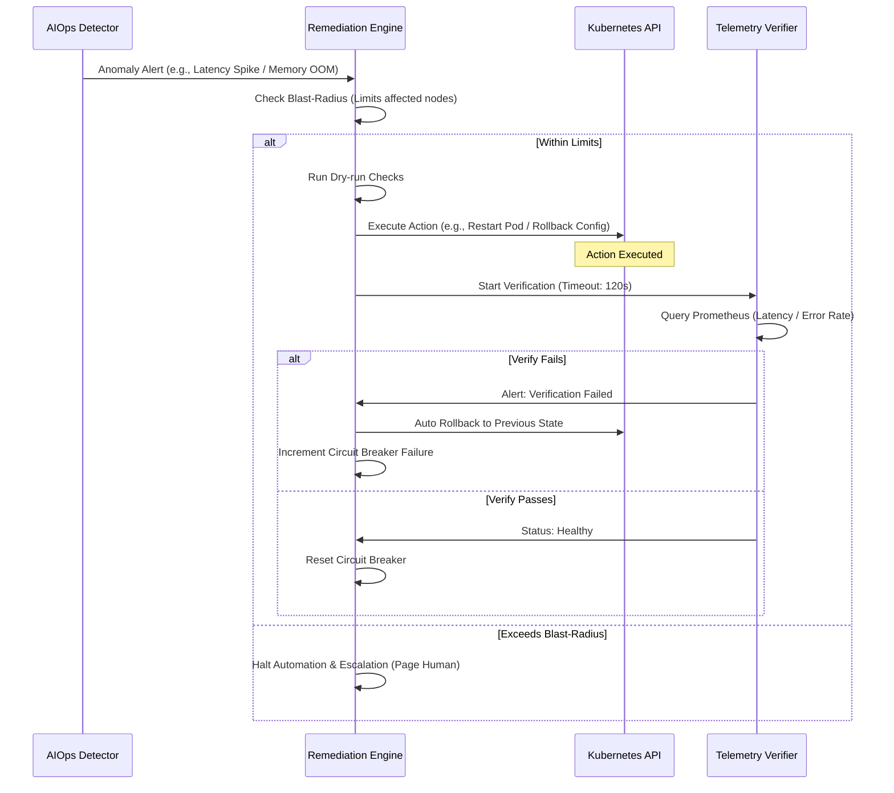

# Đặc tả Anomaly Detection & Auto-Remediation (AIOps)

## 1. Mục Tiêu & Phạm Vi (Context)
Tài liệu này định nghĩa các kịch bản tự động phục hồi khép kín (closed-loop remediation) nhằm tự động xử lý các sự cố phát sinh trên hệ thống. Trọng tâm của hệ thống AIOps là đảm bảo khả năng phát hiện dị thường (Anomaly Detection) một cách chính xác dựa trên các thuật toán, và đi kèm với các **ranh giới an toàn (Safety Boundaries)** để ngăn chặn việc tự động hóa gây lỗi hàng loạt.

---

## 2. Closed-loop Safety Pattern
Luồng hoạt động tự động khép kín giữa các thành phần giám sát, thực thi và nghiệm thu:



---

## 3. Cấu hình Phát hiện Dị thường (Detection Configuration)

Thay vì dựa vào các ngưỡng tĩnh (static threshold) dễ sinh cảnh báo rác, hệ thống sử dụng các phương pháp phân tích động:

### 3.1 Phát hiện dị thường về Metrics (Metric Anomaly)
- **Cơ chế:** Sử dụng thuật toán **EWMA (Exponentially Weighted Moving Average)** để làm mịn dữ liệu và bắt các biến động bất thường so với quá khứ.
- **Áp dụng:** Theo dõi chỉ số độ trễ `http_request_duration_seconds` (p95).
- **Ngưỡng cấu hình:** 
  - `alpha = 0.2` (trọng số cho dữ liệu mới, giúp hệ thống phản ứng nhanh với các thay đổi gần nhất nhưng không quá nhạy cảm).
  - `threshold = 3 standard deviations` (nếu độ trễ vượt qua 3 độ lệch chuẩn so với giá trị trung bình di chuyển, hệ thống sẽ kích hoạt cảnh báo Latency Spike).

### 3.2 Khai phá dữ liệu Log (Log Mining)
- **Cơ chế:** Tích hợp bộ gom cụm và phân tích log **Drain3**. Drain3 sẽ tự động trích xuất các "template" log phổ biến từ dòng log thô.
- **Áp dụng:** Gửi cảnh báo lên Slack/PagerDuty khi Drain3 phát hiện một "log template" hoàn toàn mới có chứa các từ khóa nguy hiểm như `ERROR`, `CRITICAL`, hoặc `OOM` (Out of Memory).

---

## 4. Các Tiêu Chuẩn An Toàn (Safety Boundaries)

Mọi hành động can thiệp vào Kubernetes/hệ thống (như restart pod) phải tuân thủ 4 ranh giới an toàn sau:

### 4.1 Chế độ Mô phỏng (Dry-run Mode)
- **Hành vi:** Hệ thống luôn hỗ trợ chạy logic phát hiện và đánh giá nhưng **KHÔNG** gửi lệnh gọi API thực tế tới Kubernetes (ví dụ: cờ `--dry-run=true`).
- **Mục đích:** Để in ra log và gửi cảnh báo Slack cho kỹ sư review kịch bản sửa lỗi trước khi bật chế độ Auto-remediation thực sự.

### 4.2 Giới hạn Phạm vi Tác động (Blast Radius)
- **Quy tắc:** Tối đa **1 pod / namespace** được phép khởi động lại tự động trong mỗi khung thời gian **1 giờ**.
- **Xử lý:** Nếu AIOps Detector tiếp tục phát hiện lỗi ở các pod khác cùng namespace và gửi lệnh restart thứ 2 trong vòng 1 giờ đó, Engine sẽ từ chối can thiệp và cảnh báo (Escalation) cho kỹ sư On-call.

### 4.3 Xác minh & Hoàn tác (Verify & Rollback)
- **Quy tắc:** Sau khi can thiệp (ví dụ Restart Pod), hệ thống chờ một khoảng Timeout là **120s**.
- **Xử lý:** Trong 120s này, Telemetry Verifier sẽ liên tục query Prometheus. 
  - Nếu chỉ số (Latency / Error Rate) bình thường trở lại $\rightarrow$ Quá trình Remediation hoàn tất.
  - Nếu không phục hồi $\rightarrow$ Thực thi cơ chế tự động **Rollback** về trạng thái hoặc cấu hình trước đó để tránh làm tình hình tệ hơn.

### 4.4 Cầu dao An toàn (Circuit Breaker)
- **Quy tắc:** Ngăn chặn việc tạo ra vòng lặp vô tận (Loop) khi hệ thống liên tục restart pod mà không sửa được lỗi.
- **Xử lý:** Nếu bước Verify thất bại **3 lần liên tiếp** cho cùng một sự cố, **Circuit Breaker sẽ MỞ (Open)**.
- Khi Cầu dao MỞ, mọi yêu cầu tự động phục hồi tiếp theo sẽ bị từ chối và cảnh báo trực tiếp (Page On-call) để con người vào xử lý thủ công.

---

## 5. Đặc tả Cấu hình Remediation Mẫu (YAML)

Dưới đây là thiết kế mẫu (pseudo-config) cho kịch bản phục hồi lỗi "Latency Spike":

```yaml
remediation_policy:
  name: "latency_spike_remediation"
  trigger:
    type: "ewma_metric"
    metric: "http_request_duration_seconds"
    alpha: 0.2
    std_dev_threshold: 3

  safety_boundaries:
    dry_run: false
    blast_radius:
      max_actions: 1
      time_window: "1h"
      scope: "namespace"
    
    verify_and_rollback:
      verify_duration: "120s"
      verify_metric_query: "rate(http_requests_total{status='500'}[1m])"
      auto_rollback: true

    circuit_breaker:
      max_failures: 3
      reset_timeout: "24h"

  action:
    type: "k8s_restart_pod"
    parameters:
      grace_period_seconds: 30
```
