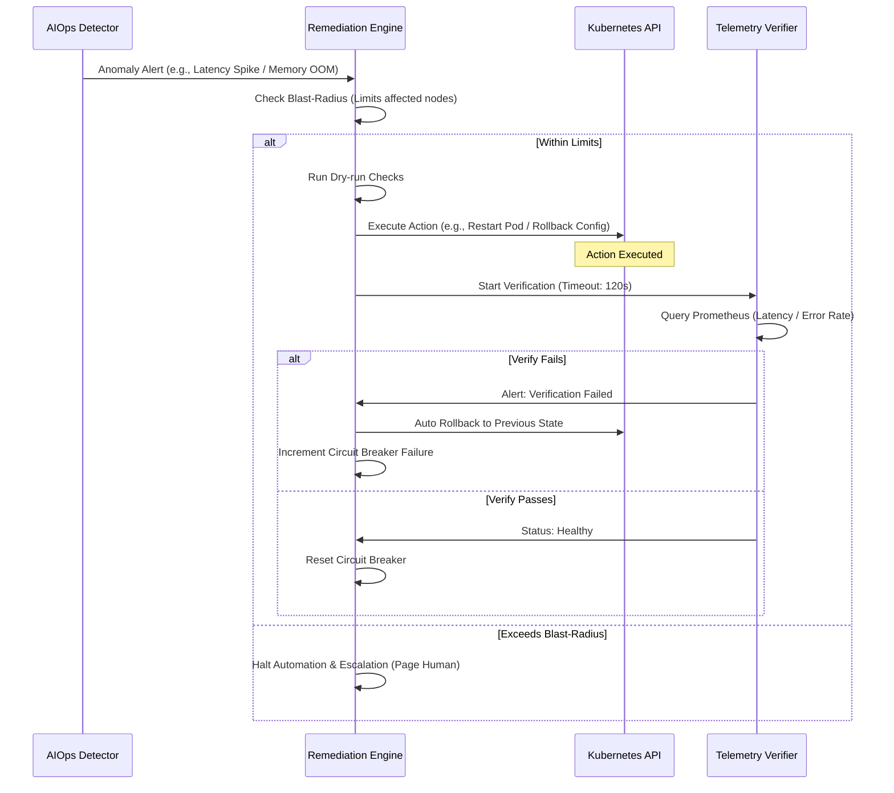

# Spec Anomaly Detection & Auto-Remediation (AIOps)

## 1. Closed-loop Safety Pattern

## 2. Detection Configuration (EWMA / Drain3)
- **Metric anomaly:** Theo dõi `http_request_duration_seconds` (p95) qua EWMA (alpha = 0.2, threshold = 3 standard deviations).
- **Log mining:** Lọc log qua bộ gom cụm **Drain3**. Gửi cảnh báo Slack khi phát hiện log template mới chứa từ khóa `ERROR`, `CRITICAL`, hoặc `OOM`.

## 3. Safety Boundaries (Blast-radius)
- **Max Pods affected:** Tối đa 1 pod/namespace được restart tự động mỗi giờ.
- **Circuit Breaker:** 3 lần khôi phục thất bại liên tiếp sẽ khóa chặt luồng tự động sửa lỗi và chuyển sang chế độ thủ công (Page On-call).
