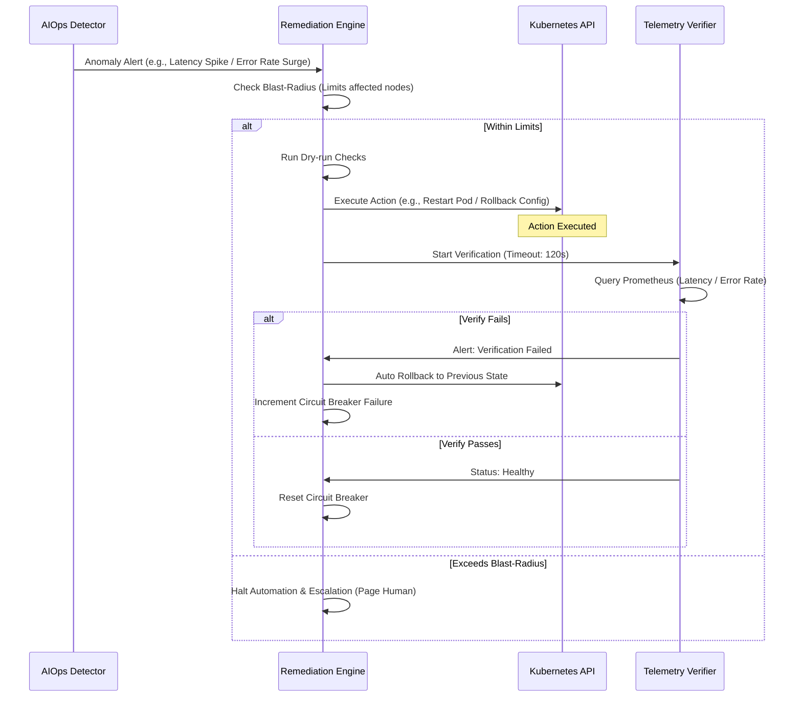

# Spec: Golden Signals Anomaly Detection (Latency & Error Rate)

## 1. Closed-loop Safety Pattern

The anomaly detection system feeds into a closed-loop remediation engine:



**Key insight:** Detection quality directly impacts remediation safety. False positives waste resources; false negatives delay recovery.

---

## 2. Mục tiêu & Phạm vi

Soạn thảo đặc tả kỹ thuật giám sát hai tín hiệu vàng (Golden Signals) của hệ thống storefront:
- **Latency (p95):** SLO cam kết < 1s.
- **Error Rate (HTTP 5xx):** Tỷ lệ lỗi backend.

Sử dụng EWMA (alpha = 0.2, threshold = 3σ) để lọc nhiễu và chuyển đổi time-series metrics thô thành tín hiệu bất thường thật sự.

---

## 3. Golden Signals — Monitored Metrics

| Signal | Metric | SLO / Alert Threshold | Detection Method |
|---|---|---|---|
| **Latency** | `http_request_duration_seconds` (p95) | SLO: < 1s · Alert: EWMA deviation > 3σ | EWMA + Prometheus rule |
| **Error Rate** | `http_requests_total{status=~"5.."}` / tổng requests | Alert: > 1% trong 5 phút | Prometheus rule + EWMA |

---

## 4. Detection Configuration (EWMA)

### 4.1 p95 Latency — EWMA Detection

Theo dõi `http_request_duration_seconds` (p95) qua thuật toán EWMA để phát hiện **gradual degradation**.

**Tham số EWMA:**

| Tham số | Giá trị | Lý do chọn |
|---|---|---|
| `alpha` | **0.2** | p95 latency storefront có variance cao trong giờ cao điểm — α thấp hơn mức mặc định 0.3 để baseline nhớ xa hơn, giảm false alarm. Phù hợp detect **gradual degradation** (ví dụ: connection pool cạn dần, memory leak), không phải sudden spike. |
| `threshold` | **3.0 σ** | ~0.3% false-positive rate với phân phối chuẩn công nghiệp. |
| Scrape interval | **15s** | Đủ granular để bắt degradation trong vòng 2–3 phút. |

**Giới hạn & Bù đắp:**
- α = 0.2 cần ~12–15 data points liên tục deviate mới trigger alert.
- Sudden spike (p95 vọt lên đột ngột trong 1–2 scrape) được bắt bởi Prometheus rule riêng (xem Section 4.3).

**Implementation:**

```python
import pandas as pd
import numpy as np


def detect_latency_anomaly(series: pd.Series, alpha: float = 0.2, threshold: float = 3.0) -> pd.Series:
    """
    Phát hiện latency anomaly bằng EWMA.
    
    Args:
        series: p95 latency values (pd.Series, indexed by timestamp).
        alpha: smoothing factor (0.2 cho storefront).
        threshold: std deviation threshold (mặc định 3σ).
    
    Returns:
        pd.Series[bool] — True tại các điểm anomaly.
    """
    ewma_mean = series.ewm(alpha=alpha, adjust=False).mean()
    ewma_std = series.ewm(alpha=alpha, adjust=False).std().replace(0, 1e-10)
    return (np.abs(series - ewma_mean) / ewma_std) > threshold
```

### 4.2 HTTP 5xx Error Rate — EWMA Detection

Theo dõi tỷ lệ lỗi HTTP 5xx qua EWMA để phát hiện **gradual increase** trong error rate.

**Tham số EWMA:**

| Tham số | Giá trị | Lý do chọn |
|---|---|---|
| `alpha` | **0.2** | Cùng lý do latency — giảm false alarm từ transient errors. |
| `threshold` | **3.0 σ** | ~0.3% false-positive rate. |
| Scrape interval | **15s** | Theo latency. |

**Lưu ý:**
- Error rate baseline phụ thuộc vào traffic volume — EWMA tự động normalize qua std deviation.
- Ví dụ: nếu baseline error rate = 0.05% ± 0.02% (1σ), thì alert trigger khi error rate > 0.11% (baseline + 3σ).

**Implementation:**

```python
def detect_error_rate_anomaly(series: pd.Series, alpha: float = 0.2, threshold: float = 3.0) -> pd.Series:
    """
    Phát hiện error rate anomaly bằng EWMA.
    
    Args:
        series: error rate values in [0, 1] (e.g., 0.01 = 1%), indexed by timestamp.
        alpha: smoothing factor.
        threshold: std deviation threshold.
    
    Returns:
        pd.Series[bool] — True tại các điểm anomaly.
    """
    ewma_mean = series.ewm(alpha=alpha, adjust=False).mean()
    ewma_std = series.ewm(alpha=alpha, adjust=False).std().replace(0, 1e-10)
    return (np.abs(series - ewma_mean) / ewma_std) > threshold
```

### 4.3 Complementary Prometheus Rules — Bắt Sudden Spikes

EWMA chậm (cần 12–15 data points) → cần rule Prometheus để bắt sudden spike:

```yaml
# prometheus-rules.yaml
groups:
  - name: storefront.golden_signals
    rules:
      # Rule 1: p95 latency SLO breach — sudden spike
      - alert: StorefrontLatencySLOBreach
        expr: |
          histogram_quantile(0.95,
            sum(rate(http_request_duration_seconds_bucket{service="storefront"}[5m])) by (le)
          ) > 1.0
        for: 2m
        labels:
          severity: warning
          team: platform
        annotations:
          summary: "Storefront p95 latency vượt SLO 1s"
          description: "p95 = {{ $value | humanizeDuration }} (SLO: < 1s)"

      # Rule 2: HTTP 5xx error rate threshold breach
      - alert: StorefrontHighErrorRate
        expr: |
          (sum(rate(http_requests_total{service="storefront", status=~"5.."}[5m]))
          /
          sum(rate(http_requests_total{service="storefront"}[5m])))
          > 0.01
        for: 5m
        labels:
          severity: critical
          team: platform
        annotations:
          summary: "Storefront HTTP 5xx rate > 1%"
          description: "Error rate = {{ $value | humanizePercentage }}"
```

**Giải thích:**
- **Rule 1:** Latency > 1s (SLO) trong 2 phút → alert. Bắt sudden spike mà EWMA chưa kịp detect.
- **Rule 2:** Error rate > 1% trong 5 phút → alert. Ngưỡng 1% được chọn vì:
  - Thường xuyên error rate < 0.1% (healthy state).
  - 1% tương đương ~1 lỗi per 100 requests → đáng để alert.
  - Balance giữa bắt real issues vs. false alarm từ transient failures.

---

## 5. Safety Considerations for Detection

### 5.1 Preventing False Positives

Vì bất kỳ anomaly detection nào cũng kích hoạt remediation tự động, chi phí của false positive cao. Chiến lược:

- **Dual detection:** EWMA (sensitive to trends) + Prometheus rule (fast spike catch). Chỉ trigger remediation khi cả hai đồng ý hoặc escalate to on-call.
- **Threshold tuning:** α = 0.2, threshold = 3σ được chọn để minimize false alarm từ giờ cao điểm traffic spikes.
- **Verification buffer:** Remediation engine chỉ confirm recovery khi p95 < 800ms (buffer 200ms so với SLO 1s) — tránh flip-flopping ở edge.

### 5.2 Blast-radius Awareness

Detection spec phải biết rằng:
- Mỗi anomaly alert có thể trigger max 1 pod restart/namespace/giờ (an control layer constraint).
- 3 lần remediation thất bại liên tiếp → circuit breaker opens → page on-call (human takes over).
- Detection phải có độ specificity đủ cao để tránh cascading false restarts.

---

## 6. Tóm tắt Detection Strategy

| Metric | Detection Method | Tham số | Tác dụng |
|---|---|---|---|
| **p95 Latency** | EWMA | α=0.2, threshold=3σ, interval=15s | Bắt gradual degradation (trend shift) |
| **p95 Latency** | Prometheus rule | threshold > 1s, for=2m | Bắt sudden spike |
| **Error Rate** | EWMA | α=0.2, threshold=3σ, interval=15s | Bắt gradual increase trong error rate |
| **Error Rate** | Prometheus rule | threshold > 1%, for=5m | Bắt sudden spike / threshold breach |

**Lý do dual detection:**
- EWMA: nhạy với trend, bắt được degradation dần dần.
- Prometheus rule: phản ứng nhanh, bắt spike đột ngột.
- Cùng nhau: coverage đầy đủ cho cả 2 loại anomaly, đồng thời giảm false alarm bằng cách yêu cầu confirmation.

