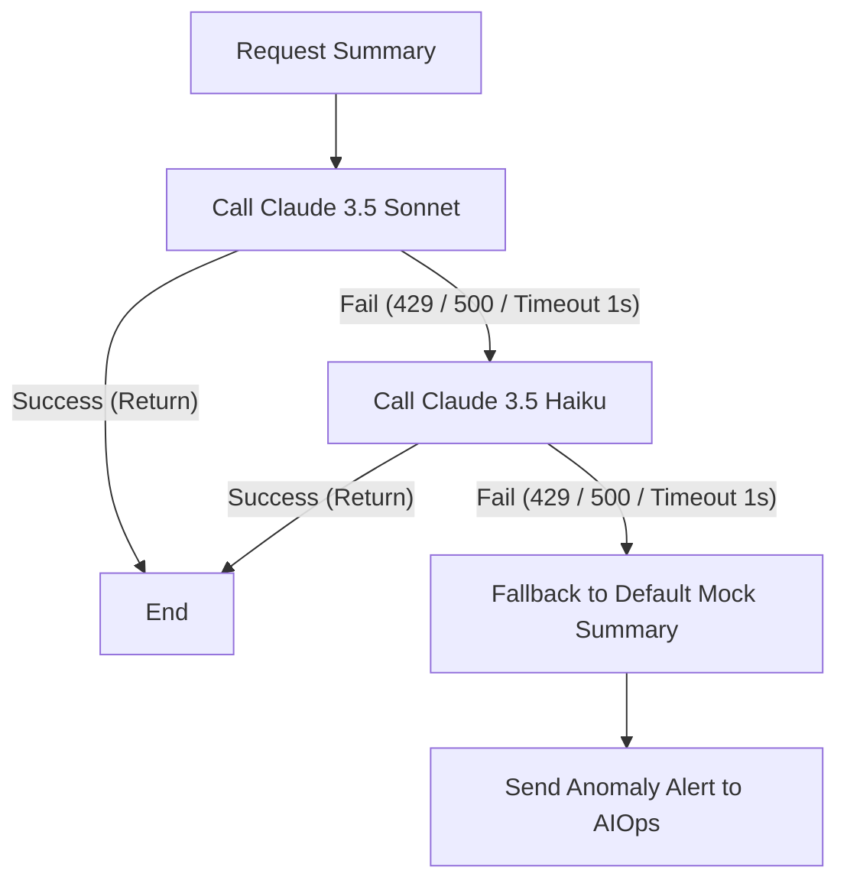

# Spec Thiết kế Fallback & Retry cho LLM Call

## 1. Flowchart Cơ chế dự phòng

## 2. Configuration Parameters
- **Primary Model:** `anthropic.claude-3-5-sonnet-v2` (Timeout: 1000ms, Retries: 1)
- **Secondary Model:** `anthropic.claude-3-5-haiku-v1` (Timeout: 800ms, Retries: 1)
- **Retry Backoff:** Exponential backoff (Base: 100ms, Factor: 2)
- **Fallback Trigger Codes:** HTTP 429, HTTP 500, ClientTimeout.

## 3. Rollback & Feature Flags
- **Flagd Key:** `llmReviewsFallbackEnabled`
- **Default Value:** `true`
- **Hành vi khi tắt (`false`):** Dịch vụ Reviews sẽ lỗi trực tiếp và trả về mã lỗi 500 khi model chính lỗi, không gọi Haiku hay Mock.
