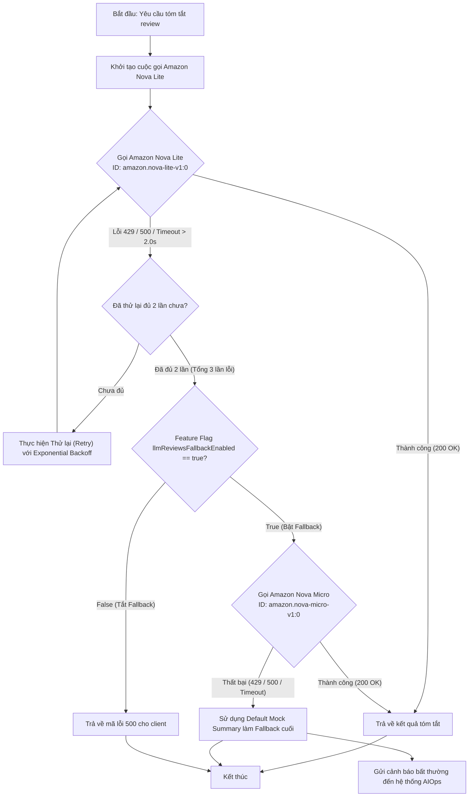
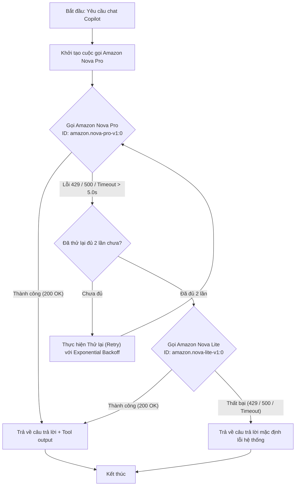

# Đặc tả thiết kế Fallback & Retry cho cuộc gọi LLM (Mô hình Định tuyến Lai - Hybrid Routing)

> **Vùng triển khai:** Đơn vùng `us-east-1` | **Ngân sách:** < $300/tuần | **SLO:** p95 < 1.0s
>
> **Nguồn dữ liệu:**
> - Chi phí model: [AWS Bedrock Pricing](https://aws.amazon.com/bedrock/pricing/)
> - Benchmark TTFT & throughput: [Artificial Analysis](https://artificialanalysis.ai/leaderboards/models)
> - Retry config: [AWS SDK Retry Behavior](https://docs.aws.amazon.com/sdkref/latest/guide/feature-retry-behavior.html)
> - Backoff & Jitter: [AWS Architecture Blog](https://aws.amazon.com/blogs/architecture/exponential-backoff-and-jitter/)
>
> **Quyết định liên quan:** [ADR-004](../ADR-log.md#adr-004---định-tuyến-model-llm-lai-theo-tác-vụ-hybrid-task-specific-routing-cho-đơn-vùng-single-region)

## 1. Flowchart Cơ chế Dự phòng (Fallback & Retry Flowchart)

Sơ đồ dưới đây thể hiện quy trình xử lý lỗi khi các dịch vụ thực hiện cuộc gọi API đến AWS Bedrock (`us-east-1`):

### A. Luồng Tóm tắt Review (Product Reviews Summary) - Tải cao, Độ phức tạp thấp:

### B. Luồng Trợ lý Chatbot (Shopping Copilot Agent) - Tải thấp, Độ phức tạp cao:

---

## 2. Thông số Cấu hình Hệ thống (Configuration Parameters)

Dưới đây là các thông số chi tiết cấu hình cho cơ chế định tuyến và fallback trong Đơn Vùng (`us-east-1`). Giá trị timeout và backoff dựa trên [AWS Architecture Blog — Backoff & Jitter](https://aws.amazon.com/blogs/architecture/exponential-backoff-and-jitter/) và benchmark từ [Artificial Analysis](https://artificialanalysis.ai/leaderboards/models):

### A. Luồng Tóm tắt Review (Product Reviews)
| Tham số | Model chính (Primary Model) | Model dự phòng (Fallback Model) |
|---|---|---|
| **Tên Model** | Amazon Nova Lite | Amazon Nova Micro |
| **Model ID AWS Bedrock** | `amazon.nova-lite-v1:0` | `amazon.nova-micro-v1:0` |
| **Timeout tối đa** | **2.0 giây (2000ms)** | **1.0 giây (1000ms)** |
| **Số lần tự động thử lại** | **Tối đa 2 lần** (Tổng cộng tối đa 3 cuộc gọi) | **Tối đa 1 lần** (Tổng cộng tối đa 2 cuộc gọi) |
| **Cơ chế Retry Backoff** | Exponential backoff (Base: 100ms, Factor: 1.5, Jitter: True) | Exponential backoff (Base: 50ms, Factor: 1.5, Jitter: True) |
| **Lỗi kích hoạt** | HTTP 429, HTTP 500/503, ClientTimeout (> 2.0s) | HTTP 429, HTTP 500/503, ClientTimeout (> 1.0s) |

### B. Luồng Trợ lý Chatbot (Shopping Copilot)
| Tham số | Model chính (Primary Model) | Model dự phòng (Fallback Model) |
|---|---|---|
| **Tên Model** | Amazon Nova Pro | Amazon Nova Lite |
| **Model ID AWS Bedrock** | `amazon.nova-pro-v1:0` | `amazon.nova-lite-v1:0` |
| **Timeout tối đa** | **5.0 giây (5000ms)** | **2.0 giây (2000ms)** |
| **Số lần tự động thử lại** | **Tối đa 2 lần** (Tổng cộng tối đa 3 cuộc gọi) | **Tối đa 1 lần** (Tổng cộng tối đa 2 cuộc gọi) |
| **Cơ chế Retry Backoff** | Exponential backoff (Base: 200ms, Factor: 1.5, Jitter: True) | Exponential backoff (Base: 100ms, Factor: 1.5, Jitter: True) |
| **Lỗi kích hoạt** | HTTP 429, HTTP 500/503, ClientTimeout (> 5.0s) | HTTP 429, HTTP 500/503, ClientTimeout (> 2.0s) |

---

## 3. Cấu hình biến môi trường (Environment Variables)

Các biến môi trường được cấu hình linh động cho Pod `product-reviews` trong cụm K8s:

*   **Cho Reviews Summary:**
    *   `LLM_REVIEWS_MAIN_MODEL`: ID model tóm tắt chính (Mặc định: `amazon.nova-lite-v1:0`).
    *   `LLM_REVIEWS_FALLBACK_MODEL`: ID model tóm tắt dự phòng (Mặc định: `amazon.nova-micro-v1:0`).
    *   `LLM_REVIEWS_TIMEOUT`: Timeout cho Nova Lite (Mặc định: `2.0`).
    *   `LLM_REVIEWS_MAX_RETRIES`: Số lần thử lại tối đa (Mặc định: `2`).
*   **Cho Shopping Copilot:**
    *   `LLM_COPILOT_MAIN_MODEL`: ID model chatbot chính (Mặc định: `amazon.nova-pro-v1:0`).
    *   `LLM_COPILOT_FALLBACK_MODEL`: ID model chatbot dự phòng (Mặc định: `amazon.nova-lite-v1:0`).
    *   `LLM_COPILOT_TIMEOUT`: Timeout cho Nova Pro (Mặc định: `5.0`).
    *   `LLM_COPILOT_MAX_RETRIES`: Số lần thử lại tối đa (Mặc định: `2`).

---

## 4. Rollback & Feature Flags

*   **Flagd Key:** `llmReviewsFallbackEnabled` (Boolean - Mặc định: `true`)
    *   *True:* Tự động kích hoạt chuyển đổi sang model dự phòng (Nova Micro) và Mock Summary khi Nova Lite bị lỗi hàng loạt. Đảm bảo SLO Availability > 99.9%.
    *   *False:* Tắt cơ chế dự phòng. Khi Nova Lite gặp lỗi sau số lần retry, ứng dụng trả thẳng lỗi 500 về storefront để bảo đảm tính nhất quán chất lượng bản dịch.

---

## 5. Kiến trúc Tự phục hồi 5 lớp (5-Layer Resilience Stack)

Đáp ứng yêu cầu vận hành bền bỉ trước sự cố mạng hoặc lỗi rate limit do BTC giả lập (như cờ `llmRateLimitError`), Reviews Service triển khai ngăn xếp tự phục hồi 5 lớp sau:

1. **Lớp 1: Adaptive Client Retry (AWS SDK):** Cấu hình client sử dụng chế độ adaptive retry tự động đo lường và xếp hàng cuộc gọi khi AWS Bedrock API trả về lỗi nghẽn.
2. **Lớp 2: Exponential Backoff & Jitter:** 
   - Thử lại tối đa 2 lần với thời gian chờ trễ: $t = \text{Base} \times 1.5^{\text{attempt}} \pm \text{random\_jitter}$.
   - Chỉ kích hoạt retry cho nhóm lỗi: HTTP 429, 500, 503, và Connection Timeout.
3. **Lớp 3: Bulkhead Isolation (Asyncio Semaphore):**
   - Giới hạn tối đa **10 luồng gọi Bedrock đồng thời** bằng `asyncio.Semaphore(10)`.
   - Nếu luồng xử lý bị nghẽn (Bedrock phản hồi chậm), các request sau sẽ xếp hàng chờ thay vì spam API hoặc làm cạn kiệt CPU/RAM của container.
4. **Lớp 4: Context-Aware Dynamic Deadlines:**
   - Đọc thời gian xử lý còn lại của request (trace context). Nếu request gần chạm ngưỡng trễ hạn SLO (ví dụ: chỉ còn 500ms trước khi hết 1.0s), hệ thống tự động co ngắn timeout của cuộc gọi Bedrock xuống còn 400ms để kịp thời trả về kết quả mock thay vì để storefront bị timeout cascading.
5. **Lớp 5: Flag-Aware Circuit Breaker:**
   - Tự động chuyển Circuit Breaker sang trạng thái **OPEN** ngay khi phát hiện flag `llmRateLimitError` từ flagd ở trạng thái ON. Chuyển thẳng request sang Mock Summary hoặc model dự phòng mà không cần thực hiện cuộc gọi thật tới Bedrock, bảo vệ trần chi phí và tránh nghẽn luồng.
