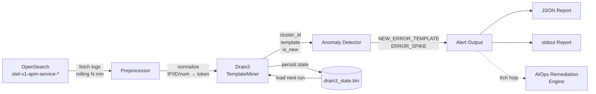
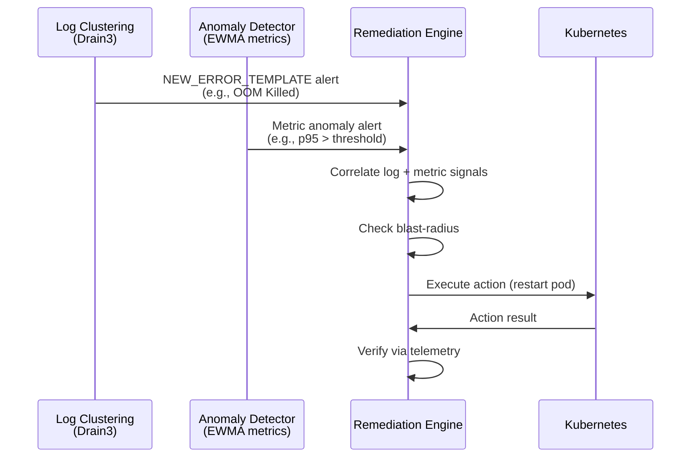

# Spec: Log Clustering sử dụng Drain3 (AIOps)

> **Task:** TF1-52 / AIOps-W1-T4  
> **Người viết:** AIO03 – TF1  
> **Ngày:** 2026-07-09  
> **Trạng thái:** Đã triển khai

---

## 1. Mục tiêu

Ứng dụng **log mining** để phân cụm log lỗi GenAI, phát hiện nhanh **culprit** trong hàng nghìn dòng log thô thay vì dựa vào alert nhiễu keyword đơn giản.

### Vấn đề hiện tại

| Vấn đề | Tác động |
|---|---|
| Log từ `product-reviews` và `llm` rất nhiễu: hàng nghìn dòng/phút khi sự cố | On-call mất 10-15 phút đọc log thủ công để tìm culprit |
| Alert dựa trên keyword đơn (`ERROR` grep) sinh quá nhiều false-positive | Alert fatigue → bỏ sót sự cố thật |
| Log giống nhau nhưng khác IP/product_id/timestamp khiến khó nhận diện pattern | Không thể nhóm lỗi theo root cause |

### Mục tiêu cụ thể

1. **Giảm noise:** Gom N dòng log → M template (M << N), giúp on-call nhìn thẳng vào pattern lỗi.
2. **Phát hiện sớm sự cố mới:** Khi xuất hiện log template lỗi **chưa từng thấy** → alert ngay (dấu hiệu bug/sự cố mới).
3. **Phát hiện tần suất tăng đột biến:** Template lỗi đã biết nhưng tần suất vượt ngưỡng → alert (dấu hiệu sự cố đang leo thang).
4. **Tích hợp vào vòng AIOps:** Output JSON phục vụ downstream cho anomaly detection + auto-remediation pipeline.

---

## 2. Kiến trúc tổng quan



### Luồng dữ liệu chi tiết

```
1. FETCH   ─ OpenSearch query (rolling window, mặc định 60 phút)
             Lọc theo service: product-reviews, llm
             Lấy: @timestamp, service.name, Body, SeverityText, Attributes

2. PREPROCESS ─ Normalize log message:
             10.0.1.5:5432     → <IP>
             OLJCESPC7Z        → <PRODUCT_ID>
             429, 5432         → <NUM>
             UUID              → <UUID>
             2026-07-09T...    → <TIMESTAMP>

3. CLUSTER ─ Drain3 TemplateMiner.add_log_message()
             → cluster_id, template string, change_type

4. DETECT  ─ So sánh cluster_id vs existing_ids (trước bước 3)
             → NEW_ERROR_TEMPLATE: template mới + chứa keyword lỗi
             → ERROR_SPIKE: template cũ + count >= threshold

5. OUTPUT  ─ JSON report + stdout summary + exit code (1 nếu có alert)
```

---

## 3. Thuật toán Drain3

### Tại sao chọn Drain3

| Tiêu chí | Drain3 | Regex thủ công | LLM-based |
|---|---|---|---|
| Tốc độ | Rất nhanh (O(n)) | Nhanh nhưng phải viết tay | Chậm, tốn API |
| Bảo trì | Tự động học template | Phải update regex mỗi khi log thay đổi | Tốn tiền mỗi lần chạy |
| Chính xác | Cao với fixed-depth tree | Phụ thuộc chất lượng regex | Cao nhưng không ổn định |
| Incremental | Có (persist state) | Không | Không |
| Chi phí | $0 | $0 | $5-20/ngày |

### Drain3 Parameters

| Parameter | Giá trị | Lý do |
|---|---|---|
| `sim_th` | ~~0.4~~ → **0.3 (theo grid đo 12/07 — xem Phụ lục)** | Grid trên 19.3k dòng log thật: 0.3 trội cả 4 tiêu chí. Lưu ý code `log_clustering.py` đang hardcode 0.5 — phải đồng bộ về một giá trị sau khi bật masking + đo lại trên EKS |
| `depth` | `4` | Đủ sâu để phân biệt các loại lỗi khác nhau |
| `max_children` | `100` | Cho phép nhiều nhánh prefix tree (log đa dạng) |
| `max_clusters` | `1000` | Giới hạn hợp lý cho 2 service |

### Preprocessing – Tại sao cần

Drain3 hoạt động tốt nhất khi log đã được **normalize** – thay thế các giá trị động bằng token cố định. Nếu không preprocess, cùng một loại lỗi với IP khác nhau sẽ tạo ra 2 cluster riêng biệt (sai).

**Ví dụ:**
```
RAW:  ERROR: connection to server at 'postgresql' (10.0.1.5), port 5432 failed
NORM: ERROR: connection to server at 'postgresql' (<IP>), port <NUM> failed

RAW:  Receive GetProductReviews for product id:OLJCESPC7Z
NORM: Receive GetProductReviews for product id:<PRODUCT_ID>
```

---

## 4. Anomaly Detection Logic

### Loại alert

| Alert | Điều kiện | Ý nghĩa |
|---|---|---|
| `NEW_ERROR_TEMPLATE` | `cluster_id ∉ existing_ids` AND (`severity ∈ {ERROR,CRITICAL,FATAL}` OR `template chứa keyword lỗi`) | Sự cố hoàn toàn mới – cần kiểm tra ngay |
| `ERROR_SPIKE` | `cluster_id ∈ existing_ids` AND `is_error` AND `count ≥ SPIKE_THRESHOLD` | Sự cố đã biết đang leo thang |

### Keyword trigger

```python
ALERT_KEYWORDS = [
    "ERROR", "CRITICAL", "OOM", "timeout",
    "connection refused", "5xx", "rate limit",
    "OutOfMemory", "FATAL", "traceback",
    "exception", "killed", "oom_kill"
]
```

### Incremental clustering

- **Lần chạy đầu:** Mọi template đều là `NEW` → alert tất cả template lỗi.
- **Lần chạy tiếp theo:** Load state từ `drain3_state.bin` → chỉ template thật sự mới mới trigger `NEW_ERROR_TEMPLATE`.
- **Khi deploy lên cron (mỗi 5 phút):** Hệ thống chỉ alert các sự cố mới xuất hiện kể từ lần chạy trước.

---

## 5. Tích hợp vào hệ thống AIOps

### Vị trí trong closed-loop



### Cách gọi từ pipeline

```python
from aiops.log_clustering.log_clustering import run

# Chạy clustering, nhận alerts
alerts = run(output_path="results/report.json")

for alert in alerts:
    if alert["alert_type"] == "NEW_ERROR_TEMPLATE":
        # OOM → trigger pod restart check
        if "OOM" in alert["template"]:
            remediation_engine.handle_oom(alert)
        # DB connection → trigger pool size check
        elif "connection" in alert["template"]:
            remediation_engine.handle_db_pool(alert)
    elif alert["alert_type"] == "ERROR_SPIKE":
        # Escalate nếu count cao
        if alert["count"] > 20:
            pagerduty.escalate(alert)
```

---

## 6. Test coverage

| Test class | Số test | Kiểm tra |
|---|---|---|
| `TestPreprocess` | 6 | IP, Product ID, Number, UUID, keyword preservation, empty |
| `TestClusterLogs` | 8 | Similar grouping, different separation, service/severity, empty, sample |
| `TestDetectAnomalies` | 7 | NEW_ERROR, OOM, INFO skip, SPIKE, low count skip, 5xx |
| `TestIsErrorTemplate` | 6 | Keyword detection, severity detection, normal skip |
| `TestSaveResults` | 2 | JSON output, valid format |
| `TestFullPipeline` | 3 | End-to-end, rate limit, incremental |
| **Tổng** | **32** | **0.37s** |

---

## 7. Cấu hình vận hành

### Biến môi trường

| Biến | Mặc định | Mô tả |
|---|---|---|
| `OPENSEARCH_HOST` | `localhost` | Host OpenSearch cluster |
| `OPENSEARCH_PORT` | `9200` | Port |
| `OPENSEARCH_INDEX_PATTERN` | `otel-v1-apm-service-*` | Index pattern OTel logs |
| `LOOKBACK_MINUTES` | `60` | Cửa sổ thời gian nhìn ngược (phút) |
| `TARGET_SERVICES` | `product-reviews,llm` | Danh sách service giám sát |
| `STATE_FILE` | `/tmp/drain3_state.bin` | File lưu trạng thái Drain3 |
| `SPIKE_THRESHOLD` | `5` | Ngưỡng count để trigger ERROR_SPIKE |

### Chạy như CronJob trên K8s

```yaml
apiVersion: batch/v1
kind: CronJob
metadata:
  name: log-clustering
  namespace: otel-demo
spec:
  schedule: "*/5 * * * *"    # Mỗi 5 phút
  jobTemplate:
    spec:
      template:
        spec:
          containers:
          - name: log-clustering
            image: <ECR>/log-clustering:latest
            env:
            - name: OPENSEARCH_HOST
              value: "opensearch"
            - name: LOOKBACK_MINUTES
              value: "10"
            - name: STATE_FILE
              value: "/state/drain3_state.bin"
            volumeMounts:
            - name: state
              mountPath: /state
          volumes:
          - name: state
            persistentVolumeClaim:
              claimName: log-clustering-state
          restartPolicy: OnFailure
```

---

## 8. Hạn chế & Cải tiến tiếp theo

| Hạn chế hiện tại | Cải tiến kế hoạch |
|---|---|
| Alert chỉ in ra stdout + JSON file | Tích hợp Slack webhook / PagerDuty |
| Không có correlation giữa log alert và metric alert | Kết hợp với EWMA metric detector (TF1-49) |
| `sim_th` cố định | Auto-tune `sim_th` dựa trên false-positive feedback |
| Chưa có dashboard | Đẩy cluster stats vào Prometheus custom metrics → Grafana |

---

## 9. Tham khảo

- **Paper gốc:** He et al., *Drain: An Online Log Parsing Approach with Fixed Depth Tree*, ICWS 2017
- **Thư viện:** [Drain3 GitHub](https://github.com/logpai/Drain3)
- **Spec liên quan:** [anomaly_remediation.md](./anomaly_remediation.md) (Closed-loop Safety Pattern)
- **ADR liên quan:** [ADR-log.md](../ADR-log.md) → ADR-007

---

## Phụ lục kiểm chứng 12/07/2026 — grid sim_th/depth trên log thật

Ba con số đang mâu thuẫn: **code `log_clustering.py` hardcode `sim_th=0.5`**, spec này ghi 0.4, còn grid đo trên **19.294 dòng log thật** của hệ (`docs/ai/evals/drain3_param_grid.py`, tiêu chí cố định trước khi đo):

| sim_th | templates | top20 coverage | singleton% | stability |
|---|---|---|---|---|
| **0.3** | **795** | **48.3%** | **56.1%** | **0.64** |
| 0.4 | 1074 | 47.1% | 59.5% | 0.73 |
| 0.5 (code hiện tại) | 1222 | 46.4% | 60.6% | 0.76 |
| 0.6 | 1645 | 42.1% | 61.5% | 0.76 |

0.3 trội ở cả 4 tiêu chí; depth 4–6 thay đổi <2% (giữ 4). Trước khi chốt vào code: **bật masking Drain3** (`<NUM>/<UUID>/<IP>/duration>` — singleton 56% chủ yếu do id/timestamp nhúng trong dòng) rồi chạy lại grid trên 24h log EKS. Baseline giáo trình AIOps course cũng mask trước khi so khớp.
