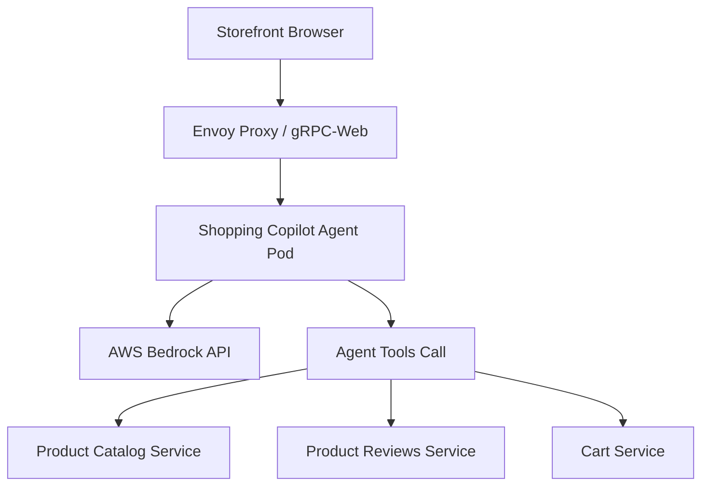

# Spec Thiết kế Shopping Copilot Agent

## 1. High-Level Architecture


## 2. Interface Definition (gRPC Contract)
Chi tiết định nghĩa gRPC tại `proto/shopping_copilot.proto`:
```protobuf
syntax = "proto3";

package shopping_copilot;

service ShoppingCopilot {
  rpc Chat(ChatRequest) returns (ChatResponse);
}

message ChatRequest {
  string session_id = 1;
  string message = 2;
}

message ChatResponse {
  string reply = 3;
  repeated string actions_taken = 4;
}
```

## 3. Prompts & Tools Configuration
- **Model ID:** `anthropic.claude-3-5-sonnet-v2`
- **System Prompt:** [Role: Trợ lý mua sắm thông minh của TechX Corp. Chỉ dùng tools để tra cứu...]
- **Tools List:**
  1. `search_products(query)`: Tra cứu sản phẩm trong Catalog.
  2. `get_product_reviews(product_id)`: Xem nhận xét của khách hàng.
  3. `add_to_cart(product_id, quantity)`: Thêm sản phẩm vào giỏ hàng (Yêu cầu xác nhận).

## 4. Safety Confirmation Gate (Cổng bảo mật giỏ hàng)
- Mọi hành động thêm sản phẩm vào giỏ hàng (`add_to_cart`) bắt buộc phải trả về câu hỏi xác nhận cho Client: *"Bạn có đồng ý thêm sản phẩm X vào giỏ hàng không?"*
- Chỉ khi Client gửi tin nhắn xác nhận Đồng ý, Agent mới gọi API Cart thực hiện hành động thêm giỏ hàng.
