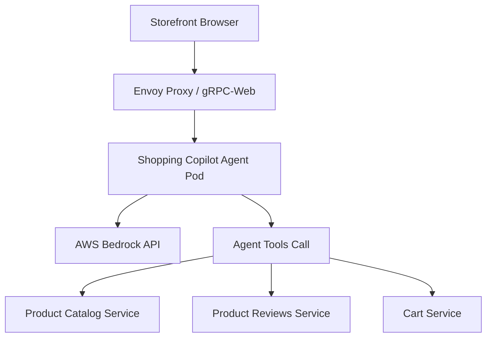

# Spec Thiết kế Shopping Copilot Agent

## 1. High-Level Architecture


## 2. Interface Definition (gRPC Contract)
Chi tiết định nghĩa gRPC tại `proto/shopping_copilot.proto`:
```protobuf
syntax = "proto3";

package shopping_copilot;

service ShoppingCopilot {
  rpc Chat(ChatRequest) returns (ChatResponse);
}

message ChatRequest {
  string session_id = 1;
  string message = 2;
}

message ChatResponse {
  string reply = 3;
  repeated string actions_taken = 4;
}
```

## 3. Prompts & Tools Configuration
- **Model ID:** `amazon.nova-pro-v1:0`
- **System Prompt:** [Role: Trợ lý mua sắm thông minh của TechX Corp. Chỉ dùng tools để tra cứu...]
- **Tools List:**
  1. `search_products(query)`: Tra cứu sản phẩm trong Catalog.
  2. `get_product_reviews(product_id)`: Xem nhận xét của khách hàng.
  3. `add_to_cart(product_id, quantity)`: Thêm sản phẩm vào giỏ hàng (Yêu cầu xác nhận).

## 4. Safety Confirmation Gate (Cổng bảo mật giỏ hàng)
- Mọi hành động thêm sản phẩm vào giỏ hàng (`add_to_cart`) bắt buộc phải trả về câu hỏi xác nhận cho Client: *"Bạn có đồng ý thêm sản phẩm X vào giỏ hàng không?"*
- Chỉ khi Client gửi tin nhắn xác nhận Đồng ý, Agent mới gọi API Cart thực hiện hành động thêm giỏ hàng.

## 5. Tầng Bảo mật & Giám sát (Input/Output Guardrails)

Để đáp ứng đầy đủ yêu cầu an toàn của **AI_FEATURE.md §2.A** và chống lại các rủi ro từ **OWASP LLM09:2025 (Excessive Agency)**, trợ lý Shopping Copilot tích hợp cấu trúc bảo mật 3 lớp:

1. **Input Guardrail (Chặn Prompt Injection & Jailbreak):**
   - Áp dụng bộ lọc Regex để loại bỏ các từ khóa độc hại, chỉ thị ghi đè prompt hệ thống (system overrides).
   - Sử dụng mô hình classifier nhẹ (Nova Micro) để đánh giá độ tin cậy của câu hỏi người dùng trước khi đưa vào context của mô hình chính Amazon Nova Pro.

2. **Output Guardrail (Lọc PII & System Prompt Leak):**
   - **PII Redaction:** Tự động lọc và che giấu các thông tin nhạy cảm của khách hàng như Email, Số điện thoại, Số thẻ tín dụng trước khi hiển thị câu trả lời ra Storefront.
   - **Prompt Leak Detector:** Tự động chặn và thay thế câu trả lời bằng fallback message nếu phát hiện mô hình cố gắng tiết lộ System Prompt gốc.

3. **Kiểm soát Phạm vi Hoạt động (Excessive Agency Guardrail):**
   - **Allow-list Tools:** Trợ lý chỉ được phép gọi các rpc đọc và rpc ghi có sự đồng ý (`add_to_cart`).
   - **Block-list Tools:** Chặn cứng ở mức hạ tầng (không cung cấp định nghĩa tool cho LLM) đối với các hành động hủy diệt hoặc thanh toán tự động: `empty_cart`, `place_order`, `ship_order`.
   - **Max Loop Limit:** Giới hạn tối đa **5 lượt gọi tool liên tiếp (5 iteration loop max)** trong một turn hội thoại để ngăn chặn lỗi lặp vô hạn (infinite tool-calling loop) gây quá tải chi phí token Bedrock.
   - **Audit trail:** Ghi log chi tiết (JSON) từng tool gọi kèm timestamp và tham số sang Collector để phục vụ audit.
