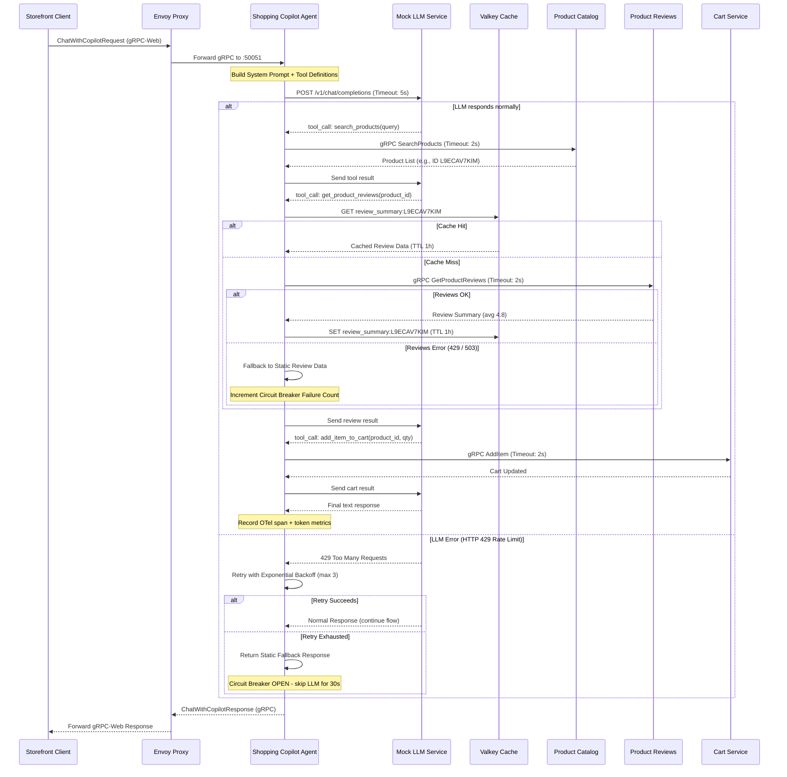

# Shopping Copilot Agent Specification

Dịch vụ **Shopping Copilot** là một AI Agent thông minh hỗ trợ người dùng mua sắm trực tiếp trên storefront của TechX Corp. Agent có khả năng gọi các công cụ (tool calling) để tra cứu danh mục sản phẩm, quản lý giỏ hàng, và lấy dữ liệu đánh giá sản phẩm nhằm đưa ra phản hồi chính xác và hữu ích nhất cho khách hàng.

---

## 1. Kiến Trúc Hệ Thống & Luồng Hoạt Động (Architecture & Workflows)

Dịch vụ chạy dưới dạng một gRPC server viết bằng Python trên cổng `:50051`. Envoy Proxy (`frontend-proxy`) chịu trách nhiệm định tuyến các request gRPC-Web từ client storefront vào dịch vụ này.

### Sơ đồ tuần tự (Sequence Diagram)



---

## 2. Đặc Tả gRPC API Contract (`shopping_copilot.proto`)

Định nghĩa protobuf được lưu trữ tại `techx-corp-platform/pb/shopping_copilot.proto`.

```protobuf
syntax = "proto3";

package oteldemo;

option go_package = "genproto/oteldemo";

// Dịch vụ Shopping Copilot Agent
service ShoppingCopilotService {
  // Thực hiện hội thoại với AI Agent
  rpc ChatWithCopilot(ChatWithCopilotRequest) returns (ChatWithCopilotResponse) {}
}

// Yêu cầu hội thoại
message ChatWithCopilotRequest {
  string user_id = 1;         // ID của người dùng đang đăng nhập (để quản lý giỏ hàng)
  string question = 2;        // Câu hỏi hoặc câu lệnh của khách hàng
  repeated string chat_history = 3; // Lịch sử hội thoại gần nhất (tùy chọn)
}

// Phản hồi từ Agent
message ChatWithCopilotResponse {
  string response = 1;        // Câu trả lời tổng hợp dạng text từ Agent
}
```

---

## 3. Đặc Tả Các Công Cụ Agent Hỗ Trợ (Tool Specifications)

Agent tích hợp mô hình OpenAI-compatible API hỗ trợ định nghĩa Function Calling. Các tool bao gồm:

### 3.1. Tra cứu sản phẩm (`search_products`)
* **Mục đích**: Tìm kiếm thông tin sản phẩm trong catalog dựa trên từ khóa.
* **Đầu vào (Arguments)**:
  ```json
  {
    "query": "string" // Từ khóa tìm kiếm sản phẩm
  }
  ```
* **Dịch vụ hạ nguồn**: Gọi gRPC `ProductCatalogService.SearchProducts`.

### 3.2. Lấy đánh giá sản phẩm (`get_product_reviews`)
* **Mục đích**: Lấy danh sách bình luận và điểm đánh giá của sản phẩm để tư vấn.
* **Đầu vào (Arguments)**:
  ```json
  {
    "product_id": "string" // ID sản phẩm cần lấy đánh giá
  }
  ```
* **Dịch vụ hạ nguồn**: Gọi gRPC `ProductReviewService.GetProductReviews`.

### 3.3. Thêm sản phẩm vào giỏ hàng (`add_item_to_cart`)
* **Mục đích**: Thêm sản phẩm được chọn trực tiếp vào giỏ hàng của khách hàng.
* **Đầu vào (Arguments)**:
  ```json
  {
    "product_id": "string",
    "quantity": "integer"
  }
  ```
* **Dịch vụ hạ nguồn**: Gọi gRPC `CartService.AddItem` (sử dụng kèm `user_id` từ request gốc).

### 3.4. Xem giỏ hàng hiện tại (`get_cart`)
* **Mục đích**: Lấy danh sách các sản phẩm đang có trong giỏ hàng.
* **Đầu vào (Arguments)**: Rỗng.
* **Dịch vụ hạ nguồn**: Gọi gRPC `CartService.GetCart`.

---

## 4. Yêu Cầu Phi Chức Năng (Non-Functional Requirements)

1. **Hiệu năng & Tài nguyên**:
   - CPU request `200m` / limit `1000m`.
   - Memory request `256Mi` / limit `1024Mi`.
2. **Khả năng phục hồi (Resilience)**:
   - Các lệnh gọi ra các microservice khác hoặc LLM mock phải được bọc trong cơ chế **Timeout** (tối đa 5 giây cho cuộc gọi LLM, 2 giây cho microservices) và **Retry với Exponential Backoff**.
   - Phục hồi khi LLM trả về lỗi 429 thông qua cơ chế Fallback (trả về câu trả lời định sẵn hoặc gợi ý tĩnh từ local).
3. **Giám sát (Telemetry)**:
   - Tích hợp OpenTelemetry SDK, tự động liên kết (correlate) trace context qua các span gọi đến LLM và các microservices khác.
   - Ghi nhận đầy đủ token tiêu thụ của LLM và tỷ lệ lỗi để phục vụ cảnh báo tự động.
