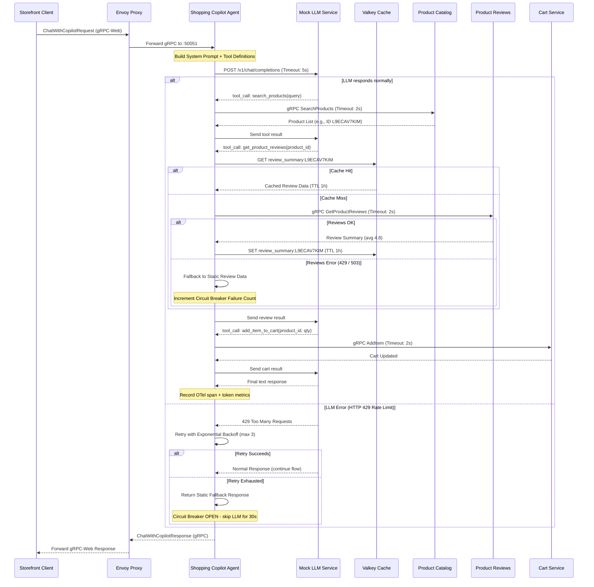

# Shopping Copilot Agent Specification

Dịch vụ **Shopping Copilot** là một AI Agent thông minh hỗ trợ người dùng mua sắm trực tiếp trên storefront của TechX Corp. Agent có khả năng gọi các công cụ (tool calling) để tra cứu danh mục sản phẩm, quản lý giỏ hàng, và lấy dữ liệu đánh giá sản phẩm nhằm đưa ra phản hồi chính xác và hữu ích nhất cho khách hàng.

---

## 1. Kiến Trúc Hệ Thống & Luồng Hoạt Động (Architecture & Workflows)

Dịch vụ chạy dưới dạng một gRPC server viết bằng Python trên cổng `:50051`. Envoy Proxy (`frontend-proxy`) chịu trách nhiệm định tuyến các request gRPC-Web từ client storefront vào dịch vụ này.

### Sơ đồ tuần tự (Sequence Diagram)



---

## 2. Đặc Tả gRPC API Contract (`shopping_copilot.proto`)

Định nghĩa protobuf được lưu trữ tại `techx-corp-platform/pb/shopping_copilot.proto`.

```protobuf
// Copyright The OpenTelemetry Authors
// SPDX-License-Identifier: Apache-2.0

syntax = "proto3";

package oteldemo;

option go_package = "genproto/oteldemo";

// Dịch vụ Shopping Copilot Agent
service ShoppingCopilotService {
  // Thực hiện hội thoại với AI Agent
  rpc ChatWithCopilot(ChatWithCopilotRequest) returns (ChatWithCopilotResponse) {}
}

// Yêu cầu hội thoại
message ChatWithCopilotRequest {
  string user_id = 1;         // ID của người dùng đang đăng nhập (để quản lý giỏ hàng)
  string question = 2;        // Câu hỏi hoặc câu lệnh của khách hàng

  // DEPRECATED: lịch sử do client gửi lên nghĩa là client kiểm soát context của
  // LLM -- đường thẳng tới prompt injection. Dùng session_id, server tự nạp lịch
  // sử. Giữ field number 3 để không tái sử dụng nhầm.
  repeated string chat_history = 3 [deprecated = true];

  // Server tra lịch sử hội thoại theo session_id. Client không gửi context.
  string session_id = 4;

  // Khi user bấm "Đồng ý" trên Confirmation Gate, client gửi lại token này
  // (lấy từ PendingConfirmation.confirmation_token của lượt trước) để agent
  // thực thi đúng hành động ghi đã được duyệt.
  string confirmation_token = 5;
}

// Hành động ghi (Tier 2 - ADR-006) đang chờ user xác nhận.
// Agent KHÔNG được tự thực thi; nó trả về đây và dừng lại.
message PendingConfirmation {
  string tool_name = 1;              // vd "add_to_cart"
  string arguments_json = 2;         // tham số đã chuẩn hoá, dạng JSON
  string human_prompt = 3;           // câu hỏi hiển thị cho user
  string confirmation_token = 4;     // idempotency key, chống double-submit
  int64  expires_at_unix = 5;        // epoch giây; hết hạn thì phải hỏi lại
}

// Một lời gọi tool đã thực thi -- phục vụ audit log (ADR-006).
message ToolCallRecord {
  string tool_name = 1;
  string arguments_json = 2;
  bool   succeeded = 3;
  int64  started_at_unix = 4;
  int64  duration_ms = 5;
}

// Phản hồi từ Agent
message ChatWithCopilotResponse {
  string response = 1;        // Câu trả lời tổng hợp dạng text từ Agent

  // Có giá trị <=> agent muốn thực thi một hành động ghi và đang chờ xác nhận.
  // Khi field này set, `response` chỉ là văn bản giải thích, KHÔNG có hành động
  // nào đã xảy ra.
  PendingConfirmation pending_confirmation = 2;

  // Mọi tool đã gọi trong lượt này. Frontend không cần dùng; tồn tại để truy vết.
  repeated ToolCallRecord actions_taken = 3;

  // Agent trả lời từ fallback (LLM lỗi/timeout) thay vì model chính.
  bool degraded = 4;
}
```

---

## 3. Đặc Tả Các Công Cụ Agent Hỗ Trợ (Tool Specifications)

Agent tích hợp mô hình OpenAI-compatible API hỗ trợ định nghĩa Function Calling. Các tool bao gồm:

### 3.1. Tra cứu sản phẩm (`search_products`)
* **Mục đích**: Tìm kiếm thông tin sản phẩm trong catalog dựa trên từ khóa.
* **Đầu vào (Arguments)**:
  ```json
  {
    "query": "string" // Từ khóa tìm kiếm sản phẩm
  }
  ```
* **Dịch vụ hạ nguồn**: Gọi gRPC `ProductCatalogService.SearchProducts`.

### 3.2. Lấy đánh giá sản phẩm (`get_product_reviews`)
* **Mục đích**: Lấy danh sách bình luận và điểm đánh giá của sản phẩm để tư vấn.
* **Đầu vào (Arguments)**:
  ```json
  {
    "product_id": "string" // ID sản phẩm cần lấy đánh giá
  }
  ```
* **Dịch vụ hạ nguồn**: Gọi gRPC `ProductReviewService.GetProductReviews`.

### 3.3. Thêm sản phẩm vào giỏ hàng (`add_item_to_cart`)
* **Mục đích**: Thêm sản phẩm được chọn trực tiếp vào giỏ hàng của khách hàng.
* **Đầu vào (Arguments)**:
  ```json
  {
    "product_id": "string",
    "quantity": "integer"
  }
  ```
* **Dịch vụ hạ nguồn**: Gọi gRPC `CartService.AddItem` (sử dụng kèm `user_id` từ request gốc).

### 3.4. Xem giỏ hàng hiện tại (`get_cart`)
* **Mục đích**: Lấy danh sách các sản phẩm đang có trong giỏ hàng.
* **Đầu vào (Arguments)**: Rỗng.
* **Dịch vụ hạ nguồn**: Gọi gRPC `CartService.GetCart`.

---

## 4. Safety Confirmation Gate (Cổng bảo mật giỏ hàng)
- Mọi hành động thêm sản phẩm vào giỏ hàng (`add_item_to_cart`) bắt buộc phải trả về câu hỏi xác nhận cho Client: *"Bạn có đồng ý thêm sản phẩm X vào giỏ hàng không?"*
- Chỉ khi Client gửi tin nhắn xác nhận Đồng ý, Agent mới gọi API Cart thực hiện hành động thêm giỏ hàng.

---

## 5. Tầng Bảo mật & Giám sát (Input/Output Guardrails)

Để đáp ứng đầy đủ yêu cầu an toàn của **AI_FEATURE.md §2 Phần B** và chống lại các rủi ro từ **OWASP LLM09:2025 (Excessive Agency)**, trợ lý Shopping Copilot tích hợp cấu trúc bảo mật 3 lớp:

1. **Input Guardrail (Chặn Prompt Injection & Jailbreak):**
   - Áp dụng bộ lọc Regex để loại bỏ các từ khóa độc hại, chỉ thị ghi đè prompt hệ thống (system overrides).
   - Sử dụng mô hình classifier nhẹ (Nova Micro) để đánh giá độ tin cậy của câu hỏi người dùng trước khi đưa vào context của mô hình chính Amazon Nova Pro.

2. **Output Guardrail (Lọc PII & System Prompt Leak):**
   - **PII Redaction:** Tự động lọc và che giấu các thông tin nhạy cảm của khách hàng như Email, Số điện thoại, Số thẻ tín dụng trước khi hiển thị câu trả lời ra Storefront.
   - **Prompt Leak Detector:** Tự động chặn và thay thế câu trả lời bằng fallback message nếu phát hiện mô hình cố gắng tiết lộ System Prompt gốc.

3. **Kiểm soát Phạm vi Hoạt động (Excessive Agency Guardrail):**
   - **Allow-list Tools:** Trợ lý chỉ được phép gọi các rpc đọc và rpc ghi có sự đồng ý (`add_item_to_cart`).
   - **Block-list Tools:** Chặn cứng ở mức hạ tầng (không cung cấp định nghĩa tool cho LLM) đối với các hành động hủy diệt hoặc thanh toán tự động: `empty_cart`, `place_order`, `ship_order`.
   - **Max Loop Limit:** Giới hạn tối đa **5 lượt gọi tool liên tiếp (5 iteration loop max)** trong một turn hội thoại để ngăn chặn lỗi lặp vô hạn (infinite tool-calling loop) gây quá tải chi phí token Bedrock.
   - **Audit trail:** Ghi log chi tiết (JSON) từng tool gọi kèm timestamp và tham số sang Collector để phục vụ audit.

---

## 6. Yêu Cầu Phi Chức Năng (Non-Functional Requirements)

1. **Hiệu năng & Tài nguyên**:
   - CPU request `200m` / limit `1000m`.
   - Memory request `256Mi` / limit `1024Mi`.
2. **Khả năng phục hồi (Resilience)**:
   - Các lệnh gọi ra các microservice khác hoặc LLM mock phải được bọc trong cơ chế **Timeout** (tối đa 5 giây cho cuộc gọi LLM, 2 giây cho microservices) và **Retry với Exponential Backoff**.
   - Phục hồi khi LLM trả về lỗi 429 thông qua cơ chế Fallback (trả về câu trả lời định sẵn hoặc gợi ý tĩnh từ local).
3. **Giám sát (Telemetry)**:
   - Tích hợp OpenTelemetry SDK, tự động liên kết (correlate) trace context qua các span gọi đến LLM và các microservices khác.
   - Ghi nhận đầy đủ token tiêu thụ của LLM và tỷ lệ lỗi để phục vụ cảnh báo tự động.
