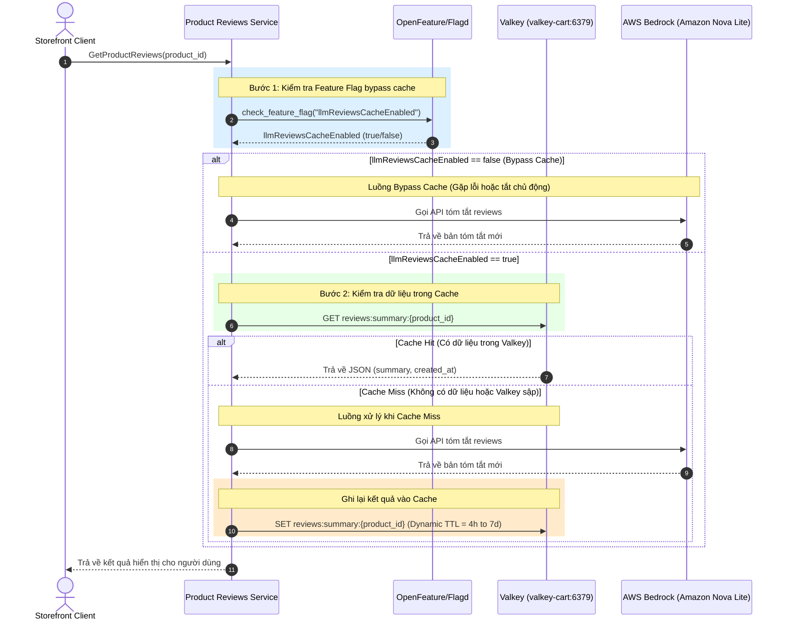

# Đặc tả thiết kế Valkey Caching - Review Summary

## 1. High-Level Architecture (Kiến trúc tổng quan)



## 2. Phân rã thành phần hệ thống (Component Breakdown)

| Thành phần | Vai trò & Trách nhiệm | Lựa chọn Công nghệ | Lý do lựa chọn & Tối ưu hóa |
|---|---|---|---|
| **Caching Store** | Lưu trữ tạm thời các bản tóm tắt review dưới định dạng JSON để tránh gọi LLM nhiều lần | **Valkey (Redis-compatible)** | - Tương thích giao thức Redis, tốc độ đọc/ghi in-memory cực nhanh (< 2ms).<br>- **Tối ưu hóa chi phí:** Tận dụng cụm `valkey-cart:6379` sẵn có chạy trong cluster EKS của nhóm CDO, không phát sinh chi phí duy trì cụm cache độc lập (tiết kiệm ít nhất ~$30/tuần chi phí hạ tầng AWS). |
| **Reviews Service** | Tiếp nhận yêu cầu, kiểm tra feature flag, thực hiện kiểm tra cache, gọi LLM khi cache miss và cập nhật cache | **Python (gRPC Service)** | Service `product-reviews` hiện tại viết bằng Python, dễ dàng tích hợp thư viện `redis-py` hoặc `valkey` client. |
| **Feature Flag Server** | Cung cấp cờ tắt/bật bypass cache động thời gian thực | **OpenFeature / Flagd** | Có sẵn trong kiến trúc hạ tầng, cho phép tắt cache ngay lập tức khi phát hiện lỗi dữ liệu mà không cần restart/redeploy service. |

## 3. Chính sách & Cấu trúc Cache (Cache Policy & Schema)

### 3.1 Cấu trúc Cache Key & Value
- **Cache Key Format:** `reviews:summary:{product_id}`
  - *Ví dụ:* `reviews:summary:L9ECAV7KIM`
- **Cache Value Format (JSON):**
  Dữ liệu được serialize dưới dạng chuỗi JSON để đảm bảo khả năng mở rộng thông tin sau này.
  ```json
  {
    "summary": "Bản tóm tắt review sản phẩm bằng tiếng Việt được tạo bởi AI...",
    "created_at": "2026-07-08T12:00:00Z"
  }
  ```

### 3.2 Cấu hình vòng đời và bộ nhớ (TTL & Eviction)
- **TTL (Time To Live):** **Động (Dynamic TTL)** tính toán tự động từ **4 giờ đến 7 ngày** dựa trên số lượng review ($N$) và độ biến động điểm số ($\sigma^2$) của sản phẩm. Xem chi tiết thuật toán tại Mục 5.
- **Eviction Policy (Chính sách giải phóng bộ nhớ) & Giải pháp Bảo vệ Giỏ hàng (Option 1):**
  - Cấu hình eviction policy của cụm Valkey là `volatile-lru`.
  - Để tránh việc giỏ hàng (có TTL mặc định 60m trong code) vẫn bị xóa nhầm khi RAM đầy, ta tiến hành **loại bỏ hoàn toàn TTL của giỏ hàng trong code C# (`ValkeyCartStore.cs`)**. Khi không có TTL, key giỏ hàng trở thành key vĩnh viễn (non-volatile) và được Valkey bảo vệ an toàn 100% khỏi cơ chế tự động eviction.
  - Thiết lập một **background CronJob** chạy lúc 2h sáng hàng ngày để chủ động quét dọn (`SCAN`) các giỏ hàng rác đã quá 30 ngày không có hoạt động, tránh làm rò rỉ và nghẽn bộ nhớ.


### 3.3 Cấu hình biến môi trường (Environment Variables)
Để đồng bộ hoàn toàn với **Hợp đồng tích hợp dịch vụ Product Reviews** với CDO, việc kết nối được cấu hình qua các biến môi trường sau:
- `VALKEY_HOST`: Tên Host/Service K8s của Valkey (Mặc định: `valkey-cart` nhằm tận dụng hạ tầng sẵn có).
- `VALKEY_PORT`: Cổng kết nối của Valkey (Mặc định: `6379`).


## 4. Kịch bản Xử lý Lỗi & Kế hoạch Dự phòng (Resilience & Rollback)

### 4.1 Cơ chế Tắt Cache Nhanh (Bypass Cache via Feature Flag)
- **Tên Flag OpenFeature:** `llmReviewsCacheEnabled`
- **Kiểu dữ liệu:** `Boolean` (Mặc định: `true`)
- **Cách thức hoạt động:**
  - Khi `llmReviewsCacheEnabled` là `true`: Luồng caching hoạt động bình thường.
  - Khi `llmReviewsCacheEnabled` là `false`: Luồng service bypass hoàn toàn Valkey, thực hiện truy vấn trực tiếp AWS Bedrock cho mọi request. Được sử dụng khi muốn kiểm thử trực tiếp model AI hoặc khi phát hiện lỗi định dạng dữ liệu trong cache.

### 4.2 Xử lý khi Valkey sập (Connection/Socket Timeout Resilience)
Để đảm bảo tính liên tục của tính năng reviews đối với khách hàng (SLO Error Rate < 0.5%), Reviews service không được phép lỗi (trả về 500) khi Valkey gặp sự cố.
- **Cơ chế Fallback khi Valkey sập:**
  - Thiết lập kết nối Valkey với `socket_timeout = 0.5s` và `socket_connect_timeout = 0.5s` để tránh nghẽn luồng (blocking).
  - Bọc tất cả các thao tác đọc (`GET`) và ghi (`SET`/`EXPIRE`) trong khối lệnh `try-except`.
  - Nếu bắt được bất kỳ lỗi kết nối nào từ phía Valkey (như `ConnectionError`, `TimeoutError`):
    1. Ghi nhận log lỗi mức độ `ERROR` kèm chi tiết trace context sang Collector/Jaeger.
    2. Tự động chuyển trạng thái xử lý sang **Cache Miss**, thực hiện gọi trực tiếp AWS Bedrock API để lấy summary.
    3. Không cố gắng thực hiện lệnh ghi (`SET`) vào Valkey ở bước sau để tránh lặp lại lỗi timeout.

---

## 5. Cơ chế Đặt TTL Động (Score-Based Dynamic TTL)

Để tối ưu hóa chi phí token (AWS Bedrock) và đảm bảo tính cập nhật của bản tóm tắt, hệ thống không sử dụng TTL 24 giờ cố định mà tính toán TTL động dựa trên thông số review của sản phẩm:

$$\text{TTL}_{\text{seconds}} = \max\left(14400, \frac{604800}{1 + 0.05 \cdot N + 0.5 \cdot \sigma^2}\right)$$

*   **Ý nghĩa các tham số:**
    *   $N$: Tổng số lượng reviews của sản phẩm.
    *   $\sigma^2$: Phương sai điểm số (Score Variance) của các reviews gần nhất.
    *   Giới hạn dưới: **4 giờ** (14,400 giây) để tránh việc gọi Bedrock quá liên tục đối với các sản phẩm cực kỳ hot.
    *   Giới hạn trên: **7 ngày** (604,800 giây) đối với sản phẩm ít reviews và điểm số ổn định, giúp giảm thiểu tối đa chi phí token trùng lặp.

---

## 6. Chiến Lược Hủy & Làm Mới Cache (Cache Invalidation & Refresh Strategy)

Hệ thống xử lý bài toán cập nhật review mới và xử lý tóm tắt chất lượng kém qua cơ chế **Active Invalidation** (Hủy cache chủ động).

> ### ⚠️ Điều kiện tiên quyết: cả §6.1 và §6.2 đều cần rpc CHƯA TỒN TẠI
>
> `pb/demo.proto` hiện định nghĩa `ProductReviewService` chỉ với 3 rpc:
> `GetProductReviews`, `GetAverageProductReviewScore`, `AskProductAIAssistant`.
>
> **Không có đường ghi review, cũng không có đường nhận feedback.** Review được seed sẵn qua `src/postgresql/init.sql`. Muốn triển khai §6.1 và §6.2 phải bổ sung trước:
> - `rpc AddReview(AddReviewRequest) returns (Empty)` — trigger cho Write-Around Invalidation.
> - `rpc SubmitSummaryFeedback(SummaryFeedbackRequest) returns (Empty)` — trigger cho Feedback Loop.
>
> Việc này được theo dõi ở task **TF1-55**. **Cho tới khi rpc tồn tại, làm mới cache dựa hoàn toàn vào Dynamic TTL (§5)** — đó là trạng thái đang có hiệu lực, không phải hai mục dưới đây.

### 6.1 Xử lý khi có Review mới (Write-Around Invalidation) — *chờ rpc `AddReview`*
- Khi người dùng gửi một review mới thành công thông qua `ProductReviewService.AddReview`:
  - Ứng dụng lập tức thực thi lệnh xóa cache: `DEL reviews:summary:{product_id}`.
  - Lượt xem sản phẩm của khách hàng tiếp theo sẽ gặp **Cache Miss**, kích hoạt gọi Bedrock để sinh lại bản tóm tắt mới nhất (chứa cả review vừa viết).

### 6.2 Xử lý khi Tóm tắt cũ kém chất lượng (User Feedback Loop) — *chờ rpc `SubmitSummaryFeedback`*
- Trên giao diện Storefront, tích hợp nút đánh giá Thích (Thumbs Up) / Ghét (Thumbs Down) cạnh phần tóm tắt review.
- Khi người dùng bấm **Thumbs Down (Ghét)**:
  - Tăng biến đếm lỗi trong Valkey: `HINCRBY reviews:summary:{product_id}:meta thumbs_down 1`.
  - Nếu số lượt ghét vượt quá ngưỡng quy định (ví dụ $\ge 3$ lượt):
    1. Xóa bản tóm tắt hiện tại ngay lập tức.
    2. Đặt cờ chỉ định mô hình chất lượng cao: `HSET reviews:summary:{product_id}:meta model_override "nova-pro"`.
    3. Lần sinh tóm tắt tiếp theo sẽ bắt buộc định tuyến qua **Amazon Nova Pro** thay vì model rẻ Nova Lite để đảm bảo chất lượng tóm tắt tốt nhất cho sản phẩm bị đánh giá kém.

