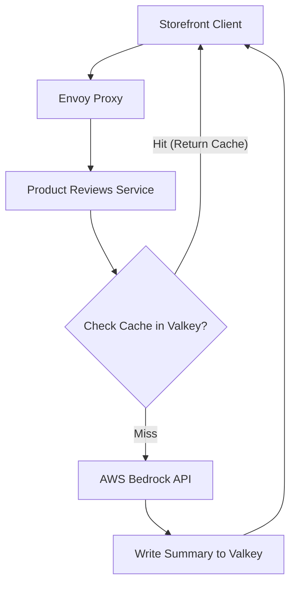

# Spec Thiết kế Valkey Caching - Review Summary

## 1. High-Level Architecture


## 2. Component breakdown
| Component | Responsibility | Tech choice | Why |
|---|---|---|---|
| Caching Store | Lưu trữ tạm thời bản tóm tắt review | Valkey (Redis-compatible) | Tốc độ in-memory cực nhanh, CDO có sẵn Helm chart, tương thích Redis protocol |
| AI Summarizer | Gọi LLM sinh tóm tắt khi cache miss | Product Reviews (Python) | Code base Python có sẵn, gọi SDK Bedrock |

## 3. Cache Policy & Schema
- **Cache Key Format:** `reviews:summary:{product_id}`
- **Cache Value Format (JSON):**
  ```json
  {
    "summary": "Bản tóm tắt bằng tiếng Việt...",
    "created_at": "2026-07-07T12:00:00Z"
  }
  ```
- **TTL (Time to Live):** 24 giờ (86400 giây).
- **Eviction Policy:** `allkeys-lru` (loại bỏ key ít dùng nhất khi bộ nhớ đầy).

## 4. Rollback & Fallback Plan
- **Tắt Cache nhanh:** Cấu hình qua Flagd feature flag `llmReviewsCacheEnabled` (chuyển sang `false` để bypass cache gọi thẳng Bedrock).
- **Valkey sập:** Nếu kết nối Valkey lỗi, service bắt buộc ghi nhận lỗi log, tự động bypass cache sang Bedrock để tránh nghẽn luồng reviews của user.
