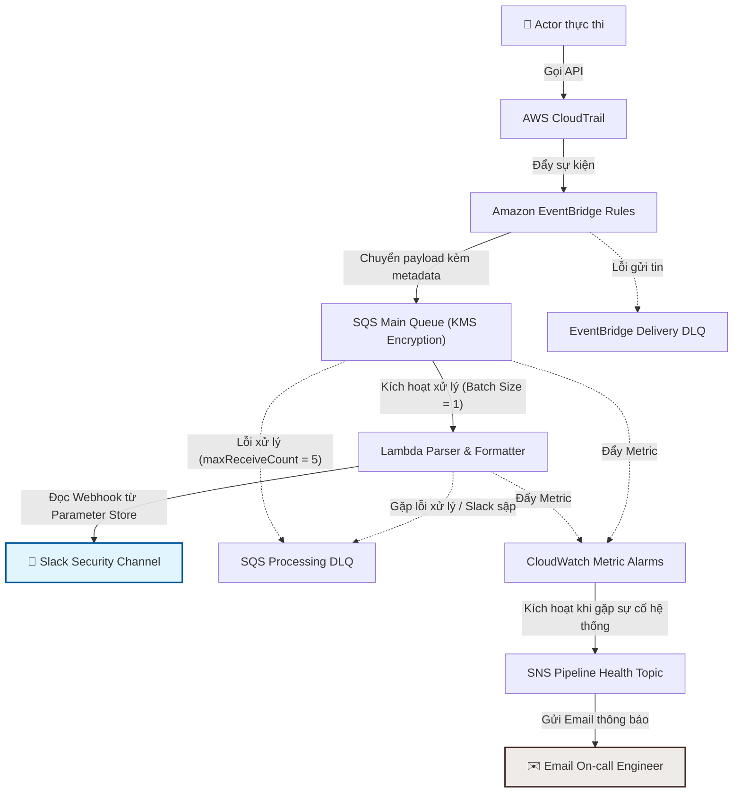

# MANDATE-11 — Báo cáo kỹ thuật: Giám sát & Phát hiện chủ động (Audit Detection · TF4)

> **Nhóm thực hiện:** Nguyễn Anh Hoàng, Nguyễn Khánh Duy, Châu Thành Trung (Task Force 4 — CDO Auditability · CDO-05)  
> **Chỉ thị tham chiếu:** `capstone-phase-3/mandates/MANDATE-11-audit-detection-tf4.md`  
> **Nhánh phát triển:** `feat/mandate11`  
> **Ngày lập báo cáo:** 2026-07-19  
> **Thời hạn hoàn thành:** Trước ngày 20/07/2026  
> **Đường dẫn mã nguồn:** `capstone-phase-3/terraform/audit-detection/`

---

## 0. Tóm tắt điều hành (Executive Summary)

Chỉ thị số 4 đã chứng minh khả năng truy vết và tái dựng sự kiện sau khi xảy ra sự cố. Mandate 11 chuyển đổi hệ thống nhật ký giám sát (audit trail) từ trạng thái lưu trữ thụ động sang **cơ chế cảnh báo chủ động và đo lường được**. Mục tiêu tối thượng là đảm bảo khi một hành động AWS nguy hiểm xảy ra, hệ thống sẽ **gửi thông báo cảnh báo tức thời tới nhân sự vận hành trong thời gian ngắn nhất**, cung cấp đầy đủ ngữ cảnh để bắt đầu điều tra ngay lập tức.

*   **Phạm vi giám sát:** Thiết lập 18 EventBridge rules, bao trùm **16 nhóm hành vi có độ rủi ro cao** (như vô hiệu hóa cơ chế ghi nhật ký, cấu hình sai CloudWatch/S3/KMS bảo vệ logs, tạo cơ chế duy trì truy cập dài hạn, leo thang đặc quyền IAM, gỡ bỏ hàng rào bảo mật, thay đổi quyền truy cập cụm EKS, sửa đổi Secrets Manager trái phép, mở rộng cổng mạng riêng tư và các hành vi phá hủy tài nguyên trọng yếu) cùng với giám sát tài khoản Root và cơ chế AssumeRole Break-glass. *(Chi tiết tại Mục 2)*.
*   **Cơ chế định tuyến cảnh báo:** Luồng dữ liệu hoạt động theo mô hình: CloudTrail $\rightarrow$ EventBridge Rules $\rightarrow$ SQS Queue (Mã hóa KMS để đảm bảo tính bền vững) $\rightarrow$ Lambda Function $\rightarrow$ Cảnh báo gửi tới kênh Slack Security chuyên dụng. Cấu hình SNS Email độc lập cho sức khỏe hệ thống (Pipeline Health Alarm) đóng vai trò giám sát hoạt động của chính hệ thống cảnh báo. *(Chi tiết tại Mục 3)*.
*   **Chỉ số thời gian phát hiện (TTD):** Cam kết thời gian phát hiện end-to-end từ lúc sự kiện phát sinh đến khi Slack nhận cảnh báo là **P95 $\le$ 5 phút** (mục tiêu tối ưu hóa đạt $\le$ 2 phút). Chỉ số này được đo lường tự động thông qua thuộc tính `Processing TTD` đính kèm trực tiếp trong tin nhắn Slack và chỉ số `ApproximateAgeOfOldestMessage` của CloudWatch. *(Chi tiết tại Mục 4)*.
*   **Độ tin cậy và giảm thiểu báo động giả:** Sử dụng cơ chế so khớp API cụ thể để lọc bỏ nhiễu, tuyệt đối không tự động bỏ qua (suppress) các sự kiện đã khớp. Các hoạt động tự động hợp lệ từ CI/CD được gắn nhãn ngữ cảnh thay vì loại bỏ cảnh báo. Tích hợp cơ chế khử trùng lặp qua bảng DynamoDB dựa trên `eventID` của CloudTrail. *(Chi tiết tại Mục 5)*.
*   **Chi phí vận hành:** Ước tính dao động **$6–10 / tháng** (khoảng **$1.4–2.4 / tuần**), thấp hơn nhiều so với giới hạn ngân sách $300/tuần/TF. *(Chi tiết tại Mục 6)*.
*   **Ràng buộc hệ thống:** Đảm bảo không ảnh hưởng tới hoạt động của storefront, các workload EKS, AIOps, flagd và không sửa đổi module CloudTrail có sẵn. Mọi tài nguyên mới được gắn nhãn sở hữu `Owner = CDO-05`. *(Chi tiết tại Mục 7)*.

---

## 1. Ánh xạ các yêu cầu của Chỉ thị

| STT | Yêu cầu trong Chỉ thị | Vị trí đáp ứng | Minh chứng cấu trúc / Mã nguồn (Lưu ý vị trí tại `capstone-phase-3/terraform/audit-detection/`) |
|:---:|---|:---:|---|
| 1 | Danh mục hành động nguy hiểm & Biện minh | Mục 2 | File cấu hình các rules: `modules/detection-routing/locals.tf` |
| 2 | Cảnh báo chạy thật, có định tuyến, đủ dữ liệu ngữ cảnh | Mục 3 | Xử lý logic: `lambda/handler.py`<br>Định tuyến & SNS: `modules/detection-routing/eventbridge.tf`, `modules/detection-routing/sns.tf` |
| 3 | Đo lường chỉ số thời gian phát hiện (TTD) | Mục 4 | Đo lường: Hàm `calculate_ttd()` trong `lambda/handler.py`<br>Giám sát: Alarm `queue-age` trong `modules/monitoring/main.tf` |
| 4 | Đảm bảo tính tin cậy, tối ưu hóa độ nhiễu | Mục 5 | Thiết kế event pattern: `modules/detection-routing/locals.tf`<br>Xử lý trùng lặp: `lambda/handler.py`, Table DynamoDB: `modules/processor/lambda.tf` |

---

## 2. Danh mục hành động nguy hiểm — Chi tiết và Biện minh

Mỗi nhóm quy tắc tương ứng với một EventBridge Rule được cấu hình so khớp chính xác cặp `eventSource` và `eventName` của dịch vụ AWS tương ứng. Cấu hình được quản lý tập trung tại tệp `modules/detection-routing/locals.tf`.

### 2.1 Vô hiệu hóa hệ thống giám sát (Giai đoạn a)

| Tên Rule (`ruleKey`) | Event Source | Event Name | Biện minh bảo mật |
|---|---|---|---|
| `cloudtrail_tampering` | `cloudtrail.amazonaws.com` | `StopLogging`, `DeleteTrail`, `UpdateTrail`, `PutEventSelectors`, `PutInsightSelectors` | **Vô hiệu hóa nhật ký là bước mở đầu của mọi cuộc tấn công.** Nếu CloudTrail bị dừng, toàn bộ hành vi xâm hại phía sau sẽ trở nên vô hình. Đây là tín hiệu nguy hiểm cao nhất. |
| `cloudwatch_log_tampering` | `logs.amazonaws.com` | `DeleteLogGroup`, `DeleteLogStream`, `PutRetentionPolicy`, `DeleteRetentionPolicy`, `AssociateKmsKey`, `DisassociateKmsKey` | Hành vi xóa log group, rút ngắn thời gian giữ log, hoặc gỡ bỏ KMS key mã hóa nhằm mục đích **xóa dấu vết bằng chứng** lưu trữ trên CloudWatch Logs. |
| `s3_audit_tampering` | `s3.amazonaws.com` | `DeleteBucket`, `DeleteBucketPolicy`, `PutBucketPolicy`, `PutBucketVersioning`, `DeleteBucketEncryption`, `PutBucketEncryption`, `DeleteBucketLifecycle`, `PutBucketLifecycleConfiguration`, `PutObjectLockConfiguration` | Bucket S3 là nơi lưu trữ bằng chứng kiểm toán cuối cùng. Sửa đổi cấu hình bất biến (Object Lock, Versioning, Lifecycle) là tiền đề để kẻ tấn công thực hiện xóa các tệp tin log cũ. |
| `kms_audit_tampering` | `kms.amazonaws.com` | `DisableKey`, `ScheduleKeyDeletion`, `PutKeyPolicy`, `DisableKeyRotation`, `RevokeGrant` | Vô hiệu hóa hoặc lên lịch xóa KMS Key dùng để mã hóa nhật ký kiểm toán sẽ làm cho **dữ liệu log không thể đọc được** hoặc ngăn chặn dịch vụ CloudTrail ghi log mới. |

### 2.2 Thiết lập cơ chế duy trì truy cập và Leo thang đặc quyền IAM (Giai đoạn b, c)

| Tên Rule (`ruleKey`) | Event Source | Event Name | Biện minh bảo mật |
|---|---|---|---|
| `iam_credential_persistence` | `iam.amazonaws.com` | `CreateAccessKey`, `UpdateAccessKey`, `CreateLoginProfile`, `UpdateLoginProfile`, `CreateUser`, `CreateRole`, `UpdateAssumeRolePolicy` | **Tạo cửa sau (backdoor):** Tạo access key dài hạn, kích hoạt truy cập console cho user, hoặc sửa đổi chính sách tin cậy (trust policy) của Role nhằm giúp kẻ tấn công duy trì truy cập ngay cả khi phiên làm việc hiện tại bị ngắt. |
| `iam_privilege_escalation` | `iam.amazonaws.com` | `AttachRolePolicy`, `AttachUserPolicy`, `AttachGroupPolicy`, `PutRolePolicy`, `PutUserPolicy`, `PutGroupPolicy`, `CreatePolicy`, `CreatePolicyVersion`, `SetDefaultPolicyVersion`, `AddUserToGroup` | **Leo thang đặc quyền từ user thường lên Administrator.** Hành vi tạo hoặc kích hoạt các phiên bản chính sách mới (`CreatePolicyVersion`/`SetDefaultPolicyVersion`) là một kỹ thuật thay đổi quyền hạn rất tinh vi cần được giám sát chặt chẽ. |
| `iam_guardrail_removal` | `iam.amazonaws.com` | `DetachRolePolicy`, `DetachUserPolicy`, `DetachGroupPolicy`, `DeleteRolePolicy`, `DeleteUserPolicy`, `DeleteGroupPolicy`, `DeletePolicy`, `DeletePolicyVersion`, `DeleteRolePermissionsBoundary`, `DeleteUserPermissionsBoundary`, `PutRolePermissionsBoundary`, `PutUserPermissionsBoundary` | **Hạ gông bảo vệ:** Gỡ bỏ các chính sách ngăn chặn chỉnh sửa nhật ký kiểm toán hoặc gỡ bỏ ranh giới phân quyền (Permissions Boundary) để thực thi các quyền hạn bị cấm trước đó. |

### 2.3 Thay đổi cấu hình cụm và Phơi bày hạ tầng mạng (Giai đoạn c, d)

| Tên Rule (`ruleKey`) | Event Source | Event Name | Biện minh bảo mật |
|---|---|---|---|
| `eks_access_changes` | `eks.amazonaws.com` | `CreateAccessEntry`, `UpdateAccessEntry`, `DeleteAccessEntry`, `AssociateAccessPolicy`, `DisassociateAccessPolicy`, `UpdateClusterConfig` | **Cấp quyền trái phép vào EKS Cluster** đang vận hành ứng dụng storefront. Cấu hình sai `UpdateClusterConfig` có thể phơi bày API Endpoint của EKS ra internet công cộng. |
| `secrets_manager_changes` | `secretsmanager.amazonaws.com` | `DeleteSecret`, `PutResourcePolicy`, `DeleteResourcePolicy`, `CancelRotateSecret`, `UpdateSecret`, `PutSecretValue`, `UpdateSecretVersionStage` | Xóa hoặc sửa đổi chính sách bảo mật của các Secret (chứa credential của DB, MSK, Valkey), trực tiếp đe dọa đến tính toàn vẹn của dữ liệu ứng dụng. |
| `network_exposure` | `ec2.amazonaws.com` | `AuthorizeSecurityGroupIngress`, `ModifySecurityGroupRules`, `CreateNetworkAclEntry`, `ReplaceNetworkAclEntry`, `DeleteVpcEndpoints` | **Mở rộng phạm vi mạng ra internet** (mở port SSH, DB, EKS API cho `0.0.0.0/0` hoặc `::/0`) hoặc xóa VPC Endpoint bảo vệ đường truyền dịch vụ AWS nội bộ. |

### 2.4 Phá hủy tài nguyên trọng yếu (Crown Jewels) (Giai đoạn d)

| Tên Rule (`ruleKey`) | Event Source | Event Name | Biện minh bảo mật |
|---|---|---|---|
| `destructive_eks` | `eks.amazonaws.com` | `DeleteCluster` | Xóa cụm Kubernetes vận hành hệ thống. |
| `destructive_rds` | `rds.amazonaws.com` | `DeleteDBInstance`, `DeleteDBCluster` | Xóa cơ sở dữ liệu quan trọng, gây gián đoạn dịch vụ vĩnh viễn. |
| `destructive_elasticache` | `elasticache.amazonaws.com` | `DeleteReplicationGroup` | Xóa bộ nhớ đệm dùng chung của ứng dụng. |
| `destructive_msk` | `kafka.amazonaws.com` | `DeleteCluster` | Xóa cụm nhắn tin trung gian MSK. |
| `destructive_elb` | `elasticloadbalancing.amazonaws.com`| `DeleteLoadBalancer` | Xóa bộ cân bằng tải phân phối traffic cho người dùng. |
| `destructive_vpc` | `ec2.amazonaws.com` | `DeleteVpc` | Xóa cấu hình mạng ảo riêng tư của toàn bộ hệ thống. |

> [!IMPORTANT]
> **Loại trừ hành động TerminateInstances:**  
> Hệ thống cố ý không đưa hành động `TerminateInstances` diện rộng vào danh mục này vì các thành phần tự động hóa như Karpenter và Auto Scaling Group thường xuyên khởi chạy/hủy Instance phục vụ cơ chế scaling tự động. Giám sát sự kiện này sẽ tạo ra lượng lớn báo động giả (noise).

### 2.5 Giám sát dựa trên Danh tính đặc quyền (Root & Break-Glass)

| Tên Rule (`ruleKey`) | Điều kiện lọc sự kiện | Biện minh bảo mật |
|---|---|---|
| `root_activity` | `detail.userIdentity.type = "Root"` | Tài khoản Root tuyệt đối không được sử dụng trong các hoạt động vận hành hằng ngày. Bất kỳ hoạt động nào của Root đều phải được cảnh báo ngay lập tức, bất kể thành công hay thất bại. |
| `break_glass_assume_role` | `sts:AssumeRole` với target ARN thuộc danh sách Role quản trị khẩn cấp | Việc sử dụng các tài khoản khẩn cấp là hoạt động bất thường, cần gửi cảnh báo để thực hiện đối chiếu chéo (reconciliation) với mã số sự cố hoặc phiếu yêu cầu thay đổi đã được phê duyệt. |

---

## 3. Định tuyến và Cấu trúc Nội dung Cảnh báo

### 3.1 Luồng truyền dữ liệu kiến trúc

Hệ thống được thiết kế với cơ chế hàng đợi trung gian và tách biệt hoàn toàn kênh cảnh báo bảo mật với kênh giám sát sức khỏe để đảm bảo tính sẵn sàng cao và khả năng chống mất mát dữ liệu log.



### 3.2 Cơ chế phân tách cảnh báo kép (Dual-Channel Alerting)

Hệ thống phân tách rõ ràng trách nhiệm của hai kênh truyền thông tin để đảm bảo không bỏ sót lỗi và giảm thiểu nhiễu thông tin cho đội ngũ trực vận hành:

| Loại cảnh báo | Kênh truyền tải | Dữ liệu truyền tải | Rationale (Lý do thiết kế) |
|---|---|---|---|
| **Cảnh báo Bảo mật (Audit Alert)** | **Slack Channel** | Chi tiết ngữ cảnh sự kiện nguy hiểm: **Ai, làm gì, khi nào, từ đâu, kết quả và tài nguyên bị ảnh hưởng**. | Kênh chính để chuyên viên bảo mật theo dõi và tiến hành điều tra sự kiện bảo mật tức thì. |
| **Cảnh báo Sức khỏe hệ thống (Pipeline Health)** | **SNS Email** | Trạng thái Alarms của CloudWatch (Lambda bị lỗi, DLQ có tin nhắn kẹt, SQS bị nghẽn...). | **Cơ chế Dead-man's-switch:** Email chỉ gửi đi khi chính hệ thống cảnh báo bị lỗi. Điều này giúp cô lập sự cố: khi Slack bị sập, dữ liệu audit vẫn được lưu giữ an toàn trong SQS và chuyên viên vận hành sẽ nhận email báo động về sự cố nghẽn mạng để can thiệp kịp thời. |

### 3.3 Vai trò của hàng đợi SQS trong định tuyến dữ liệu
Việc chèn hàng đợi SQS ở giữa EventBridge và Lambda mang lại các lợi ích kỹ thuật quan trọng:
*   **Chống mất mát log (Durability):** Khi hệ thống Slack gặp sự cố hoặc Lambda bị quá tải (throttled), tin nhắn vẫn nằm an toàn trong hàng đợi SQS tối đa 14 ngày.
*   **Cô lập tin nhắn độc (DLQ Isolation):** Các sự kiện lỗi hoặc cấu trúc sai lệch (poison messages) sau khi thử lại 5 lần sẽ được đưa vào hàng đợi lỗi (Processing DLQ) để phân tích, tránh làm nghẽn các tin nhắn phía sau.
*   **Hỗ trợ đo lường:** Cung cấp thông số `ApproximateAgeOfOldestMessage` để giám sát thời gian trễ của dữ liệu trong hàng đợi.

### 3.4 Cấu trúc nội dung cảnh báo trên Slack (Alert Contract)

Mỗi tin nhắn cảnh báo bảo mật được định dạng bằng cấu trúc Slack Block Kit rõ ràng tại hàm `format_slack_message()` của tệp tin `lambda/handler.py`, đáp ứng đầy đủ các tiêu chuẩn kiểm toán:

| Trường thông tin | Nguồn dữ liệu từ CloudTrail | Mục đích sử dụng |
|---|---|---|
| **Nhóm phát hiện** | Nhãn `detectionCategory` và `ruleKey` từ EventBridge target | Phân loại nhanh loại hình tấn công (ví dụ: `cloudtrail_tampering`). |
| **Ai (Caller Context)** | Phân tích từ đối tượng `userIdentity` của sự kiện | Trích xuất chính xác IAM User ARN, AssumedRole ARN, Root, hoặc AWSService kèm theo thông tin Session Issuer. |
| **Làm gì** | `detail.eventSource` và `detail.eventName` | Xác định hành vi cụ thể đang diễn ra. |
| **Khi nào** | `detail.eventTime` | Mốc thời gian xảy ra sự kiện theo múi giờ UTC. |
| **Từ đâu** | `detail.sourceIPAddress`, `detail.awsRegion`, `detail.userAgent` | Vị trí mạng, vùng tài nguyên bị tác động và công cụ thực thi. |
| **Kết quả** | `detail.errorCode`, `detail.errorMessage` | Ghi nhận thao tác thành công hay bị từ chối (`AccessDenied`). |
| **Tài nguyên** | Đối tượng `requestParameters` sau khi được lọc sạch (redacted) | Tên hoặc thuộc tính của các tài nguyên chịu ảnh hưởng trực tiếp. |
| **Tương quan** | `detail.eventID` và `detail.requestID` | Cung cấp mã khóa định danh để truy vết chéo giữa các hệ thống giám sát. |
| **Chỉ số TTD** | Đo lường thời gian thực tại Lambda | Hiển thị chính xác thời gian phát hiện từ lúc sự kiện xảy ra đến khi gửi tin. |
| **Hướng xử lý** | Link Runbook bảo mật | Đường dẫn trực tiếp đến tài liệu xử lý sự cố chuẩn cho loại hành vi đó. |

---

## 4. Đo lường Thời gian Phát hiện (Time-to-Detect — TTD)

### 4.1 Định nghĩa các tham số đo lường
Hệ thống sử dụng ba mốc đo lường thời gian chính xác để đánh giá hiệu năng:
*   $\text{Processing TTD} = \text{Thời điểm Lambda thực thi} - \text{Mốc eventTime gốc của CloudTrail}$ (được đo tự động trong mã nguồn).
*   $\text{Queue Age} = \text{Thời điểm Lambda thực thi} - \text{Mốc SentTimestamp của SQS}$ (thời gian tin nhắn nằm chờ xử lý).
*   $\text{Slack TTD} = \text{Thời điểm Slack nhận cảnh báo} - \text{Mốc eventTime gốc của CloudTrail}$ (thời gian phát hiện đầu-cuối thực tế).

### 4.2 Cam kết mức độ dịch vụ (SLA)
*   **Thời gian phát hiện Slack (Slack TTD):** **P95 $\le$ 5 phút (300 giây)**. Mục tiêu tối ưu hóa vận hành đạt $\le$ 2 phút.
*   **Lý do thiết lập SLA 5 phút:** Mặc dù luồng xử lý nội bộ (SQS $\rightarrow$ Lambda $\rightarrow$ Slack) hoạt động gần như thời gian thực ($\le$ 3 giây), thời gian dịch vụ CloudTrail của AWS gom log và đẩy sang EventBridge có độ trễ dao động tự nhiên từ **1 đến 4 phút** (đây là giới hạn hạ tầng của AWS). SLA 5 phút đảm bảo tính khả thi thực tế và tránh báo động giả về hiệu năng.
*   **Thời gian cảnh báo sức khỏe (Pipeline Health TTD):** $\le$ 2 phút kể từ khi phát hiện lỗi hệ thống (nhờ tần suất quét định kỳ 60 giây của CloudWatch Alarm).

### 4.3 Phương pháp kiểm định chỉ số
Chuyên viên vận hành hoặc mentor có thể kiểm định chỉ số này bằng 3 phương pháp:
1.  **Xem trực tiếp trên tin nhắn:** Đọc dòng `TTD:` ở cuối mỗi cảnh báo Slack để thấy số liệu thời gian thực.
2.  **Giám sát qua CloudWatch:** Theo dõi biểu đồ metric `ApproximateAgeOfOldestMessage` của SQS.
3.  **Chạy thử nghiệm kiểm chứng:** Thực hiện 5 lần thử nghiệm ngẫu nhiên để ghi nhận các mốc thời gian và tổng hợp thành bảng thống kê (sử dụng mẫu bảng tại Mục 8.4).

---

## 5. Đảm bảo Tính Tin cậy và Giảm thiểu Báo động giả (Noise Reduction)

Để hệ thống cảnh báo hoạt động hiệu quả và tránh tình trạng người vận hành bỏ qua cảnh báo do tần suất spam quá cao (alert fatigue), chúng tôi áp dụng các nguyên tắc thiết kế sau:

### 5.1 Thu hẹp phạm vi lọc (Narrow Rule Scoping)
Hệ thống không lắng nghe toàn bộ các sự kiện ghi nhật ký (Write events) mà chỉ lọc chính xác các API nguy hiểm được chỉ định rõ ràng trong cấu hình `event_pattern`. Các quy tắc giám sát S3, KMS, CloudWatch Logs được giới hạn trên các ARN tài nguyên quan trọng được chỉ định thay vì áp dụng cho toàn bộ tài khoản AWS.

### 5.2 Gắn nhãn ngữ cảnh thay vì loại bỏ cảnh báo (Context Labeling over Suppression)
Hệ thống tuân thủ nguyên tắc: **Không bao giờ âm thầm bỏ qua sự kiện đã khớp danh mục**.
Khi phát hiện hành vi từ các tài khoản CI/CD hợp lệ (ví dụ như `GitHubTerraformSandboxRole`), hệ thống không hủy tin nhắn mà gắn nhãn ngữ cảnh hiển thị là `Automation (GitHub Actions)`. Điều này giúp người vận hành biết ngay đây là hành động tự động hóa của đội nhà mà vẫn đảm bảo tính minh bạch cho công tác kiểm toán.

### 5.3 Cơ chế khử trùng lặp tin nhắn (Idempotency Engine)
Lambda sử dụng bảng DynamoDB Lock (`idempotency_table`) để lưu trạng thái xử lý của từng CloudTrail `eventID`. 
*   Khi nhận tin nhắn, Lambda gọi `acquire_event_lock()` để đánh dấu `IN_PROGRESS`.
*   Sau khi gửi Slack thành công, trạng thái chuyển sang `COMPLETED` kèm cấu hình thời gian tự hủy (TTL) là 24 giờ.
*   Nếu có tin nhắn trùng lặp gửi đến, Lambda kiểm tra thấy trạng thái `COMPLETED` sẽ lập tức bỏ qua, ngăn chặn spam cảnh báo trên Slack.
*   Nếu gửi Slack thất bại, khóa sẽ được giải phóng (`release_event_lock()`) để cho phép SQS retry tin nhắn ở lần tiếp theo.

---

## 6. Ước tính Chi phí Vận hành (Cost Estimation)

### 6.1 Giả định tần suất hoạt động
Dựa trên tần suất triển khai mã nguồn và thao tác quản trị trên môi trường sandbox/dev: Giả định có trung bình **~1.500 sự kiện nguy hiểm xảy ra trong 1 tháng** (chủ yếu là hoạt động tạo Role, Access Key từ CI/CD và cấu hình tài nguyên của quản trị viên). Vận hành tại vùng `us-east-1`.

### 6.2 Bảng tính chi phí hằng tháng (On-Demand Pricing)

| Thành phần tài nguyên | Công thức tính và Đơn giá | Lượng sử dụng giả định | Chi phí ước tính |
|---|---|---|---:|
| **Amazon EventBridge** | Phân phát sự kiện mặc định của AWS: **Miễn phí** | 1.500 sự kiện | **$0.00** |
| **Amazon SQS** | $0.40 / 1 triệu yêu cầu (Hàng tháng được free 1 triệu yêu cầu đầu tiên) | ~5.000 yêu cầu | **$0.00** |
| **AWS Lambda (Arm64)** | 256MB RAM, thời gian chạy ~200ms. Đơn giá: $0.0000133 / GB-giây | 1.500 lượt chạy | **$0.00** (nằm trong Free Tier) |
| **Amazon DynamoDB** | Ghi/Đọc dữ liệu khóa: $1.25 / 1 triệu WCU, $0.25 / 1 triệu RCU | 3.000 yêu cầu | **$0.01** |
| **CloudWatch Logs** | Lưu trữ nhật ký chạy Lambda: $0.50 / GB ghi mới (Lưu giữ log 30 ngày) | ~50 MB dữ liệu | **$0.03** |
| **CloudWatch Alarms** | Giám sát sức khỏe: $0.10 / alarm-tháng | 8 alarms hệ thống + 36 alarms động cho rules | **$4.40** |
| **AWS KMS** | $1.00 / khóa khách hàng quản lý (CMK) | 2 KMS Keys (1 cho SQS, 1 cho SNS) | **$2.00** |
| **Amazon SNS (Email)** | Đơn giá: $2.00 / 100.000 email (Miễn phí 1.000 email đầu) | ~50 email báo động | **$0.00** |
| **Băng thông mạng** | Slack Webhook HTTPS Outbound: $0.09 / GB | < 10 MB dữ liệu | **$0.00** |

> [!TIP]
> **Tổng chi phí ước tính:** **~$6.44 / tháng** (tương đương **~$1.50 / tuần**).  
> Chi phí này chỉ chiếm **~0.5%** so với hạn mức ngân sách cho phép là **$300/tuần/TF**, đảm bảo tính hiệu quả kinh tế cực kỳ cao.

---

## 7. Các ràng buộc hệ thống đã tuân thủ

*   **Bảo vệ tính an toàn tuyệt đối của logs:** Quy trình dọn dẹp hoặc rollback tuyệt đối không được tắt dịch vụ CloudTrail hoặc xóa tệp tin log cũ.
*   **Bảo vệ dữ liệu nhạy cảm (No Secrets in State):** Webhook URL của Slack không được truyền dưới dạng biến clear-text vào Terraform hoặc lưu trong tệp state. Lambda sẽ tự đọc webhook trực tiếp từ Parameter Store của AWS tại thời điểm chạy (runtime).
*   **Phân định quyền sở hữu rõ ràng:** Mọi tài nguyên mới khởi tạo phục vụ hệ thống cảnh báo đều được gắn thẻ `Owner = "CDO-05"`. Không thay đổi cấu hình mặc định ở provider để tránh ảnh hưởng đến các tài nguyên dùng chung của CDO-09.

---

## 8. Runbook Kiểm thử dành cho Mentor

> [!IMPORTANT]
> Quy trình này được thiết kế để Mentor tự thực hiện một hành động nguy hiểm **vô hại** nhằm kiểm chứng khả năng phát hiện của hệ thống mà không gây rủi ro bảo mật cho môi trường thật.

### 8.1 Các bước thực hiện kiểm thử tự động
1.  Đảm bảo bạn đã confirm email nhận tin nhắn cảnh báo sức khỏe hệ thống từ SNS gửi tới hộp thư của mình.
2.  Chạy lệnh CLI sau để tạo một Access Entry tạm thời trên cụm EKS (đây là hành vi nguy hiểm vì mở quyền vào cụm, nhưng vô hại vì không gắn kèm chính sách phân quyền nào):

```bash
# Bước 1: Ghi nhận thời gian bắt đầu kiểm thử (múi giờ UTC)
date -u +"%Y-%m-%dT%H:%M:%SZ"

# Bước 2: Tạo Access Entry giả lập cuộc tấn công
aws eks create-access-entry \
  --cluster-name ecommerce-dev-eks \
  --principal-arn arn:aws:iam::804372444787:role/mandate11-drill-temp \
  --type STANDARD

# Bước 3: Quan sát kênh Slack Security và kiểm tra thông tin cảnh báo xuất hiện
# Bước 4: Thực hiện dọn dẹp tài nguyên ngay sau khi kiểm thử hoàn tất
aws eks delete-access-entry \
  --cluster-name ecommerce-dev-eks \
  --principal-arn arn:aws:iam::804372444787:role/mandate11-drill-temp
```

### 8.2 Nội dung tin nhắn kiểm thử kỳ vọng trên Slack
Khi sự kiện `CreateAccessEntry` diễn ra, Slack channel sẽ nhận được tin nhắn dạng:
*   **Nhóm phát hiện:** `eks_access_changes`
*   **Ai:** ARN của tài khoản Mentor đã thực hiện lệnh.
*   **Làm gì:** `eks.amazonaws.com` - `CreateAccessEntry`
*   **Kết quả:** `Success`
*   **Thời gian phát hiện (TTD):** Hiển thị thời gian phản hồi thực tế (ví dụ: `Processing TTD: 124.5s`).

### 8.3 Bảng theo dõi và Đánh giá hiệu năng TTD (Mẫu ghi nhận)

| Lần thử | Hành vi thực hiện | Thời điểm thực hiện (UTC) | Thời điểm Slack nhận (UTC) | Thời gian phát hiện (TTD) | Kết quả xử lý | Đánh giá |
|:---:|---|---|---|:---:|---|:---:|
| 1 | `CreateAccessEntry` | | | | Thành công (Xóa khỏi queue) | |
| 2 | `CreateAccessEntry` | | | | Thành công (Xóa khỏi queue) | |
| 3 | `CreateAccessEntry` | | | | Thành công (Xóa khỏi queue) | |
| 4 | `CreateAccessEntry` | | | | Thành công (Xóa khỏi queue) | |
| 5 | `CreateAccessEntry` | | | | Thành công (Xóa khỏi queue) | |

### 8.4 Đường đi của cảnh báo (Chứng minh luồng: Nguồn → Xử lý → Người nhận)

Để minh chứng đường đi của cảnh báo đáp ứng yêu cầu của Chỉ thị, cấu trúc hạ tầng được liên kết thông qua các Outputs sau của Terraform tại môi trường Sandbox:

*   **Nguồn sự kiện (Event Source):** 18 EventBridge Rules lắng nghe CloudTrail (quản lý tập trung trong `locals.tf`).
*   **Hàng đợi trung gian (Queue Buffer):** SQS Queue chính có địa chỉ ARN xuất ra tại Output `audit_detection_processing_queue_arn`.
*   **Bộ xử lý và định dạng (Processor):** Lambda Function có tên xuất ra tại Output `audit_detection_lambda_function_name`.
*   **Đích nhận cảnh báo bảo mật (Receiver):** Kênh Slack Security (gọi thông qua webhook lưu tại SSM Parameter Store có ARN khai báo qua biến `audit_slack_webhook_parameter_arn`).
*   **Đích nhận cảnh báo sức khỏe (Self-monitoring):** SNS Topic có ARN xuất ra tại Output `audit_detection_pipeline_health_topic_arn` (gửi mail báo động cho on-call).

---

## 9. Kịch bản Kiểm tra khả năng chịu lỗi (Resilience Testing)

Trước khi bàn giao hệ thống, nhóm thực hiện đã thực hiện các bài kiểm tra khả năng phục hồi sau sự cố sau:

| Kịch bản sự cố | Phương pháp giả lập | Kết quả kiểm chứng kỳ vọng |
|---|---|---|
| **Outage Lambda / Slack sập** | Vô hiệu hóa Event Source Mapping của Lambda (ngắt kết nối Lambda khỏi SQS). Thực hiện hành vi nguy hiểm. | <ul><li>Tin nhắn thô được giữ an toàn trong SQS Queue chính.</li><li>Cảnh báo Slack không được gửi đi ngay.</li><li>Sau 2 phút, CloudWatch Alarm kích hoạt và **SNS gửi Email cảnh báo sức khỏe hệ thống** về hòm thư người trực.</li></ul> |
| **Phục hồi sau sự cố** | Kích hoạt lại Event Source Mapping của Lambda. | Lambda tự động đọc lượng tin nhắn tồn đọng trong SQS và gửi đầy đủ cảnh báo về Slack (với mốc thời gian TTD được tính toán chính xác để ghi nhận độ trễ). |
| **Xử lý tin nhắn lỗi (Poison Message)** | Đẩy một gói tin có cấu trúc sai lệch (không thể parse JSON) vào SQS. | Lambda thử xử lý 5 lần thất bại liên tiếp $\rightarrow$ tin nhắn tự động bị đẩy sang **Processing DLQ** để cách ly $\rightarrow$ CloudWatch gửi cảnh báo email để quản trị viên can thiệp xử lý. |

---

## 10. Quy trình Rollback an toàn (Khi gặp sự cố khẩn cấp)

Trong trường hợp hệ thống cảnh báo mới triển khai gây lỗi hoặc làm treo các dịch vụ khác, tuyệt đối tuân thủ quy trình rollback sau để bảo vệ dữ liệu:

1.  **Chỉ vô hiệu hóa luồng cảnh báo phụ trợ:** Thực hiện tắt `event_source_mapping` của Lambda hoặc tắt các rule EventBridge cụ thể. **Tuyệt đối không được tắt dịch vụ CloudTrail hoặc xóa log group chính.**
2.  **Giữ nguyên hiện trạng để điều tra:** Không xóa hàng đợi SQS hay DLQ vì đây là nơi đang lưu giữ các sự kiện chưa được xử lý. Sử dụng log của Lambda để xác định nguyên nhân lỗi.
3.  **Thực hiện Revert mã nguồn:** Tiến hành revert PR hoặc cập nhật biến cấu hình `audit_detection_enabled = false` thông qua quy trình phê duyệt CI/CD an toàn, sau đó chạy `terraform apply` để đưa hạ tầng về trạng thái trước đó một cách có kiểm soát.

---

## 11. Bản đồ đối chiếu và Thống kê quy mô mã nguồn (Source Code Mapping)

Tổng số dòng mã nguồn thực tế (LOC) đã triển khai trong dự án là **2.035 dòng** (bao gồm các tệp cấu hình Terraform `.tf` và mã nguồn Python `.py` của Lambda & Unit Tests). Chi tiết đối chiếu và quy mô từng cấu phần (tương đối từ thư mục gốc `capstone-phase-3/terraform/audit-detection/`):

### 11.1 Thống kê chi tiết số dòng code (LOC) của từng tệp:

*   **Tập tệp cấu hình Root (305 LOC):**
    *   `main.tf` (Composition Root): 54 dòng
    *   `variables.tf` (Root Variables): 186 dòng
    *   `outputs.tf` (Root Outputs): 52 dòng
    *   `versions.tf` (Providers Constraint): 13 dòng
*   **Phân hệ Định tuyến & Hàng đợi `modules/detection-routing/` (662 LOC):**
    *   `locals.tf` (Quy tắc lọc & Event Patterns): 212 dòng
    *   `eventbridge.tf` (Quy tắc EventBridge & Targets): 35 dòng
    *   `sqs.tf` (Main SQS, DLQs & KMS Key): 167 dòng
    *   `sns.tf` (SNS Email Alert Topic): 137 dòng
    *   `variables.tf` / `outputs.tf` / `versions.tf` / `main.tf` (Interface & Metadata): 111 dòng
*   **Phân hệ Xử lý `modules/processor/` (250 LOC):**
    *   `lambda.tf` (Tài nguyên Lambda & Event Source Mapping): 68 dòng
    *   `iam.tf` (Least-Privilege Policies cho Lambda): 75 dòng
    *   `variables.tf` / `outputs.tf` / `versions.tf` / `main.tf` (Interface & Metadata): 107 dòng
*   **Phân hệ Giám sát sức khỏe `modules/monitoring/` (229 LOC):**
    *   `main.tf` (Bộ CloudWatch Metric Alarms hệ thống): 146 dòng
    *   `variables.tf` / `outputs.tf` / `versions.tf` (Interface & Metadata): 83 dòng
*   **Mã nguồn Logic & Bộ kiểm thử (623 LOC):**
    *   `lambda/handler.py` (Mã xử lý Lambda, giải mã & lọc nhạy cảm): 377 dòng
    *   `tests/test_handler.py` (Unit Tests chạy độc lập): 246 dòng

---

## 12. Trạng thái & Việc còn lại

*   ✅ Module TF (detection-routing + processor + monitoring) và Lambda handler đã hiện thực trên `feat/mandate11`.
*   ✅ Danh mục phát hiện, dedup, self-health alarm, redaction, TTD instrumentation — có trong code.
*   ⬜ **Chạy thật để lấy số:** nạp webhook secret, apply, chạy 5 TTD trial + resilience test + mentor drill, điền bảng §8.3 và chụp bằng chứng (redact account/IP/webhook/secret).
*   ⬜ Wire vào environment (`develop`/`sandbox`) + tfvars mẫu (không secret) nếu chưa hoàn tất.

> **Điểm mấu chốt đạt được:** khi ai đó làm điều nguy hiểm, hệ **kêu đúng lúc, đúng người, đủ ngữ cảnh** — chứ không đợi tới lúc ai đó mở log ra mới biết.
