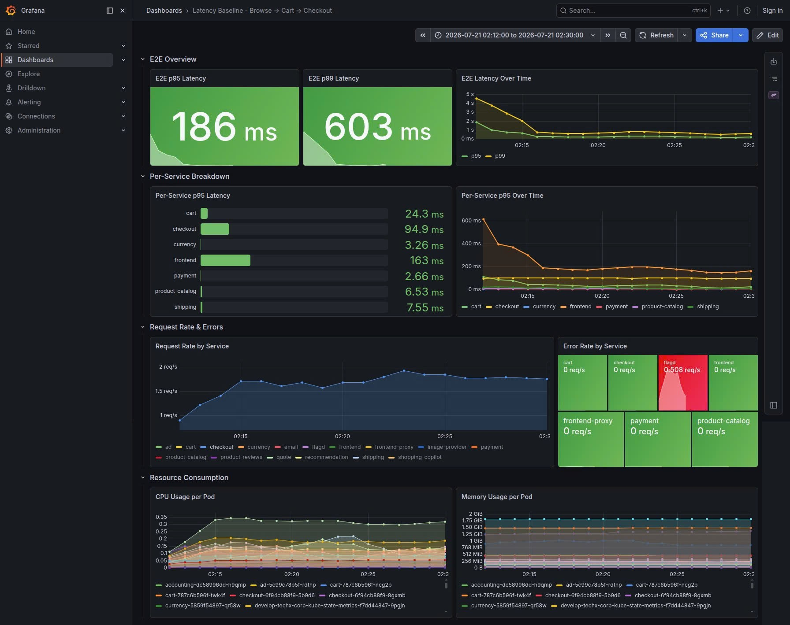
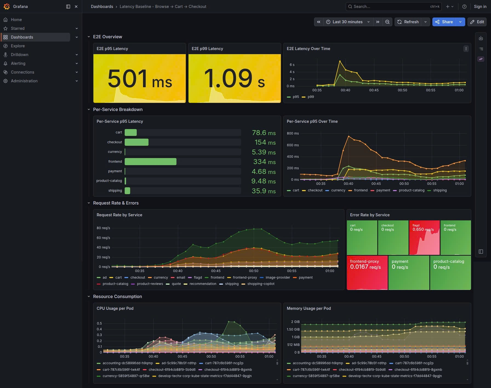
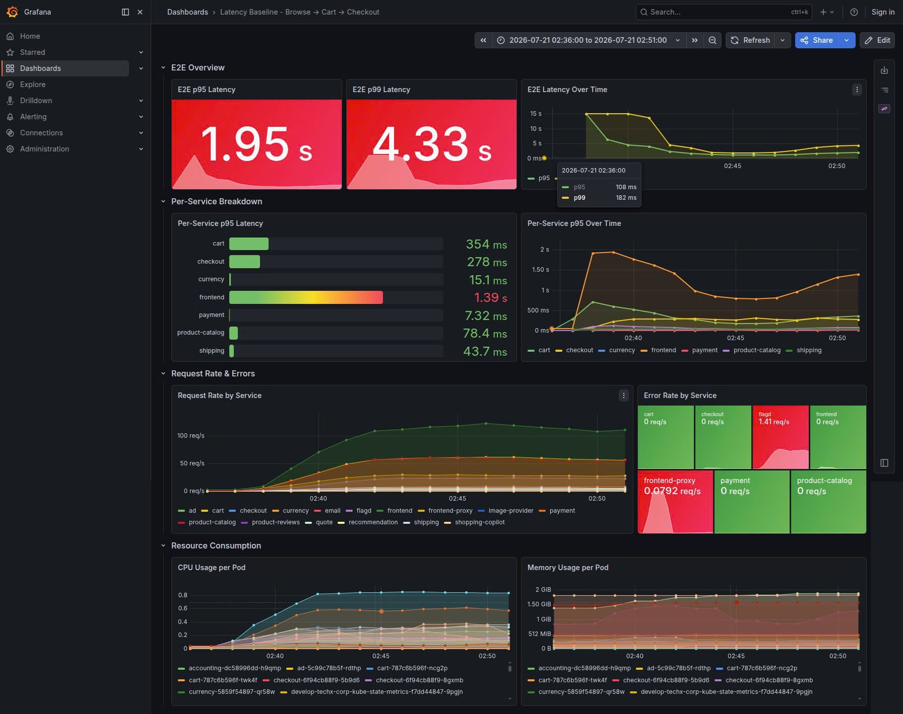

# Báo cáo Hoàn thành MANDATE 16: Latency Under Load (Độ trễ dưới tải bền)

**Người thực hiện:** [Tên/Team của bạn]
**Luồng kiểm tra (Critical Path):** Browse → Cart → Checkout

---

## 0. Cấu hình Hạ tầng (Before / After)
Bảng tham chiếu tài nguyên dùng chung cho cả báo cáo. Cột **Before** là cấu hình mặc định của hệ thống (chart default, chưa tối ưu); cột **After** điền sau khi deploy bản fix. Dùng làm mốc đối chiếu cho Phase 3 (p99 giảm mà không tăng tài nguyên).
Nguồn: `platform/charts/application/values.yaml` + override `develop` (`values-single-replica.yaml`, `values-application.yaml`).

### 0.1. Tài nguyên các service trên Critical Path (Browse → Cart → Checkout)

| Service | CPU req (Before) | CPU limit (Before) | Mem req (Before) | Mem limit (Before) | HPA min/max (Before) | HPA target | CPU req (After) | CPU limit (After) | Mem req (After) | Mem limit (After) | HPA min/max (After) |
|---|---|---|---|---|---|---|---|---|---|---|---|
| frontend (Next.js SSR) | 100m | 200m ¹ | 128Mi | 250Mi | 2 / 6 | 70% CPU | | | | | |
| cart (.NET + Valkey) | 100m | 200m | 64Mi | 160Mi | 2 / 6 | 70% CPU | | | | | |
| checkout (Go) | 100m | 200m | 64Mi | 128Mi | 2 / 5 | 70% CPU | | | | | |
| product-catalog (Go + PG) | 100m | 200m | 32Mi | 128Mi | 2 / 6 | 70% CPU | | | | | |
| currency | 50m | 100m | 16Mi | 20Mi | 1 / 4 | 70% CPU | | | | | |
| recommendation | 100m | 200m | 128Mi | 500Mi | 1 / 4 | 70% CPU | | | | | |
| frontend-proxy (Envoy edge) | 100m | 200m | 48Mi | 65Mi | 2 / 6 | 70% CPU | | | | | |

¹ Baseline được đo trên `frontend.limits.cpu = 200m` (chart default). Trên `develop`, `values-application.yaml` override giá trị này lên `500m` (Mandate-19); cấu hình đó không áp dụng cho phép đo baseline này.

### 0.2. Tham số HPA (mặc định — áp cho mọi hot-path service)
- Metric: CPU-only (`autoscaling/v2`, type `Resource`).
- `averageUtilization`: **70%** (chart default, không service nào override).
- Behavior: scale-up nhanh / scale-down chậm (chịu flash-sale rồi co xuống).

### 0.3. Node / Cụm
- **Before** — Node group (primary MNG): **3 nodes** (nâng 2→3 trong `develop-capacity.tfvars` để đủ chỗ chạy HPA prod-like).
- `default.replicas`: 1 (các service critical-path bị HPA `min` ép lên 2).
- `ml-guard`: `enabled: false` trên `develop` (ngoài scope Mandate-16, chừa CPU headroom cho luồng đo).
- **After**: _(điền sau)_

### 0.4. Tham số Load test (Locust — mặc định)
- `LOCUST_USERS: 10`, `LOCUST_SPAWN_RATE: 1` (điều chỉnh khi chạy sustained 100/150/300 users).
- `LOCUST_BROWSER_TRAFFIC_ENABLED: false` (HTTP thuần).
- Target: `http://frontend-proxy:80`.
- Resources: request 200m/256Mi, limit 500m/500Mi.

---

## 1. Executive Summary (Tóm tắt Kết quả)
- **Mục tiêu:** Giảm p95/p99 luồng cốt lõi dưới tải bền mà không tăng CPU/Node.
- **Điểm nghẽn phát hiện:** [Ghi vắn tắt: ví dụ "N+1 query ở service X", "Thiếu cache ở service Y"...]
- **Giải pháp:** [Ghi vắn tắt: "Thêm Redis cache", "Tối ưu gộp query"...]
- **Kết quả p99:** Giảm từ `[X]ms` xuống `[Y]ms` (Cải thiện `[Z]%`).
- **Tài nguyên:** Hoàn toàn không tăng (hoặc giảm).

---

## 2. Thiết lập Baseline & Tải bền (Phase 1)
- **Kịch bản Tải (Locust):** Sustained load test thực hiện với 100, 150 và 300 concurrent users.
- **Ngân sách Độ trễ (Latency Budget):**
  - Mục tiêu p95: `< 500ms` (hiện tại 150 users vượt mức lên tới 777.44ms)
  - Mục tiêu p99: `< 1200ms` (hiện tại 150 users vượt mức lên tới 1453.38ms)
- **Baseline ban đầu (Trước tối ưu):**
  - Tại mức tải **100 Users** (Cấu hình: Swap 15):
    - p95 đo được: `460.60 ms`
    - p99 đo được: `1102.90 ms`
  - Tại mức tải **150 Users** (Cấu hình: Swap 30, System Overloaded, Request rate giảm 31%):
    - p95 đo được: `777.44 ms` (+69%)
    - p99 đo được: `1453.38 ms` (+32%)
    - Tốc độ request: `26.60 req/s` (giảm từ mức `38.81 req/s` ở 100 users)
  - Tại mức tải **300 Users** (Cấu hình: Swap 75):
    - p95 đo được: `[cập nhật sau]`
    - p99 đo được: `[cập nhật sau]`
    - Tốc độ request: `[cập nhật sau]`

- **Screenshot Grafana Dashboard (Baseline — Trước tối ưu):**

  **100 Users (Swap 15):**

  

  *Hình 1: Grafana Latency Baseline — 100 Users (E2E p95 186ms / p99 603ms, hệ ổn định).*

  **150 Users (Swap 30):**

  

  *Hình 2: Grafana Latency Baseline — 150 Users (E2E p95 501ms / p99 1.09s, bắt đầu quá tải).*

  **300 Users (Swap 75):**

  

  *Hình 3: Grafana Latency Baseline — 300 Users (E2E p95 1.95s / p99 4.33s, hệ bão hòa & CPU throttling).*

---

## 3. Phân tích Điểm nghẽn (Phase 2)
- **Phân tích Trace (Jaeger):**
  - Dưới tải 100 users, p99 vọt lên đến 12s tại thời điểm 02:38:00.
  - Span chậm nhất nằm ở các lệnh gọi `add_to_cart` trước khi thực hiện checkout và đoạn fetch dữ liệu bên trong API checkout.
  - *(Đính kèm: Screenshot/Export span chậm nhất trên Jaeger)*
- **Xác định Root Cause (Nguyên nhân gốc rễ):**
  - **Bottleneck chính (P0): Thiếu Cache ở Frontend.** Mỗi lần gọi `add_to_cart` đều tạo 1 request trực tiếp xuống gRPC backend (`product-catalog`) tốn ~1.5s/call. Do kịch bản Locust thiết kế chạy 3 lần `add_to_cart` liên tiếp (tuần tự), tổng thời gian chờ lên tới hơn 10s trước cả khi việc Checkout diễn ra.
  - **Double Fetch (P0b):** Trong `POST /api/checkout`, sau khi `PlaceOrder` hoàn thành cực nhanh (~62ms), hàm API lại thực hiện load lại chi tiết từng sản phẩm một lần nữa từ `product-catalog`. Điều này chiếm đến 75-90% tổng thời gian chờ vô ích.
  - **N+1 Query ở Checkout Service (P1):** Trong hàm `checkout.prepOrderItems` (Golang), lệnh `GetProduct` và `convertCurrency` chạy trong vòng lặp `for` tuần tự (sequential) thay vì song song, làm thời gian bị nhân lên theo số lượng mặt hàng trong giỏ.

---

## 4. Giải pháp Tối ưu & Bằng chứng Tài nguyên (Phase 3)

### 4.1. Giải pháp Tối ưu (Root Cause Fix)
- **Vị trí điểm nghẽn:** Service `[Tên Service]`
- **Cách xử lý (Root Cause Fix):**
  - Mô tả kỹ thuật tối ưu (vd: Thay vì for-loop gọi DB từng item, gom lại thành 1 câu IN query; hoặc thêm LRU Cache).
  - Link đến PR hoặc thay đổi code/config (Before vs After).

### 4.2. Bằng chứng Độ trễ p95/p99 (Tốc độ)
- p95 sau tối ưu: `[Giá trị] ms` (Đạt ngân sách!)
- p99 sau tối ưu: `[Giá trị] ms` (Đạt ngân sách!)
- *(Đính kèm: Screenshot Grafana Dashboard cho thấy p99 tụt dốc sau khi deploy bản fix)*
- *(Đính kèm: Screenshot Jaeger Trace sau tối ưu, cho thấy span chậm đã biến mất hoặc thu ngắn)*

### 4.3. Bằng chứng Tài nguyên (Không dùng tiền mua tốc độ)
- *(Đính kèm: Screenshot Grafana phần CPU Usage và Node count)*
- **Phân tích:** Biểu đồ cho thấy dưới cùng một mức tải, CPU và số node trước và sau khi fix là BẰNG NHAU hoặc THẤP HƠN.

---

## 5. Độ ổn định & ADR (Phase 4)

### 5.1. Bằng chứng Độ ổn định (Stability)
- *(Đính kèm: Screenshot Grafana thể hiện tải dao động)*
- **Phân tích:** Khi tải tăng dần, đường p99 vẫn đi ngang, không có hiện tượng jitter (giật cục) tỷ lệ thuận với tải.

### 5.2. ADR — Architecture Decision Record (BẮT BUỘC — Ký tên)
- **Vị trí điểm nghẽn:** Service `[Tên Service]` — [mô tả ngắn nguyên nhân gốc].
- **Quyết định xử lý:** [Cache / gộp query / parallelize / pool...].
- **Đánh đổi (Trade-offs - BẮT BUỘC CÓ):**
  - Ví dụ: Nếu dùng Cache -> Đánh đổi bằng độ trễ dữ liệu (Data staleness) / tốn thêm Memory.
  - Ví dụ: Nếu dùng Connection Pool -> Đánh đổi bằng việc cấu hình phức tạp hơn, có thể giữ connection mồ côi nếu không handle tốt.

---
*(Ký tên / Xác nhận hoàn thành)*
