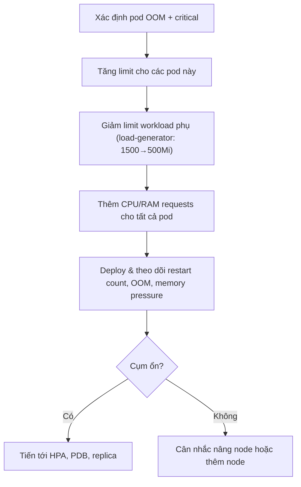
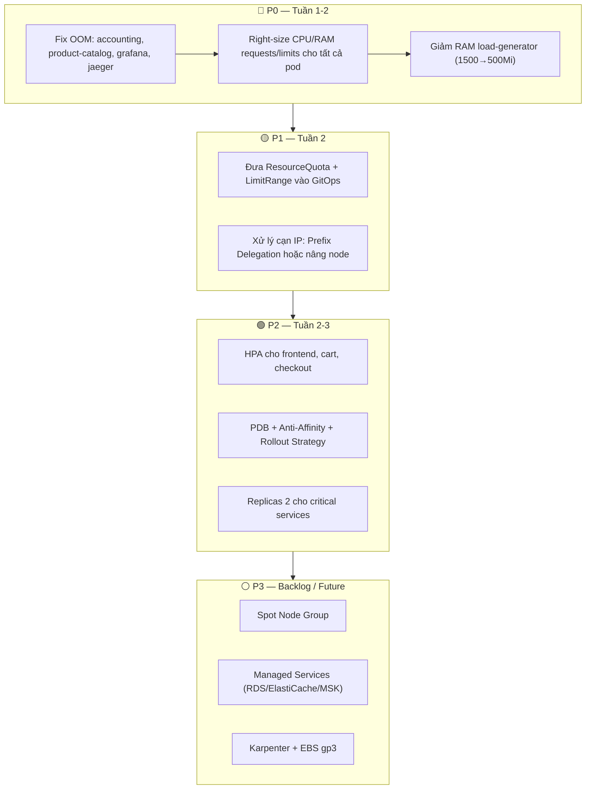

# Đánh Giá Cost Optimization & Reliability

> **Phạm vi:** Đánh giá tình trạng ban đầu và đề xuất cải tiến cho hệ thống TechX Phase 3, dựa trên repo hiện tại và 3 báo cáo vận hành:
> - `EKS_ISSUES_LIST.md` — 9 lỗi/rủi ro phát hiện trên cụm EKS.
> - `POD_RESOURCE_CONFIGS.md` — Cấu hình tài nguyên chi tiết của 28 pods.
> - `OPTIMIZATION_REPORT.md` — Phân tích trade-off và khuyến nghị tối ưu.

---

## 1. Tóm Tắt Điều Hành

### 1.1 Đánh giá tổng quan

Hệ thống đã có baseline EKS/ECR/Helm/ArgoCD để chạy microservices trên AWS, nhưng trạng thái ban đầu **chưa production-ready** về cả **Cost Optimization** lẫn **Reliability**.

> [!CAUTION]
> **Rủi ro lớn nhất không phải thiếu tính năng mới**, mà là cụm EKS đang ở trạng thái **rất sát ngưỡng sập** — lỗi OOM đã xảy ra thật, RAM cụm đã dùng 88%, IP pod chỉ còn 7 slot trống.

### 1.2 Bức tranh hiện trạng qua 5 con số

| Chỉ số | Giá trị | Mức độ |
|---|---|---|
| Pod đã bị **OOMKilled** thật | 4 services (`accounting` 36 lần, `grafana`, `jaeger`, `product-catalog`) | 🔴 Nguy hiểm |
| RAM cụm đã sử dụng (Limit) | **88%** (8.7Gi / 9.88Gi) | 🔴 Nguy hiểm |
| IP pod còn trống | **7 / 51** (chỉ còn 14%) | 🔴 Nguy hiểm |
| Pod thiếu CPU request/limit | **~90%** (hầu hết service) | 🟡 Cảnh báo |
| Service chạy single replica | **100%** (tất cả replicas = 1) | 🟡 Cảnh báo |

### 1.3 Kết luận cho pitch

> **Ưu tiên Cost/Reliability trong tuần 2-3** nên là:
> 1. Right-sizing tài nguyên (fix OOM + khai báo request/limit).
> 2. Guardrail namespace (LimitRange + GitOps cho ResourceQuota).
> 3. HPA cho service critical.
> 4. Giải quyết cạn IP/RAM trước khi thêm kiến trúc nặng (Karpenter, MSK, ElastiCache).

---

## 2. Baseline Từ Repo

### 2.1 Hạ Tầng AWS (Terraform)

| Thành phần | Trạng thái | Ghi chú |
|---|---|---|
| **VPC** | 3 public + 3 private subnets, NAT/IGW | Đầy đủ cho multi-AZ |
| **ECR** | Repo `techx-corp` | Lưu image cho CI/CD |
| **EKS** | Cluster `techx-eks-dev` | 1 cluster duy nhất |
| **Node group** | 3 node `t3.medium` (2 vCPU, 4GB RAM) | Private subnet |
| **Capacity type** | `ON_DEMAND` | Có comment chuyển sang Spot |

> [!NOTE]
> **Bằng chứng:** `terraform/modules/eks/main.tf` dùng EKS managed node group với `capacity_type = "ON_DEMAND"`, `terraform/md/RESOURCES.md` xác nhận 3 nodes `t3.medium`.

### 2.2 Kubernetes/Helm Baseline

Repo có Helm chart chính `platform/charts/application` gồm **19 microservices**, **3 data stores** (PostgreSQL, Valkey, Kafka), và **observability stack** (OTel, Prometheus, Jaeger, OpenSearch, Grafana).

**Những gì chart đã hỗ trợ vs chưa có:**

| Capability | Trạng thái | Tác động |
|---|:---:|---|
| `resources` (CPU/RAM) | ✅ Template có | Nhưng values hầu hết bỏ trống |
| `livenessProbe` / `readinessProbe` | ✅ Template có | Chưa cấu hình thật cho critical services |
| `nodeSelector` / `affinity` / `tolerations` | ✅ Template có | Values chưa dùng để phân tán pod |
| `replicas` | ✅ Default `1` | Mọi service đều single replica |
| `revisionHistoryLimit` | ✅ Có | OK |
| **HPA** (Horizontal Pod Autoscaler) | ❌ Chưa có | Không thể auto-scale theo tải |
| **PDB** (PodDisruptionBudget) | ❌ Chưa có | Không bảo vệ pod khi drain node |
| **LimitRange** | ❌ Chưa có | Pod mới có thể "thả rông" tài nguyên |
| **Rollout strategy** (`maxUnavailable`/`maxSurge`) | ❌ Chưa có | Deploy có thể gây downtime |

### 2.3 Namespace Guardrail

Repo có file `platform/policies/resource-governance/quota.yaml` định nghĩa ResourceQuota:

```yaml
requests.cpu: "4"
requests.memory: 8Gi
limits.cpu: "8"
limits.memory: 12Gi
pods: "40"
```

> [!WARNING]
> File quota tồn tại nhưng **chưa được tích hợp vào ArgoCD hay Helm chart**. Nếu không được apply tự động qua GitOps, rủi ro "có file nhưng không có tác dụng" vẫn còn.

---

## 3. Tình Trạng Ban Đầu: Cost Optimization

### 3.1 🔴 Cost Risk #1 — Tài nguyên pod khai báo không đầy đủ

**Thực trạng:** Theo `POD_RESOURCE_CONFIGS.md`, hầu hết pod bỏ trống CPU request/limit và RAM request:

| Component | CPU Req | CPU Limit | RAM Req | RAM Limit | Nhận xét |
|---|:---:|:---:|:---:|:---:|---|
| accounting | `-` | `-` | `-` | 120Mi | Thiếu cả 3 trường |
| checkout | `-` | `-` | `-` | 20Mi | Thiếu cả 3, limit cực thấp |
| product-catalog | `-` | `-` | `-` | 20Mi | Thiếu cả 3, limit cực thấp |
| shipping | `-` | `-` | `-` | 20Mi | Thiếu cả 3, limit cực thấp |
| valkey-cart | `-` | `-` | `-` | 20Mi | Cache Redis chỉ 20Mi |
| postgresql | `-` | `-` | `-` | 100Mi | DB chỉ 100Mi |
| llm | `-` | `-` | `-` | `-` | **Hoàn toàn không giới hạn** |
| prometheus | `-` | `-` | `-` | `-` | **Hoàn toàn không giới hạn** |
| jaeger | `-` | `-` | `-` | `-` | **Hoàn toàn không giới hạn** |

**Tác động Cost — tại sao thiếu request/limit lại tốn tiền?**

```
Scheduler thấy pod "rẻ" (0 CPU/RAM request)
    → Nhét nhiều pod lên cùng 1 node
        → Các pod tranh CPU/RAM thật trên node vật lý
            → Node bị saturate, nhưng Kubernetes dashboard vẫn báo "CPU còn trống"
                → Ops tưởng cụm khỏe, không scale → app chậm/sập
                    → Phải scale node bằng cảm tính thay vì dữ liệu
```

> [!IMPORTANT]
> **Ví dụ cụ thể:** Report ghi nhận CPU Request chỉ dùng **36%** (2.1/5.79 Cores). Con số này **hoàn toàn ảo** vì đa số pod không khai báo CPU request — Kubernetes coi chúng dùng 0 CPU. Thực tế khi Locust load test, CPU vật lý có thể lên 100% nhưng dashboard vẫn báo an toàn.

### 3.2 🟡 Cost Risk #2 — Limit quá cao ở workload phụ trợ

| Component | RAM Limit | % RAM Node (4GB) | Nhận xét |
|---|---:|---:|---|
| **load-generator** | 1500Mi | ~37% | Công cụ test chiếm gần nửa RAM node |
| **opensearch** | 1100Mi | ~27% | Lưu log, nặng với dev cluster |
| **kafka** | 700Mi | ~17% | Message queue |

**Tác động:**
- 2 workload phụ (`load-generator` + `opensearch`) đã chiếm **~64% RAM** của 1 node.
- App revenue-critical (checkout, cart, payment) lại phải chia nhau phần còn lại.
- Có nguy cơ phải **scale thêm node chỉ vì công cụ phụ**, không phải vì traffic thực.

### 3.3 🟢 Cost Risk #3 — Node group đang On-Demand

Terraform cấu hình `capacity_type = "ON_DEMAND"`.

| Khía cạnh | Đánh giá |
|---|---|
| **An toàn** | On-Demand phù hợp baseline ban đầu, không bị AWS thu hồi |
| **Chi phí** | Đắt hơn Spot **70-90%** cho stateless workload |
| **Trạng thái hiện tại** | Chưa nên chuyển Spot ngay vì thiếu PDB, anti-affinity, multi-replica |

> [!TIP]
> Spot Instance tiết kiệm nhiều nhưng **không phải bước đầu tiên**. Cần có guardrail reliability (PDB, replicas ≥ 2, anti-affinity) trước khi bật Spot, nếu không sẽ đổi cost lấy downtime.

---

## 4. Tình Trạng Ban Đầu: Reliability

### 4.1 🔴 Reliability Risk #1 — OOMKilled đã xảy ra thật

> [!CAUTION]
> **Đây không phải rủi ro lý thuyết.** Lỗi OOMKilled (Exit Code 137) đã xảy ra trên cụm baseline, gây crash và restart liên tục.

| Component | Số lần restart | RAM Limit hiện tại | Nguyên nhân | Ảnh hưởng nghiệp vụ |
|---|---:|---:|---|---|
| **accounting** | **36 lần** | 120Mi | .NET Core cần nhiều RAM hơn 120Mi để khởi chạy + GC | ❌ Hỏng luồng xử lý đơn hàng sau checkout |
| **product-catalog** | 4 lần | 20Mi | Go runtime vượt 20Mi khi xử lý request dồn dập | ❌ Khách không xem được sản phẩm |
| **grafana** | 1 lần | 300Mi | Dashboard/plugins/sidecar vượt 300Mi | ❌ Mất khả năng monitor đúng lúc cần |
| **jaeger** | 1 lần | Không giới hạn* | Storage `memory` phình khi load test (Locust) | ❌ Mất khả năng tracing khi điều tra lỗi |

**Tại sao không thể "cứ tăng RAM" là xong?**

Nếu tăng limit cho cả 4 service bị OOM (cần thêm ~1.3-1.5Gi), tổng memory pressure sẽ **vượt ngưỡng cụm** (đã ở 88%). Do đó phải kết hợp:

1. ✅ Tăng limit cho pod OOM + critical trước.
2. ✅ **Giảm** limit cho workload phụ (`load-generator`: 1500Mi → 500-800Mi).
3. ✅ Thêm requests để scheduler phân bổ đúng.
4. ✅ Theo dõi lại restart count, OOM, node memory pressure sau thay đổi.

### 4.2 🔴 Reliability Risk #2 — Cụm gần cạn RAM

| Chỉ số RAM | Giá trị | % Sử dụng | Đánh giá |
|---|---:|---:|---|
| Tổng RAM Allocatable (3 node `t3.medium`) | 9.88 Gi | — | Trần cứng |
| RAM Pod Request (đã giữ chỗ) | 7.5 Gi | **76%** | 🟡 Cao |
| RAM Pod Limit (giới hạn tối đa) | 8.7 Gi | **88%** | 🔴 Nguy hiểm |
| RAM còn khả dụng thực tế | ~1.1 Gi | **12%** | 🔴 Gần cạn |

**Tác động trực tiếp:**

```
Fix OOM bằng cách tăng limit
    → Tổng limit vượt 100% RAM cụm
        → Pod mới (rolling update) không schedule được → kẹt deploy
        → Node memory pressure tăng → kubelet tự kill pod ngẫu nhiên
            → Sập dây chuyền (cascading failure)
```

### 4.3 🔴 Reliability Risk #3 — Cạn IP pod trên EKS

| Chỉ số | Giá trị |
|---|---:|
| Pod đang chạy | 44 |
| Tổng IP khả dụng (3 node `t3.medium` × 17 IP/node) | 51 |
| **IP còn trống** | **7** |

> [!WARNING]
> **Rolling update là kịch bản kẹt gần nhất.** Kubernetes tạo pod mới _trước_ khi xóa pod cũ. Nếu update 10 deployment cùng lúc, cần 10 IP tạm → nhưng chỉ còn 7 → rollout kẹt ở trạng thái **Pending** dù CPU/RAM chưa hẳn cạn.

**Các kịch bản bị chặn bởi thiếu IP:**
- ❌ Rolling update nhiều service cùng lúc.
- ❌ HPA tăng replica (cần IP mới cho pod mới).
- ❌ Deploy observability stack update.
- ❌ Chạy canary/blue-green deployment.

### 4.4 🟡 Reliability Risk #4 — Single replica = Điểm chết đơn lẻ

Theo `POD_RESOURCE_CONFIGS.md`, **tất cả 28 components** đang chạy `replicas = 1`.

**Bảng phân loại rủi ro theo nhóm service:**

| Nhóm service | Services | Rủi ro khi replica = 1 | Mức ưu tiên tăng replica |
|---|---|---|---|
| 🔴 **Entry path** | `frontend-proxy`, `frontend` | Sập = toàn bộ hệ thống mất truy cập | P1 — Ưu tiên cao |
| 🔴 **Revenue path** | `checkout`, `cart`, `payment`, `product-catalog` | Sập = mất doanh thu trực tiếp | P1 — Ưu tiên cao |
| 🟡 **Async consumers** | `accounting`, `fraud-detection` | Sập = đơn hàng không được xử lý hậu kỳ | P2 — Cần hiểu idempotency trước |
| 🟡 **Observability** | `grafana`, `jaeger`, `prometheus` | Sập = mất khả năng điều tra lỗi | P2 — Cân nhắc cost |
| 🟢 **Công cụ phụ** | `load-generator` | Sập = chỉ ảnh hưởng test | Không cần HA |

### 4.5 🟡 Reliability Risk #5 — Observability stack tiêu thụ lớn nhưng thiếu giới hạn

Observability là **vừa công cụ cứu hộ, vừa nguồn tiêu thụ tài nguyên** lớn:

| Component | RAM Limit | Rủi ro |
|---|---:|---|
| OpenSearch | 1100Mi | Nặng nhất cụm, chiếm 27% RAM node |
| Grafana | 300Mi | Đã bị OOMKilled, cần tăng |
| Jaeger | Không giới hạn | Memory storage phình khi trace nhiều |
| Prometheus | Không giới hạn | Retention/scrape nhiều → tăng RAM/disk |
| OTel Collector | 200Mi | Readiness probe fail khi node quá tải |

> [!IMPORTANT]
> **Không nên tắt observability** vì Phase 3 cần SLO/Ops Review. Nhưng phải right-size và giới hạn retention/log volume để observability **không làm nghẹt chính hệ thống nó đang giám sát**.

---

## 5. Cải Tiến Đã Có Trong Repo

| Mảng | ✅ Đã có | ⚠️ Hạn chế còn lại |
|---|---|---|
| **Terraform EKS/ECR** | Cluster, ECR, node group đầy đủ | Chưa có Spot node group, Karpenter, gp3 StorageClass |
| **Helm chart** | Template deployment/service chung | Chưa có HPA, PDB, LimitRange, rollout strategy |
| **ResourceQuota** | File `platform/policies/resource-governance/quota.yaml` | Chưa tích hợp GitOps (ArgoCD/Helm) |
| **Probes** | Template hỗ trợ readiness/liveness | Values chưa cấu hình cho critical services |
| **Scheduling** | Template hỗ trợ affinity/tolerations | Values chưa dùng để phân tán pod |
| **Observability** | Prometheus, Grafana, Jaeger, OpenSearch, OTel | Chính stack này đang tiêu tốn RAM lớn và bị OOM |

---

## 6. Phân Tích Chi Tiết Theo Vấn Đề

### 6.1 Thiếu requests/limits — không chỉ là vấn đề cấu hình

Trong Kubernetes, `requests` và `limits` **quyết định trực tiếp** cách hệ thống hoạt động:

| Trường | Tác dụng | Hậu quả nếu thiếu |
|---|---|---|
| **CPU request** | Scheduler dùng để quyết định đặt pod lên node nào | Pod bị nhét quá dày, tranh CPU thật |
| **RAM request** | Scheduler dùng để tính lịch phân bổ | Kubernetes tưởng pod "rẻ", đặt sai |
| **CPU limit** | Mức CPU tối đa container được dùng | Pod "thả rông", ảnh hưởng pod khác |
| **RAM limit** | Ngưỡng RAM trước khi container bị OOMKilled | Rò rỉ RAM → nuốt hết RAM node |

**Tác động business:**

| Service bị ảnh hưởng | Hậu quả nếu nghẽn/sập |
|---|---|
| `checkout` | Khách không thanh toán được → **mất doanh thu trực tiếp** |
| `product-catalog` | Khách không xem được sản phẩm → **mất cơ hội mua hàng** |
| `cart` / `valkey-cart` | Giỏ hàng bị mất → **trải nghiệm xấu, khách bỏ đi** |
| `frontend` | Toàn bộ giao diện sập → **hệ thống hoàn toàn ngưng trệ** |

**Tác động cost:**

- Không có request đúng → không thể right-size node chính xác.
- HPA dựa trên CPU utilization nhưng utilization tính dựa trên request → **HPA mất nền tảng**.
- Ops phải scale node bằng **cảm tính** thay vì dữ liệu.

### 6.2 OOMKilled — lỗi thật, không phải giả thuyết

> [!CAUTION]
> `accounting` đã restart **36 lần** do OOMKilled. Đây là lỗi nghiêm trọng nhất đã xảy ra trên cụm.

**Bảng so sánh Trước vs Đề xuất:**

| Component | Runtime | RAM Limit hiện tại | Vấn đề | RAM đề xuất |
|---|---|---:|---|---:|
| accounting | C#/.NET Core | 120Mi | .NET cần ≥200Mi cho runtime + GC | **200-256Mi** |
| product-catalog | Go | 20Mi | Go runtime vượt 20Mi khi load cao | **64-128Mi** |
| checkout | Go | 20Mi | Limit quá sát cho bất kỳ app nào | **64-128Mi** |
| shipping | Go/Rust | 20Mi | Limit quá sát | **64-128Mi** |
| grafana | — | 300Mi | Dashboard + plugins + sidecar vượt | **512Mi** |
| jaeger | — | Không giới hạn | Memory storage phình khi load test | **1-1.5Gi** hoặc chuyển storage |

**Hướng xử lý đúng** — không phải "cứ tăng RAM":



### 6.3 Cạn IP — blocker trước mọi kế hoạch scale

Report ghi nhận 44 pod / 51 IP → còn **7 IP trống**. Đây là rủi ro **dễ bị đánh giá thấp nhất**.

| Kịch bản | IP cần thêm | Khả thi? |
|---|---:|---|
| Rolling update 5 services cùng lúc | 5 | ✅ Vừa đủ (còn 7) |
| Rolling update 10 services cùng lúc | 10 | ❌ Thiếu 3 IP → kẹt Pending |
| Bật HPA `frontend` min=2 max=5 | 1-4 | ⚠️ Có thể thiếu |
| Tăng replicas critical services lên 2 | 4-6 | ❌ Gần hết hoặc hết IP |

**Phương án xử lý:**

| Phương án | Hiệu quả | Trade-off | Khi nào dùng |
|---|---|---|---|
| **VPC CNI Prefix Delegation** | Tăng từ 17→110 pod/node | Cần subnet ≥ `/20`, giữ trước 16 IP/node | Subnet đủ rộng |
| **Nâng node `m5a.large`** | Tăng cả RAM (8GB) + IP (36/node) | Tăng chi phí On-Demand | Vừa thiếu IP vừa thiếu RAM |
| **Thêm node** | Tăng tổng IP + RAM | Tăng cost | Cần phân tán workload |
| **Giảm workload phụ** | Giải phóng IP ngay | Mất khả năng test/log | Giải pháp tạm thời |

> [!IMPORTANT]
> **Phải xử lý IP/RAM trước khi bật HPA hay tăng replica.** Nếu không, các cải tiến reliability sẽ thất bại ngay ở bước schedule pod.

### 6.4 Single replica — mọi service đều là SPOF

Hầu hết services đang `replicas = 1`. Điều này hợp lý cho baseline tiết kiệm, nhưng **mọi restart, deploy, node drain đều gây downtime**.

> [!WARNING]
> **Thứ tự đúng:** Right-size + capacity trước → Tăng replica sau. Nếu bật replica 2 khi cụm đang cạn IP/RAM, deploy sẽ fail.

### 6.5 ResourceQuota có nhưng thiếu LimitRange

Hai tầng bảo vệ khác nhau, cần có cả hai:

| Resource | Câu hỏi nó trả lời | Repo hiện tại |
|---|---|---|
| **ResourceQuota** | Namespace được dùng tối đa bao nhiêu CPU/RAM/pod? | ✅ Có file, ❌ chưa GitOps |
| **LimitRange** | Mỗi pod mặc định / tối đa / tối thiểu bao nhiêu? | ❌ Chưa có |

**Nếu chỉ có ResourceQuota mà không có LimitRange:**
- Developer có thể tạo pod không khai báo request/limit.
- Pod mới "thả rông" vẫn lọt vào namespace.
- Scheduler vẫn thiếu dữ liệu.

### 6.6 Spot Instance — tiết kiệm lớn nhưng chưa nên làm ngay

| Ưu điểm | Rủi ro hiện tại |
|---|---|
| Tiết kiệm **70-90%** EC2 cho stateless | Single replica → Spot thu hồi = downtime |
| Phù hợp dev/staging | Chưa có PDB bảo vệ pod |
| Có thể kết hợp nhiều instance type | Chưa có anti-affinity/topology spread |

**Thứ tự an toàn trước khi bật Spot:**

```
1. Right-size resources
    → 2. PDB + replica ≥ 2 cho stateless critical
        → 3. Tách stateless/stateful bằng nodeSelector
            → 4. Thêm Spot node group
```

### 6.7 Managed Services — hướng production nhưng cần bảo vệ ROI

| Đề xuất | Lợi ích Reliability | Chi phí ước tính | Phase phù hợp |
|---|---|---|---|
| PostgreSQL → **RDS Multi-AZ** | Backup tự động, failover, SLA 99.99% | ~$50-100/tháng | Prod |
| Valkey → **ElastiCache** | Ổn định cache, không mất giỏ hàng | ~$30-60/tháng | Prod |
| Kafka → **MSK** | Bền hơn, giảm vận hành broker | ~$150-300/tháng | Prod (nếu có budget) |

> [!NOTE]
> Managed services là **phương án production target**, nhưng trong Phase 3 capstone với timeline 3 tuần và ngân sách giới hạn, nên ưu tiên right-sizing (cost thấp, impact nhanh) trước. RDS/MSK/ElastiCache nên ở backlog P3.

---

## 7. Đề Xuất Cải Tiến Theo Mức Độ Ưu Tiên

### 🔴 P0 — Right-size resources cho service OOM và critical

**Mục tiêu:** Giảm CrashLoopBackOff/OOMKilled, tạo request/limit rõ ràng.

**Bảng cải tiến chi tiết (Trước → Sau):**

| Component | CPU Req (cũ→mới) | CPU Limit (cũ→mới) | RAM Req (cũ→mới) | RAM Limit (cũ→mới) | Lý do |
|---|---|---|---|---|---|
| **accounting** | `-` → `100m` | `-` → `200m` | `-` → `128Mi` | `120Mi` → **`256Mi`** | OOMKilled 36 lần, .NET cần RAM cao |
| **product-catalog** | `-` → `50m` | `-` → `100m` | `-` → `32Mi` | `20Mi` → **`128Mi`** | OOMKilled 4 lần, Go runtime |
| **checkout** | `-` → `100m` | `-` → `200m` | `-` → `64Mi` | `20Mi` → **`128Mi`** | Revenue-critical, limit quá thấp |
| **shipping** | `-` → `50m` | `-` → `100m` | `-` → `32Mi` | `20Mi` → **`128Mi`** | Limit quá thấp |
| **cart** | `-` → `100m` | `-` → `200m` | `-` → `64Mi` | `160Mi` → `160Mi` | Thêm request, giữ limit |
| **valkey-cart** | `-` → `100m` | `-` → `200m` | `-` → `64Mi` | `20Mi` → **`256Mi`** | Cache Redis 20Mi → mất giỏ hàng |
| **postgresql** | `-` → `250m` | `-` → `500m` | `-` → `256Mi` | `100Mi` → **`512Mi`** | DB 100Mi quá ít |
| **grafana** | `-` → `100m` | `-` → `250m` | `-` → `256Mi` | `300Mi` → **`512Mi`** | OOMKilled khi load dashboard |
| **jaeger** | `-` → `100m` | `-` → `200m` | `-` → `256Mi` | `-` → **`1Gi`** | Memory storage phình |
| **prometheus** | `-` → `200m` | `-` → `500m` | `-` → `256Mi` | `-` → **`512Mi`** | Thả rông → rò rỉ RAM kill node |
| **load-generator** | `-` → `200m` | `-` → `500m` | `-` → `256Mi` | `1500Mi` → **`500Mi`** | ⬇️ Giảm để giải phóng RAM cho app |

**Trade-off quan trọng:**
- Tăng limit cho OOM services + giảm limit cho `load-generator` = **tổng RAM gần như không đổi** → an toàn cho cụm.
- Thêm request cho tất cả pod → scheduler phân bổ chính xác hơn.

---

### 🟡 P1 — Đưa ResourceQuota + LimitRange vào GitOps

**Mục tiêu:** Biến guardrail thành cấu hình bắt buộc, không phụ thuộc apply thủ công.

**Đề xuất:**
- Đưa `ResourceQuota` vào Helm chart hoặc ArgoCD Application.
- Thêm `LimitRange` default cho mọi pod mới:

```yaml
apiVersion: v1
kind: LimitRange
metadata:
  name: default-limits
spec:
  limits:
    - default:
        cpu: "200m"
        memory: "256Mi"
      defaultRequest:
        cpu: "50m"
        memory: "64Mi"
      type: Container
```

**Acceptance criteria:**
- ✅ `helm template` render được ResourceQuota và LimitRange.
- ✅ Namespace `techx-tf1` có quota và default request/limit.
- ✅ Service mới không khai báo resources → tự nhận default từ LimitRange.

---

### 🟡 P1 — Giải quyết cạn IP/RAM trước khi scale

**Mục tiêu:** Rolling update và HPA không bị Pending vì thiếu IP/RAM.

| Option | Lợi ích | Trade-off | Đề xuất |
|---|---|---|---|
| **Bật VPC CNI Prefix Delegation** | 17 → 110 pod/node | Cần subnet ≥ `/20` | ✅ Ưu tiên nếu subnet đủ |
| **Nâng node `m5a.large`** | 8GB RAM + 36 IP/node | Tăng chi phí On-Demand | ✅ Ưu tiên nếu vừa thiếu RAM+IP |
| **Thêm node group riêng** | Cách ly observability/loadgen | Tăng complexity + cost | Cân nhắc |

---

### 🟢 P2 — HPA cho service critical

**Mục tiêu:** Scale theo tải thực tế cho `frontend`, `checkout`, `cart`.

**Điều kiện tiên quyết (phải hoàn thành P0 + P1 trước):**
- ✅ CPU/RAM requests đã khai báo đúng.
- ✅ Đủ IP/RAM trên node.
- ✅ metrics-server hoạt động.

**Cấu hình mẫu:**

```yaml
apiVersion: autoscaling/v2
kind: HorizontalPodAutoscaler
metadata:
  name: frontend-hpa
spec:
  scaleTargetRef:
    apiVersion: apps/v1
    kind: Deployment
    name: frontend
  minReplicas: 2
  maxReplicas: 10
  metrics:
    - type: Resource
      resource:
        name: cpu
        target:
          type: Utilization
          averageUtilization: 70
```

---

### 🟢 P2 — PDB + Anti-Affinity + Rollout Strategy

**Mục tiêu:** Giảm downtime khi pod/node lỗi, deploy an toàn hơn.

**Đề xuất cụ thể:**

| Cải tiến | Áp dụng cho | Config |
|---|---|---|
| **Replicas 2** | `frontend`, `frontend-proxy`, `checkout`, `cart` | `replicas: 2` |
| **PDB** | Tất cả service replicas ≥ 2 | `minAvailable: 1` |
| **Anti-Affinity** | Service replicas ≥ 2 | `topologyKey: kubernetes.io/hostname` |
| **Rollout strategy** | Tất cả Deployment | `maxUnavailable: 0, maxSurge: 1` |

---

### ⚪ P3 — Spot Node Group + Managed Services

| Item | Lợi ích | Điều kiện | Timeline |
|---|---|---|---|
| **Spot Node Group** | Giảm 70-90% EC2 cho stateless | Cần PDB + replicas ≥ 2 + anti-affinity | Sau P2 |
| **RDS PostgreSQL** | Backup, Multi-AZ, SLA 99.99% | Budget + migration effort | Prod target |
| **ElastiCache** | Ổn định cache | Budget | Prod target |
| **MSK Kafka** | Giảm vận hành broker | Budget cao | Prod target nếu cần |
| **EBS gp3 StorageClass** | Giảm 20% chi phí lưu trữ | Chuyển đổi volume cũ | Bất kỳ lúc nào |
| **Karpenter Autoscaler** | Scale node 15s, tự dồn Pod | Cấu hình IAM phức tạp | Production |

---

## 8. Tổng Hợp Backlog Cost & Reliability

| Ưu tiên | Backlog Item | Pillar | Lý do ưu tiên | Effort |
|---:|---|---|---|---|
| **P0** | Right-size CPU/RAM cho critical + OOM services | Cost + Reliability | Lỗi đã xảy ra thật, scheduler thiếu data | Thấp (sửa values.yaml) |
| **P0** | Fix OOM `accounting`, `product-catalog`, `grafana`, `jaeger` | Reliability | 36+ restart, ảnh hưởng nghiệp vụ + observability | Thấp |
| **P0** | Giảm RAM `load-generator` (1500→500Mi) | Cost | Giải phóng RAM cho app critical | Thấp |
| **P1** | Đưa ResourceQuota + LimitRange vào Helm/ArgoCD | Cost | Có file nhưng chưa thành guardrail GitOps | Trung bình |
| **P1** | Xử lý cạn IP pod (Prefix Delegation hoặc nâng node) | Reliability | Chỉ còn 7 IP, rolling update/HPA dễ fail | Trung bình |
| **P2** | HPA template cho `frontend`, `cart`, `checkout` | Cost + Reliability | Scale theo tải, cần request/metrics trước | Trung bình |
| **P2** | PDB + anti-affinity cho critical services | Reliability | Giảm downtime khi node drain/update | Trung bình |
| **P2** | Rollout strategy `maxUnavailable: 0, maxSurge: 1` | Reliability | Giảm downtime khi deploy, scope nhỏ | Thấp |
| **P3** | Spot node group cho stateless workload | Cost | Tiết kiệm EC2, cần guardrail reliability | Cao |
| **P3** | Managed DB/cache/queue (RDS/ElastiCache/MSK) | Reliability | Tốt cho Prod nhưng chi phí/effort cao | Cao |
| **P3** | EBS gp3 StorageClass | Cost | Giảm 20% lưu trữ, cấu hình đơn giản | Thấp |
| **P3** | Karpenter Autoscaler | Cost + Reliability | Scale node nhanh, nhưng cấu hình phức tạp | Cao |

---

## 9. Luồng Cải Tiến Đề Xuất



---

## 10. Câu Trả Lời Pitch Theo Stakeholder

### PM hỏi: "Khách hàng được gì?"

> Khách không nhìn thấy HPA hay resource limit, nhưng khách bị ảnh hưởng trực tiếp khi `checkout`, `product-catalog`, `cart` hoặc `frontend` bị restart/OOM. **Cải tiến này giúp:**
> - Storefront ổn định hơn (không crash khi traffic tăng).
> - Checkout ít gián đoạn hơn (không mất đơn giữa chừng).
> - Giảm rủi ro deploy làm sập dịch vụ (rollout strategy + PDB).

### CFO hỏi: "Tốn bao nhiêu?"

> Right-sizing và LimitRange chủ yếu là **sửa Helm config, chi phí implement gần 0**. Một số pod tăng RAM, nhưng bù lại bằng giảm `load-generator` → **tổng RAM gần như không đổi**. Spot/managed service chỉ nằm trong backlog, chưa phát sinh chi phí.

### SRE lead hỏi: "Làm sai thì sao?"

> Thay đổi đi theo **thứ tự an toàn:**
> 1. `helm template` render trước → review diff.
> 2. Apply trên namespace dev → theo dõi restart count, OOM, CPU/RAM.
> 3. Mới bật HPA/replicas sau khi xác nhận cụm ổn.
> 4. Rollback bằng Helm/ArgoCD nếu có vấn đề.

---

## 11. Kết Luận

Tình trạng ban đầu cho thấy **Cost và Reliability liên kết chặt chẽ** — không thể tối ưu một bên mà không ảnh hưởng bên kia:

| Nếu... | Thì... |
|---|---|
| Để limit quá thấp | → OOMKilled → mất reliability |
| Tăng limit bừa bãi | → Cụm `t3.medium` cạn RAM → tăng cost (phải thêm node) |
| Scale replica/HPA khi chưa có IP/RAM | → Pod Pending → deploy fail |
| Bật Spot khi chưa có PDB/replica | → Spot thu hồi → downtime |

**Thứ tự hợp lý:**

```
Fix OOM + Right-size → Guardrail GitOps → Capacity (IP/RAM) → HPA/PDB/Replica → Spot/Managed Services
```

> [!TIP]
> Backlog này có tính bảo vệ cao vì đi từ **lỗi đã xảy ra thật** → **rủi ro deploy gần kề** → **cải tiến cost có guardrail**, thay vì chạy theo giải pháp lớn (Karpenter, MSK, multi-account) nhưng chưa cần thiết ngay.
