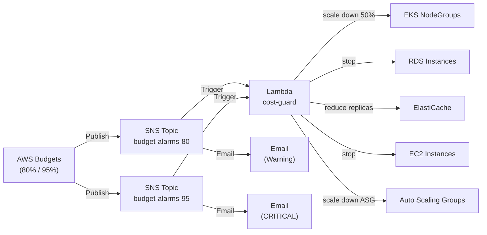

# Cost Guard Automation — Phân tích thay đổi & Rủi ro khi merge vào `develop`

> **Nhánh nguồn:** `feat/lambda-cost-guard`  
> **Nhánh đích:** `origin/develop`  
> **Ngày phân tích:** 2026-07-19

---

## 1. Tổng quan thay đổi

Nhánh `feat/lambda-cost-guard` bổ sung module **Cost Guard Automation** — một hệ thống tự động phản ứng khi AWS Budget Alarms kích hoạt, nhằm bảo vệ ngân sách bằng cách scale-down hoặc stop các tài nguyên AWS.

### Sơ đồ luồng hoạt động



---

## 2. Danh sách file thay đổi so với `develop`

| File | Trạng thái | Mô tả |
|---|---|---|
| `terraform/modules/cost_guard_automation/main.tf` | **NEW** | Toàn bộ infrastructure module: SNS, IAM, Lambda, Budget |
| `terraform/modules/cost_guard_automation/index.py` | **NEW** | Python 3.11 Lambda handler logic |
| `terraform/modules/cost_guard_automation/variables.tf` | **NEW** | Định nghĩa biến module |
| `terraform/modules/cost_guard_automation/outputs.tf` | **NEW** | Outputs của module |
| `terraform/environments/sandbox/main.tf` | **MODIFIED** | Gọi module `cost_guard_automation` |
| `terraform/environments/sandbox/variables.tf` | **MODIFIED** | Thêm 8 biến Cost Guard |
| `terraform/environments/sandbox/outputs.tf` | **MODIFIED** | Thêm 8 outputs Cost Guard + duplicate `msk_secret_arn` |
| `terraform/environments/sandbox/providers.tf` | **MODIFIED** | Thêm `archive` provider + duplicate `data.aws_caller_identity` |
| `terraform/environments/sandbox/cost_guard.auto.tfvars.example` | **NEW** | File ví dụ cấu hình |
| `terraform/environments/sandbox/cost_guard.auto.tfvars` | **NEW** | File cấu hình thực tế (có email thật) |
| `terraform/md/COST_GUARD_SETUP.md` | **NEW** | Tài liệu setup |
| `terraform/modules/rds/outputs.tf` | **MODIFIED** | Thêm output `instance_id` |
| `terraform/modules/elasticache/outputs.tf` | **MODIFIED** | Thêm output `cluster_id` |
| `platform/.../cost-breakdown-dashboard.json` | **MODIFIED** | Chuyển từ Athena sang CloudWatch |

---

## 3. Chi tiết thay đổi từng file

### 3.1. `terraform/environments/sandbox/main.tf`

Thêm mới block module gọi `cost_guard_automation`:

```hcl
module "cost_guard_automation" {
  count  = var.enable_cost_guard_automation ? 1 : 0
  source = "../../modules/cost_guard_automation"

  project_name   = var.project_name
  environment    = var.environment
  account_id     = data.aws_caller_identity.current.account_id
  budget_limit   = var.budget_limit
  budget_periods = var.budget_periods

  alert_emails = {
    threshold_80 = var.budget_alert_email_80
    threshold_95 = var.budget_alert_email_95
  }

  eks_cluster_name         = module.eks.cluster_name
  eks_cluster_arn          = module.eks.cluster_arn
  rds_instance_identifiers = [module.rds.instance_id]
  elasticache_cluster_ids  = [module.elasticache.cluster_id]

  lambda_timeout                = var.cost_guard_lambda_timeout
  lambda_memory                 = var.cost_guard_lambda_memory
  cloudwatch_log_retention_days = var.cost_guard_log_retention_days
}
```

> **Lưu ý:** Module dùng `count = 0` mặc định — an toàn, không tạo resource nào nếu chưa bật flag.

---

### 3.2. `terraform/environments/sandbox/providers.tf`

```diff
+ archive = {
+   source  = "hashicorp/archive"
+   version = "~> 2.0"
+ }

+ data "aws_caller_identity" "current" {}
```

> **Lỗi:** `data "aws_caller_identity" "current"` đã tồn tại ở `main.tf` (develop). Thêm lại ở `providers.tf` gây **lỗi duplicate** làm `terraform validate` thất bại.

---

### 3.3. `terraform/environments/sandbox/outputs.tf`

Thêm 8 outputs mới cho Cost Guard. Tuy nhiên output `msk_secret_arn` bị **khai báo 2 lần**:

```diff
# Dòng ~161 (cũ, từ develop)
  output "msk_secret_arn" { ... }

# Dòng ~208 (mới, bị duplicate)
+ output "msk_secret_arn" { ... }
```

---

### 3.4. `terraform/environments/sandbox/variables.tf`

Thêm 8 biến mới:

| Biến | Type | Default | Mô tả |
|---|---|---|---|
| `enable_cost_guard_automation` | bool | `false` | Bật/Tắt module |
| `budget_limit` | number | `1000` | Giới hạn USD/tháng |
| `budget_alert_email_80` | string | `""` | Email nhận cảnh báo 80% |
| `budget_alert_email_95` | string | `""` | Email nhận cảnh báo 95% |
| `budget_periods` | list(object) | `[]` | Danh sách kỳ budget tùy chỉnh |
| `cost_guard_lambda_timeout` | number | `300` | Timeout Lambda (giây) |
| `cost_guard_lambda_memory` | number | `512` | Bộ nhớ Lambda (MB) |
| `cost_guard_log_retention_days` | number | `14` | Số ngày giữ log CloudWatch |

---

### 3.5. Grafana Dashboard (`cost-breakdown-dashboard.json`)

| Thuộc tính | Trước (Athena) | Sau (CloudWatch) |
|---|---|---|
| Datasource | `athena` | `cloudwatch` |
| Query | SQL Presto/Athena | `AWS/Billing` namespace metrics |
| Variables | `athena_datasource`, `billing_database`, `billing_table`, `tag_key` | `cloudwatch_datasource`, `currency` |
| Số panels | 6 | 5 |
| Region | Không cố định | `us-east-1` (bắt buộc cho Billing) |
| Granularity | Per row (billing export) | Per day (`period = 86400`) |

---

## 4. AWS Resources được tạo mới

Khi `enable_cost_guard_automation = true`:

| Resource | Số lượng | Ghi chú |
|---|---|---|
| `aws_sns_topic` | 2 | budget-alarms-80 và budget-alarms-95 |
| `aws_sns_topic_subscription` (email) | 2 | Gửi email cảnh báo |
| `aws_sns_topic_subscription` (lambda) | 2 | Trigger Lambda |
| `aws_sns_topic_policy` | 2 | Cho phép Budgets publish |
| `aws_iam_role` | 1 | Role cho Lambda |
| `aws_iam_role_policy` | 4–6 | Inline policies (logs, eks, rds, elasticache, ec2) |
| `aws_cloudwatch_log_group` | 1 | `/aws/lambda/*-cost-guard` |
| `aws_lambda_function` | 1 | Python 3.11, 512MB, 300s |
| `aws_lambda_permission` | 2 | SNS invoke Lambda |
| `aws_budgets_budget` | 1–3 | Custom hoặc fallback monthly |

---

## 5. Hậu quả & Rủi ro khi merge vào `develop`

### 🔴 Lỗi nghiêm trọng — Blocker

| # | Vấn đề | File | Hậu quả |
|---|---|---|---|
| 1 | Duplicate `data "aws_caller_identity"` | `providers.tf` vs `main.tf` | `terraform validate` fail — CI/CD bị block |
| 2 | Duplicate output `msk_secret_arn` | `outputs.tf` dòng ~161 và ~208 | `terraform validate` fail — không apply được |

---

### 🟡 Rủi ro trung bình — Cần review kỹ

| # | Vấn đề | Mô tả | Khuyến nghị |
|---|---|---|---|
| 3 | Email thật trong `.auto.tfvars` | File bị commit lên git | Thêm vào `.gitignore` |
| 4 | Lambda scale EKS về 0 | False-positive alarm → toàn bộ workload tắt | Chỉ áp dụng môi trường dev/sandbox |
| 5 | Lambda stop RDS | RDS dừng → mất connection pool, rollback transaction | Thêm guard check trạng thái trước khi stop |
| 6 | `cost_filter` dùng `values = ["*"]` | AWS Budgets không hỗ trợ wildcard | Xóa block `cost_filter` |
| 7 | `time_period_start = "2024-01-01"` hardcode | Start date 2 năm trước | Đổi sang ngày hiện tại |

---

### 🟢 Rủi ro thấp — Có thể chấp nhận

| # | Vấn đề | Mô tả |
|---|---|---|
| 8 | Module tắt mặc định | `enable_cost_guard_automation = false` → không tạo resource |
| 9 | Archive provider thêm mới | Cần `terraform init` lại sau merge |
| 10 | Grafana dashboard thay đổi | Team đang dùng Athena sẽ mất panel cũ |

---

## 6. Các fix bắt buộc trước khi merge

### Fix 1 — Xóa duplicate `data "aws_caller_identity"` trong `providers.tf`

```diff
# terraform/environments/sandbox/providers.tf
- data "aws_caller_identity" "current" {}
```

### Fix 2 — Xóa duplicate `output "msk_secret_arn"` trong `outputs.tf`

```diff
# terraform/environments/sandbox/outputs.tf (xóa block thứ 2 ở ~dòng 208)
- output "msk_secret_arn" {
-   description = "ARN của Secret Manager lưu msk credentials"
-   value       = module.msk.msk_secret_arn
- }
```

### Fix 3 — Xóa `cost_filter` không hợp lệ trong module

```diff
# terraform/modules/cost_guard_automation/main.tf
- cost_filter {
-   name   = "Service"
-   values = ["*"]
- }
```

### Fix 4 — Không commit file `.auto.tfvars` có email thật

```bash
# Thêm vào terraform/environments/sandbox/.gitignore
echo "cost_guard.auto.tfvars" >> terraform/environments/sandbox/.gitignore
```

### Fix 5 — Sửa `time_period_start` của fallback budget

```diff
- time_period_start = "2024-01-01_00:00"
+ time_period_start = "2026-07-01_00:00"
```

---

## 7. Checklist trước khi tạo PR sang `develop`

- [ ] Xóa duplicate `data "aws_caller_identity"` ở `providers.tf`
- [ ] Xóa duplicate output `msk_secret_arn` ở `outputs.tf`
- [ ] Fix hoặc xóa `cost_filter` với `values = ["*"]`
- [ ] Thêm `cost_guard.auto.tfvars` vào `.gitignore`
- [ ] Sửa `time_period_start` fallback budget về ngày hiện tại
- [ ] `terraform init` thành công ✅
- [ ] `terraform validate` thành công ✅
- [ ] `terraform plan -var="enable_cost_guard_automation=false"` → no changes ✅
- [ ] Review IAM permissions Lambda (quyền stop RDS, scale EKS về 0)
- [ ] Email subscriptions phải được confirm từ hộp thư sau khi apply

---

## 8. Lệnh kiểm tra nhanh

```bash
cd terraform/environments/sandbox

# Kiểm tra syntax và duplicate
terraform init -backend=false
terraform validate

# Plan an toàn (cost guard TẮT)
terraform plan \
  -var="enable_cost_guard_automation=false" \
  -var-file="terraform.tfvars"

# Plan cost guard BẬT (xem resource tạo mới)
terraform plan \
  -var="enable_cost_guard_automation=true" \
  -var="budget_alert_email_80=your@email.com" \
  -var="budget_alert_email_95=your@email.com" \
  -var-file="terraform.tfvars"
```
