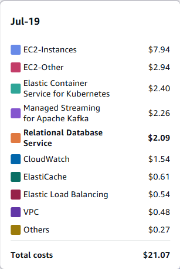
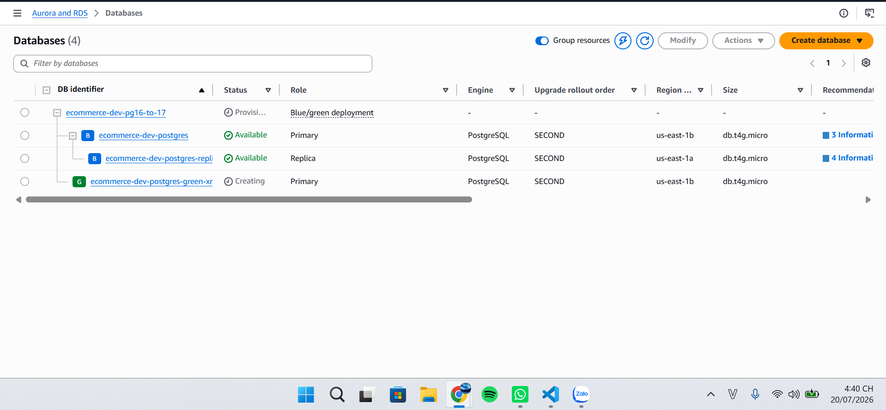
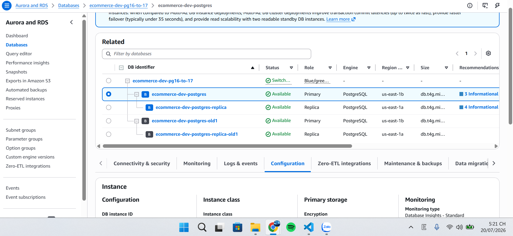
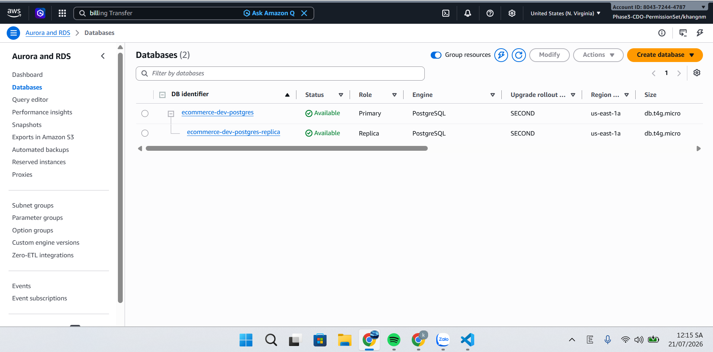
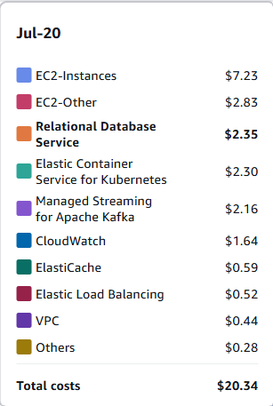

# CDO-TBD8 – Cost Optimization for Managed Zero-Downtime Operations (MANDATE-09)

> **Owner:** Nguyễn Mạnh Khang  
> **Directive:** MANDATE-09 – Managed Zero-Downtime Operations  
> **Pillar:** Cost Optimization (AWS Well-Architected Framework)  
> **Version:** 1.0  
> **Last Updated:** 18/07/2026

---

# Mục lục

- 1. Giới thiệu
- 2. Kiến trúc hệ thống
- 3. Phân tích chi phí Blue/Green Deployment
- 4. Blue-Green Cost Runbook
- 5. Cleanup Plan
- 6. Cost Monitoring Dashboard
- 7. Grafana Dashboard Queries
- 8. AWS Budget & Cost Anomaly Detection
- 9. Evidence cần thu thập
- 10. Final Cost Optimization Report


---

# 1. Giới thiệu

## 1.1 Mục tiêu

Tài liệu này mô tả toàn bộ chiến lược tối ưu chi phí trong quá trình thực hiện
Blue/Green Deployment của MANDATE-09.

Mục tiêu:

- Giữ chi phí phát sinh ở mức thấp nhất.
- Không để tài nguyên dư thừa sau Migration.
- Không vượt Budget.
- Không phát sinh Cost Anomaly.
- Có đầy đủ bằng chứng để trình bày với Mentor.

---

## 1.2 Phạm vi

Bao gồm

- Cost Analysis
- Blue/Green Cost Runbook
- Cleanup
- Cost Dashboard
- Budget
- Cost Anomaly Detection
- Final Report
---

## 1.3 Kiến trúc hệ thống

| Thông tin | Giá trị |
|------------|----------|
| AWS Region |us-east-1 |
| Kubernetes Version |eks.7 |
| RDS Engine |PostgreSQL |
| Engine Version |16.14 |
| DB Instance Class |db.t4g.micro|
| Storage Type |General Purpose SSD (gp2) |
| Multi AZ |Yes |
| Karpenter Version |1.14.0 |
| EC2 Instance Type |t3.small, t3a.medium, t3.medium, t3.large*2 |

# 2. Phân tích chi phí Blue/Green Deployment

## 2.1 Mục tiêu

Phân tích mức chi phí phát sinh khi tạo môi trường Green trong quá trình Migration.

---

## 2.2 Kiến trúc

```
Blue

↓

Create Green

↓

Migration

↓

Switch Traffic

↓

Delete Blue
```

---

## 2.3 Phân tích tài nguyên

| Resource | Blue | Green | Tổng(Ước tính cho 1-2 giờ test) |
|-----------|------|--------|------|
| DB Instance |db.t4g.micro |db.t4g.micro |~$0.16 + $0.016 USD|
| Storage |gp2 / 20 GB |gp2 / 20 GB |~ $0.01 + $0.01 USD |
| Backup |7 ngày |7 ngày |$0 |
| IOPS |100 (gp2) |100 (gp2)|$0 |

---

## 2.4 Chi phí phát sinh

| Hạng mục | Giá trị |
|----------|----------|
| Chi phí Blue | $0.17 |
| Chi phí Green | $0.17 |
| Thời gian tồn tại Green | 2 giờ (dự kiến) |
| Tổng Cost tăng |$0.17 |

---

## 2.5 Đánh giá

- **Có over-provision không?**
    - Hiện tại **không bị over-provision**. Việc sử dụng `db.t4g.micro` là cấu hình tối ưu cho môi trường `dev` với tải thấp. Cấu hình `gp2` với 20 GB là mức tối thiểu để đạt được hiệu năng baseline 100 IOPS, đảm bảo hệ thống phản hồi ổn định trong quá trình switchover.
- **Có thể giảm Instance Class không?**
    - **Không nên giảm**. `db.t4g.micro` đã là loại instance có chi phí thấp nhất trong dòng T4g. Nếu giảm xuống thấp hơn, bạn có thể gặp rủi ro về hiệu năng và gián đoạn kết nối khi thực hiện major upgrade từ PostgreSQL 16 lên 17.
- **Có thể giảm thời gian Green tồn tại không?**
    - **Có thể tối ưu**. Thời gian tồn tại của Green phụ thuộc vào tốc độ đồng bộ (replication lag) giữa Blue và Green. Để giảm thời gian này, bạn có thể thực hiện việc tạo Green Deployment vào thời điểm lưu lượng truy cập thấp và thực hiện `cleanup` ngay lập tức sau khi xác nhận các chỉ số `curl 200` cũng như logs từ Grafana ổn định.
---
# 3. Blue-Green Cost Runbook

## Stage 1 – Pre-check
* [ ] **Cost Baseline**: Ghi lại chi phí hàng tháng hiện tại để làm cơ sở so sánh.
* [ ] **Budget**: Đảm bảo ngân sách dự phòng đủ cho chi phí phát sinh khi chạy song song.
* [ ] **Cost Dashboard**: Truy cập `Cost Explorer` hoặc `CloudWatch` để sẵn sàng theo dõi.
* [ ] **Alert**: Thiết lập cảnh báo chi phí (Cost Anomaly) nếu phát sinh đột biến.
* [ ] **Backup**: Xác nhận đã có snapshot an toàn (lưu ý: snapshot cũng phát sinh phí lưu trữ).

---

## Stage 2 – Create Green
* [ ] **Instance Class**: Xác nhận cấu hình tương thích (thường là `db.t4g.micro` để tối ưu chi phí)[cite: 1].
* [ ] **Storage**: Kiểm tra dung lượng `gp2` (20 GB) để đảm bảo không vượt quá nhu cầu[cite: 1].
* [ ] **Multi AZ**: Kiểm tra cấu hình `Multi-AZ: false` cho môi trường Green để giảm thiểu chi phí[cite: 1].
* [ ] **Parameter Group**: Đảm bảo cấu hình không gây lãng phí tài nguyên hệ thống.

---

## Stage 3 – Migration
* [ ] **Monitoring**: Theo dõi *Replication Lag* thường xuyên (lag cao có thể gây ảnh hưởng đến hiệu năng).
* [ ] **Cost**: Kiểm tra chi phí tổng hợp của **cả hai** môi trường đang hoạt động song song.

---

## Stage 4 – Switch Over
* [ ] **Checklist**: Xác nhận *Error Count*, *Active Connections* và *Latency* sau khi đổi Endpoint.
* [ ] **Verification**: Đảm bảo ứng dụng trỏ đúng vào database mới và hoạt động bình thường.

---

## Stage 5 – Validation
* [ ] **Time**: Theo dõi liên tục trong 30 phút (khoảng thời gian quan trọng trước khi quyết định Cleanup).
* [ ] **Stability**: Đảm bảo không có lỗi 5xx và chi phí đã ổn định ở mức của môi trường mới.
* [ ] **Final Decision**: Xác nhận không cần rollback trước khi tiến hành xóa tài nguyên cũ.

---

## Stage 6 – Cleanup (Tối ưu chi phí)
* [ ] **Delete Blue**: Xóa database Blue ngay sau khi xác nhận hệ thống ổn định.
* [ ] **Delete Snapshot**: Xóa các snapshot của Blue không còn giá trị để giảm phí lưu trữ.
* [ ] **Parameter/Security Group**: Xóa các cấu hình/nhóm bảo mật không còn được sử dụng để làm sạch môi trường.
# 4. Cleanup Plan

## 4.1 Resource Inventory

| Resource | Delete | Keep |
|----------|--------|------|
| Blue DB |X (Xóa sau khi đã confirm hệ thống ổn định và hết thời hạn rollback) | |
| Snapshot |X (Xóa các snapshot cũ của Blue không còn giá trị) | |
| Parameter Group |X (Xóa nếu là cấu hình riêng cho Blue/tạm thời) | |
| Security Group | |X (Nếu là các nhóm bảo mật dùng chung hoặc đã cấu hình cho Green) |

---

## 4.2 Cleanup Flow

```
Switch

↓

Monitor

↓

Delete Blue

↓

Delete Snapshot

↓

Done
```

---
# 5. Cost Monitoring Dashboard

## Dashboard Layout

### Row 1

Infrastructure

- EC2
- RDS
- EBS

---

### Row 2

Kubernetes

- CPU
- Memory
- Pods
- Nodes

---

### Row 3

Migration

- Connections
- Errors
- Latency

---

### Row 4

Cost

- Estimated Cost
- Budget
- Spot Ratio

---

# 6. Grafana Queries

## CPU

```promql
sum(rate(container_cpu_usage_seconds_total[5m]))
```

---

## Memory

```promql
sum(container_memory_working_set_bytes)
```

---

## CPU Request

```promql
sum(kube_pod_container_resource_requests{resource="cpu"})
```

---

## Memory Request

```promql
sum(kube_pod_container_resource_requests{resource="memory"})
```

---

## Node Count

```promql
count(kube_node_info)
```

---

## Running Pods

```promql
count(kube_pod_status_phase{phase="Running"})
```

---

## 📌 Query cần bổ sung

- Spot Nodes
- Node Utilization
- RDS CPU
- RDS Connections
- Free Storage

---

# 7. AWS Budget

## Budget

> 📌 **Thông tin cần điền**

| Budget | Giá trị |
|----------|----------|
| Monthly Budget |$900 |
| Weekly Budget |$300 |
| Threshold 80% |$240 |
| Threshold 95% |$285 |

# 8. Cost Anomaly Detection

## Monitor

> 📌 **Thông tin cần điền**

| Thuộc tính | Giá trị |
|------------|----------|
| Monitor Name |monitor-all-services |
| Threshold |$20|
| Notification | ndtien317@gmail.com, Nhatphanhk102@gmail.com, nguyenkhang.28102004@gmail.com|

---

# 9. Evidence cần thu thập

## Trước Migration
- Mô tả: Ảnh chụp Cost Explorer ghi nhận chi phí nền tảng (baseline) của hệ thống trước khi bắt đầu triển khai môi trường Green.


---
## Trong Migration
- Mô tả: Giao diện AWS Console thể hiện quá trình khởi tạo thành công môi trường Green với phiên bản PostgreSQL 17.10 song song với Blue (16.14).

- Mô tả: Nhật ký/Trạng thái thực hiện lệnh switchover, đánh dấu thời điểm chuyển đổi endpoint ứng dụng sang Green thành công.

### Timeline

| Event | Timestamp |
|---------|-----------|
| Green Environment Created |16h35 |
| Database Upgrade Started |16h50 |
| Switch Over |17h15 |
| Validation Completed |17h17 |
| Blue Environment Deleted |0h15 |

---

### Cost Observation

| Hạng mục | Giá trị |
|----------|----------|
| Blue Environment | Running |
| Green Environment | Running |
| Tổng thời gian chạy song song |7h40m |
| Chi phí phát sinh (Estimated) |~$0.3 (thêm chi phí của glue khi chạy song song) |

## Sau Migration
- Mô tả: Giao diện AWS Console xác nhận tài nguyên Blue cũ đã được xóa hoàn toàn, hệ thống chỉ duy trì môi trường Green làm Primary mới.

- Mô tả: Ảnh chụp Cost Explorer sau khi hoàn tất dọn dẹp, chứng minh chi phí đã quay lại mức ổn định và không phát sinh chi phí dài hạn sau khi tối ưu.

---

# 10. Final Cost Optimization Report

## Trước Migration

| Hạng mục | Giá trị |
|-----------|----------|
| Daily Cost |~$20.6 |
| DB Cost |~$2.09 |

---

## Trong Migration

| Hạng mục | Giá trị |
|-----------|----------|
| Cost tăng |~0.3 |
| Budget vượt? |không|
| Cost Anomaly? |Không cảnh báo |

---

## Sau Migration

| Hạng mục | Giá trị |
|-----------|----------|
| Blue Deleted |yes |
| Green Running |yes |
| Daily Cost |$21-$22 (dự đoán do chưa đủ 24h nên chưa có Cost Explorer)|
| Cleanup Success |yes |
