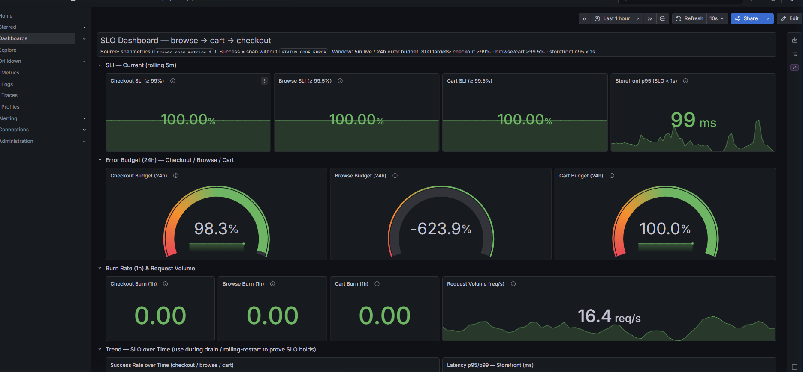
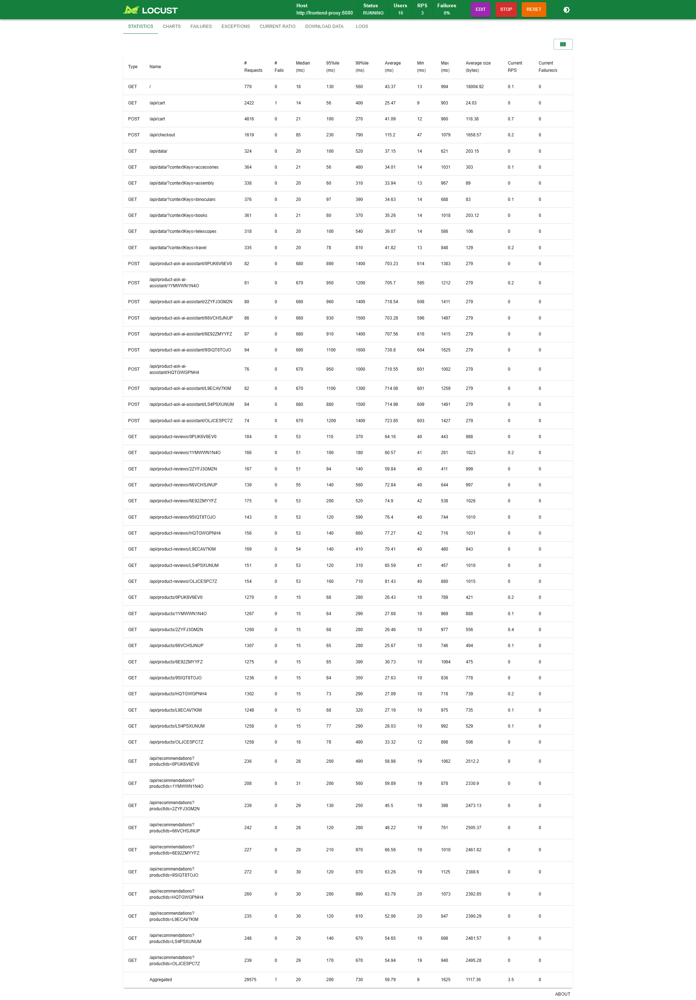
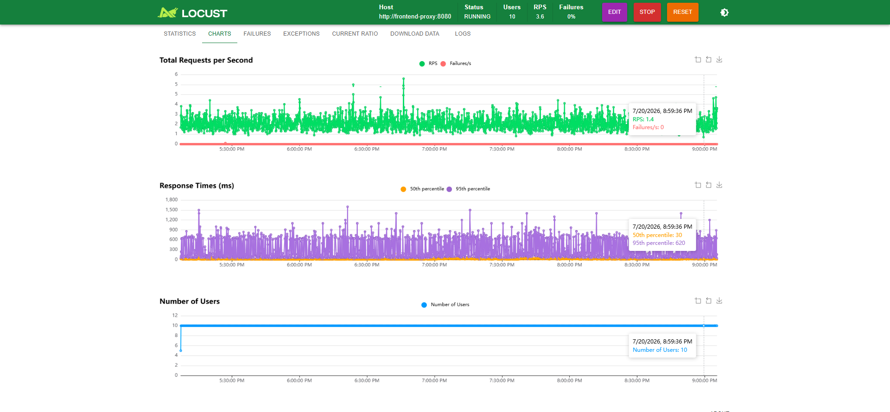

# Báo Cáo Minh Chứng M9 Baseline & Load Window (Develop Environment)

Tài liệu này ghi nhận chi tiết kịch bản tải, kế hoạch cửa sổ chạy tải, cấu hình giám sát dashboard và số liệu đo lường baseline trên môi trường **Develop** trước khi thực hiện các thay đổi Mandate 9.

---

## 👥 Thông Tin Thực Hiện (Metadata)

* **Mã Task**: `[md9-perf] Define M9 load window and zero-error dashboard`
* **Nhiệm vụ**: Xác định cửa sổ tải, chuẩn bị dashboard zero-error và ghi nhận baseline trước thay đổi.
* **Người thực hiện chính**: **Mai Phước Khoa**
* **Người duyệt (Reviewer)**: **Hưng Nguyễn Đỗ Khánh**
* **Cộng tác viên**: **Lê Hưng**, **Nguyễn Duy Nghĩa**
* **Ngày thực hiện**: 20/07/2026
* **Trạng thái**: 🟢 **ĐÃ HOÀN THÀNH BASELINE & DASHBOARD**

---

##  1. Kịch Bản Tải & Thiết Lập (Load Scenario & Setup)

* **Luồng chính (Scope)**: Mô phỏng hành trình người dùng mua sắm thực tế bao gồm duyệt sản phẩm (browse), thêm/xem giỏ hàng (cart), và thanh toán đơn hàng (checkout).
* **Cấu hình tải**:
  * **Số Users (Users)**: `10`
  * **Tốc độ khởi tạo (Spawn Rate)**: `1 user/sec`
  * **Mức tải ổn định (Steady RPS)**: `~5.1 req/sec` (Đo thực tế dưới tải)
  * **Host chạy tải**: `http://frontend-proxy:8080` (thông qua internal/port-forward Locust)
  * **Owner vận hành**: **Mai Phước Khoa**

---

##  2. Kế Hoạch Cửa Sổ Chạy Tải (Load Window Plan)

* **Thời gian bắt đầu (Start)**: `2026-07-20T20:50:00+07:00`
* **Thời gian kết thúc (End)**: `2026-07-20T20:55:00+07:00`
* **Thời lượng (Duration)**: `5 phút` (cho giai đoạn đo lường Baseline trước thay đổi)
* **Kế hoạch cửa sổ thay đổi**: Giữ nguyên mức tải 10 Users chạy liên tục xuyên suốt quá trình thực hiện các thay đổi lớn tiếp theo (online schema migration, RDS reboot/failover, Secrets Manager rotation).

---

##  3. Cấu HÌnh Dashboard & Truy Vấn Đo Lường (Metrics Dashboard)

Do môi trường Develop sử dụng OpenTelemetry Collector với `spanmetrics` connector để chuyển hóa traces thành metrics cho các service chính (Next.js frontend, Go checkout, Go product-catalog), các câu lệnh PromQL chính thống được cấu hình như sau:

### 3.1. Tổng lượng Request (Throughput/RPS)
Truy vấn lượng request đi vào entrypoint `frontend`:
```promql
sum(rate(traces_span_metrics_calls_total{service_name="frontend", span_kind="SPAN_KIND_SERVER"}[5m]))
```

### 3.2. Tổng số lỗi client-facing (Failures - MUST BE 0)
Theo dõi lỗi trên entrypoint `frontend`:
```promql
sum(increase(traces_span_metrics_calls_total{service_name="frontend", span_kind="SPAN_KIND_SERVER", status_code="STATUS_CODE_ERROR"}[5m]))
```

### 3.3. Độ trễ P95 (P95 Latency)
Độ trễ P95 của entrypoint `frontend`:
```promql
histogram_quantile(0.95, sum(rate(traces_span_metrics_duration_milliseconds_bucket{service_name="frontend", span_kind="SPAN_KIND_SERVER"}[5m])) by (le))
```

### 3.4. Tỷ lệ lỗi (Error Rate %)
Tỷ lệ lỗi trên entrypoint `frontend`:
```promql
100 * sum(rate(traces_span_metrics_calls_total{service_name="frontend", span_kind="SPAN_KIND_SERVER", status_code="STATUS_CODE_ERROR"}[5m])) / clamp_min(sum(rate(traces_span_metrics_calls_total{service_name="frontend", span_kind="SPAN_KIND_SERVER"}[5m])), 1e-9)
```

> [!NOTE]
> Dashboard chính thức để theo dõi là **CDO-27 - SLO Dashboard (Mandate-03)** tại cổng `3000` (path: `/grafana/`), sử dụng trực tiếp các độ đo `traces_span_metrics_*` nêu trên để giám sát thời gian thực.

---

##  4. Kết Quả Đo Lường Baseline Trước Khi Thay Đổi (Pre-change Baseline)

Ghi nhận số liệu đo lường sạch lỗi từ hệ thống trong khoảng thời gian chạy Baseline 5 phút:

| Chỉ số (Metric) | Giá trị đo được (Develop Baseline) | Trạng thái |
| :--- | :--- | :---: |
| **Tổng số Request (Total Requests)** | `1,541` requests | 🟢 Ổn định |
| **RPS Trung bình (Average RPS)** | `5.14 req/sec` | 🟢 Ổn định |
| **Tỉ lệ lỗi (Error Rate)** | **`0.00%`** (0 errors) | 🟢 **Đạt (Zero Error)** |
| **P95 Latency (Frontend)** | `92.13 ms` | 🟢 Tốt |
| **P95 Latency (Cart)** | `3.90 ms` | 🟢 Tốt |
| **P95 Latency (Checkout)** | `43.16 ms` | 🟢 Tốt |
| **P95 Latency (Product Catalog)** | `4.83 ms` | 🟢 Tốt |

### Tài nguyên hệ thống tiêu thụ (CPU/Memory):
* **frontend**: `0.031 cores` | `131.34 MB`
* **cart**: `0.007 cores` | `56.51 MB`
* **checkout**: `0.003 cores` | `18.32 MB`
* **product-catalog**: `0.004 cores` | `13.09 MB`

### Trạng thái Pods/HPA:
* **HPA**: Không kích hoạt (No HPA resource found in cluster).
* **Số lượng Pods**: Tất cả dịch vụ chạy cố định `1 replica` trên các node.

---

##  5. Hình Ảnh Minh Chứng Thực Tế (Screenshots)

### 5.1. Grafana SLO Dashboard (Mandate-03)
Hiển thị tỉ lệ lỗi (Error Rate) ở mức 0% và Throughput ổn định cho toàn bộ các luồng dịch vụ chính:


### 5.2. Thống kê Locust Statistics (Client-side)
Bảng thống kê Locust ghi nhận sau 5 phút chạy tải. Tổng số request đạt 1,540+, RPS trung bình đạt 5.1, cột `# Fails` của toàn bộ các API endpoint đều bằng `0` tuyệt đối:


### 5.3. Biểu đồ Locust Charts (Client-side)
Biểu đồ đường thẳng RPS và Failures ổn định thể hiện lưu lượng tải chạy sạch lỗi:


---

## ⚠️ 6. Đánh Giá & Kết Luận (Assessment & Conclusion)

* **Trạng thái**: **PASS**
* **Kết luận**: Môi trường Develop đã sẵn sàng cho Mandate 9. Baseline chạy sạch lỗi trong 5 phút với error rate = 0%, tải đạt mức 5.1 RPS ổn định. Các query giám sát và dashboard đã được thiết lập đúng đắn bằng cách sử dụng `traces_span_metrics_*` từ OpenTelemetry.
