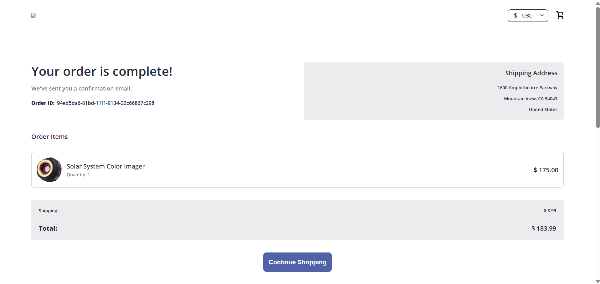
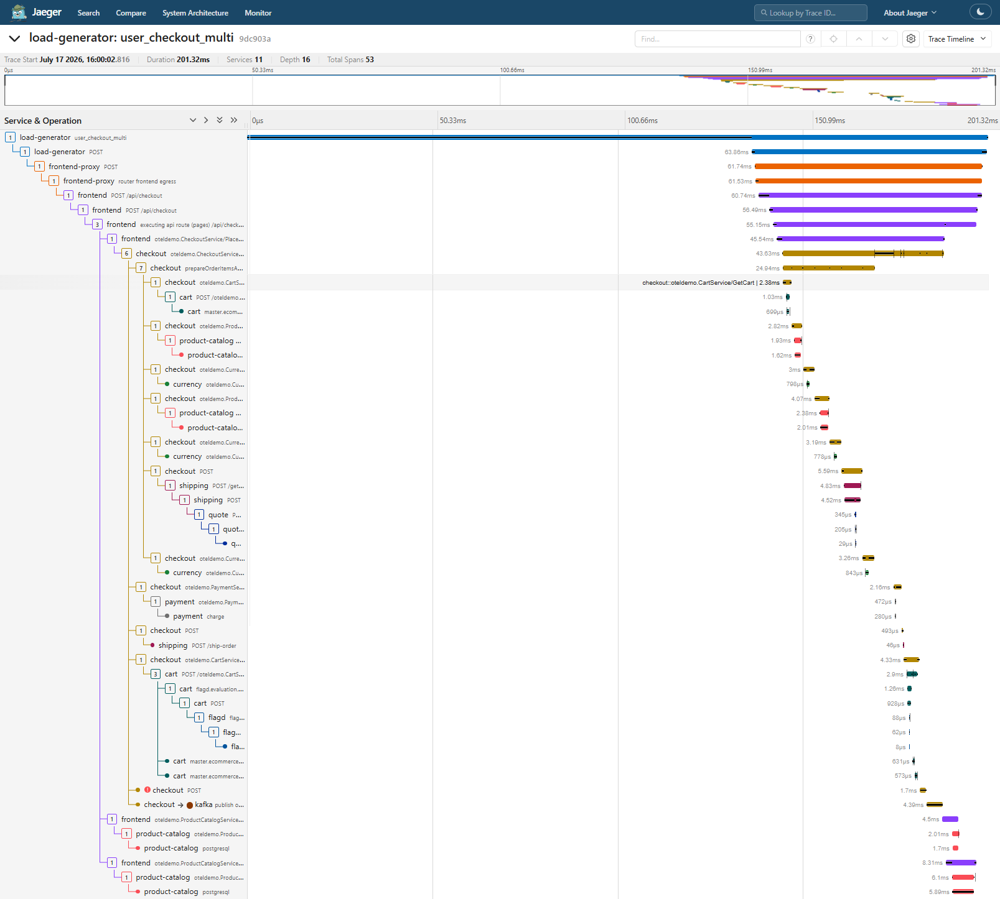

# CDO05-SLO-02: Smoke Checkout Flow and Jaeger Trace Evidence

Tài liệu này ghi nhận kết quả thực hiện chạy thử nghiệm (smoke test) luồng checkout trên storefront và phân tích trace tương ứng trên Jaeger để xác nhận hệ thống hoạt động ổn định và đo lường độ trễ (latency) của các dependency services.

---

## 1. Kết Quả Checkout Đơn Hàng (Storefront Checkout Success)

* **Trạng thái**: 🟢 Thành công (Successful)
* **Order ID**: `94ed5da6-81bd-11f1-9134-32c66867c298`
* **Sản phẩm mua**: Solar System Color Imager (Số lượng: 1)
* **Tổng tiền (Total)**: $183.99

**Ảnh chụp màn hình xác nhận đơn hàng thành công (Order Confirmation):**

---

## 2. Phân Tích Jaeger Trace (End-to-End Tracing)

* **Trace ID**: `9dc903a848e2ca8f577df99192ef47d6`
* **Thời gian bắt đầu (Trace Start)**: `July 17 2026, 16:00:02.816`
* **Tổng thời gian xử lý (Total Duration)**: `201.32 ms`
* **Số lượng Service tham gia (Services)**: `11`
* **Tổng số Span (Total Spans)**: `53`
* **Độ sâu Trace (Depth)**: `16`

**Ảnh chụp màn hình Jaeger Trace (Gantt Chart):**

---

## 3. Bảng Đo Lường Độ Trễ Của Các Dependency (Dependency Latency Note)

Dưới đây là thống kê chi tiết latency của các dependency chính được gọi từ dịch vụ `checkout` trong suốt tiến trình `PlaceOrder` (tổng thời gian xử lý tại `checkout` service là **43.63 ms**):

| Service / Dependency | Operation Name / Type | Latency (ms) | Notes & Performance |
| :--- | :--- | :---: | :--- |
| **cart** | `oteldemo.CartService/GetCart` | **2.38 ms** | Gọi trước khi tính toán đơn hàng. Chứa truy vấn Valkey Cache (`master.ecommerce-dev-valkey`) mất **699 us**. |
| **cart** (Empty) | `oteldemo.CartService/EmptyCart` | **4.33 ms** | Gọi sau khi checkout thành công. Chứa eval flagd (`1.26 ms`) và xóa cache Valkey. |
| **product-catalog** | `oteldemo.ProductCatalogService/GetProduct` | **2.82 ms** & **4.07 ms** | Thực hiện 2 lần gọi gRPC để lấy thông tin sản phẩm. Truy cập cơ sở dữ liệu PostgreSQL mất lần lượt **1.62 ms** và **2.01 ms**. |
| **currency** | `oteldemo.CurrencyService/Convert` | **3.00 ms**, **3.19 ms**, **3.26 ms** | Thực hiện 3 lần đổi tiền qua gRPC. Xử lý cực nhanh (phần xử lý nội bộ của currency service chỉ ~800 us). |
| **shipping** | `shipping POST /get-quote` | **5.56 ms** | Lấy báo giá phí vận chuyển. Gọi lồng sang `quote service` mất **4.52 ms**. |
| **shipping** (Ship) | `shipping POST /ship-order` | **0.49 ms** | Thực hiện giao hàng (gọi bất đồng bộ sau khi thanh toán). |
| **payment** | `payment oteldemo.PaymentService/Charge` | **2.16 ms** | Gọi dịch vụ thanh toán qua gRPC. Xử lý nội bộ mất **472 us**. |
| **email** | Không gọi trực tiếp | **0.00 ms** (Sync) | Dịch vụ email được kích hoạt bất đồng bộ (Asynchronous) qua Kafka Message Queue, không chặn luồng checkout đồng bộ của người dùng. |
| **Kafka** | `checkout -> kafka publish order_placed` | **4.39 ms** | Đẩy sự kiện đặt hàng thành công lên Kafka Topic để các service khác (như email, accounting) tiêu thụ. |

---

## 4. Nhận Xét & Đánh Giá Hiệu Năng (Observations & Highlights)

1. **Hiệu năng hệ thống (System Performance)**:
   - Tổng thời gian checkout đồng bộ (từ client gửi request đến khi nhận response từ `frontend`) chỉ mất **60.74 ms**, và thời gian thực thi tại core `checkout` service chỉ là **43.63 ms**. Đây là mức hiệu năng xuất sắc (well-performing), đáp ứng dư sức các tiêu chí SLO khắt khe nhất (thường là `< 500 ms`).
2. **Thiết kế phi đồng bộ (Asynchronous Pattern)**:
   - Hệ thống tối ưu hóa luồng checkout bằng cách đẩy tác vụ gửi email và hạch toán kế toán qua Kafka (`order_placed` topic). Thời gian publish lên Kafka chỉ mất **4.39 ms**, giúp giảm thiểu tối đa độ trễ phản hồi cho người dùng so với việc gọi đồng bộ dịch vụ email.
3. **Trạng thái lỗi (Errors)**:
   - Không phát hiện bất kỳ lỗi (Error Span) nào trong toàn bộ trace. Tất cả các service phản hồi thành công (HTTP 200 / gRPC OK).
