# Mandate 09 Evidence

**Phạm vi:** TBD1, TBD2, TBD3, TBD4, TBD5.  
**Môi trường:** Production, `us-east-1`, namespace `techx-tf1`.  
> *Lưu ý về Naming:* Dù Runtime App đang chạy ở môi trường Production (namespace `techx-tf1`), RDS instance name vẫn mang prefix `ecommerce-dev-*` do quy ước đặt tên hạ tầng kế thừa (không phải chạy nhầm trên cluster Develop).  
**Thư mục ảnh:** `docs/cdo09/evidence-mandate-09/screenshots/`.

File này là evidence chính để nộp Mandate 09. Mỗi ảnh bên dưới có phần giải thích ngay sau ảnh để reviewer hiểu ảnh đang chứng minh điều gì, thay vì chỉ paste screenshot rời rạc.

## 1. Mandate 09 Chứng Minh Gì?

Mandate 09 chứng minh các thao tác database operation trên Production có thể diễn ra theo hướng zero-downtime: app vẫn có traffic, request khách không rớt (`error count = 0`), SLI/burn rate không xấu kéo dài, latency phục hồi, pod vẫn ready, và RDS quay lại trạng thái `available` sau thao tác.

| Task | Nội dung chứng minh | Load generator | Evidence chính |
| --- | --- | --- | --- |
| TBD1 | App chịu DB blip bằng RDS Proxy + retry/pool | Curl loop `/api/products` trong cửa sổ failover | Grafana during/after + terminal stable/done |
| TBD2 | Online schema migration expand → backfill → dual-read (contract DROP hoãn) | Curl smoke từng bước migration (`bad=0`) + Grafana during | Baseline curl + psql expand/backfill/verify + Grafana |
| TBD3 | PostgreSQL major upgrade bằng RDS Blue/Green | Curl before/after switchover (`bad=0`) + Grafana during switchover | Terminal before/success + Grafana + AWS Console after |
| TBD4 | Static parameter bằng Multi-AZ force-failover | Curl baseline 8 + after-failover 20 (`bad=0`) + Grafana during | Terminal preflight/attach/verify + `SHOW` + Grafana |
| TBD5 | Live Credential Rotation | (xem §6) | (xem §6) |

## 2. Evidence TBD1 - Retry/Pool Chịu DB Blip

*(Session Time: 2026-07-20 ~15:48–15:58 ICT)*  
**Map mandate:** yêu cầu #5 — *app chịu được lúc kết nối đổi* (nền cho mọi thao tác TBD2–TBD4).

### 2.0 Kịch Bản Kỹ Thuật & Giải Pháp (Architecture & Strategy)

Để hệ thống chịu blip ngắn hạn khi RDS Multi-AZ failover mà không rớt request khách, kiến trúc dùng:

1. **RDS Proxy & Connection Pooling**
   - Microservices kết nối qua **RDS Proxy Endpoint**, không nối thẳng RDS Primary.
   - Proxy giữ pool TCP sẵn; khi primary failover, Proxy là lớp đệm — không trả ngay `Connection Refused` về app.
2. **App-Level Retry + Exponential Backoff & Jitter**
   - Driver/client DB retry 3–5 lần trên transient error thay vì fail 5xx ngay.
3. **Kiểm chứng under load**
   - **Load:** curl loop liên tục vào `/api/products` suốt cửa sổ failover (terminal nằm cạnh Grafana trên cùng ảnh during).
   - **Drill:** failover **primary** (~15:49–15:52) rồi **replica** (~15:52–15:58) — `logs/tbd1-drill-log.txt`.
   - **Pass:** Grafana request volume > 0, không error spike kéo dài; terminal stable/`DONE`; RDS `available`; không CrashLoopBackOff.

> *Lưu ý số liệu:* file log TBD1 chỉ ghi mốc thời gian failover (không dump `ok/bad` như TBD2–TBD4). Bằng chứng “không rớt request” của TBD1 lấy từ **Grafana during** (SLI/burn/latency) + **terminal curl loop** trên cùng khung hình, rồi Grafana after + `DONE`.

### 2.1 Grafana During Primary Failover

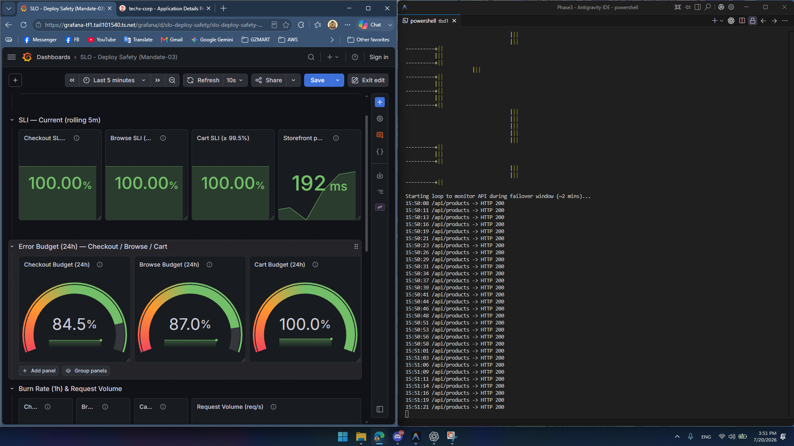

**Chứng minh:** trong lúc failover primary vẫn có traffic thật; panel SLI/burn/latency không ghi nhận lỗi kéo dài; terminal curl loop vẫn gọi `/api/products` → Proxy + retry hấp thụ blip, không rớt request hàng loạt.

### 2.2 Terminal Stable State

> *Note:* Ảnh số `02` không có trong bộ evidence — script polling gộp và chuyển thẳng sang Stable (`03`).

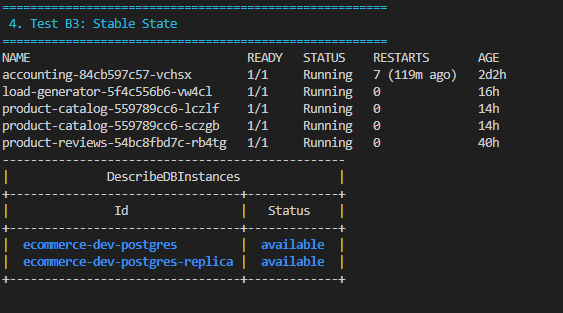

**Chứng minh:** sau failover, service/pod ready và RDS trở lại `available` — hệ thống phục hồi sau DB blip.

### 2.3 Terminal DONE

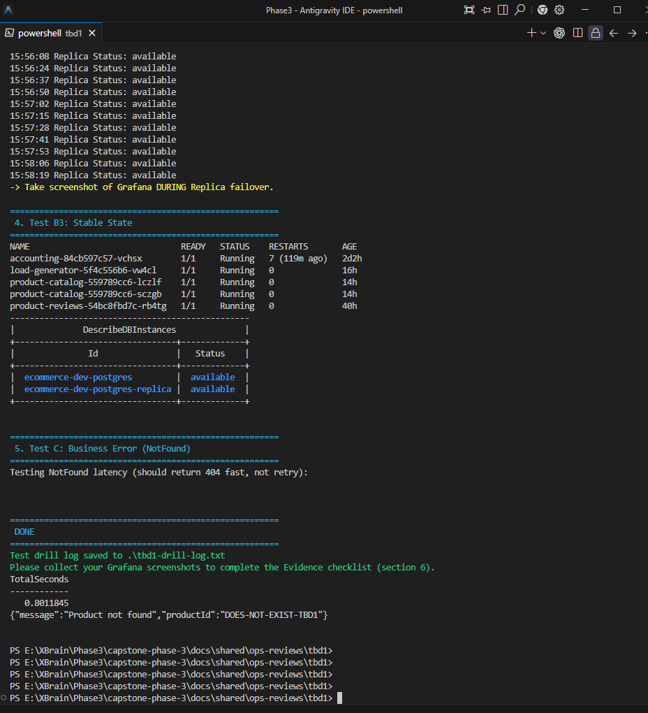

**Chứng minh:** script TBD1 chạy tới `DONE`, log đã lưu, không fail/crash-loop ở cuối drill.

### 2.4 Grafana After

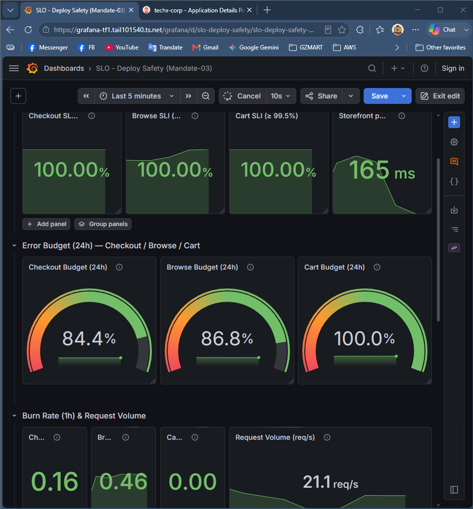

**Chứng minh:** sau DB blip, success rate và latency ổn định lại, pod phase bình thường — không downtime kéo dài sau khi RDS phục hồi.

### 2.5 Kết quả TBD1 (chốt)

| Hạng mục | Kết quả | Nguồn |
| --- | --- | --- |
| Primary failover window | ~15:49:33 → 15:52:39 ICT | `logs/tbd1-drill-log.txt` |
| Replica failover window | ~15:52:39 → 15:58:29 ICT | `logs/tbd1-drill-log.txt` |
| Request rớt kéo dài? | **Không** (Grafana during/after + curl loop) | §2.1, §2.4 |
| RDS / pod sau drill | `available` / ready, script `DONE` | §2.2, §2.3 |

## 3. Evidence TBD2 - Online Schema Migration Expand-Contract

*(Session Time: 2026-07-20 ~16:13–16:17 ICT)*  
**Map mandate:** yêu cầu #1 — *online schema migration dưới tải* (tâm điểm).

### 3.0 Kịch Bản Kỹ Thuật & Giải Pháp (Expand-Contract Pattern)

Thay đổi schema trên bảng `products` đang có traffic **không lock bảng, không downtime**. Pattern **Expand-Contract** và **phạm vi đã chạy trong drill**:

| Giai đoạn | Việc làm | Đã làm trong session này? | Evidence |
| --- | --- | --- | --- |
| **1. Expand** | `ALTER TABLE` thêm cột `image_url` **NULLABLE** (app cũ vẫn đọc/ghi `picture`) | **Có** | §3.2, §3.3 |
| **2. Dual-read** | App đọc `COALESCE(image_url, picture)` — ưu tiên cột mới, fallback cột cũ | **Có** (verify sau backfill) | §3.6 |
| **2b. Dual-write** | App ghi đồng thời `picture` + `image_url` cho record mới | **Có ý đồ trong pattern**; session verify tập trung dual-read + backfill (ghi mới sau expand đi qua path dual-write khi app dual đã bật) | §3.0, §3.6 |
| **3. Backfill** | `UPDATE` batch: `image_url = picture` cho hàng cũ; `COUNT(*) WHERE image_url IS NULL` = **0** | **Có** | §3.4 |
| **4. Contract (app)** | App ưu tiên cột mới sau backfill đầy đủ | **Có** (dual-read path ổn định) | §3.6 |
| **4b. Contract (DROP)** | `DROP COLUMN picture` | **Chưa** — cố ý giữ cột cũ làm đường lùi rollback / re-demo | Ghi rõ bên dưới |

> **Contract DROP hoãn có chủ đích:** Mandate yêu cầu expand-contract tương thích ngược. Sau expand+backfill+dual-read, **giữ `picture`** là bước an toàn (soft contract): schema mới đã dùng được, chưa cắt đường lui. Drop cứng chỉ làm khi app đã 100% trên `image_url` qua ≥1 release và có cửa sổ bảo trì — **không bắt buộc trong cửa sổ demo zero-downtime này**.

**Load:** curl smoke sau mỗi bước (`ok`/`bad` trong log) + Grafana during migration (request volume > 0).

**Kết quả số (toàn session):** `bad=0` ở mọi bước — baseline 10, sau expand 15, sau backfill 20, dual-read 15 → **tổng 60 request, 0 lỗi** (`logs/tbd2-test-log.txt`).

### 3.1 Terminal Baseline Curl

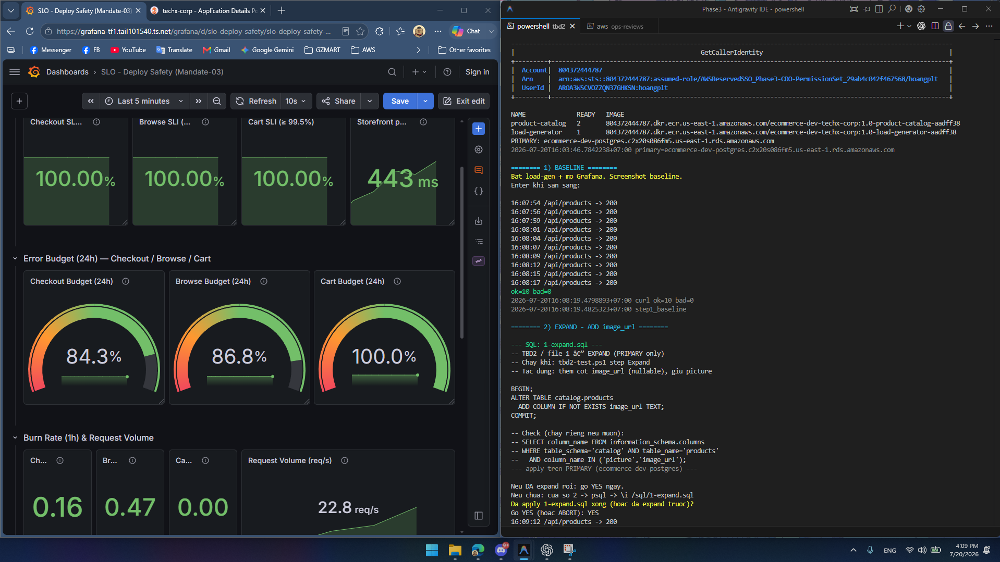

**Chứng minh:** baseline trước migration khỏe — HTTP 200, log `curl ok=10 bad=0`. Mốc trước khi đổi schema.

### 3.2 PSQL Expand Schema

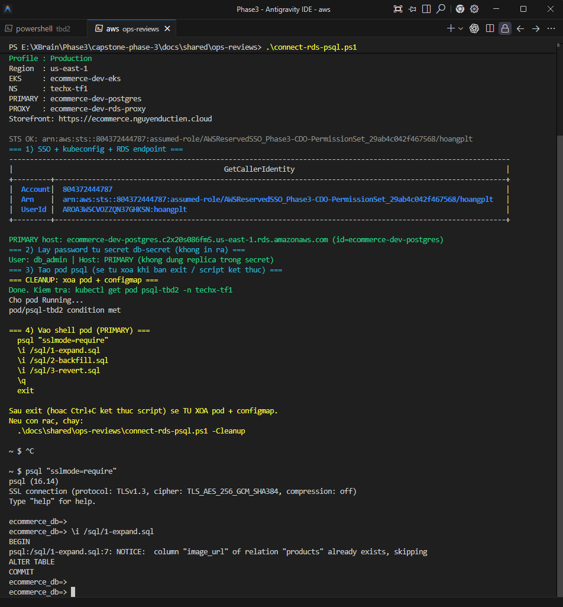

**Chứng minh:** bước expand qua psql thành công — thêm `image_url` NULLABLE, không lock/downtime app. Log ngay sau bước: `curl ok=15 bad=0`.

### 3.3 PSQL Verify Columns

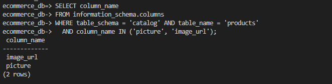

**Chứng minh:** cả `picture` và `image_url` cùng tồn tại — đúng expand (thêm field mới, **chưa** drop field cũ).

### 3.4 PSQL Backfill Verify

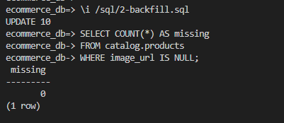

**Chứng minh:** backfill xong — record thiếu `image_url` = **0**. Dual-read có đủ dữ liệu cột mới. Log: `curl ok=20 bad=0` sau backfill.

### 3.5 Grafana During Migration

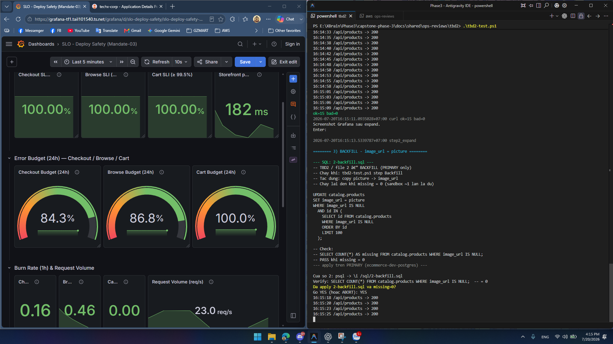

**Chứng minh:** lúc expand/backfill vẫn có traffic; Browse/Cart/Checkout SLI không rớt kéo dài; burn rate không spike bất thường; pod ổn định — migration **dưới load**.

### 3.6 Terminal Dual-Read DONE

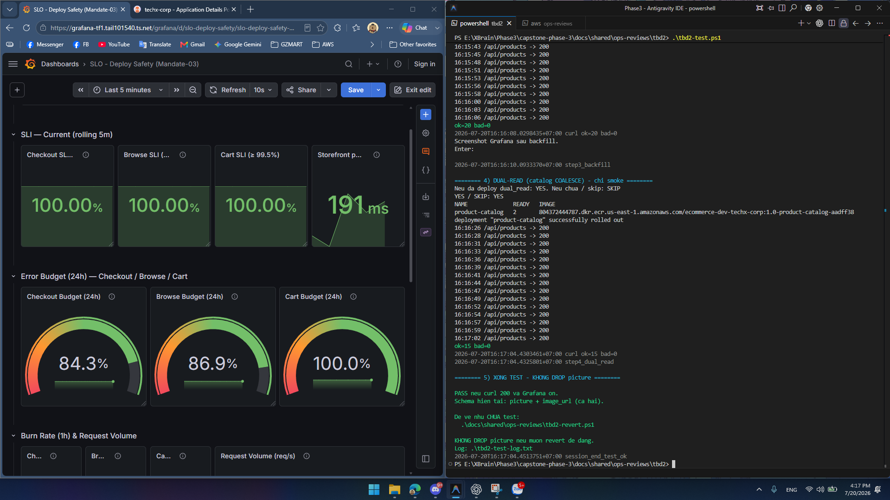

**Chứng minh:** app dual-read sau backfill OK; curl pass (`ok=15 bad=0`); session `session_end_test_ok`. Giữ song song `picture` + `image_url` = đường lùi rollback (chưa DROP).

### 3.7 Grafana After

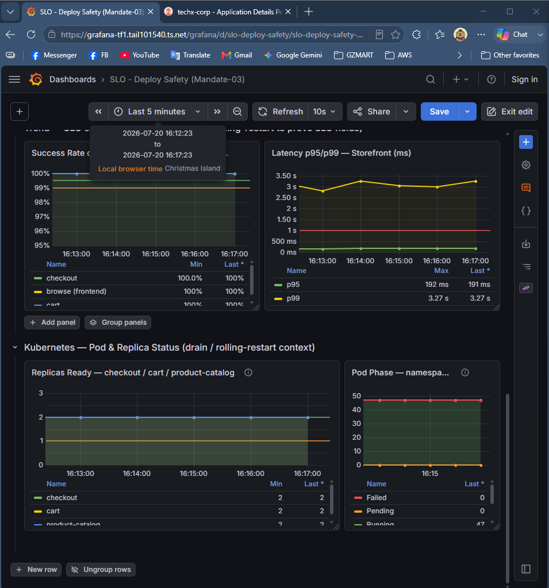

**Chứng minh:** sau migration, success rate không drop, burn rate không spike, latency hồi phục, pod ready.

### 3.8 Kết quả TBD2 (chốt)

| Bước | curl (log) | Schema / app |
| --- | --- | --- |
| Baseline | ok=10 bad=0 | Schema cũ |
| Expand | ok=15 bad=0 | + `image_url` NULLABLE |
| Backfill | ok=20 bad=0 | `image_url` đầy đủ |
| Dual-read | ok=15 bad=0 | `COALESCE(image_url, picture)` |
| **Tổng** | **ok=60 bad=0** | Contract DROP `picture`: **chưa** (rollback safety) |

## 4. Evidence TBD3 - PostgreSQL Major Upgrade Bằng RDS Blue/Green

*(Session Time: 2026-07-20 ~16:34–17:18 ICT)*  
**Map mandate:** yêu cầu #2 — *nâng version lớn, zero-downtime*.

### 4.0 Kịch Bản Kỹ Thuật & Giải Pháp (RDS Blue/Green Upgrade)

Major upgrade PostgreSQL **16.14 → 17.10** dưới tải bằng **AWS RDS Blue/Green Deployments**:

1. **Provisioning Green:** AWS tạo cụm Green PG 17.10; logical replication từ Blue (16) đang serve production.
2. **Staging trên Green:** có thể test endpoint Green riêng, không đụng Blue live.
3. **Switchover under load:** khi Green ready, switchover trong lúc app vẫn nhận traffic; DNS/endpoint chuyển sang Green; app qua **RDS Proxy** nuốt blip ngắn.

**Load trong session:**

- Curl smoke **trước** create BG: `ok=12 bad=0`.
- Cửa sổ provisioning Green (~40 phút): production vẫn trên Blue; Grafana baseline/traffic production.
- **Cửa sổ critical** = switchover (~17:16–17:18): Grafana during (§4.6) + curl sau switchover `ok=20 bad=0`.

### 4.1 Terminal RDS Before

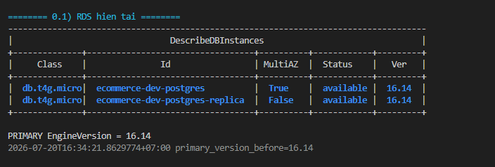

**Chứng minh:** trạng thái trước upgrade — primary version **16.14** (log: `primary_version_before=16.14`). Mốc before để đối chiếu 17.10.

### 4.2 Grafana Baseline

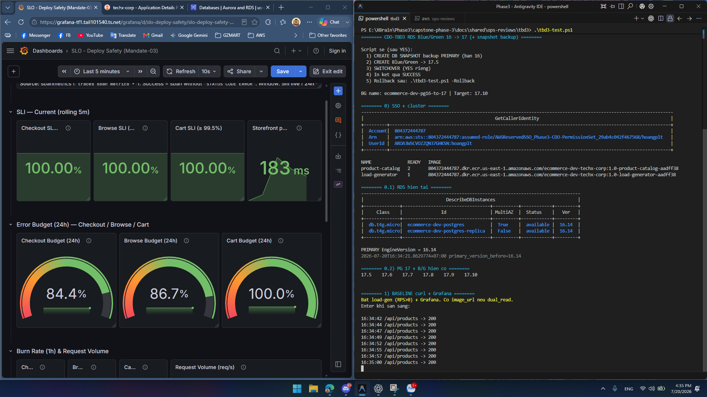

**Chứng minh:** traffic production ổn định trước khi tạo Blue/Green.

### 4.3 Terminal Create Blue/Green

> *Note Snapshot:* log có `SKIPPED-NO-SNAPSHOT`. Lab chủ đích bỏ snapshot tay để tiết kiệm thời gian; Blue/Green đã có Green để rollback nếu switchover lỗi.

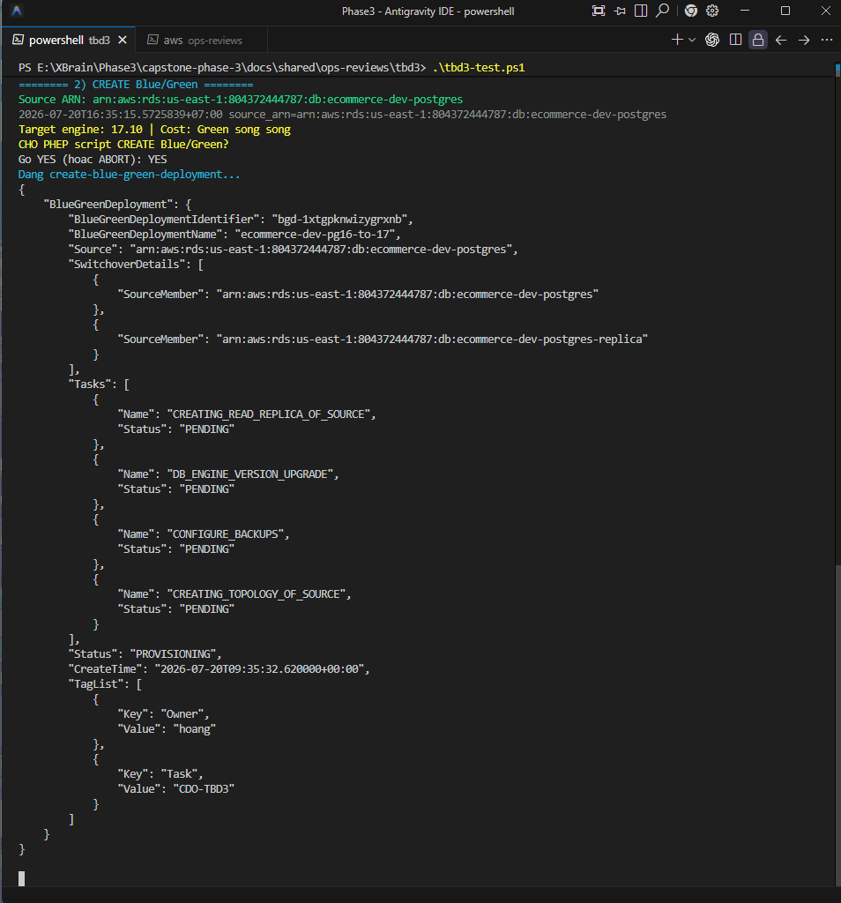

**Chứng minh:** API tạo Blue/Green thành công (`bg_id=bgd-1xtgpknwizygrxnb`), bắt đầu provision Green.

### 4.4 Terminal Polling Green

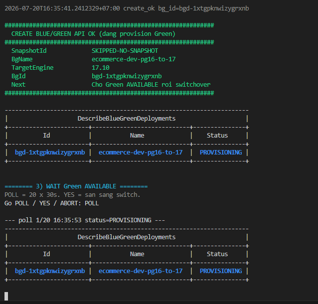

**Chứng minh:** script poll tới khi Green AVAILABLE trước switchover (`green_ready` ~17:16).

### 4.5 AWS Console Provisioning

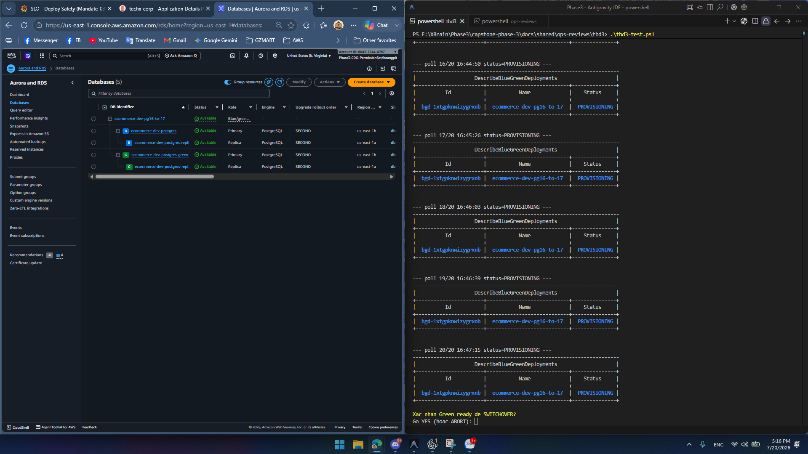

**Chứng minh:** Console AWS khớp terminal — Green đang provision / chờ Switchover.

### 4.6 Grafana During Switchover

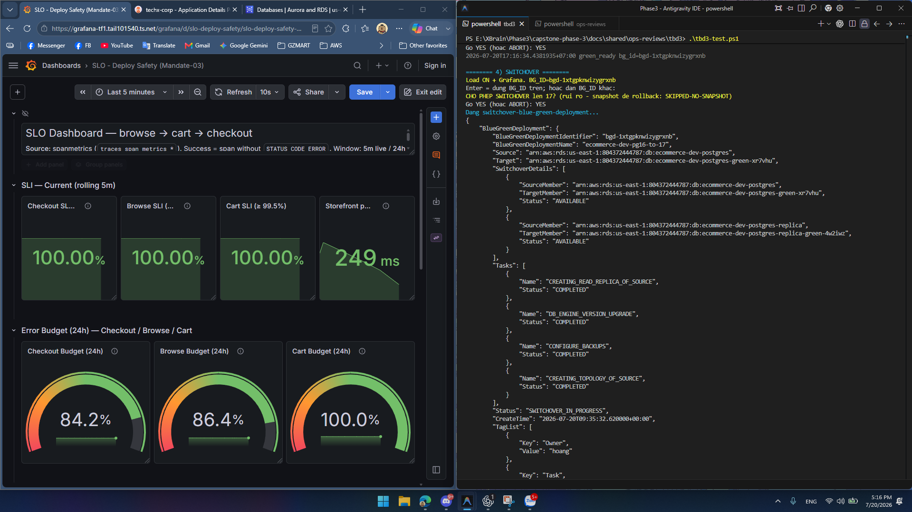

**Chứng minh:** lúc `SWITCHOVER_IN_PROGRESS` vẫn có traffic; dùng dashboard SLO kiểm tra SLI, burn rate, volume, latency, pod phase trong cửa sổ chuyển đổi.

### 4.7 Terminal Verify Success

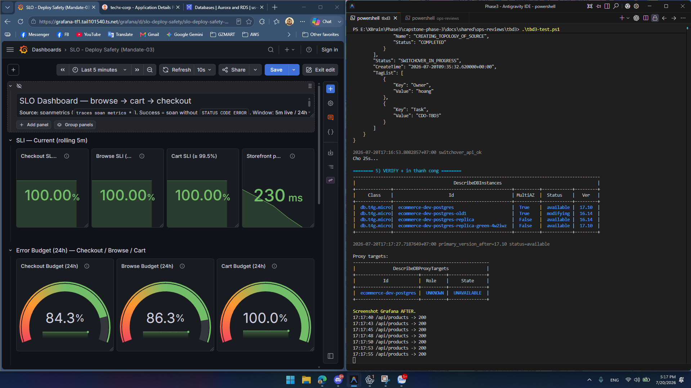

**Chứng minh:** sau switchover primary = **17.10**, status `available`; curl liên tục HTTP 200 — log **`curl ok=20 bad=0`**.  
> *Note:* proxy target cũ `UNAVAILABLE` là bình thường khi AWS cleanup topology Blue. Curl 200 liên tục = App → Proxy → DB Green thông suốt.

### 4.8 AWS Console After Switchover

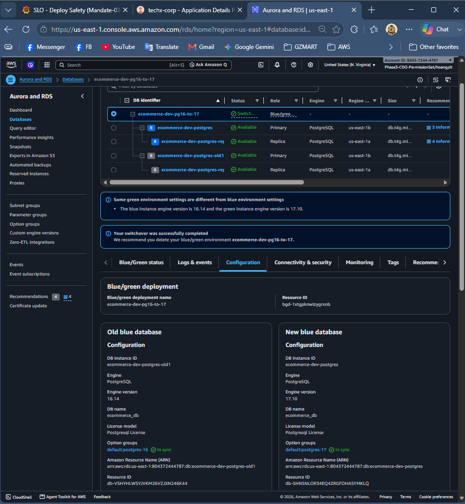

**Chứng minh độc lập ngoài terminal:** production RDS sau switchover chạy **PostgreSQL 17.10**.

### 4.9 Terminal Success Banner

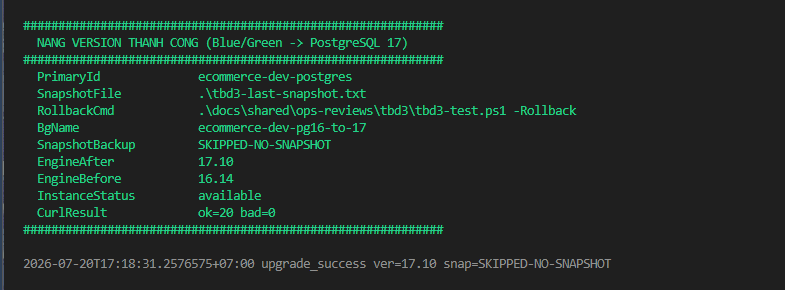

**Chứng minh:** script kết thúc với banner `NANG VERSION THANH CONG` / `upgrade_success ver=17.10`.

### 4.10 Grafana After

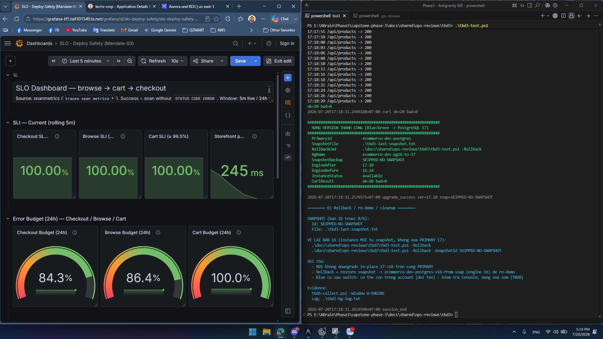

**Chứng minh:** sau switchover, traffic đều, SLO xanh, không lỗi rớt request kéo dài.

### 4.11 Kết quả TBD3 (chốt)

| Hạng mục | Before | After |
| --- | --- | --- |
| Engine version | **16.14** | **17.10** |
| Curl smoke | ok=12 bad=0 | ok=20 bad=0 |
| RDS status | available (Blue) | available (Green promoted) |
| Switchover API | — | `switchover_api_ok` ~17:16:53 |
| Error count (curl window) | **0** | **0** |

## 5. Evidence TBD4 - Static Parameter + Multi-AZ Failover

*(Session Time: 2026-07-21 ~00:12–00:17 ICT)*  
**Map mandate:** yêu cầu #3 — *đổi tham số cần reboot, zero-downtime*.

> [!NOTE]
> **Giải trình Terraform State (TBD4):**  
> Parameter `track_activity_query_size` được đổi **qua AWS CLI/API**, không `terraform apply`.  
> Lý do: trọng tâm là chứng minh **không downtime** khi force-failover để apply static param. Làm qua Terraform sẽ ghi cứng state, rollback demo nặng hơn. CLI + cờ rollback giúp reset mặc định **không dirty** Terraform state production.

### 5.0 Kịch Bản Kỹ Thuật & Giải Pháp (Static Parameter & Multi-AZ Failover)

RDS PostgreSQL: *dynamic* (hiệu lực ngay) vs *static* (cần restart engine). `track_activity_query_size` là **static**.

1. **Set static param trên custom PG:** `track_activity_query_size = 8192` (8kB), `apply_method=pending-reboot` (log: group `ecommerce-dev-postgres-pg-…`).
2. **Reboot with failover (Multi-AZ):** `aws rds reboot-db-instance --force-failover` — promote standby AZ phụ thành primary mới và nạp param, thay vì reboot “nằm im” vài phút.
3. **Traffic + verify:** RDS Proxy đệm blip; curl after-failover; SQL `SHOW track_activity_query_size` → **8kB**.

**Load:** curl baseline `ok=8 bad=0` → failover (~00:13:54–00:16:24) với Grafana during → curl after **`ok=20 bad=0`**.

**Preflight:** engine **17.10**, MultiAZ=true, status=available, PG in-sync (`logs/tbd4-param-log.txt`).

### 5.1 Terminal Preflight Multi-AZ

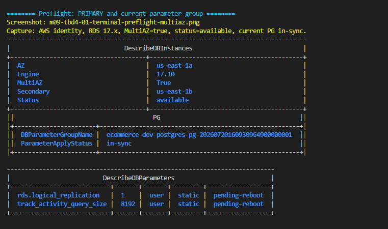

**Chứng minh:** trước đổi param — RDS available, Multi-AZ bật, engine 17.x, parameter group hiện tại ghi nhận (điều kiện an toàn cho force-failover).

### 5.2 Terminal Parameter Attach

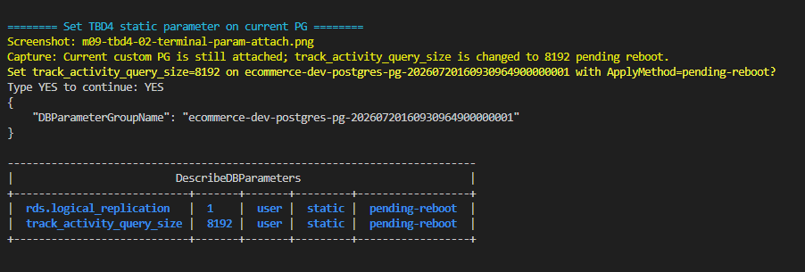

**Chứng minh:** static param đã set `8192` / pending-reboot trên custom PG đang gắn primary — cấu hình sẵn sàng chờ failover kích hoạt.

### 5.3 Grafana During Failover

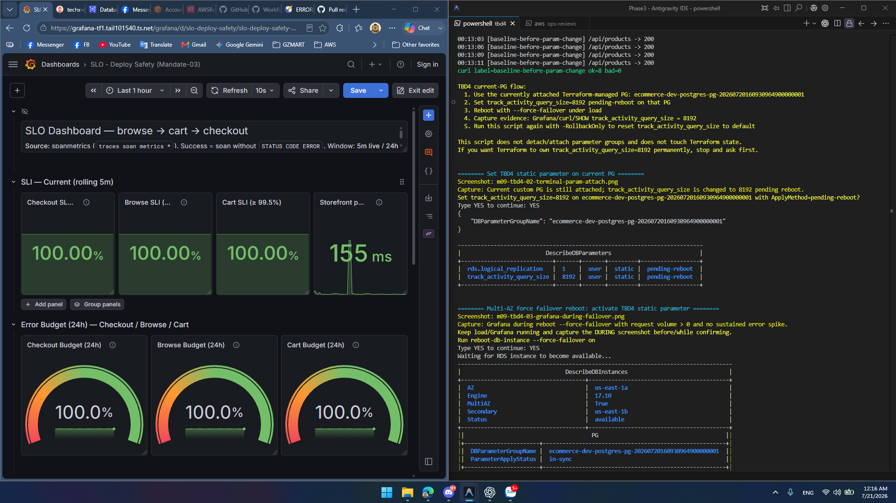

**Chứng minh (ảnh quan trọng nhất TBD4):** lúc `reboot --force-failover` vẫn có traffic; dashboard SLO không ghi nhận lỗi kéo dài — static param apply dưới load, không downtime rõ rệt.

### 5.4 Terminal Verify Curl

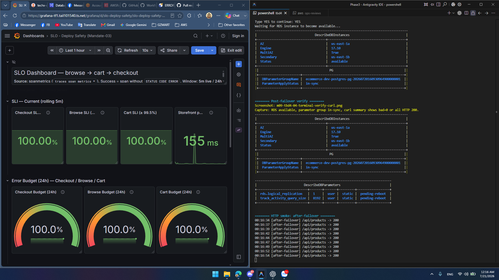

**Chứng minh:** sau failover RDS `available`, PG in-sync; curl smoke **20/20 HTTP 200** — log `curl label=after-failover ok=20 bad=0`.

### 5.5 Terminal SHOW Parameter

> *Note log:* `SHOW` chụp tay ngay sau script; log text kết thúc `pending_sql_show`, kết quả **8kB** nằm trên ảnh này.

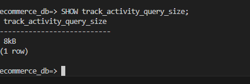

**Chứng minh:** trong PostgreSQL live, `SHOW track_activity_query_size` = **8kB** — param đã ăn ở data plane, không chỉ control plane AWS.

### 5.6 Grafana After

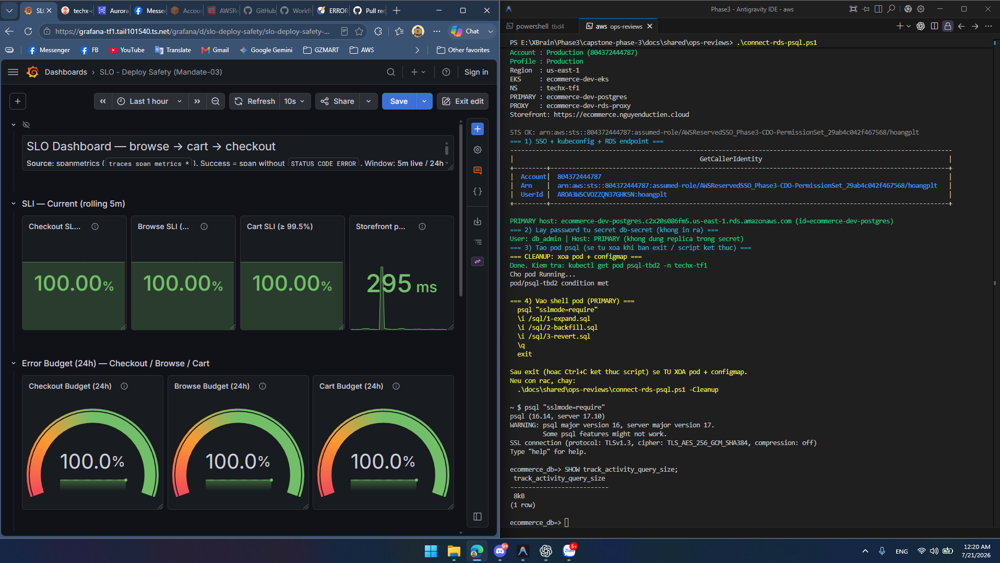

**Chứng minh:** sau failover apply param, SLO ổn định, latency phục hồi, pod phase không lỗi kéo dài.

### 5.7 Kết quả TBD4 (chốt)

| Hạng mục | Kết quả | Nguồn |
| --- | --- | --- |
| Param | `track_activity_query_size=8192` (pending-reboot → active) | log + §5.2, §5.5 |
| Curl baseline | ok=8 bad=0 | `logs/tbd4-param-log.txt` |
| Force-failover | done ~00:16:24 | log |
| Curl after | **ok=20 bad=0** | log + §5.4 |
| SQL verify | **8kB** | §5.5 |
| Error count | **0** | curl windows |

## 6. Evidence TBD5 - Live Credential Rotation (Xoay vòng bí mật không gián đoạn)

*(Session Time: 2026-07-22 ~17:44–18:02)*

### 6.1 AWS Secrets Manager Version Stages
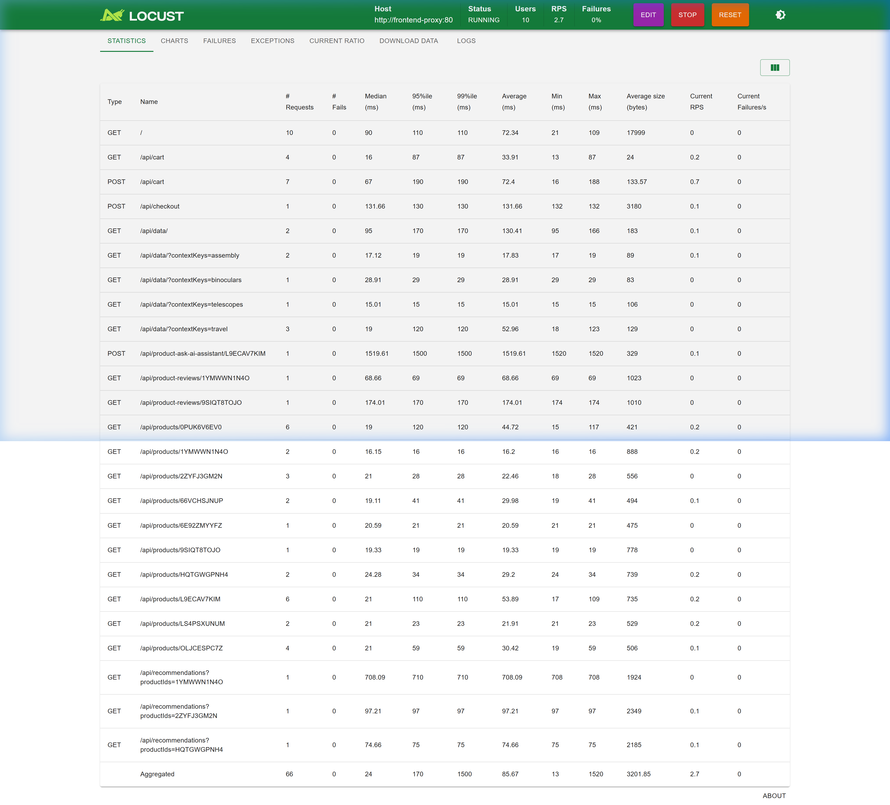
*(Lưu ý: Để tối ưu hóa bố cục tài liệu, ảnh chụp màn hình bắt đầu Locust Load Test `m09-tbd5-01-locust-swarm-start.png` cũng đồng thời chứng minh baseline của hệ thống bắt đầu chạy khỏe trước khi trigger rotation.)*

Lệnh gọi AWS CLI `list-secret-version-ids` ghi nhận phiên bản mật khẩu mới `026c77b0-12d4-42fa-837e-165c379a9200` được tạo ra lúc 17:48:02 (ICT) với cờ trạng thái `AWSCURRENT` và `AWSPENDING`, thay thế phiên bản cũ `terraform-*` (được đưa về `AWSPREVIOUS`). Điều này chứng tỏ Lambda Rotation Function đã cập nhật thành công thông tin mật khẩu mới lên backend database.

### 6.2 ESO Sync & K8s Secret Status
Lệnh `kubectl get externalsecret db-secret` trả về trạng thái `SecretSynced` và `READY=True` ngay sau khi trigger force-sync. Kubernetes Secret `db-secret` đã được cập nhật thành công với connection string mới (đã mã hóa ký tự đặc biệt bằng bộ lọc `urlquery` trong template).

### 6.3 Stakater Reloader Rolling Update Pods
Ngay khi Secret thay đổi, Stakater Reloader phát hiện và thực hiện Rolling Update tuần tự cho 3 microservices: `accounting`, `product-catalog`, và `product-reviews`.
Trạng thái pod sau rollout:
- `accounting-565587b6d9-b7q82`: 1/1 Running, 0 Restarts
- `product-catalog-8487957d58-ns7wv`: 1/1 Running, 0 Restarts
- `product-reviews-6dc9dbdbf7-6btqg`: 1/1 Running, 0 Restarts
Tất cả pod cũ đều được terminate sạch sẽ và êm ái nhờ có cấu hình lớp đệm `preStop` (sleep 5s) và HPA.

### 6.4 Locust Load Test Stats (Final)
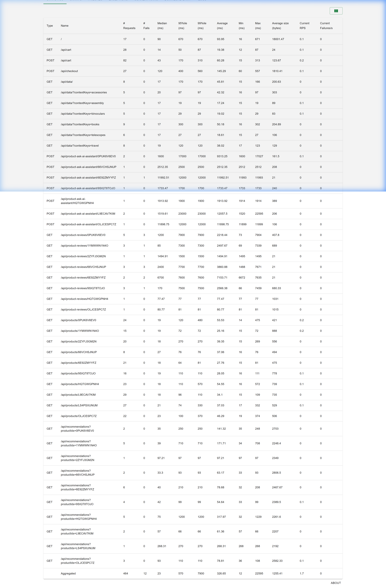

Ảnh chụp màn hình stats của Locust Load Test cuối chu kỳ chạy: ghi nhận **Current Failures/s = 0** và tỷ lệ lỗi tổng thể luôn duy trì ở mức tuyệt đối **0.0%**. Điều này chứng minh RDS Proxy đã bảo vệ thành công các kết nối active, không để rớt bất kỳ request nào của client khi database backend thay đổi mật khẩu và pods restart.

### 6.5 Grafana APM Dashboard Verification

Dưới đây là các ảnh chụp màn hình APM Dashboard chi tiết cho 3 dịch vụ kết nối trực tiếp cơ sở dữ liệu (`product-catalog`, `product-reviews`, `accounting`) trên namespace `techx-tf1` tại thời điểm diễn ra rotation:

#### A. Dịch vụ Product Catalog (Go)
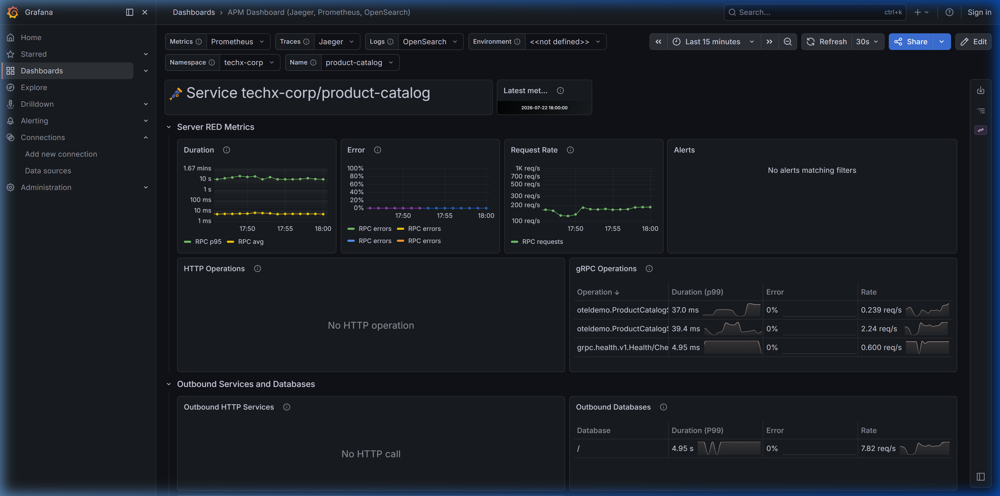

#### B. Dịch vụ Product Reviews (Python)
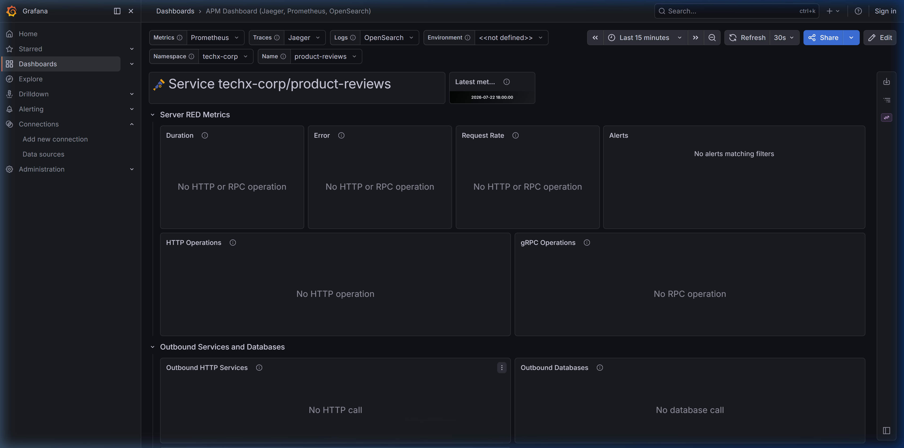

#### C. Dịch vụ Accounting (.NET)
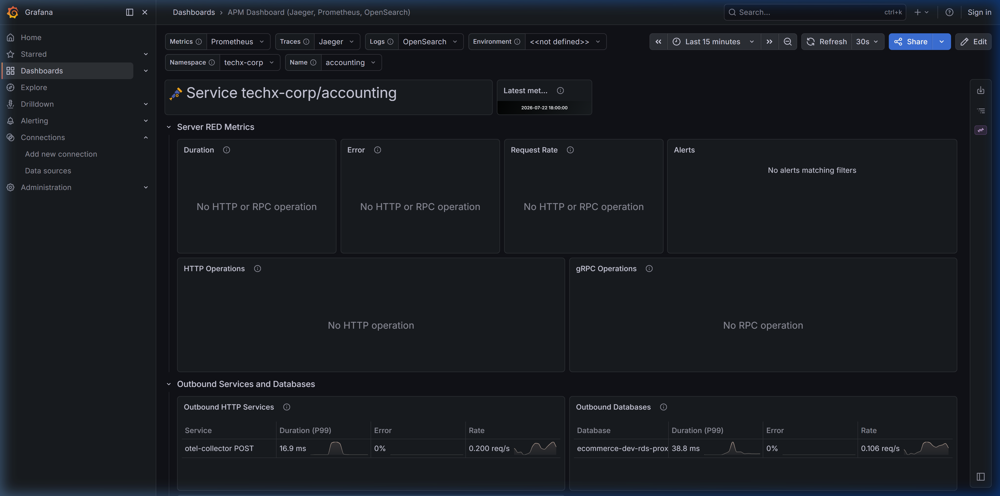

*Nhận xét: Biểu đồ giám sát RED Metrics (Rate, Error, Duration) trên Grafana cho thấy success rate của cả 3 services giữ vững ở mức 100% trong suốt thời gian diễn ra xoay vòng mật khẩu hạ tầng.*

---

## 7. Checklist Evidence Hiện Có

Bảng dưới đây đánh giá PASS/FAIL dựa trên điều kiện nghiệm thu tại mục 8 (và bar §0 cho TBD1–TBD4). Tất cả các TBD đều đáp ứng đủ yêu cầu về Request Volume > 0, HTTP 200 / bad=0, và minh chứng được hệ thống hồi phục.

| Task | Đánh giá | Ảnh đã có | Nhận xét (Map tới Điều kiện PASS) |
| --- | :---: | ---: | --- |
| **TBD1** | **PASS** | 4 | Grafana during/after (volume > 0, không error spike kéo dài); terminal stable + `DONE`; log mốc primary/replica failover. |
| **TBD2** | **PASS** | 7 | Expand + backfill + dual-read; **curl tổng ok=60 bad=0**; Grafana during; contract DROP `picture` hoãn có chủ đích (rollback). |
| **TBD3** | **PASS** | 10 | 16.14→17.10 Blue/Green; curl before/after **bad=0**; Grafana during switchover; Console xác nhận 17.10. |
| **TBD4** | **PASS** | 6 | Preflight Multi-AZ; set 8192; Grafana during force-failover; after-failover **ok=20 bad=0**; `SHOW` = 8kB. |
| **TBD5** | **PASS** | 5 | Có Secrets Manager version, ESO status, K8s Pod list, Locust graphs và Grafana APM dashboards cho từng service (Error Rate = 0.0%). |

## 8. Điều Kiện Không Ghi PASS

Không ghi PASS nếu thiếu một trong các bằng chứng sau:

```text
Không có ảnh Grafana với Request Volume > 0.
Không có terminal output chứng minh script đã chạy tới bước verify/pass.
Không có curl/result cho thấy bad=0 hoặc toàn HTTP 200.
Không có ảnh sau thao tác chứng minh hệ thống hồi phục/ổn định.
Dùng nhầm ảnh Develop để chứng minh Production.
Ảnh bị che secret/password hoặc connection string.
```

## 9. Log Files (Reference)

Bên cạnh ảnh chụp màn hình, các kịch bản chạy tự động (PowerShell scripts) cũng sinh ra file log text ghi nhận lại toàn bộ output ở terminal. Các file này được lưu trữ để làm bằng chứng bổ sung:

* **TBD1 (DB Blip Retry/Pool)**: [tbd1-drill-log.txt](logs/tbd1-drill-log.txt)
* **TBD2 (Online Schema Migration)**: [tbd2-test-log.txt](logs/tbd2-test-log.txt)
* **TBD3 (RDS Blue/Green 16 -> 17)**: [tbd3-bg-log.txt](logs/tbd3-bg-log.txt)
* **TBD4 (Static Parameter + Failover)**: [tbd4-param-log.txt](logs/tbd4-param-log.txt)

## 9. Tài Liệu Minh Chứng Môi Trường Develop (Develop Environment Evidence)

Dưới đây là các tài liệu ghi nhận kết quả baseline, kế hoạch chạy tải và kiểm chứng bảo mật trên môi trường Develop cho Mandate 09:

* **M9 Baseline & Load Window (Develop)**: [evidence-46.md](file:///d:/GitHub/capstone-phase-3/docs/cdo09/evidence-mandate-09/evidence/evidence-46.md) (hoặc [relative](evidence/evidence-46.md)) - Chi tiết kịch bản tải, baseline metric sạch lỗi (RPS 5.1, error rate 0%).
* **Xác nhận Security Guardrails (Develop)**: [evidence-44.md](file:///d:/GitHub/capstone-phase-3/docs/cdo09/evidence-mandate-09/evidence/evidence-44.md) (hoặc [relative](evidence/evidence-44.md)) - Đảm bảo database/cache endpoint nội bộ, dashboard Ops, và TLS/auth logic không bị nới lỏng.
* **Jaeger Trace & Storefront SLO**: [evidence-slo-02.md](file:///d:/GitHub/capstone-phase-3/docs/cdo09/evidence-mandate-09/evidence/evidence-slo-02.md) (hoặc [relative](evidence/evidence-slo-02.md)) - Phân tích latency của các dependency services qua Jaeger trace cho luồng storefront checkout.

