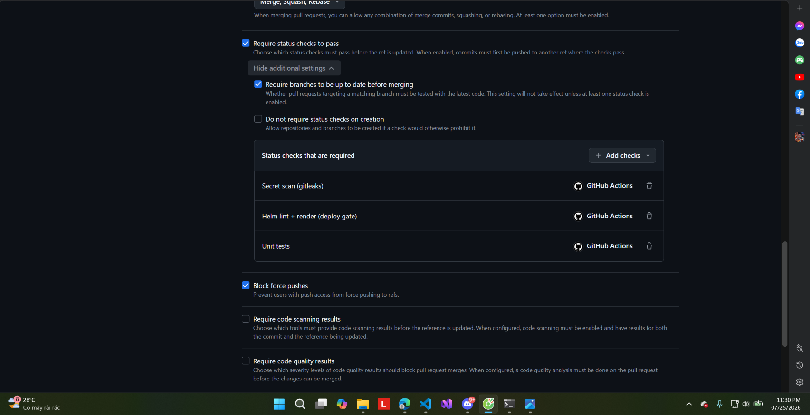
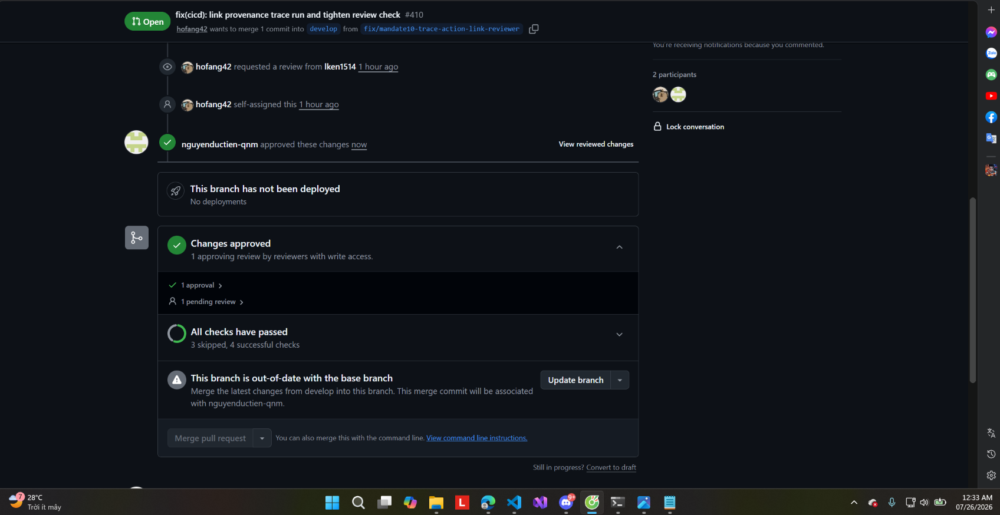
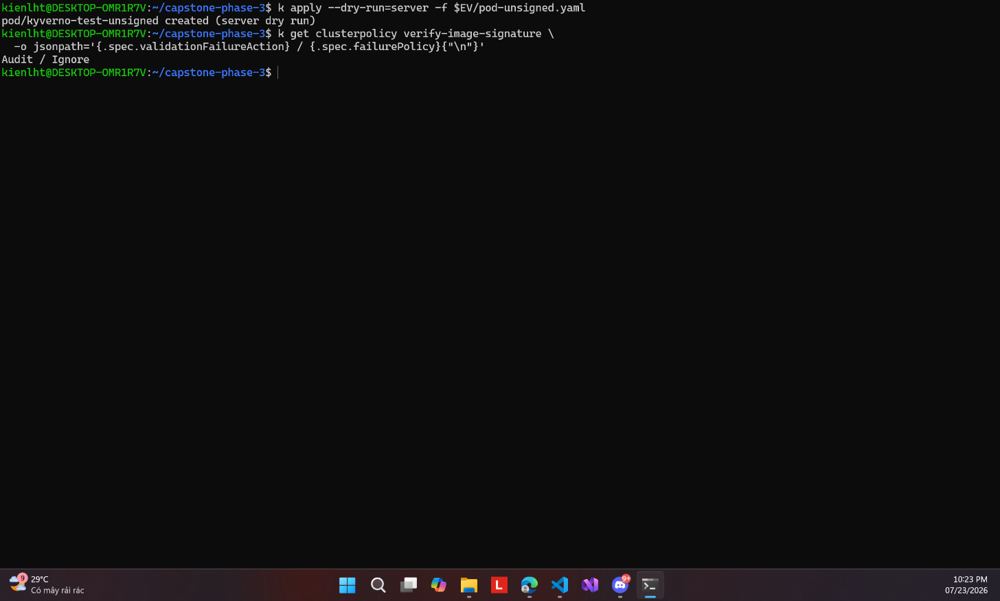
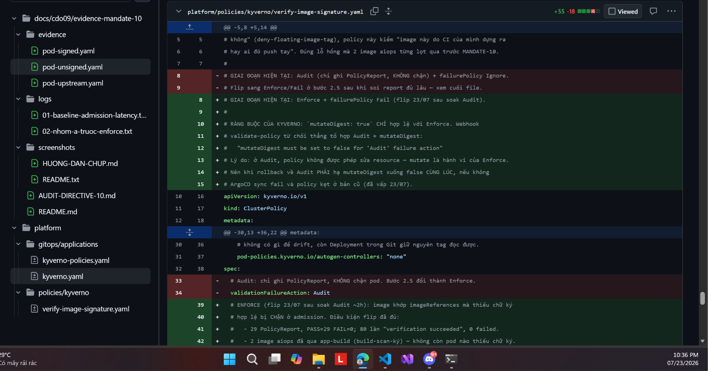
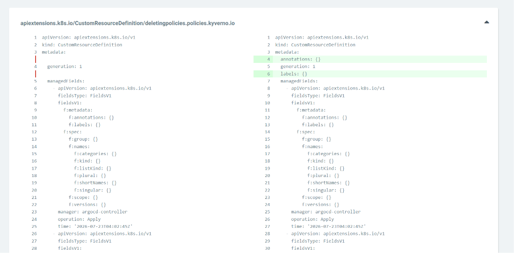
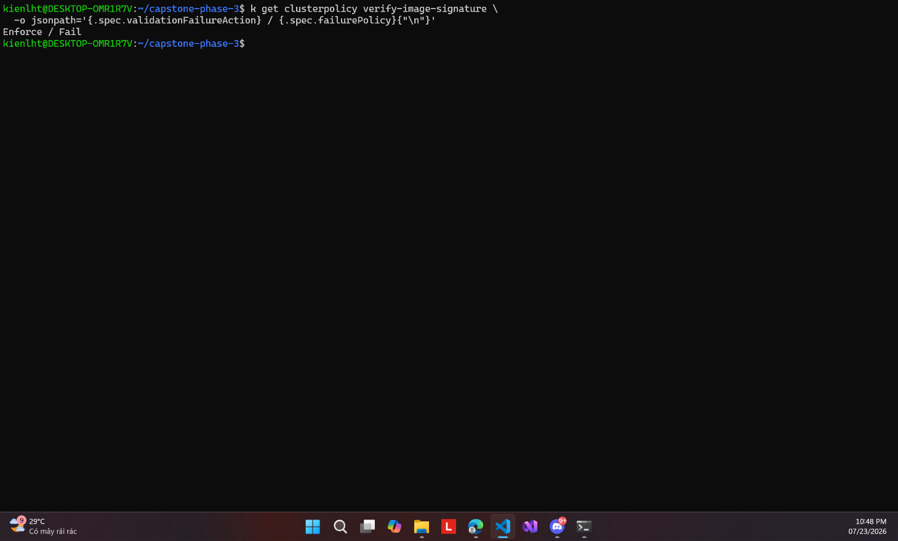
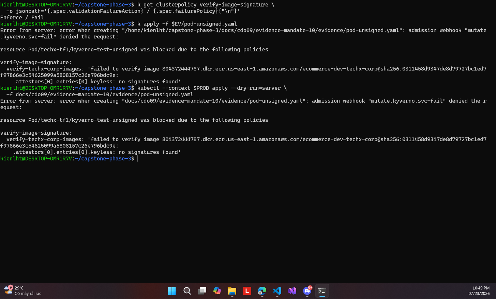
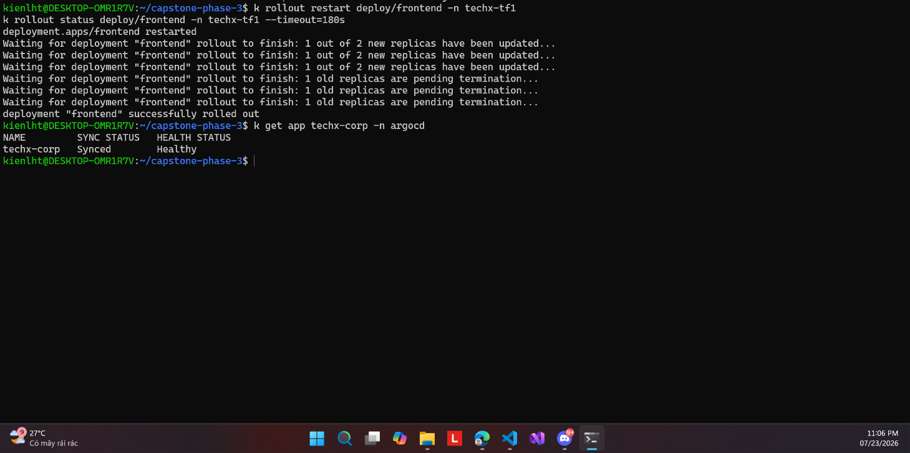
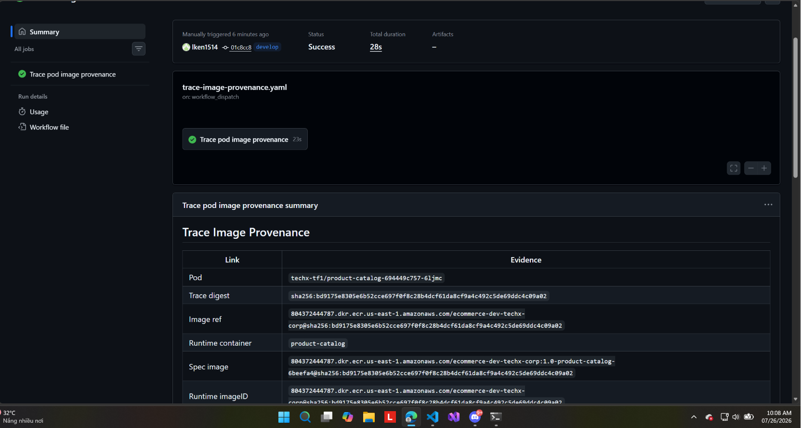
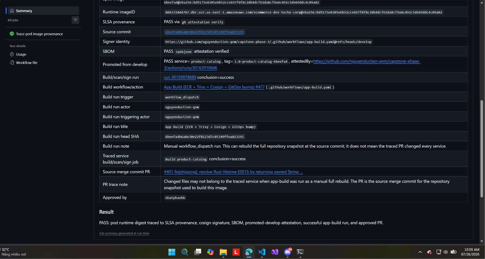

# MANDATE-10 — Bằng chứng theo từng yêu cầu của DIRECTIVE #10

> **Cách đọc:** mỗi mục dưới đây là **một yêu cầu** trong
> [DIRECTIVE #10](../../../mandates/MANDATE-10-secure-delivery-pipeline.md), theo thứ tự:
> nguyên văn yêu cầu → ảnh bằng chứng kèm giải thích → lệnh/file kiểm chứng lại → kết luận
> đạt hay chưa. Ảnh nhúng thẳng trong trang này; bấm "chú thích" dưới mỗi ảnh để đọc sâu.

**Phạm vi và cách thu bằng chứng**

| | |
|---|---|
| Môi trường | PROD — account `804372444787`, cluster `ecommerce-dev-eks`, ns `techx-tf1` |
| Khoảng thời gian | 23/07 → 26/07/2026, mỗi ảnh ghi rõ mốc giờ |
| Cách thu | Chụp trực tiếp màn hình lệnh `kubectl`/`gh` và giao diện ArgoCD/GitHub, không dựng lại |
| Tái lập | Manifest trong `evidence/`, số đo trong `logs/`, lệnh in kèm từng mục |

---

## 📊 Tổng quan — 6/6 đạt (vế SAST và IaC gate vá xong 26/07)

| # | Yêu cầu | Kết quả | Bằng chứng | Đọc tiếp |
|---|---|---|---|---|
| 1 | Cổng chặn thật | ✅ **ĐẠT** | 5 ảnh + `gh api` | [↓](#1--cổng-chặn-thật) |
| 2 | Quét chặn HIGH/CRITICAL | ✅ **ĐẠT** — đủ 4/4 vế | 2 ảnh + code workflow | [↓](#2--quét-trước-khi-ra-cluster-chặn-trên-highcritical) |
| 3 | Bất biến + ký + admission enforce | ✅ **ĐẠT** | 14 ảnh + logs | [↓](#3--bất-biến--xác-thực-nguồn-gốc) |
| 4 | Không phụ thuộc thứ trôi | ✅ **ĐẠT** | grep 2 lệnh | [↓](#4--không-phụ-thuộc-thứ-trôi) |
| 5 | Truy ngược được | ✅ **ĐẠT** | 2 ảnh, 8 mắt xích | [↓](#5--truy-ngược-được) |
| 6 | Chỉ đụng cái gì đổi | ✅ **ĐẠT** | 1 ảnh + code workflow | [↓](#6--chỉ-đụng-cái-gì-đổi) |

Hai vế cuối của yêu cầu #2 được vá ngày 26/07 bằng hai PR:

| PR | Vá gì | Bằng chứng |
|---|---|---|
| [#428](https://github.com/nguyenductien-qnm/capstone-phase-3/pull/428) | Thêm CodeQL quét 8 ngôn ngữ, rồi đưa `SAST (codeql)` vào required check | ảnh [21](screenshots/21-codeql-8-ngon-ngu-pass.md) + [23](screenshots/23-ruleset-4-checks-co-sast.md) |
| [#429](https://github.com/nguyenductien-qnm/capstone-phase-3/pull/429) | Bật IaC gate: Trivy `exit-code:"1"`, Checkov `soft_fail:false` | [IAC-GATE.md](IAC-GATE.md) |

**Ba phép thử kiểm chứng được** (mục "Phải nộp" của directive):

| Phép thử | Yêu cầu | Trạng thái |
|---|---|---|
| PR có CI đỏ → bị chặn merge | #1 | 🟡 cơ chế ĐẠT (4 required check, xem ảnh [23](screenshots/23-ruleset-4-checks-co-sast.md)), **thiếu ảnh PR đỏ** |
| Deploy image chưa ký → admission từ chối | #3 | ✅ **ĐẠT** |
| Chỉ vào pod → truy ngược full provenance | #5 | ✅ **ĐẠT** |

Cả ba đều tái lập được: lệnh và manifest dùng để dựng bằng chứng nằm trong `evidence/`,
kết quả đo trong `logs/`.

---

## #1 — Cổng chặn thật

> *"CI đỏ = **không merge, không deploy**. Bật branch protection + required status checks
> trên nhánh deploy. Hết cảnh 'pipeline chạy cho vui' — test/scan/render phải xanh mới qua."*

### Cổng đặt đúng nhánh deploy


*25/07 23:28 — Ruleset áp cho **2 target**: `develop` (nhánh deploy thật, nơi `app-build`
chạy và bump tag) và `main`. `Restrict deletions` bật để không ai né cổng bằng cách xóa
rồi tạo lại nhánh.* → [chú thích đầy đủ](screenshots/15-ruleset-target-branches.md)

### Bắt buộc PR và phải có người duyệt


*25/07 23:29 — `Require a pull request before merging` ✅, `Required approvals = 1`.*

Dòng **"Dismiss stale pull request approvals when new commits are pushed"** quan trọng hơn
vẻ ngoài của nó. Nếu ai đó được duyệt rồi mới push thêm commit, phê duyệt cũ bị hủy và
phải duyệt lại. Không có nó thì mắt xích "PR ai duyệt" ở yêu cầu #5 trở thành vô nghĩa:
người duyệt xem một bản code, thứ được merge lại là bản khác.
→ [chú thích đầy đủ](screenshots/16-ruleset-require-pr-approval.md)

### ⭐ Ba required status check



*25/07 23:30 — Bằng chứng trực tiếp nhất cho yêu cầu này.*

| Check bắt buộc | Chặn cái gì |
|---|---|
| `Secret scan (gitleaks)` | secret lọt vào repo |
| `Helm lint + render (deploy gate)` | manifest hỏng ra cluster |
| `Unit tests` | code đỏ |

Kèm theo: `Require branches to be up to date` ✅ và `Block force pushes` ✅ — bịt đường vòng
force-push đè lên nhánh để né cổng. → [chú thích đầy đủ](screenshots/17-ruleset-3-required-checks.md)

Kiểm chứng lại bằng lệnh:

```bash
gh api repos/nguyenductien-qnm/capstone-phase-3/rulesets/18604771 \
  --jq '.rules[] | select(.type=="required_status_checks")
        | .parameters.required_status_checks[].context'
# Secret scan (gitleaks)
# Helm lint + render (deploy gate)
# Unit tests
```

### Cổng cản thật, không chỉ nằm trên trang cấu hình



*26/07 00:33 — PR #410 đã được duyệt, mọi check xanh (4 successful, 3 skipped), vậy mà nút
**Merge pull request vẫn xám**.*

Lý do là `Require branches to be up to date` đang làm việc: nhánh chưa rebase theo `develop`
mới nhất thì không được merge, kể cả khi tự nó hoàn hảo. Quy tắc này chặn tình huống hai PR
riêng lẻ đều xanh nhưng gộp lại thì hỏng.
→ [chú thích đầy đủ](screenshots/18-pr410-approved-checks-passed.md)

### Kết luận

✅ **ĐẠT.** Cổng đặt đúng nhánh deploy, ba check bắt buộc, chặn force-push, bắt buộc PR có
người duyệt. Ảnh 18 chứng minh cổng thật sự cản một PR dù đã xanh và đã được duyệt.

Tên `Unit tests` là job discovery (PR #340) thay 2 check cứng cũ, nên thêm service mới
không phải sửa ruleset.

> [!WARNING]
> **Còn thiếu cho bài mentor:** ảnh PR **cố tình đỏ** → nút merge xám kèm dòng *"Required
> statuses must pass"*. Ảnh 18 là PR xanh bị chặn vì lý do khác (out-of-date), chưa thay
> thế được. Cần chụp bổ sung để hoàn thiện bộ bằng chứng.

---

## #2 — Quét trước khi ra cluster, chặn trên HIGH/CRITICAL

> *"Image CVE scan + IaC misconfig scan + **secret/SAST** là **cổng chặn**, không phải hậu
> kiểm (ECR scan-on-push **không tính**). Dính HIGH/CRITICAL thì dừng, không đẩy tiếp."*

### Mổ theo từng vế

| Vế | Kết quả | Bằng chứng |
|---|---|---|
| Image CVE scan | ✅ **chặn thật** | [app-build.yaml:485](../../../.github/workflows/app-build.yaml#L485) |
| Secret scan | ✅ **chặn thật** | [platform-ci.yaml:27](../../../.github/workflows/platform-ci.yaml#L27) + trong required checks |
| IaC misconfig scan | ✅ **chặn thật** | [infra-cd.yaml](../../../.github/workflows/infra-cd.yaml) — `exit-code: "1"` + `soft_fail: false` |
| SAST | ✅ **chặn thật** (26/07) | [codeql.yaml](../../../.github/workflows/codeql.yaml) — 8 ngôn ngữ + `SAST (codeql)` trong required checks |

### Vế ĐẠT — image CVE scan

```yaml
# .github/workflows/app-build.yaml:485
- name: Trivy vulnerability scan (gate)
  uses: aquasecurity/trivy-action@ed142fd0673e97e23eac54620cfb913e5ce36c25 # v0.36.0
  with:
    severity: CRITICAL,HIGH
    exit-code: "1"          # <- CHẶN
- name: Push image           # <- chỉ chạy nếu scan pass
```

Điểm làm đúng: scan đặt **trước** bước push. Image bẩn không lên được ECR. Đây chính là thứ
directive gạch chân khi nói *"ECR scan-on-push không tính"* — quét sau khi đã push là hậu
kiểm, còn đây là cổng chặn thật.

Cũng không dùng `ignore-unfixed: true` — cờ đó tắt mọi CVE chưa có bản vá, làm gate nhẹ đi
một cách giả tạo.

### Vế ĐẠT — IaC misconfig scan (bật 26/07)

Trước đó cả hai công cụ chỉ in báo cáo rồi cho đi tiếp: Trivy `exit-code: "0"`, Checkov
`soft_fail: true`. Nay đã thành cổng chặn thật:

```yaml
- name: Trivy IaC scan (gate)
  with:
    severity: CRITICAL,HIGH
    exit-code: "1"            # <- CHẶN
    trivyignores: .trivyignore

- name: Checkov scan (gate)
  with:
    config_file: .checkov.yaml
    soft_fail: false          # <- CHẶN
```

Trước khi bật đã **đếm finding và xử lý**, không bật khơi khơi để CI đỏ vĩnh viễn:

| Công cụ | Trước | Sau khi sửa thật | Sau khi + khai skip |
|---|---|---|---|
| Checkov | 136 fail / 690 pass | **128 fail / 714 pass** | **0 fail** |
| Trivy IaC | 34 (15 CRITICAL + 19 HIGH) | 32 | **0** |

Sáu loại check được **sửa thật** (SNS mã hoá, KMS rotation + policy, default SG chặn hết,
SG description, MSK encryption at-rest). Phần còn lại khai skip **từng ID kèm lý do và
ngày review** trong [.checkov.yaml](../../../.checkov.yaml) và
[.trivyignore](../../../.trivyignore) — cùng kỷ luật đang dùng cho CVE, nên finding **mới**
phát sinh vẫn đỏ.

Chi tiết 136 finding phân 4 nhóm + những gì đã sửa: [IAC-GATE.md](IAC-GATE.md).

### Vế ĐẠT — SAST (vá 26/07, PR #428)

Trước ngày này repo không có SAST nào:

```bash
grep -rilE "codeql|semgrep|sonar|snyk|bandit|gosec|njsscan|horusec|opengrep" .github/
# (không kết quả)   <-- trạng thái TRƯỚC 26/07
```

Nay có `.github/workflows/codeql.yaml` quét 8 ngôn ngữ, và `SAST (codeql)` nằm trong
required status checks:

```bash
gh api repos/nguyenductien-qnm/capstone-phase-3/rulesets/18604771 \
  | python3 -c "import json,sys; [print(' ',c['context']) for r in json.load(sys.stdin)['rules'] if r['type']=='required_status_checks' for c in r['parameters']['required_status_checks']]"
#   Secret scan (gitleaks)
#   Helm lint + render (deploy gate)
#   Unit tests
#   SAST (codeql)          <-- mới
```

Bằng chứng ảnh: [21](screenshots/21-codeql-8-ngon-ngu-pass.md) CodeQL pass đủ 8 ngôn ngữ
(43s–1m58s mỗi ngôn ngữ, không finding) và [23](screenshots/23-ruleset-4-checks-co-sast.md)
ruleset đủ 4 check.

> [!CAUTION]
> **Bẫy đã mắc, ghi lại để không tái phạm.** Từng kết luận *"gitleaks thỏa vế secret nên #2
> gần đủ"* — SAI. Nguyên văn directive là *"secret**/**SAST"*, nghĩa là **CẢ HAI**.
> Gitleaks tìm secret bị lộ trong code; nó **không** phân tích logic mã nguồn để bắt SQL
> injection, path traversal, hay crypto yếu. Đó là việc của SAST.
> Lần grep đầu chỉ dùng 3 từ khóa nên tưởng có; grep rộng 10 công cụ mới thấy hở nguyên.

> [!CAUTION]
> **Bẫy thứ hai, trả giá thật ngày 26/07.** Thêm `SAST (codeql)` vào ruleset **trước khi**
> `codeql.yaml` có trên develop làm 4 PR đang mở kẹt cứng ở trạng thái `Expected` — GitHub
> chờ một check mà không PR nào sinh ra được. Thứ tự đúng: **merge workflow trước, thêm vào
> ruleset sau**. Chi tiết trong ảnh [23](screenshots/23-ruleset-4-checks-co-sast.md).

### Kết luận

✅ **ĐẠT đủ 4/4 vế.** Trước 26/07 hở 2 vế (IaC gate không chặn + không có SAST); cả hai đã
vá trong ngày bằng PR #429 và #428.

| Vế | Công cụ | Chặn ở đâu |
|---|---|---|
| Image CVE | Trivy image | tầng build — `exit-code:"1"` trước bước Push |
| IaC misconfig | Trivy config + Checkov | tầng CI — `soft_fail:false` |
| Secret | gitleaks | tầng merge — required check |
| **SAST** | **CodeQL 8 ngôn ngữ** | **tầng merge — required check** |

> [!NOTE]
> Ô `Require code scanning results` trong ruleset **cố ý để trống**. Bản trước của tài liệu
> này khuyên tick nó — **lời khuyên đó không đúng**: chỉ cần `SAST (codeql)` trong required
> checks là đã chặn merge. Ba lý do giữ nguyên ô trống ghi trong ảnh
> [23](screenshots/23-ruleset-4-checks-co-sast.md).

---

## #3 — Bất biến + xác thực nguồn gốc

> *"Registry để **immutable**; mỗi image được **ký (cosign) + kèm SBOM + provenance**;
> cluster **chỉ chạy image đã ký, tham chiếu theo digest** — admission **enforce**
> (không phải audit/cảnh báo suông)."*

Đây là mục có nhiều bằng chứng nhất — 14 ảnh, kể trọn một đêm 23/07 từ lúc Kyverno còn
quan sát tới lúc thật sự chặn.

### Mổ theo từng vế

| Vế | Kết quả | Bằng chứng |
|---|---|---|
| Registry immutable | ✅ | ECR `imageTagMutability = IMMUTABLE` (codify commit `72d81a0`) |
| Ký cosign | ✅ | [09](screenshots/09-enforce-unsigned-bi-chan.md) lỗi `no signatures found`; [20](screenshots/20-trace-provenance-8-mat-xich.md) identity `app-build.yaml@refs/heads/develop` |
| SBOM | ✅ | [20](screenshots/20-trace-provenance-8-mat-xich.md) — `PASS spdxjson attestation verified` |
| Provenance | ✅ | [20](screenshots/20-trace-provenance-8-mat-xich.md) — `PASS via gh attestation verify` |
| Chạy theo digest | ✅ | [10](screenshots/10-enforce-signed-mutate-digest.md) — mutate tag → `@sha256:` |
| Admission **enforce** | ✅ | [08](screenshots/08-policy-mode-enforce-fail.md) `Enforce/Fail` + [09](screenshots/09-enforce-unsigned-bi-chan.md) chặn thật |

### Nền tảng: Kyverno chạy HA trước khi dám fail-closed


*23/07 22:08 — Hai pod `admission-controller` cùng Running, PDB `ALLOWED DISRUPTIONS = 1`.*

Policy đặt `failurePolicy: Fail`, nghĩa là webhook chết thì cụm không nhận pod mới. Đó là
lựa chọn fail-closed có chủ đích, nhưng nó chỉ an toàn khi webhook không bao giờ chết hẳn.
Hai replica cộng PDB là thứ giữ cho quyết định đó không thành tự bắn vào chân mình lúc node
bảo trì. → [chú thích](screenshots/01-kyverno-pods-pdb.md)

### Soak chế độ Audit — điều kiện để dám flip


*23/07 22:10 — 20 pod, `PASS=1` `FAIL=0` `WARN=0` `ERROR=0`, tuổi 10h.*

Chạy Audit khoảng 10 tiếng mà không một FAIL nào nghĩa là mọi workload đang chạy đều có chữ
ký hợp lệ. Nếu flip thẳng sang Enforce ngay từ đầu, rủi ro là chặn nhầm chính service của
mình rồi sập cụm.

Con số `ERROR=0` còn nói thêm: **IRSA hoạt động**. Không có role `ecommerce-dev-kyverno` thì
mọi verify đã fail với lỗi ECR auth, vì node prod đặt IMDSv2 hop limit = 1 nên pod không
mượn được node role. → [chú thích](screenshots/02-policyreport-audit-20pass.md)

### ⭐ Cặp bằng chứng before/after

Đây là phần cốt lõi của yêu cầu #3. **Cùng một manifest, cùng một cụm, chỉ khác chế độ
policy** — kết quả lật hoàn toàn.

#### Vế TRƯỚC — Audit: image không chữ ký được nhận


*23/07 22:22 — `pod/kyverno-test-unsigned` **created** (server dry run).*

Chữ `created` chính là bằng chứng. Ở chế độ Audit, pod mang image không có `.sig` vẫn đi
qua admission trót lọt — policy chỉ ghi PolicyReport rồi cho đi. Image dùng làm mẫu là
`1.2-aiops-detector-ae89fa2`, chính image aiops push tay ngày 17/07.
→ [chú thích](screenshots/03-audit-unsigned-duoc-nhan.md)



*23/07 22:23 — `Audit / Ignore`. Chụp ngay sau để đóng dấu ảnh trên đúng là lúc còn Audit,
không phải ảnh cũ dựng lại.* → [chú thích](screenshots/04-policy-mode-audit-ignore.md)

#### Chuyển đổi — flip đi qua Git



*23/07 22:36 — Diff `verify-image-signature.yaml`, `+55 −18`.*

ArgoCD bật selfHeal nên `kubectl patch` tay sẽ bị revert sau vài phút — mọi thay đổi policy
buộc phải qua PR. → [chú thích](screenshots/06-pr-flip-enforce-diff.md)

> [!NOTE]
> **Bẫy vận hành đã vấp, ghi trong comment của PR này:** `mutateDigest: true` **chỉ hợp lệ
> với `Enforce`**. Webhook `validate-policy` từ chối thẳng tổ hợp `Audit` + `mutateDigest`
> với lỗi *"mutateDigest must be set to false for 'Audit' failure action"* — vì ở Audit
> policy không được phép sửa resource, mà mutate là hành vi của Enforce.
> Hệ quả: **khi rollback về Audit phải hạ `mutateDigest` xuống `false` CÙNG LÚC**, nếu
> không ArgoCD sync fail và policy kẹt ở bản cũ.


*23/07 22:45 — GitOps đã sync. `kyverno-policies` báo **OutOfSync** nhưng đó là drift
cosmetic, không phải policy chưa lên.* → [chú thích](screenshots/07-argocd-apps-sau-flip.md)



*Nguyên nhân OutOfSync vĩnh viễn: chart khai `annotations: {}` và `labels: {}` rỗng, mà
Kubernetes không lưu field rỗng nên diff không bao giờ hết. Vô hại.*
→ [chú thích](screenshots/05-argocd-diff-map-rong.md)



*23/07 22:48 — `Enforce / Fail`. Đầu mốc thứ hai. `Enforce` = vi phạm thì chặn; `Fail` =
webhook lỗi cũng chặn.* → [chú thích](screenshots/08-policy-mode-enforce-fail.md)

#### ⭐ Vế SAU — Enforce: image không chữ ký BỊ CHẶN



*23/07 22:49 — **Bằng chứng đắt nhất của MANDATE-10.** Cùng file `pod-unsigned.yaml` của
ảnh trên, giờ bị từ chối.*

```
admission webhook "mutate.kyverno.svc-fail" denied the request:
resource Pod/techx-tf1/kyverno-test-unsigned was blocked due to the following policies
verify-image-signature:
  verify-techx-corp-images: 'failed to verify image ...@sha256:0311458d...:
    .attestors[0].entries[0].keyless: no signatures found'
```

Ba chi tiết làm nên sức nặng. Lệnh chạy **hai lần** — một lần `apply` thật, một lần
`--dry-run=server` — cả hai đều bị chặn, không phải trục trặc ngẫu nhiên. Lỗi ghi rõ
**`no signatures found`**, tức policy thật sự đi tìm chữ ký và không thấy, chứ không phải
fail vì mạng. Và so với ảnh trước thì kết quả lật từ `created` sang `blocked` chỉ vì đổi
chế độ policy. → [chú thích](screenshots/09-enforce-unsigned-bi-chan.md)

#### Không chặn nhầm image sạch — và mutate sang digest


*23/07 22:52 — Pod có chữ ký được `created`, và image bị **sửa** từ tag sang digest.*

```
Git khai   : ...ecommerce-dev-techx-corp:1.0-frontend-4252fed
Pod thật   : ...ecommerce-dev-techx-corp:1.0-frontend-24b2d8c@sha256:43a435af04f9e8f52689...
```

Đó là `mutateDigest: true` làm việc tại admission. Directive đòi *"chỉ chạy image đã ký,
tham chiếu theo digest"* — và ta đạt được **mà không phải sửa GitOps**. Manifest vẫn đọc
được bằng tag cho người, còn thứ thật sự chạy là digest bất biến. Ai đè lại tag trên
registry cũng không ảnh hưởng pod đang chạy.
→ [chú thích](screenshots/10-enforce-signed-mutate-digest.md)

### Bịt "shadow path" image push tay


*23/07 22:52 — `aiops-detector` và `aiops-remediation` đều `PASS=1`.*

Hai image này trước 17/07 là **push tay**, không qua CI nào — đúng cái directive gọi là
*"image ra cluster mà không ai chứng minh được nó sạch, từ đâu, ai duyệt"*. Workflow
`aiops-ci` chỉ chạy pytest, còn `app-build` không nhìn thư mục `aiops/`, nên tồn tại một
đường đi song song không ai gác.

Sau khi kéo `aiops/**` vào `app-build`, chúng đi trọn build → Trivy → ký → SBOM. Sửa gốc
bằng cách đưa vào pipeline có cổng, **không phải ký vá**.
→ [chú thích](screenshots/11-policyreport-36-aiops-pass.md)

### Không phá SLO


*23/07 22:53 — `rollout restart deploy/frontend` → **"successfully rolled out"**, 2 replica
thay lần lượt.*

Đây là phép thử trực tiếp: ép toàn bộ pod của một Deployment thật đi qua admission mới. Nếu
policy cấu hình sai — sai identity, sai repo pattern, hay IRSA hỏng — rollout sẽ treo.
Việc thay lần lượt chứ không đồng loạt nghĩa là dịch vụ không có khoảng trống.
→ [chú thích](screenshots/12-rollout-frontend-thanh-cong.md)



*23/07 23:06 — App `techx-corp` (chứa ~20 service ứng dụng) **Synced / Healthy**. Chốt cuối
của mạch 23/07.* → [chú thích](screenshots/13-techx-corp-synced-healthy.md)


*23/07 23:07 — Đo 3 lần: **3639 / 2829 / 3005 ms** khi cache đã ấm.*

| Tình huống | Thời gian |
|---|---|
| Lần verify **đầu** của một digest mới | **70.1s** |
| Lần 2-5 của cùng digest | 2.6-4.8s |
| Image ngoài phạm vi policy (busybox) | 2.4s |

Trừ đi 2.4s overhead mạng nền thì chi phí thật của verify chỉ khoảng **0.2-2.4s**. Con số
70s là cái giá **một lần cho mỗi digest mới** (tải TUF root + truy vấn Rekor qua NAT) — lý
do giữ `webhookTimeoutSeconds: 30`.
Chi tiết: [logs/01-baseline-admission-latency.txt](logs/01-baseline-admission-latency.txt)
→ [chú thích](screenshots/14-do-tre-admission-3-lan.md)

### Kết luận

✅ **ĐẠT đầy đủ.** Cả 6 vế đều có bằng chứng chạy thật trên prod. Bài mentor
*"deploy image chưa ký → admission từ chối"* đã có ảnh [09](screenshots/09-enforce-unsigned-bi-chan.md).

---

## #4 — Không phụ thuộc thứ trôi

> *"GitHub Action pin theo **commit SHA**; base image pin theo **digest**. Không `@latest`,
> không `@master`, không tag trôi ở bước dựng."*

### Bằng chứng lệnh

```bash
# Action pin SHA — không còn dòng nào dùng @vX
grep -rnE "uses:.*@v[0-9]+\s*$" .github/workflows/ | wc -l
# 0

# Base image pin digest — toàn bộ FROM đều có @sha256:
grep -rhE "^FROM " --include="Dockerfile*" . | wc -l          # 57
grep -rhE "^FROM .*@sha256:" --include="Dockerfile*" . | wc -l # 57
```

Ví dụ trong workflow:

```yaml
uses: aquasecurity/trivy-action@ed142fd0673e97e23eac54620cfb913e5ce36c25 # v0.36.0
uses: gitleaks/gitleaks-action@ff98106e4c7b2bc287b24eaf42907196329070c7 # v2
```

### Cơ chế giữ cho không trôi lại

Renovate GitHub App đã cài, cấu hình ở [renovate.json](../../../renovate.json). Hai PR đã
làm việc pin: **#346** (`github-actions-pin`) và **#377** (`pin-docker`). Renovate tiếp tục
bump digest có kiểm soát thay vì để người sửa tay rồi quên.

### Kết luận

✅ **ĐẠT.** 20/20 action pin SHA, 57/57 dòng `FROM` pin digest, có cơ chế duy trì.

Chưa có ảnh chụp cho mục này — bằng chứng dạng lệnh grep đã đủ rõ và tái lập được.

---

## #5 — Truy ngược được

> *"Với **một pod bất kỳ đang chạy**, dựng lại được chuỗi: image digest → commit →
> **PR ai duyệt** → scan nào đã pass → **ai/khóa nào ký** → SBOM."*

### Công cụ truy ngược chạy được



*26/07 10:08 — Workflow `trace-image-provenance.yaml`, `workflow_dispatch`, actor
`lken1514`, commit `01c8cc8` nhánh `develop`, **Success trong 28s**.*

Con số 28 giây quan trọng khi có người đứng chờ kết quả. Workflow này thay cho
`scripts/provenance.sh` trong plan gốc — đổi sang workflow có cái lợi là mỗi lần chạy để
lại run log công khai, có người bấm, có thời điểm, nên bản thân nó cũng là bằng chứng kiểm
toán được. → [chú thích](screenshots/19-trace-provenance-run-success.md)

### ⭐ Đủ 8 mắt xích, không "unknown" nào



*26/07 10:09 — Bảng job summary cho pod `techx-tf1/product-catalog-694449c757-6ljmc`.*
→ [chú thích](screenshots/20-trace-provenance-8-mat-xich.md)

### Đối chiếu: directive đòi 6 mắt, workflow truy 8

| # | Mắt xích | Directive đòi? | Bằng chứng trong ảnh |
|---|---|---|---|
| 1 | Pod → runtime digest | ✅ | `sha256:bd9175e8305e6b52cce697...` |
| 2 | Spec image ↔ runtime imageID | — *(thêm)* | hai dòng **trùng digest** → không bị tráo |
| 3 | SLSA provenance | — *(thêm)* | `PASS via gh attestation verify` |
| 4 | → commit | ✅ | `6beefa4b6a8e30e22f8123d7c05349ffea813191` |
| 5 | → ai/khóa nào ký | ✅ | identity `.../app-build.yaml@refs/heads/develop` |
| 6 | → SBOM | ✅ | `PASS spdxjson attestation verified` |
| 7 | → dấu promote | — *(thêm)* | `PASS service=product-catalog` |
| 8 | → scan nào pass | ✅ | run `30159978689` conclusion=success |
| 9 | → **PR ai duyệt** | ✅ | PR #401 · **Approved by `nhatphanhk`** |

Kết luận in ở cuối job summary:

> PASS: pod runtime digest traced to SLSA provenance, cosign signature, SBOM,
> promoted-develop attestation, successful app-build run, and approved PR.

### Fail-closed, không "unknown" mù

Thiếu bất kỳ mắt nào → `::error::` + `exit 1`. Không có đường trả về "unknown" rồi coi như
qua. Mắt xích 2 (spec ↔ runtime) là kiểm tra chặt thêm: nếu digest trong spec khác digest
container runtime thật sự kéo về thì fail ngay.

### Phần tự khai điểm yếu

Hai dòng `Build run note` và `PR trace note` trong ảnh ghi rõ: image này dựng từ một lần
`workflow_dispatch` **full rebuild**, nên PR #401 gắn kèm là PR của commit snapshot chứ
không phải PR đổi riêng `product-catalog`. **Ghi rõ thay vì giấu** — đúng tinh thần
"không tin mù" của directive.

### Kết luận

✅ **ĐẠT, phủ rộng hơn yêu cầu.** `provenance.sh` trong plan gốc đã thay bằng workflow
`trace-image-provenance.yaml` (PR #385).

> [!TIP]
> Phải lấy **tên pod ngay trước lúc chạy**. Bốn run fail hôm 25/07 đều do dispatch với tên
> pod đã bị rollout thay thế (`pods "..." not found`) — dương tính giả, không phải lỗi
> chuỗi cung ứng.

---

## #6 — Chỉ đụng cái gì đổi

> *"Một thay đổi nhỏ **không được** kéo rebuild + redeploy cả hệ. Build/deploy có phạm vi
> theo service thay đổi; nếu có đường 'full rebuild' thì phải **hẹp và có lý do**, không
> phải mặc định mỗi lần merge."*

### Bằng chứng file

[.github/workflows/app-build.yaml](../../../.github/workflows/app-build.yaml) — job
`Detect changed services` dò service đổi theo diff:

```bash
mapfile -t changed < <(git diff --name-only "$BASE_SHA" "${{ github.sha }}")
if printf '%s\n' "${changed[@]}" | grep -q "^techx-corp-platform/src/$svc/"; then
  # chỉ build service này
```

Đường full rebuild **không còn là mặc định im lặng**:

```
::error:: services để trống = FULL REBUILD toàn bộ N image. Đây không phải mặc định:
hãy điền 'services' để build có phạm vi, hoặc bật confirm_full=true kèm reason nếu thật sự cần.

::error:: confirm_full=true nhưng thiếu 'reason'. Full rebuild phải có lý do ghi lại được
(MANDATE-10 #6: đường full phải hẹp và có lý do).
```

### Ba lớp bảo vệ

| Lớp | Cơ chế |
|---|---|
| Mặc định | Chỉ build service có file đổi trong diff |
| Muốn full | Phải bật `confirm_full=true` **tường minh** |
| Có full rồi | Vẫn phải điền `reason`, ghi vào job summary để truy vết |

`reason` được in vào job summary nên mỗi lần full rebuild đều để lại dấu vết kiểm toán
được — về sau soi lại biết ai làm, lúc nào, vì sao.

### Kết luận

✅ **ĐẠT.** Commit `5a367a3` (`ci(app-build): siết đường full rebuild và ghi lại căn cứ
chọn service`). Blast-radius nhỏ, không đốt chi phí build thừa.

Chưa có ảnh — bằng chứng ở mã workflow. Có thể chụp bổ sung một CI run chỉ build 1 service
để minh họa trực quan.

---

---

# Phụ lục A — Chi tiết P2 Kyverno verifyImages

Admission control chặn image không mang chữ ký Cosign của workflow `app-build.yaml`.
Bổ sung cho VAP `runtime-hardening`: VAP trả lời "tag có trôi không", Kyverno trả lời
"image này do CI của mình dựng ra hay ai đó push tay".

## Trạng thái các bước

| Bước | Nội dung | Trạng thái |
|---|---|---|
| 2.0 | Capacity (hạ ml-guard 1000m→400m) | ✅ PR #303 |
| 2.1 | IRSA + cài Kyverno qua GitOps | ✅ PR #311, #314 |
| 2.2 | ClusterPolicy verify-image-signature (Audit) | ✅ PR #314 |
| 2.3 | Soak Audit | ✅ ~2h, sạch |
| 2.4 | 2 image aiops vào app-build | ✅ PR #307 |
| 2.5 | Flip Enforce + 5 test | ✅ **XONG 23/07 22:48** — ảnh [08](screenshots/08-policy-mode-enforce-fail.md), [09](screenshots/09-enforce-unsigned-bi-chan.md), [10](screenshots/10-enforce-signed-mutate-digest.md) |

## Kết quả soak (23/07, chế độ Audit)

```
PolicyReport : 23 report, PASS=23, FAIL=0, ERROR=0
Log verify   : 80 "verification succeeded", 0 failed
PDB          : kyverno-admission-controller  ALLOWED DISRUPTIONS = 1
```

80 lần verify thành công là bằng chứng **IRSA hoạt động** — không có role
`ecommerce-dev-kyverno` thì mọi verify đã fail với lỗi ECR auth (node prod đặt
IMDSv2 hop limit = 1 nên pod không mượn được node role).

2 pod aiops đều PASS: chuỗi build→Trivy→ký→SBOM→verify khép kín cho 2 workload
trước đây push tay.

## Độ trễ admission (baseline lúc Audit)

| | Thời gian |
|---|---|
| Image qua policy — lần verify **đầu** của một digest | **70.1s** |
| Image qua policy — lần 2-5 | 2.6-4.8s |
| Image ngoài policy (busybox) — mốc overhead mạng | 2.4s |

Chi phí verify khi cache đã ấm: **~0.2-2.4s**. Con số 70s là cái giá một lần cho mỗi
digest mới (tải TUF root + truy vấn Rekor qua NAT) — lý do giữ
`webhookTimeoutSeconds: 30`.

Chi tiết: [logs/01-baseline-admission-latency.txt](logs/01-baseline-admission-latency.txt)

## Hạn chế đã biết

1. **Kyverno không cache được token ECR** — `readOnlyRootFilesystem` chặn ghi `/.ecr`
   (log `Could not save cache` ×143). Mỗi verify tốn thêm 1 round-trip ECR. Giảm được
   bằng cách mount emptyDir vào `/.ecr` trong values chart. Để lại sau deadline.

2. **App `kyverno` báo OutOfSync vĩnh viễn** — chart khai `annotations: {}` và
   `labels: {}` (map rỗng) mà K8s không lưu field rỗng, nên diff không bao giờ hết.
   Vô hại, không ảnh hưởng hoạt động. Dọn được bằng thêm 2 jsonPointer vào
   `ignoreDifferences`.

3. **Policy chỉ verify chữ ký, KHÔNG verify attestation** — attestation
   `promoted-develop` nằm ở repo tách riêng (`ecommerce-dev-techx-corp-attest`, vì ECR
   immutable không cho ghi `.att` thứ hai lên repo chính). Kéo vào admission vừa phức
   tạp vừa thừa: gate promote đã enforce ở CI.

## Rollback

Leo thang theo mức độ:

1. **Hạ về Audit**: sửa 2 dòng trong `platform/policies/kyverno/verify-image-signature.yaml`
   (`Enforce`→`Audit`, `Fail`→`Ignore`) rồi merge. Policy vẫn ghi report, hết chặn.
2. **Gỡ hẳn policy**: `kubectl delete clusterpolicy verify-image-signature`. Thoát
   ngay, không cần gỡ Kyverno — đây là lý do policy tách Application riêng.
   **Phải revert cả Git**, nếu không selfHeal dựng lại sau ~3 phút.

KHÔNG `kubectl patch` để đổi Audit/Enforce — ArgoCD selfHeal revert về Git.

---

# Phụ lục B — Chỉ mục tài liệu

```
README.md (file này)    bằng chứng theo 6 yêu cầu directive + phụ lục P2
screenshots/           20 ảnh + chú thích .md đi kèm từng ảnh + INDEX.md
evidence/              manifest pod test (signed / unsigned / upstream đối chứng)
logs/                  output đo đạc và trạng thái cụm
```

| File | Nội dung |
|---|---|
| [screenshots/INDEX.md](screenshots/INDEX.md) | Bảng tra nhanh 20 ảnh |
| `screenshots/NN-*.md` | Chú thích chi tiết từng ảnh (nằm cạnh ảnh) |
| [AUDIT-DIRECTIVE-10-lich-su-23-07.md](AUDIT-DIRECTIVE-10-lich-su-23-07.md) | Bản tự kiểm gốc 23/07 (LỊCH SỬ — mọi mục THIẾU đã vá xong) |
| [IAC-GATE.md](IAC-GATE.md) | Yêu cầu #2 vế IaC — hiện trạng, 136 finding phân 4 nhóm, 3 câu cần chốt, kế hoạch bật gate |
