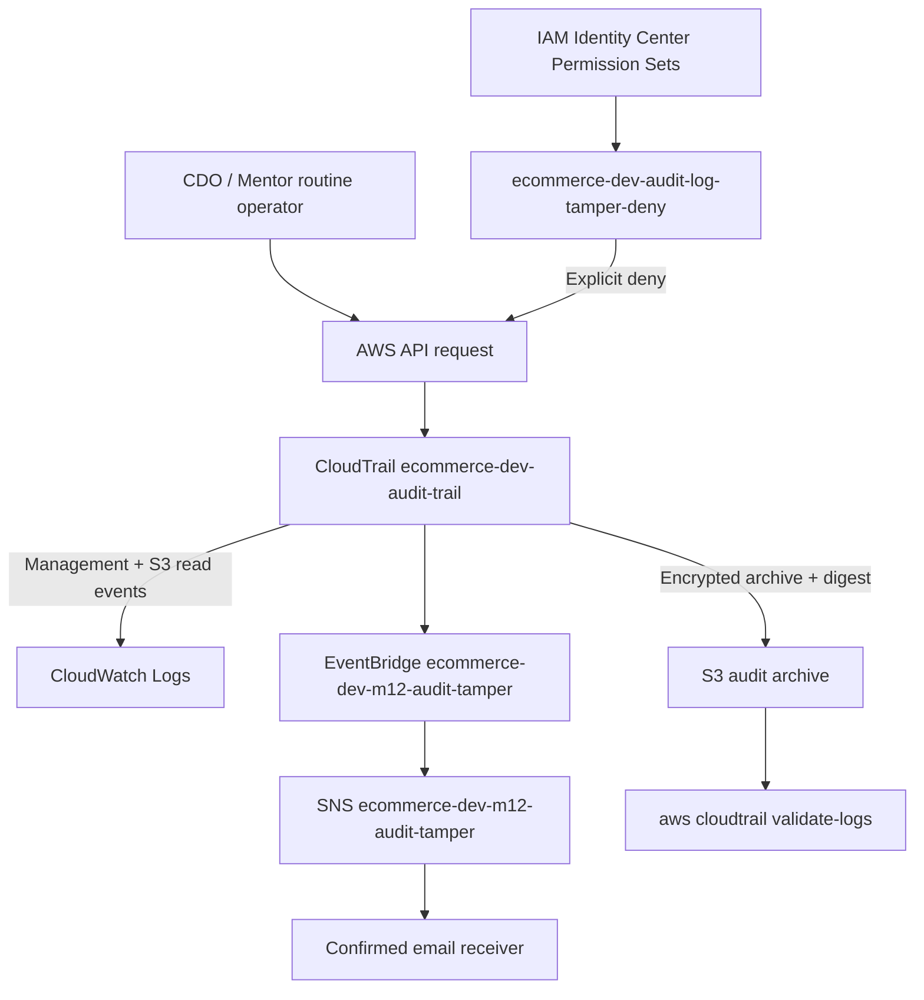

# MANDATE-12 — Báo cáo kỹ thuật: Audit Anti-Defeat

> **Owner:** CDO-09 · Task Force 4 — Auditability
> **Môi trường:** Sandbox / Product-like
> **Region:** `us-east-1`
> **Chỉ thị tham chiếu:** [`MANDATE-12-audit-anti-defeat-tf4.md`](../../../../mandates/MANDATE-12-audit-anti-defeat-tf4.md)
> **Ngày cập nhật runtime:** 21/07/2026
> **PR triển khai:** [PR #236](https://github.com/nguyenductien-qnm/capstone-phase-3/pull/236)
> **Protected apply:** [Workflow run 29818863006](https://github.com/nguyenductien-qnm/capstone-phase-3/actions/runs/29818863006)

---

## 0. Tóm tắt điều hành

Mandate-12 yêu cầu audit trail không bị đánh bại bằng ba đòn:

1. **Làm mù** — dừng hoặc làm yếu đường ghi log trước khi tấn công.
2. **Làm hụt** — hoạt động ở nơi không được ghi, đặc biệt là đọc dữ liệu nhạy cảm.
3. **Làm mỏng/sửa** — log không đủ chi tiết để điều tra, hoặc log bị thêm, xóa, sửa mà không bị phát hiện.

Project không tạo CloudTrail hoặc S3 bucket riêng cho Mandate-12. Thay vào đó, implementation nâng cấp audit infrastructure dùng chung:

- IAM explicit deny chặn CDO/Mentor routine operators làm yếu CloudTrail.
- EventBridge và SNS email riêng cung cấp detective backup.
- CloudTrail Advanced Event Selectors bổ sung S3 read data events.
- Management events tiếp tục ghi Secrets Manager và thay đổi cấu hình quan trọng.
- CloudTrail Log File Validation chứng minh digest chain và log files không bị sửa lén.
- CloudTrail archive giữ 2.555 ngày, tương đương khoảng 7 năm.

Kết quả runtime gần nhất:

```text
CDO audit-tamper simulation     → explicitDeny
Mentor audit-tamper simulation  → explicitDeny
CloudTrail logging              → true
S3 GetObject data event         → observed
EventBridge rule                → ENABLED
SNS subscription                → 1 confirmed, 0 pending
CloudTrail integrity            → 2/2 digest, 85/85 log files valid
Terraform protected apply       → 5 added, 1 changed, 0 destroyed
```

Technical controls đã được deploy và verify live. Evidence archive chưa được cập nhật đầy đủ sau deploy; safe SNS email delivery test sẽ được capture trong buổi demo.

---

## 1. Ánh xạ yêu cầu Mandate-12

| Yêu cầu | Control của project | Bằng chứng kỹ thuật | Trạng thái runtime |
|---|---|---|---|
| Không có cửa sổ mù | IAM deny tại CDO/Mentor Permission Sets; EventBridge/SNS backup | IAM Simulator; rule/target/subscription | **PASS technical** |
| Đóng coverage gap | Management events + S3 read data events cho hai bucket nhạy cảm | Advanced Event Selectors; CloudWatch `GetObject` event | **PASS technical** |
| Toàn vẹn và đủ về mật mã | CloudTrail Log File Validation, KMS và digest chain | `aws cloudtrail validate-logs` | **PASS technical** |
| Giữ đủ lâu | S3 2.555 ngày; transition Glacier IR sau 90 ngày; CloudWatch 90 ngày | Terraform retention configuration | **PASS configuration** |

## 2. Baseline và phạm vi áp dụng

Mandate gốc giả định Directive #4 đã chứng minh Object Lock. Sandbox hiện tại chưa bật Object Lock, vì vậy báo cáo không tuyên bố audit objects là immutable tuyệt đối.

Baseline được tái sử dụng:

```text
CloudTrail      ecommerce-dev-audit-trail
S3 archive      ecommerce-dev-cloudtrail-logs
Terraform state terraform-state-phase-3
CloudWatch Logs /aws/cloudtrail/ecommerce-dev-audit-trail
```

Các control baseline đang bật:

- multi-region trail và global service events;
- KMS encryption bằng customer-managed key có rotation;
- S3 versioning, encryption và public access block;
- CloudWatch Logs integration;
- Log File Validation;
- lifecycle retention dài hạn.

Mandate-12 không tạo:

- CloudTrail mới;
- audit S3 bucket mới;
- Lambda mới;
- Slack integration mới;
- dedicated operator role không có người sử dụng.

## 3. Kiến trúc giải pháp



Thiết kế có hai lớp chống làm mù:

- **Preventive:** IAM explicit deny chặn request.
- **Detective:** CloudTrail event được EventBridge match và gửi tới SNS email.

Alert path này độc lập với Lambda/SQS/Slack pipeline của Mandate-11.

## 4. Case 1 — Chống làm mù

### 4.1 Preventive control

Customer-managed policy:

```text
ecommerce-dev-audit-log-tamper-deny
```

AdminHolder quản lý policy reference tại:

- `Phase3-CDO-PermissionSet`;
- `Phase3-Mentor-PermissionSet`.

Policy chặn các thao tác CloudTrail chính:

```text
StopLogging
DeleteTrail
UpdateTrail
PutEventSelectors
PutInsightSelectors
```

Policy còn bảo vệ CloudWatch audit logs, S3 audit bucket và KMS key khỏi các thao tác xóa hoặc làm yếu retention/encryption.

Runtime verification bằng IAM Simulator:

| Principal | `StopLogging` | `DeleteTrail` | `PutEventSelectors` |
|---|---|---|---|
| CDO role | `explicitDeny` | `explicitDeny` | `explicitDeny` |
| Mentor role | `explicitDeny` | `explicitDeny` | `explicitDeny` |

Không gọi thật `StopLogging` hoặc `DeleteTrail`, vì IAM Simulator chứng minh enforcement mà không tạo rủi ro blind window.

### 4.2 Detective backup

EventBridge rule riêng Mandate-12 theo dõi ba nhánh:

| Event source | Phạm vi |
|---|---|
| `cloudtrail.amazonaws.com` | Stop/Delete/Update trail và thay event selectors |
| `iam.amazonaws.com` | Gỡ hoặc làm yếu đúng deny policy Mandate-12 |
| `sso.amazonaws.com` | Gỡ customer-managed policy reference khỏi Permission Set |

Pattern dùng `$or` để không ghép chéo event source và event name. Nhánh IAM được lọc theo đúng policy ARN; nhánh Identity Center được lọc theo policy name/path để giảm alert noise.

Runtime hiện tại:

```text
Rule state              ENABLED
EventBridge target      SNS Mandate-12 topic
SNS confirmed           1
SNS pending             0
```

Subscription đã confirmed. Safe delivery message và screenshot email sẽ được capture trong buổi demo; không cần thực hiện destructive CloudTrail action để test email.

## 5. Case 2 — Chống làm hụt

### 5.1 Management event coverage

Advanced selector `ManagementEvents` giữ toàn bộ management events. Coverage này bao gồm:

- Secrets Manager API calls như `GetSecretValue`;
- CloudTrail, IAM, KMS, EKS và network configuration changes;
- caller identity, event time, source IP, region, request parameters và kết quả request khi AWS cung cấp.

Secret value hoặc credential không được ghi nguyên văn vào CloudTrail. Đây là redaction bảo mật có chủ ý, không phải coverage gap.

### 5.2 S3 read data events

Trước Mandate-12, trail không có S3 object data resource selector. Implementation bổ sung selector `S3ReadDataEvents`:

```text
eventCategory = Data
resources.type = AWS::S3::Object
readOnly = true
```

Scope chỉ gồm:

```text
arn:aws:s3:::ecommerce-dev-cloudtrail-logs/
arn:aws:s3:::terraform-state-phase-3/
```

Giới hạn hai bucket giúp đóng coverage gap ở dữ liệu audit/state nhạy cảm mà không bật data events cho toàn bộ S3 account.

Runtime đã ghi nhận `GetObject` thành công với:

```text
eventName       GetObject
eventCategory   Data
managementEvent false
readOnly        true
actor           CDO SSO role
```

Kết quả này chứng minh một routine operator đọc object sẽ để lại vết có thể truy vấn trong CloudWatch Logs.

## 6. Case 3 — Chống làm mỏng/sửa

### 6.1 Độ chi tiết phục vụ điều tra

CloudTrail management/data events cung cấp các trường phục vụ dựng lại hành vi:

- ai thực hiện: `userIdentity` và session issuer;
- làm gì: `eventSource` và `eventName`;
- khi nào: `eventTime`;
- từ đâu: source IP, region và user agent;
- tài nguyên nào: `resources` và request parameters;
- kết quả: response elements hoặc error code/message;
- tương quan: event ID và request ID.

CloudTrail không lưu nội dung plaintext của secret hoặc toàn bộ object payload. Việc không ghi sensitive value là đặc tính bảo mật; audit trail tập trung vào attribution, action, resource và kết quả.

### 6.2 Toàn vẹn mật mã

Trail có:

```text
IsMultiRegionTrail        true
LogFileValidationEnabled  true
KMS encryption            enabled
```

CloudTrail tạo digest files được ký và nối thành hash chain. `validate-logs` phát hiện:

- log file bị sửa hoặc xóa;
- digest file bị sửa hoặc xóa;
- digest chain bị đứt;
- file lạ được chèn vào chuỗi đã ký.

Fresh validation ngày 21/07/2026:

```text
Interval: 2026-07-21T10:00:00Z → 2026-07-21T11:00:00Z
2/2 digest files valid
85/85 log files valid
Exit code: 0
```

Không dùng `--state-file`; AWS CLI `2.36.1` không hỗ trợ option này cho `cloudtrail validate-logs`.

## 7. Retention

| Lớp lưu trữ | Retention | Mục đích |
|---|---:|---|
| CloudTrail S3 archive | 2.555 ngày, khoảng 7 năm | Điều tra dài hạn và audit evidence |
| Glacier Instant Retrieval transition | Sau 90 ngày | Giảm chi phí archive |
| CloudTrail CloudWatch Logs | 90 ngày | Operational query nhanh |
| EKS control-plane audit logs | 7 ngày | Known gap riêng; không phải archive chính của Mandate-12 |

S3 archive là nguồn lưu dài hạn sau khi CloudWatch Logs hết retention. Versioning bảo vệ khỏi overwrite/xóa nhầm nhưng không thay thế Object Lock.

## 8. Implementation và source mapping

| File | Vai trò |
|---|---|
| `terraform/modules/cloudtrail/main.tf` | Advanced selectors, IAM deny policy, EventBridge và SNS resources |
| `terraform/modules/cloudtrail/variables.tf` | Inputs cho S3 data events và alert path |
| `terraform/modules/cloudtrail/outputs.tf` | Policy ARN, rule name và SNS topic ARN |
| `terraform/environments/sandbox/access.auto.tfvars` | Bật M12 alert và khai báo hai bucket prefixes |
| `terraform/environments/sandbox/main.tf` | Wire Sandbox inputs vào CloudTrail module |
| `terraform/environments/sandbox/variables.tf` | Sandbox variable contract |
| `terraform/environments/sandbox/outputs.tf` | Expose runtime outputs |
| `terraform/environments/develop/*` | Giữ shared interface tương thích; M12 mặc định tắt |
| `.github/workflows/infra-cd.yaml` | Map email secret vào Terraform plan/apply |

`access.auto.tfvars` chỉ chứa non-secret security configuration có thể review. Email receiver không hardcode; GitHub secret `MANDATE_12_ALERT_EMAIL` được map thành `TF_VAR_mandate_12_alert_email`.

## 9. Change trail và deployment

| Hạng mục | Giá trị |
|---|---|
| PR | [#236](https://github.com/nguyenductien-qnm/capstone-phase-3/pull/236) |
| Review | Owner review: `APPROVED` |
| Merge commit | `a7cef168f36d69bb0126d8f3d275c0f79f636670` |
| Implementation head | `524bd75d7eff3d0620e6b01b3c2deec8f169402a` |
| Protected apply | [Run 29818863006](https://github.com/nguyenductien-qnm/capstone-phase-3/actions/runs/29818863006) |
| Plan/apply result | `5 added, 1 changed, 0 destroyed` |
| Jira parent | `CDO-202` |
| Jira subtasks | `CDO-214`, `CDO-215`, `CDO-216` |

Apply update CloudTrail in-place và tạo năm resource alert:

- EventBridge rule;
- EventBridge SNS target;
- SNS topic;
- SNS topic policy;
- SNS email subscription.

Không replace hoặc destroy CloudTrail trail, S3 audit bucket hay KMS key.

## 10. Runtime verification matrix

| ID | Acceptance | Kết quả kỹ thuật | Evidence archive |
|---:|---|---|---|
| 01 | PR được review và protected apply | PASS | Chưa cập nhật pack |
| 02 | Trail còn logging, multi-region, KMS, validation | PASS | Chưa cập nhật pack |
| 03 | Deny policy có trên CDO/Mentor roles | PASS | Đã có evidence cũ; cần review lại metadata |
| 04 | CDO/Mentor tamper actions là explicit deny | PASS | Đã có evidence cũ |
| 05 | Management + S3 Advanced Event Selectors | PASS | Chưa capture raw output mới |
| 06 | Actual S3 GetObject data event | PASS | Chưa capture raw output đã redact |
| 07 | EventBridge rule và SNS target/policy | PASS | Chưa capture raw output mới |
| 08 | SNS subscription confirmed | PASS configuration | Safe delivery screenshot pending |
| 09 | Digest/log integrity validation | PASS: 2/2 và 85/85 | Chưa capture output vào pack |
| 10 | PR/Jira/reviewer/workflow attribution | PASS technical | Chưa cập nhật evidence index |

Phân biệt trạng thái:

- **PASS technical:** control đã được kiểm tra live trên AWS.
- **Evidence pending:** output/screenshot đã redact chưa được đưa vào evidence pack.

## 11. Chi phí và blast radius

Chi phí tăng thêm được giữ thấp nhờ:

- chỉ ghi read-only data events cho hai bucket;
- một EventBridge rule riêng;
- một SNS topic và email subscription;
- không thêm Lambda, SQS, DynamoDB hoặc CloudTrail mới.

Blast radius của apply:

- CloudTrail selector được update in-place;
- storefront, EKS workloads và flagd không bị sửa;
- không có resource destroy;
- smoke test hot path sau apply đã pass trong cùng workflow.

## 12. Rủi ro còn lại

### 12.1 Object Lock chưa bật

CloudTrail bucket có versioning nhưng chưa bật Object Lock. AWS hỗ trợ bật Object Lock trên bucket hiện hữu có versioning, tuy nhiên đây là thay đổi không thể đảo ngược. Default retention chỉ áp dụng cho object mới; object cũ cần retention riêng.

Object Lock cần follow-up có risk approval, retention design và rollback expectations riêng. Mandate-12 hiện dựa vào IAM deny, versioning, KMS, long retention và cryptographic validation; báo cáo không tuyên bố immutable storage tuyệt đối.

### 12.2 Identity Center administrator

CDO/Mentor routine roles bị chặn nhưng Identity Center/Organizations administrator vẫn có thể thay đổi Permission Set. EventBridge theo dõi thao tác detach đúng customer-managed policy reference, nhưng không bao phủ mọi thay đổi Identity Center control plane.

Follow-up mạnh hơn nếu threat model yêu cầu:

- SCP ở Organizations level;
- Permission Set management bằng code với independent approval;
- định kỳ kiểm tra policy attachment và IAM Simulator;
- break-glass principal tách biệt, có expiry và evidence.

### 12.3 Scope S3 data events

Chỉ hai bucket được bật data events. Đọc object ở bucket khác không thuộc coverage Mandate-12 hiện tại. Mở rộng coverage cần cost và data classification review.

### 12.4 Email delivery

SNS subscription đã confirmed. Safe email delivery cần được chạy trong buổi demo và lưu screenshot đã redact. Alert email không thay thế preventive IAM deny.

## 13. Rollback

Rollback chuẩn đi qua revert PR và protected Terraform workflow:

1. Revert code tạo EventBridge/SNS resources và S3 data selector.
2. Review Terraform plan đảo ngược.
3. Chỉ apply khi plan không destroy trail, audit bucket hoặc KMS key.
4. AdminHolder chỉ gỡ deny policy khỏi Permission Sets khi có phê duyệt riêng.

Có thể rollback alert path riêng mà không chạm Lambda/SQS/Slack của Mandate-11.

## 14. Tài liệu và evidence

- [Video demo guide](video.md)
- [Implementation plan](implementation-plan.md)
- [Verification runbook](runbook.md)
- [External/adminHolder actions](external-actions.md)
- [Decision log](decision-log.md)
- [Evidence workspace](../README.md)
- [Evidence matrix](../mandate-12.md)

## 15. Trạng thái cuối

### Đã hoàn tất về kỹ thuật

- [x] Preventive IAM deny effective trên CDO và Mentor roles.
- [x] EventBridge/SNS alert path đã deploy và subscription confirmed.
- [x] Management events được giữ nguyên.
- [x] S3 read data events được bật cho hai bucket nhạy cảm.
- [x] Actual `GetObject` data events đã được quan sát.
- [x] Log File Validation enabled và fresh validation pass.
- [x] Retention dài hạn được cấu hình.
- [x] PR review, protected apply và smoke test pass.

> **Kết luận:** Mandate-12 đã được triển khai và kiểm chứng live về mặt kỹ thuật. Việc còn lại là đóng gói evidence và thực hiện safe email delivery demo; không còn thay đổi architecture bắt buộc cho scope hiện tại.
