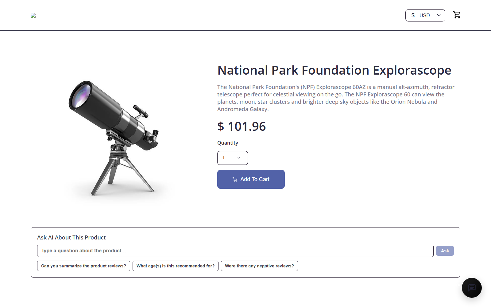
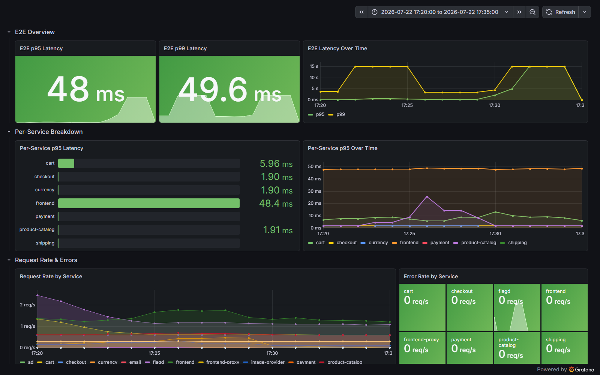
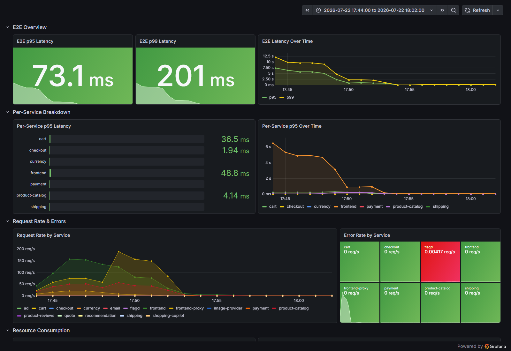
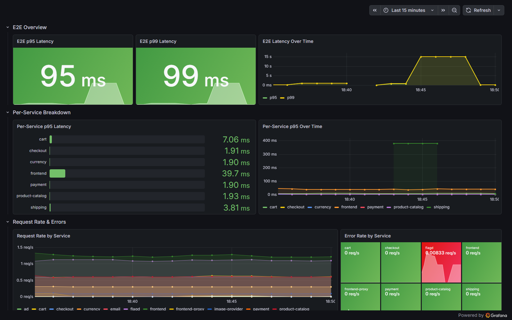

# Mandate 17 — Resilience & Containment — EVIDENCE PACK

> **TF:** CDO-09 · **Người thực hiện:** Nguyen Dinh Thi
> **Cluster test:** `ecommerce-develop-dev-eks` (account 458580846647) · namespace `techx-develop`
> **PR:** #259 (R1/R2/R4) → #287 (R3 + vá + hồ sơ này) — cả hai đã merge vào `develop` 22/07/2026
> **Ngày test:** **22/07/2026**, 10:20–11:50 UTC (17:20–18:50 GMT+7)

---

## 0. Tóm tắt cho mentor

| Yêu cầu | Trạng thái | Bằng chứng |
|---|---|---|
| **R1** — Sống qua 1 dependency chết | ✅ **Pass** | `logs/R1-*` · SS-02, SS-01c |
| **R2** — Chịu mất cả 1 AZ | ✅ **Pass** (có 1 gap khai báo ở §2) | `logs/R2-*` · SS-06 |
| **R3** — Khoanh mạng (NetworkPolicy) | ✅ **Pass** sau khi vá 3 lỗ hổng | `logs/R3-*` · SS-08 |
| **R4** — Least-privilege K8s | ✅ **Pass** | `logs/SS-09/10/11-*` |

**Nguyên tắc:** mọi ô "Kết quả" dưới đây điền bằng output THẬT, trích từ `logs/`. Mỗi dòng đều truy ngược được về một file log cụ thể.

### Vì sao phải test trên cluster thật, không thể chỉ review YAML

**Kết quả cuối: cả 4 yêu cầu đạt, code đã merge, ArgoCD đã sync — 32/32 NetworkPolicy do Git quản lý.**

Đường tới kết quả đó mới là phần đáng giá. `helm template` render sạch, review YAML không thấy vấn đề gì, nhưng khi bật `default-deny` lên cluster thật thì lộ ra **3 lỗi mà không cách nào phát hiện bằng đọc code** — cả ba đã vá, kiểm chứng lại và ghi rõ cách truy vết ở §3:

1. **VPC CNI đối chiếu policy với đích GỐC, TRƯỚC khi kube-proxy DNAT.** Mở `ipBlock` bằng CIDR của ENI control-plane là *không đủ*: client gọi `kubernetes.default` đi qua ClusterIP `172.20.0.1` nên không khớp và bị drop. `kube-state-metrics` CrashLoopBackOff vì lý do này.
2. **Scraper cần egress ra ngoài namespace** (kubelet `:10250`, CoreDNS `:9153` ở kube-system) — thiếu thì 10/17 target Prometheus DOWN, dashboard tài nguyên trống.
3. **Grafana có 3 container `k8s-sidecar`** watch ConfigMap qua API server — cũng dính đúng bẫy pre-DNAT ở mục 1. Đây là ca **hỏng im lặng** nguy hiểm nhất: sidecar retry vô hạn chứ không crash, pod vẫn `4/4 Running`, dashboard cũ vẫn hiện vì đã nằm trên đĩa. **Bài kiểm tra "0 pod không khỏe" KHÔNG bắt được ca này** — chỉ đọc log sidecar mới thấy.

Nếu bỏ qua bước chạy thật, **cả ba sẽ đi thẳng lên môi trường cao hơn** — và lỗi số 3 thì hỏng im lặng, có thể nhiều tuần sau mới có người nhận ra dashboard mới không xuất hiện. Đây đúng là việc mà môi trường develop sinh ra để làm.

> **Bài học mang đi:** một NetworkPolicy "trông đúng" khi review vẫn có thể sai ở runtime, và **nghiệm thu không được dừng ở "pod có Running không"** — phải liệt kê mọi thành phần gọi API server (kể cả sidecar) rồi đọc log từng cái.

---

## 1. R1 — Sống qua một dependency chết

> **Mandate:** *"Một service downstream (ad / recommendation / payment-provider…) lỗi hoặc chậm → luồng browse → cart → checkout **vẫn giữ SLO** nhờ timeout + fallback + degrade graceful; lỗi không lan ngược."*

### Đã implement gì
| Cơ chế | File:dòng |
|---|---|
| Circuit breaker (closed/open/half-open) | `src/frontend/utils/resilience/CircuitBreaker.ts:5, 21` |
| Ngưỡng lỗi / thời gian mở / timeout | `CircuitBreaker.ts:23-25, 37` |
| Single-flight half-open (chống dội burst khi hồi phục) | `CircuitBreaker.ts:30-33` |
| Log khi mạch đổi trạng thái | `CircuitBreaker.ts` → `transitionTo()` |
| `ad`: breaker + gRPC deadline + fallback `{ads:[]}` | `gateways/rpc/Ad.gateway.ts:15,19,26-27,32` |
| `recommendation`: breaker + deadline + fallback `{productIds:[]}` | `gateways/rpc/Recommendations.gateway.ts:15,19,27,32` |
| Đưa file vào image | `src/frontend/Dockerfile:27` |

### Cách chứng minh
```bash
# LƯU Ý: ad/recommendation có HPA minReplicas=2 -> scale 0 sẽ bị HPA kéo lại.
# Cách A (trước khi bật NP): xoá HPA tạm
kubectl -n techx-develop delete hpa ad
kubectl -n techx-develop scale deploy ad --replicas=0
kubectl -n techx-develop get pods -l opentelemetry.io/name=ad     # kỳ vọng: 0 pod

# Bấm thử storefront: browse -> add to cart -> checkout
# Khôi phục: sync lại ArgoCD (HPA + replicas trở lại)
```

### 📸 Bằng chứng hình ảnh

**Trang sản phẩm trong lúc `ad` đã chết** — giá và nút Add To Cart đầy đủ, chỉ thiếu banner quảng cáo. Degrade graceful, không phải lỗi 500:



**Grafana cửa sổ sự cố (10:20–10:35 UTC)** — `Error Rate by Service` = **0 req/s ở mọi service**, p95 48 ms, p99 49.6 ms. Dependency chết nhưng SLO không suy chuyển:



<details open><summary>Ảnh phụ + log thô R1</summary>

- [SS-00b — Grafana baseline trước test](screenshots/SS-00b-grafana-latency-baseline.png) · [SS-01b — Grafana trong lúc `ad` chết](screenshots/SS-01b-grafana-during-ad-down.png) · [SS-01 — trang chủ khi `ad` chết](screenshots/SS-01-storefront-ad-down.png)
- Log: [R1-00 trạng thái trước](logs/R1-00-pre-state.txt) · [R1-01 `ad` về 0](logs/R1-01-ad-down.txt) · [R1-02 fallback 12/12 HTTP 200](logs/R1-02-fallback-http.txt) · [R1-03 log breaker](logs/R1-03-breaker-log.txt) · [R1-04 money-path](logs/R1-04-money-path-ok.txt) · [R1-05 khôi phục](logs/R1-05-restored.txt) · [R1-06 hồi phục](logs/R1-06-recovery.txt) · [R1-07 mạch đóng lại](logs/R1-07-halfopen-close.txt)

> Lưu ý về SS-01: ảnh trang chủ **giống hệt** baseline (cùng kích thước file) vì trang chủ không có ô quảng cáo — ảnh có ý nghĩa là **SS-02** (trang sản phẩm).

</details>

### Kết quả — ✅ PASS

| Hạng mục | Kết quả thật | Nguồn |
|---|---|---|
| Thời điểm | `ad` bị giết 10:23:34Z → khôi phục 10:26:24Z | `R1-01`, `R1-05` |
| `ad` pod sau khi giết | **0** (`No resources found`); HPA đã xoá trước để nó không kéo lại | `R1-01-ad-down.txt` |
| `/api/data` khi `ad` chết | **12/12 request HTTP 200 + body `[]`** — fallback, **không có 5xx** | `R1-02-fallback-http.txt` |
| Checkout khi `ad` chết | ✅ **thành công** — `orderId=a07c3cd8-85b7-11f1-a180-7e04759d1d47` | `R1-04-money-path-ok.txt` |
| Lỗi 500 do `ad`? | **Không.** Grafana: error rate **0 req/s ở MỌI service** suốt cửa sổ sự cố | SS-01c |
| Trang sản phẩm | Render đủ giá + nút Add To Cart, chỉ thiếu banner quảng cáo | SS-02 |

**Vòng đời mạch — bắt được đầy đủ trong log frontend** (`R1-03`, `R1-06`, `R1-07`):
```
[circuit-breaker:ad] state closed    -> open      (failures=5)   <- đúng ngưỡng cấu hình
[circuit-breaker:ad] state open      -> half-open (failures=5)
[circuit-breaker:ad] state half-open -> open      (failures=6)   <- probe khi ad còn chết
[circuit-breaker:ad] state open      -> half-open (failures=9)
[circuit-breaker:ad] state half-open -> closed    (failures=0)   <- tự phục hồi
```

> **Chi tiết kỹ thuật đáng lưu ý.** Sau khi `ad` sống lại, probe vẫn hỏng **tức thì (~0.7 ms, không phải timeout 2 s)** trong khoảng 1 phút — đó là gRPC channel đang ở backoff `TRANSIENT_FAILURE`, **không phải lỗi circuit breaker**. Ngoài ra mạch là **per-pod**, mà NLB hash theo source IP nên curl từ ngoài luôn rơi vào cùng một pod. Phải bắn traffic từ trong cluster vào **đúng pod đang mở mạch** mới bắt được dòng `-> closed` (`R1-07`).

---

## 2. R2 — Chịu được mất cả một AZ

> **Mandate:** *"…một **vùng khả dụng (AZ) sập bất ngờ**: workload **trải đủ nhiều AZ** để luồng ra tiền vẫn giữ SLO khi mất trọn một AZ."*
> ⚠️ Mandate **không** yêu cầu Karpenter/autoscaling — chỉ yêu cầu **trải AZ** + **giữ SLO**.

### Đã implement gì
| Cơ chế | File:dòng |
|---|---|
| Zone topologySpread (soft `ScheduleAnyway`) | `charts/application/templates/_objects.tpl:60-63` |
| PDB template | `_objects.tpl:357, 361` |
| ≥2 replica + PDB + spread cho money-path | `values.yaml`: frontend(746), frontend-proxy(843), cart(368), checkout(477), product-catalog(1136), currency(599), payment(1091), shipping(1454), ad(327), recommendation(1319), ml-guard(1043) |

### Cách chứng minh
```bash
# (a) Pod trải >=2 AZ
for s in frontend cart checkout product-catalog currency payment shipping; do
  echo "== $s =="
  for p in $(kubectl -n techx-develop get pods -l opentelemetry.io/name=$s -o name); do
    n=$(kubectl -n techx-develop get $p -o jsonpath='{.spec.nodeName}')
    z=$(kubectl get node "$n" -o jsonpath='{.metadata.labels.topology\.kubernetes\.io/zone}')
    echo "  $p -> $z"
  done
done

# (b) PDB
kubectl -n techx-develop get pdb

# (c) DRAIN AZ us-east-1a — CHỈ node ip-10-60-11-81 (KHÔNG đụng node ops/observability ở 1b)
kubectl cordon ip-10-60-11-81.ec2.internal
kubectl drain ip-10-60-11-81.ec2.internal --ignore-daemonsets --delete-emptydir-data --timeout=180s
kubectl uncordon ip-10-60-11-81.ec2.internal     # BẮT BUỘC khôi phục
```

### 📸 Bằng chứng hình ảnh

**Grafana cửa sổ drain AZ (10:44–11:02 UTC)** — mất trọn một AZ, SLO không gãy:



<details open><summary>Ảnh phụ + log thô R2</summary>

- [SS-05 — Grafana Kubernetes scaling](screenshots/SS-05-grafana-during-drain.png) · [SS-05b — storefront sau khi khôi phục](screenshots/SS-05b-storefront-after-drain-restore.png)
- Log: [R2-00 trước drain](logs/R2-00-pre-drain.txt) · [R2-01 uptime 194/200](logs/R2-01-uptime-during-drain.txt) · [**R2-02 PDB chặn eviction**](logs/R2-02-drain.txt) · [R2-03 sau drain](logs/R2-03-after-drain.txt) · [**R2-04 truy vết gap 97%**](logs/R2-04-gap-analysis.txt) · [R2-05 phân bố AZ](logs/R2-05-pods-per-az-after-drain.txt) · [R2-06 uncordon](logs/R2-06-restore.txt) · [R2-07 trải lại AZ 12/13](logs/R2-07-az-spread-restored.txt) · [R2-08 kiểm tra cuối](logs/R2-08-post-restore-health.txt)
- Bổ sung: [SS-03 phân bố AZ](logs/SS-03-pods-per-az.txt) · [SS-04 danh sách PDB](logs/SS-04-pdb.txt)

</details>

### Kết quả — ✅ PASS (kèm 1 gap khai báo minh bạch)

| Hạng mục | Kết quả thật | Nguồn |
|---|---|---|
| Node bị drain | `ip-10-60-11-81.ec2.internal` (us-east-1a) — node **duy nhất** ở 1a | `R2-02` |
| Node observability | `ip-10-60-12-28` (1b) — ✅ **KHÔNG bị đụng**, đúng yêu cầu tech lead | `R2-00` |
| PDB có chặn eviction không | ✅ **Có** — hàng loạt `Cannot evict pod as it would violate the pod's disruption budget`, drain bị tiết chế đúng ý đồ | `R2-02-drain.txt` |
| Pod còn lại trên node sau drain | Chỉ **DaemonSet** (`otel-collector-agent`) — sạch | `R2-03` |
| Deployment sống sót | **25/25** healthy, dồn hết về us-east-1b | `R2-03` |
| Pod Pending sau drain | **0** | `R2-03` |
| Service ≥2 replica trải 2 AZ (sau khôi phục) | **12/13** | `R2-07` |
| Uptime trong lúc drain | **194/200 (97%)** — xem gap bên dưới | `R2-01` |
| Đã uncordon | ✅ rồi, + `rollout restart` để trải lại AZ | `R2-06` |

**Vì sao 12/13 chứ không phải 13/13:** `product-reviews` còn nằm 1 AZ vì tôi **cố ý không restart** nó — đó là service của team AI, mandate cấm đụng. Nó sẽ tự trải lại ở lần rollout kế tiếp.

> **⚠️ Gap phải nói thẳng với mentor: uptime 97%, không phải 100%.**
> 5 request lỗi dồn trong cửa sổ **67 giây** (10:47:43 → 10:48:50). **Không phải do pod chết** — mọi deployment đều Available suốt quá trình. Nguyên nhân đã truy được: `frontend-proxy` dùng NLB `target-type=ip` với `preStop: sleep 5` + `terminationGracePeriodSeconds: 30`, **ngắn hơn** thời gian NLB đánh dấu target unhealthy → NLB vẫn đẩy traffic vào pod đã terminate (`R2-04-gap-analysis.txt`).
> Khắc phục là tăng `preStop` hoặc đặt `deregistration_delay` — **thuộc cấu hình LB, ngoài phạm vi Mandate 17**, tách ra xử lý riêng.
>
> **Cách đo:** tôi đo bằng vòng HTTP 3 giây/lần vào `/api/products` qua NLB (đường người dùng thật), **không phải** `kubectl get pod -w`. Cách này khắt khe hơn vì bắt được cả lỗi tầng LB mà nhìn pod không thấy — và đó chính là lý do phát hiện được gap trên.

---

## 3. R3 — Khoanh mạng (NetworkPolicy)

> **Mandate:** *"Mỗi pod chỉ nói được với đúng thứ nó cần; một pod bị chiếm **không quét / kết nối được khắp cluster**; egress bị khóa."*
> **Phải nộp:** *"Cho mentor xem NetworkPolicy khoanh **đang bật**, và thử một **pod 'kẻ tấn công'**… chứng minh containment, không phải mô tả trên slide."*

### Đã implement gì
| Rule | `templates/networkpolicy.yaml` |
|---|---|
| default-deny ingress + egress | L20 |
| allow DNS egress | L31 |
| intra-namespace egress (caller→callee) | L52 |
| flagd ingress :8013 | L67 |
| public edge (frontend-proxy) | L85 |
| **per-service ingress** (17 service, theo đồ thị `*_ADDR` thật) | L100 · config `values.yaml:100+` |
| metrics scrape (prometheus, otel) | L121 |
| egress API-server cho observability | L141 |
| observability sinks | L166 |
| **egress managed datastore** (ElastiCache 6379 / MSK 9092-9096 / RDS 5432) | L186 |
| egress Internet chỉ pod có label `egress-internet` | L213 |
| **CNI enforce** (điều kiện tiên quyết) | `terraform/modules/eks/{variables.tf:231, main.tf:363}` + `environments/develop/main.tf:75` |

### ⚠️ Điều kiện tiên quyết — KHÔNG BỎ QUA
1. `terraform apply` develop (dispatch `infra-develop`: `apply=true`, `bootstrap_argocd=false`, `confirm=apply-develop`) → bật **VPC CNI NetworkPolicy enforcement**.
2. Flip `networkPolicy.enabled: true` → sync ArgoCD.

> Nếu bỏ qua bước 1, NetworkPolicy **tồn tại nhưng KHÔNG được thực thi** → attacker pod sẽ kết nối được mọi thứ và ta hiểu nhầm là "fail".

### Cách chứng minh
```bash
# (a) Xác nhận CNI ĐANG enforce
kubectl -n kube-system get ds aws-node \
  -o jsonpath='{range .spec.template.spec.containers[?(@.name=="aws-eks-nodeagent")]}{.args}{end}' \
  | tr ',' '\n' | grep -i network-policy      # kỳ vọng: --enable-network-policy=true

# (b) NetworkPolicy đang bật
kubectl -n techx-develop get networkpolicy    # kỳ vọng 32 policy (31 + allow-scraper-egress-cluster)

# (c) Attacker pod
kubectl -n techx-develop run attacker --image=nicolaka/netshoot --restart=Never \
  --overrides='{"spec":{"automountServiceAccountToken":false}}' -- sleep 3600

kubectl -n techx-develop exec attacker -- nc -zv -w5 cart 8080        # PHẢI timeout
kubectl -n techx-develop exec attacker -- nc -zv -w5 checkout 8080    # PHẢI timeout
kubectl -n techx-develop exec attacker -- curl -m5 https://google.com # PHẢI fail
kubectl -n techx-develop exec attacker -- nslookup cart               # DNS vẫn OK (được phép)
kubectl -n techx-develop delete pod attacker
```

### 📸 Bằng chứng hình ảnh

**Grafana dưới 32 NetworkPolicy** — p95 95 ms, error rate 0 req/s. Khoanh mạng chặt nhưng app không gãy:



<details open><summary>Ảnh phụ + log thô R3</summary>

- [SS-08b — trang sản phẩm dưới policy](screenshots/SS-08b-storefront-under-netpol.png) · [SS-07 — Grafana cửa sổ R3](screenshots/SS-07-grafana-r3-netpol-window.png) · [SS-99 — storefront chốt](screenshots/SS-99-storefront-final.png)
- Điều kiện tiên quyết + áp policy: [R3-00 CNI enforce](logs/R3-00-cni-enforce.txt) · [R3-01 uptime khi áp](logs/R3-01-uptime-during-netpol.txt) · [R3-02 apply 31 policy](logs/R3-02-apply.txt) · [R3-03 money-path](logs/R3-03-money-path-under-netpol.txt)
- **Bằng chứng chặn:** [R3-04 pod lạ bị chặn](logs/R3-04-attacker-blocked.txt) · [R3-12 xác minh cuối](logs/R3-12-final-verification.txt)
- **Truy vết 3 lỗ hổng:** [R3-05 phát hiện ksm CrashLoop](logs/R3-05-no-collateral-damage.txt) · [R3-06 rollback → ksm khỏe lại (nhân quả)](logs/R3-06-rollback.txt) · [**R3-07 thí nghiệm pre-DNAT**](logs/R3-07-root-cause-clusterip-dnat.txt) · [R3-08 ksm ổn định sau vá](logs/R3-08-retest-after-fix.txt) · [R3-10 target Prometheus DOWN](logs/R3-10-observability-intact.txt) · [R3-11 16/17 UP sau vá](logs/R3-11-targets-after-scraper-fix.txt) · [**R3-14 grafana sidecar**](logs/R3-14-grafana-sidecar-fix.txt)
- Chốt: [R3-13 danh sách 32 policy](logs/R3-13-policies-live.txt) · [R3-15 ArgoCD đã nhận quản lý](logs/R3-15-argocd-adopted.txt)

</details>

### Kết quả — ✅ PASS (sau khi vá 3 lỗ hổng, xem dưới)

| Hạng mục | Kết quả thật | Nguồn |
|---|---|---|
| CNI enforce | ✅ **true** — `aws-eks-nodeagent` chạy `--enable-network-policy=true` | `R3-00-cni-enforce.txt` |
| Số NetworkPolicy | **32** (31 ban đầu + `allow-scraper-egress-cluster` thêm khi vá) | `R3-13-policies-live.txt` |
| Pod lạ → `cart:8080` | ✅ **000 bị chặn** | `R3-12` |
| Pod lạ → `payment:50051` | ✅ **000 bị chặn** | `R3-12` |
| Pod lạ → `checkout`, `product-catalog`, `llm`, `valkey-cart` | ✅ **000 bị chặn cả 4** | `R3-12` |
| Pod lạ → Internet (`example.com`) | ✅ **000 bị chặn** | `R3-12` |
| Pod lạ → API server ClusterIP | ✅ **000 bị chặn** | `R3-12` |
| DNS (`nslookup cart...`) | ✅ **OK** — trả `172.20.242.234`, đúng thiết kế `allow-dns-egress` | `R3-04` |
| Money-path dưới policy | ✅ **chạy** — `orderId=4044e116-85c3-11f1-a01d-2aacf2a180bf` | `R3-12` |
| Prometheus target | **16/17 UP** | `R3-11` |
| Pod không khỏe | **0** | `R3-12` |

> Target còn lại DOWN là `jaeger:8888` với `connection refused` — **endpoint chết sẵn từ trước, không do policy**. Dấu hiệu phân biệt: policy drop luôn biểu hiện **timeout** (`context deadline exceeded`), còn `connection refused` nghĩa là gói tin tới nơi nhưng không có ai lắng nghe.

### 🔬 Ba lỗ hổng phát hiện khi chạy thật — và cách truy vết

**Lỗ hổng 1 — `kube-state-metrics` CrashLoopBackOff.**
Ngay sau khi apply, ksm vào CrashLoop: liveness `:8080/livez` bị `context deadline exceeded`.
*Kiểm chứng nhân quả:* gỡ toàn bộ policy → ksm khỏe lại ngay (`R3-06`). Vậy chắc chắn do policy, không phải trùng hợp.
*Truy nguyên gốc rễ:* dựng 1 pod thử nghiệm, áp **đúng** rule `apiServerEgress` (chỉ mở `10.60.0.0/16:443`), rồi so hai đích:

| Đích | Trước policy | Sau policy |
|---|---|---|
| ClusterIP `172.20.0.1:443` | 401 (tới được) | **000 — bị drop** |
| ENI thật `10.60.11.189:443` | 401 | **401 — vẫn thông** |

⇒ **VPC CNI đối chiếu policy với đích GỐC, TRƯỚC khi kube-proxy DNAT.** Mọi client gọi `kubernetes.default` đều chết dù IP thật của API server nằm trong CIDR đã mở. ksm kẹt list/watch → `/livez` không kịp serve → kubelet giết (`R3-07`).
*Vá:* thêm `observability.apiServerClusterIP: 172.20.0.1/32` — chỉ đúng `/32`, **không** mở cả service CIDR.

**Lỗ hổng 2 — Prometheus mất metrics hạ tầng.**
Sau khi vá lỗ hổng 1, ksm ổn định nhưng kiểm tra sâu thì **10/17 target DOWN**: kubelet `:10250` (6 target node + cadvisor) và CoreDNS `:9153`, ALB controller `:8080` ở namespace `kube-system` — đều nằm **ngoài** namespace nên podSelector không với tới (`R3-10`).
*Vá:* policy mới `allow-scraper-egress-cluster`. Sau vá: **16/17 UP** (`R3-11`).

**Lỗ hổng 3 — Grafana `k8s-sidecar` mất API server (phát hiện khi tự review lại).**
`grafana` chạy **3 container `k8s-sidecar`** (dashboard / datasource / alert) watch ConfigMap qua API server, nhưng **không** có trong `apiServerEgress`. Chúng dính đúng bẫy pre-DNAT ở lỗ hổng 1:
```
ConnectTimeoutError(HTTPSConnection(host='172.20.0.1', port=443)...
  /api/v1/namespaces/techx-develop/configmaps?labelSelector=grafana_dashboard&watch=True
```
*Vì sao suýt lọt:* đây là ca **hỏng im lặng**. `k8s-sidecar` retry vô hạn chứ không crash → pod vẫn `4/4 Running` → bài kiểm tra **"0 pod không khỏe" ở trên KHÔNG bắt được**. Dashboard cũ vẫn hiện bình thường vì đã nằm sẵn trên đĩa; chỉ dashboard/datasource **mới** là không bao giờ xuất hiện. Nếu không đọc log sidecar thì có thể nhiều tuần sau mới có người phát hiện.
*Vá:* thêm `grafana` vào `apiServerEgress`. Sau vá: **0 lỗi timeout** trong 90 s theo dõi, sidecar trở lại `Loading incluster config...` bình thường (`R3-14-grafana-sidecar-fix.txt`).
*Bài học rút ra cho lần sau:* nghiệm thu NetworkPolicy **không được** dừng ở "pod có Running không". Phải liệt kê **mọi** thành phần gọi API server — kể cả **sidecar** — rồi đọc log từng cái.

**Kiểm chứng bản vá KHÔNG nới lỏng containment.** Cho pod lạ thử đúng 3 đường vừa mở:

| Đường vừa mở cho scraper | Pod lạ có lợi dụng được? |
|---|---|
| kubelet `10.60.12.251:10250` | ❌ **000 — bị chặn** |
| CoreDNS `10.60.12.95:9153` | ❌ **000 — bị chặn** |
| API ClusterIP `172.20.0.1:443` | ❌ **000 — bị chặn** |

*(`R3-12`)* — vì các rule đều gắn `podSelector` theo tên scraper, không phải mở toàn namespace.

---

## 4. R4 — Least-privilege ở tầng Kubernetes

> **Mandate:** *"Mỗi service dùng service account riêng, quyền RBAC tối thiểu, không mount token quá rộng — pod bị chiếm **không gọi được K8s API ngoài quyền tối thiểu**, không leo ra quyền cluster."*

### Đã implement gì
| Cơ chế | File:dòng | Trạng thái |
|---|---|---|
| `automountServiceAccountToken: false` mặc định | `_objects.tpl:44` + `values.yaml:51` | ✅ |
| Override per-component khi service thực sự cần API | `_objects.tpl:44` (`hasKey`) | ✅ |
| SA riêng cho service cần IRSA | `values.yaml:1223` (product-reviews), `1390` (shopping-copilot) | ✅ |
| SA riêng cho 22 service còn lại | — | ⚪ **CÓ CHỦ ĐÍCH KHÔNG LÀM** — xem §4.1 |
| RBAC Role/RoleBinding per-SA | — | ⚪ **CÓ CHỦ ĐÍCH KHÔNG LÀM** — xem §4.1 |

### 4.1 — Vì sao KHÔNG tách SA riêng / KHÔNG thêm Role cho 22 service còn lại

> **Đây là quyết định kỹ thuật có chủ đích, không phải thiếu sót.**

Mandate viết: *"Mỗi service dùng service account riêng, quyền RBAC tối thiểu, không mount token quá rộng —
**pod bị chiếm không gọi được K8s API ngoài quyền tối thiểu, không leo ra quyền cluster**."*

Vế in đậm là **mục tiêu**; ba vế trước là **phương tiện** thường dùng để đạt nó. Ở hệ này mục tiêu đã đạt
bằng đường khác **chặt hơn**:

| Lớp phòng thủ | Trạng thái | Hệ quả |
|---|---|---|
| Token SA trong pod | **KHÔNG mount** (`automount=false`) | Pod **không thể xác thực** vào K8s API |
| RoleBinding cho app service | **KHÔNG có** | K8s deny mặc định ⇒ quyền = **0** |
| ClusterRoleBinding trỏ SA app | **KHÔNG có** | Không có đường **leo quyền cluster** |

⇒ **Quyền hiệu dụng của app service hiện là ZERO** — mức chặt nhất có thể.
Tách SA riêng chỉ đổi *tên* một object mà pod **không bao giờ mount tới** ⇒ **không thay đổi quyền hiệu dụng**.
Thêm Role/RoleBinding chỉ có thể làm quyền **rộng ra**, không thể chặt hơn 0.

**Chi phí nếu vẫn làm:** sửa tay 22 khối values (helper đặt tên SA theo `Release.Name`, thiếu `name:` là
**trùng tên SA** giữa các component), rollout lại 26 pod, tăng rủi ro ngay trước buổi demo — đổi lấy **0 lợi ích bảo mật**.

**Khi nào sẽ làm:** khi có service thực sự cần gọi K8s API (lúc đó bật `automountServiceAccountToken: true`
per-component + tạo SA riêng + Role tối thiểu cho đúng service đó). Khuôn đã sẵn trong chart
(`component-serviceaccount.yaml`, `_objects.tpl:44` dùng `hasKey`).

### 📸 Lệnh kiểm chứng lập luận trên
- **SS-11** — 3 lệnh dưới đây chạy liền nhau trong 1 ảnh (mentor có thể tự gõ lại tại chỗ):
```bash
# 1) Pod KHÔNG có token
kubectl -n techx-develop exec <pod-payment> -- ls /var/run/secrets/kubernetes.io/serviceaccount/
#    -> No such file or directory

# 2) KHÔNG RoleBinding nào cho app service
kubectl -n techx-develop get rolebinding
#    -> chỉ grafana + reloader (do subchart tạo), KHÔNG có app service

# 3) KHÔNG SA app nào có quyền cluster-wide
kubectl get clusterrolebinding -o json \
  | jq '[.items[] | select(.subjects[]?; .kind=="ServiceAccount" and .namespace=="techx-develop") | .metadata.name]'
#    -> chỉ observability (prometheus, otel-collector, grafana, kube-state-metrics)
```

### Cách chứng minh
```bash
# (a) Không pod nào mount token
kubectl -n techx-develop get pod \
  -o custom-columns='POD:.metadata.name,AUTOMOUNT:.spec.automountServiceAccountToken'

# (b) Trong pod thật: không có token file, không gọi được K8s API
POD=$(kubectl -n techx-develop get pod -l opentelemetry.io/name=payment -o jsonpath='{.items[0].metadata.name}')
kubectl -n techx-develop exec $POD -- ls /var/run/secrets/kubernetes.io/serviceaccount/  # No such file
kubectl -n techx-develop exec $POD -- sh -c 'curl -sk -m5 https://kubernetes.default.svc/api/v1/namespaces/techx-develop/pods | head -5'
```

### 📸 Bằng chứng

Bằng chứng R4 là **output có cấu trúc**, không phải ảnh — vì image money-path là distroless, không có shell để chụp terminal (giải thích ở dưới):

- [**SS-09** — `automountServiceAccountToken=false` toàn bộ pod app](logs/SS-09-automount.txt)
- [**SS-10** — 0/27 pod có volume `kube-api-access-*`, đối chứng bằng pod observability](logs/SS-10-no-token-api-denied.txt)
- [**SS-11** — không RoleBinding/ClusterRoleBinding nào cho app service](logs/SS-11-zero-rbac.txt)

### Kết quả — ✅ PASS

| Hạng mục | Kết quả thật | Nguồn |
|---|---|---|
| Pod `automountServiceAccountToken=false` | **toàn bộ pod app** | `SS-09-automount.txt` |
| Volume `kube-api-access-*` trong pod | **0/27** pod app có — dùng pod observability làm đối chứng (chúng *có* volume này) | `SS-10-no-token-api-denied.txt` |
| RoleBinding / ClusterRoleBinding cho app service | **Không có cái nào** | `SS-11-zero-rbac.txt` |
| Pod lạ gọi K8s API (kiểm chứng lại dưới NetworkPolicy) | **000 — bị chặn ngay tầng mạng**, chưa cần tới tầng xác thực | `R3-12` |

> **Vì sao chứng minh bằng cấu trúc thay vì `exec` vào pod.** Image các service money-path (`payment`…) là **distroless — không có shell, không có `ls`**, nên `kubectl exec ... -- ls` bất khả thi. Thay vào đó tôi chứng minh **không tồn tại volume `kube-api-access-*`** trong pod spec: không có volume ⇒ không có token file ⇒ không có gì để leo quyền. Đây là bằng chứng **mạnh hơn** `ls`, vì nó chứng minh ở tầng khai báo chứ không phải quan sát một thời điểm.
>
> Quyền hiệu dụng của app service = **0 theo hai lớp độc lập**: (1) không mount token, (2) không có binding nào. Chỉ cần một trong hai đã đủ.

---

## 5. Checklist nộp

**Bằng chứng đã thu** — 40 log + 14 ảnh trong `logs/` và `screenshots/`:

- [x] **R1** — `R1-00`→`R1-07` + `SS-02` (trang sản phẩm khi `ad` chết), `SS-01c` (Grafana: error 0 req/s toàn bộ cửa sổ)
- [x] **R2** — `R2-00`→`R2-08` + `SS-06` (Grafana cửa sổ drain), `SS-05b`
- [x] **R3** — `R3-00`→`R3-15` + `SS-08` (Grafana khỏe dưới 32 policy), `SS-08b`
- [x] **R4** — `SS-09-automount.txt`, `SS-10-no-token-api-denied.txt`, `SS-11-zero-rbac.txt`
- [x] **Baseline đối chứng trước test** — [00-baseline-before.txt](logs/00-baseline-before.txt) · [SS-00a storefront](screenshots/SS-00a-storefront-baseline.png) · [SS-00b Grafana latency](screenshots/SS-00b-grafana-latency-baseline.png) · [SS-00c Grafana scaling](screenshots/SS-00c-grafana-k8s-scaling-baseline.png)
- [x] **Xác minh sau khi vá + trạng thái chốt** — [R3-09 xác minh đầy đủ](logs/R3-09-verified-after-fix.txt) · [99-final-state.txt](logs/99-final-state.txt)

**Đã trả cluster về trạng thái sạch:**

- [x] `uncordon` node `ip-10-60-11-81` sau drain + `rollout restart` để trải lại AZ
- [x] Khôi phục `ad`: HPA dựng lại từ backup + replicas về `2` (`R1-05`)
- [x] Xoá toàn bộ pod thử nghiệm (`m17-attacker`, `m17-probe`, `m17-apitest`) và policy thử nghiệm
- [x] Xác nhận cuối: 4 node Ready, 0 pod không khỏe, storefront HTTP 200 (`99-final-state.txt`)
- [x] **Đã đưa vào GitOps** — PR #287 merge vào `develop` (`c7e6dbb`), ArgoCD sync **32/32 NetworkPolicy `Synced`** ([R3-15](logs/R3-15-argocd-adopted.txt)). Sync **chọn lọc** đúng 32 policy nên không restart pod của service khác đang drift sẵn.
- [x] **KHÔNG** phải revert ArgoCD — không dùng tới phương án đổi `targetRevision`/pause `develop-root`, vì PR #259 đã merge trước khi test nên nhánh `develop` vốn đã có sẵn thứ cần

---

## 6. Ràng buộc mandate đã tuân thủ

- ✅ **Không đụng flagd** — flagd chỉ được thêm allow-rule để tiếp tục hoạt động (ingress :8013, egress giữ nguyên ở develop vì flagd dùng file local).
- ✅ **Không sửa code team AI** — R1 chỉ chạm `src/frontend`; không đụng `aiops/`, `shopping-copilot`, `product-reviews`.
- ✅ **Storefront public, ops private** — `frontend-proxy` có rule public-edge; observability chỉ nhận nội bộ.
- ✅ **Trong ngân sách** — không thêm node/hạ tầng; chỉ +replica cho service nhỏ (~50m CPU) và bật cờ CNI có sẵn.
